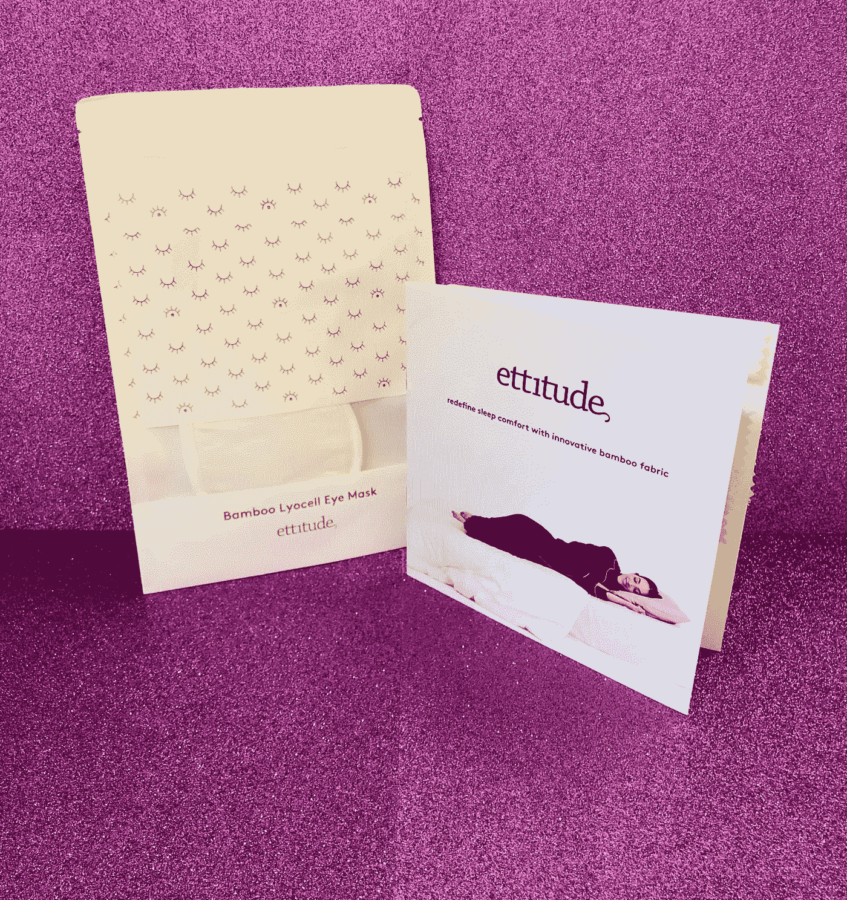

# 一个风投的观点:态度

> 原文：<https://medium.datadriveninvestor.com/a-vcs-take-on-ettitude-26a244914e42?source=collection_archive---------26----------------------->

**这个故事最初发布在我的**[**insta gram**](https://www.instagram.com/digitallyyours_/)**(digitally yours _)账户上，在这个账户上，我用风险投资的视角讨论了当今数字原生的、风险投资支持的产品(DNVBs)的最早期阶段及以后。**

*   电梯广告:竹制床上用品和睡衣
*   今天:Ettitude 是东海岸加速器 ERA 的一部分。该公司在自筹资金的情况下实现了与其他床上用品初创公司相当的销售额。他们非常精简，只获得了大约 50 万美元的资金。
*   机会:虽然大多数床上用品公司使用相同的供应商(也就是相同的材料)，但 Ettitude 正在寻求创新，不仅仅是包装和品牌:他们正在使用一种创新产品，竹子。
*   经验:我相信你已经听过被过度引用的“你一生中的⅓时间都在睡觉”的统计数据；而且，这也是 Ettitude 着手创造更实惠的睡眠产品的部分原因。Ettitude 采用专有的竹莱赛尔面料，致力于革新睡眠舒适度。创始人 Phoebe 和 Kat 向我介绍了 Ettitude，很明显这两人在这个类别中看到了空白。他们意识到舒适的床单价格贵得离谱(大约 800 美元/套)，并希望以零售商棉床单的价格为年轻的专业人士提供高质量的产品。虽然在看到 Casper 和 Parachute 等初创公司的成功后，我对另一家 D2C 床上用品公司的出现保持警惕，但我意识到，2017 年，这是一个人们在全球花费约 1100 亿美元的类别。鉴于美国人的睡眠方式正在发生变化，我也看到了为什么我们购物和思考亚麻制品的方式需要改进的原因。随着各行各业开始重新定义奢华和可及性，超软床单不再只是 1%的人的专利。“睡眠”领域的创业公司让我兴奋的是 1)每个人都可以成为消费者；每个人都睡觉，2)美国人越来越关注睡眠对他们自身健康的作用，3)人们意识到投资他们的幸福是值得的。此外，还有大量邻近市场适合扩张(睡衣、家居服、健康产品等)。
*   虽然我只有机会测试眼罩，但我确实亲自感受到了床单有多柔软。作为一名投资者，我很高兴看到 Ettitude 尝试创造性的营销方法。例如，除了建立一个拥有约 26k 粉丝的在线社区——如今在 D2C 的赌桌上，他们还通过与 Fabfitfun 等目标用户相同的公司合作来吸引新客户。鉴于现在看 Ettitude 是否还为时过早，我希望看到更强大、更有机的社区增长。