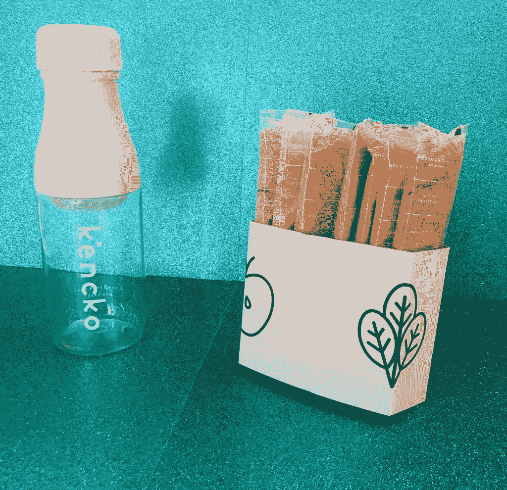

# 一个风险投资家的看法:肯科

> 原文：<https://medium.datadriveninvestor.com/a-vcs-take-on-kencko-3c85acc7f18a?source=collection_archive---------28----------------------->

**这个故事最初发布在我的**[**insta gram**](https://www.instagram.com/digitallyyours_/)**(digitally yours _)账户上，在这个账户上，我用风险投资的视角讨论了当今数字原生的、风险投资支持的产品(DNVBs)的最早期阶段及以后。**

*   电梯推销:12 美元冷榨果汁的便捷廉价替代品
*   今天:尽管资金来源不为人知，但肯科确实参与了伦敦的 Techstars 加速器计划[1/10 的公司]。
*   机会:尽管专家、研究论文，甚至我们的母亲不断向我们宣讲同样的道理，“你需要吃更多的水果和蔬菜”，但在今天这个忙碌不停的世界，我们很容易忽视自己摄入的食物。这就是为什么 90%的美国人不吃每日推荐摄入量的水果和蔬菜。
*   经历:与海妖小吃的起源故事相似，Kencko 是出于创始人治愈自己不幸疾病的愿望而诞生的。当托马斯的医生诊断出他患有急性胃炎时，托马斯认为在他的余生中服用鸡尾酒疗法并不是一个理想的选择。就这样，肯科诞生了。通过在纽约和里斯本的办公室，肯科的内部营养师、工程师和美食家正在水果和蔬菜界掀起一场风暴。Kencko 与其他速溶饮品的独特之处在于其冷冻干燥配方，旨在保持冷榨果汁浓厚浓郁的口感，而不会损害您的健康。此外，托马斯证明了他有一个企业家的大视野，并已经在考虑扩展到其他基于食品的产品，同样的使命是帮助人们达到水果和蔬菜的推荐摄入量。然而，该公司不会仅仅向你出售健康饮料和食品。它希望融入用户的整体福祉。它正在开发一个 iOS 应用程序来跟踪用户每天的水果/蔬菜之旅。
*   虽然食用完全有机的饮食对大多数人来说听起来很理想，但这并不像听起来那么容易。这就是为什么肯科对我来说是最好的。我可以快速轻松地将一个香包放入漂亮的混合瓶中(他们免费运送给你)，仍然可以啜饮一口美味的果汁，以前只有在旧金山的健康咖啡馆才能找到。事实上，我已经成为了一个超级粉丝，我在不到一周的时间里就喝光了我的第一份订单(大约 11 袋)!无论是作为投资者还是消费者，这肯定是我会跟踪的一家公司！