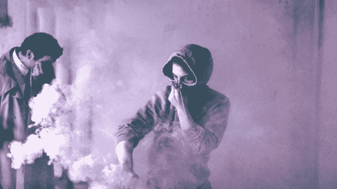
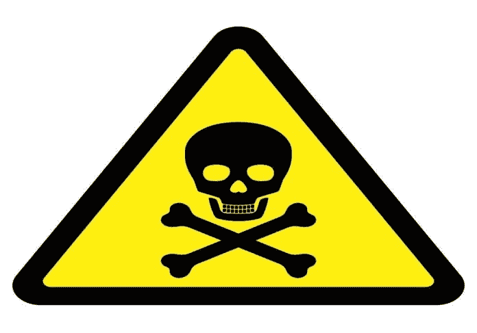
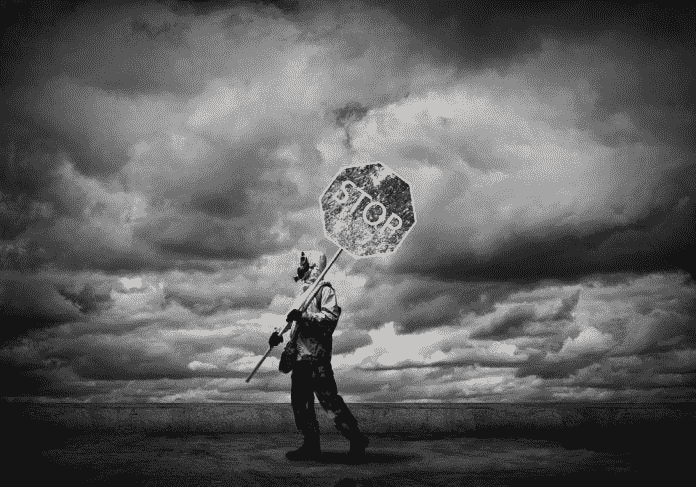

# 一个非常现实的禁忌:有毒文化威胁着每个人

> 原文：<https://medium.datadriveninvestor.com/a-very-real-taboo-toxic-culture-threatens-everyone-f9bc9a350458?source=collection_archive---------3----------------------->

## 任何职业中的政治都会创造一个危险的环境

Photo by Jules D. on unsplash

有毒细菌是从它们接触的任何东西中滋生的疾病，使得生产工作无法进行。这种有毒环境对任何工作环境都有害，但当它们侵入病人生命处于危险之中的医疗保健时，尤其具有毁灭性。

Gia Baquiran Sison 医生是一名资深的医疗服务提供者，他见证了医疗领域的好与坏。她知道野蛮文化会造成的伤害。职业健康专家是世界卫生组织西太平洋地区和菲律宾马卡蒂医疗中心的顾问。

“医药界可能听起来‘迷人’，但另一方面，这个行业有很多毒性，尤其是在高年级到低年级的权力游戏场景中，”Sison 说。“这似乎是一个禁忌话题，但事实是它确实存在。

“对我们中的一些医生和医科学生来说，结果可能是有害的，”她说。“有毒文化是导致职业倦怠的最大[原因之一。我们必须克服它。”](https://www.datadriveninvestor.com/2019/01/15/burnout-exhausts-easy-answers/)

在这个领域有 40 年经验的保健专家、讲师和临床研究员 Yinka Vidal 认为，精神痛苦来自于赶上和达到好医生形象的负面影响。

 [## 大笔资金和尖端技术:人工智能/人工智能投资将如何革新医疗保健…

### 在过去几年人工智能(AI)和机器学习(ML)的显著发展中…

www.datadriveninvestor.com](https://www.datadriveninvestor.com/2018/03/22/big-money-and-cutting-edge-technology-how-investment-in-ai-ml-will-revolutionize-the-healthcare-industry/) 

“在保持所谓的好医生形象的过程中，你必须隐藏自己生活挑战的现实，”他说。“医生和医疗保健专业人员是通过预防来照顾好自己健康的最后一群人。

“这是一场比其他医生更好的比赛，是一场成为有魅力的医生的社会比赛，”维达尔引用人类死亡人数说。“在过去的两年里，我失去了两位伟大的朋友，他们都是医学博士，一生都在努力工作，但却死于他们治疗的相同疾病。”

Sison 描述的权力游戏有着广泛的，有时意想不到的效果，Vidal 亲眼目睹了这一点。

“任何职业中的政治都非常危险，”维达尔说。“我见过很多次恶霸摔倒或者被自己的剑所伤。”

# 把病人放在第一位

药剂师贾文·谭(Jarvin Tan)在菲律宾首都地区为精神健康联盟指导青少年研究。他希望推动菲律宾药剂师参与精神保健和宣传。这包括对抗有毒文化。

“我觉得有必要强调一位同事和朋友所描述的医疗专业人员的‘霸权’——而不是挑出一个——与我们应该帮助的病人相比，”他说。

谭将中国的情况与英国的情况进行了比较。

“专业人士利用他们的地位反对服务使用者，这让英国精神健康的历史陷入了困境，”他说。“许多故事只是用来证实我的理论思考如何滥用他们的法律。

“看到我们自己的精神健康法案和决议获得通过，以及现有的服务用户的账户，作为一个倡导者，我担心我们可能会走上英国走过的类似的黑暗道路，”谭说。

 [## 糟糕的沟通和欺凌会增加压力

### 如果工作场所不安全，那些易患精神疾病的人会面临更大的危险。被…污染的有毒环境

medium.com](https://medium.com/datadriveninvestor/bad-communication-and-bullying-throttle-up-stress-6666097e51d1) 

他强调了树立良好行为榜样的重要性。

“我希望给学生们树立一个更好的榜样，承认我的错误——但也给自己施加压力，让自己变得更好，赚得更少——走一条成长的道路，促进合作，”谭说。

他指出，并不是所有的压力都是不好的，也不一定是有害的。

“也许‘有毒’可以是一个描述过度的形容词，就像 Paracelsus 一样，以区分什么是真正有帮助的，”谭说。“一些更令人鼓舞的东西，如‘挑战’、‘坚持’、‘勇气’或其他术语可以用来描述积极的压力。

“就像我和我的家庭治疗师讨论的那样，这种感觉类似于亲子沟通的挑战，”他说。“孩子有合理的担忧，但可能会被视为否定父母的经验。父母想要的是最好的，但倾向于僵化，成长空间较小。"

严格遵守等级制度令人窒息，甚至更糟。

“毒性意味着不得不以牺牲职业尊重和尊严为代价过着强调资历的生活，”T2 的 jai Fred Christian“Jim”Lopez 医生说。“我不代表所有的培训项目，但这种情况在很多项目中都存在。我在这种环境下无法茁壮成长。我选择了一条非临床的道路。”

洛佩兹在马尼拉菲律宾大学公共卫生学院任教。他也从事健康政策和管理方面的研究。

“公平地说，处于拯救他人生命的位置可能会过于授权而导致失误，”他说。我们许多人让它爬到了头上。"

# 意外伤害

生物化学家、内科医生和肺病学家厄尔·路易斯·森皮奥博士解释说，好的意图可能导致坏的事情。

他说:“任何本质上的好或坏过量都会潜在地损害正常的功能，即使是长期的少量损害。”“毒性超越了一个人的极限。这可能是有害的。但如果活下来了，它也能让人变得更好。并不是所有的毒性都是不好的。”

 [## 在董事会中敞开心胸接受偏见

### 警惕餐桌上隐藏的偏执

medium.com](https://medium.com/datadriveninvestor/open-your-mind-to-bias-in-the-boardroom-9f77924bca7d) 

风湿病学家兼教师[Sids Manahan](https://twitter.com/PhRheumaJr)博士也选择了乐观的一面。

“有毒工作教会我们更好、更有效地做事，或者让我们开发系统，”他说。“另一方面，有毒的人坚持要我们按照他们的方式去做，从而挑战系统的平衡。

“运动也会造成损伤，但它会指引我们的身体哪些部位需要改善，”马纳汉说。“一旦康复，肌肉会更强壮，更好。但如果太多，我们可能会变得更糟或终生伤痕累累。”

他补充说，他已经看到有毒的“蝙蝠”，甚至少年。

“毒性是当人们相信他们的方式比别人更好的时候，”马纳汉说。"他们非但不乐于助人，反而有贬低他人的倾向。"

精神病学家如[斯蒂芬妮·米亚科](https://twitter.com/StephMiaco)博士已经看到由此产生的压力达到了临界点。

“工作中的有毒物质就像橡皮筋一样被过度拉伸，随时会断裂，”她说。“至少，大多数时候是这样的感觉。”

有毒文化从“我为先”到极致。条款和关系很少或根本没有灵活性或同理心。

“一部分来自指挥链，这很重要，”洛佩兹说。"自负和骄傲恰好交织在一起."

维达尔描述了一种危险的，由扮演上帝而激起的权力、地位、头衔和声望的情感混合体。除此之外，马纳汉还增加了一种特权和权利感。

“有一种观点认为，困难或不幸事件是由团队中最薄弱的环节造成的，”马纳汉说。“当人们感到自己的地位或舒适受到威胁时，他们会说些什么，做些什么。”

谭说，这种文化滋生了导致错误的压力:“那些坚持以证据为基础的医学也是有毒的。”

# 了解你的极限

帮助应对毒性，不要让别人默默承受。伸出援助之手，让他们知道他们并不孤单。

“谦逊是我们为公众服务的最大美德，”维达尔说。“没有人是完美的。我们都是看护者，不是魔术师。人有局限性。

他说:“丢掉医生那看不见的迷人的桂冠，拥抱做一个普通人的现实。”“这让你感觉好多了。向一个经历情感创伤的人表达爱意，是一个人筋疲力尽的最佳解药之一。”

 [## 倦怠耗尽了简单的答案

### 人们在付出全部甚至更多后会激情四射

medium.com](https://medium.com/datadriveninvestor/burnout-exhausts-easy-answers-143a0840743b) 

洛佩兹提出了抵御毒性的各种方法:

*   找到你的支持团体。
*   以善杀毒。
*   答应不要像你讨厌的人一样。
*   说服其他人也这样做。

“善待每一个人，”他说。“善良使我们成为人类。”

马纳汉增加了谦逊、耐心和理解。

“真诚地希望帮助他人进步，而不要经历你自己经历过的痛苦，”他说。“注意我们如何对待他人。我们都是人。我们没有人是完美的。

“即使我们不知所措，也要停下来整理一下思绪，”马纳汉说。“然后我们可以表达失望，但仍然能够继续作为一个团队工作。以善心相待。”

米阿科主张，每个人都应该有“一种心态来教导你是什么样的人，多年前的你。”

**关于作者**

吉姆·卡扎曼是[拉戈金融服务公司](http://largofinancialservices.com/?source=post_page---------------------------)的经理，曾在空军和联邦政府的公共事务部门工作。你可以在[推特](https://twitter.com/JKatzaman?source=post_page---------------------------)、[脸书](https://www.facebook.com/jim.katzaman?source=post_page---------------------------)和 [LinkedIn](https://www.linkedin.com/in/jim-katzaman-33641b21/?source=post_page---------------------------) 上和他联系。

*原载于 2019 年 8 月 9 日*[*https://www.datadriveninvestor.com*](https://www.datadriveninvestor.com/2019/08/09/a-very-real-taboo-toxic-culture-threatens-everyone/)*。*