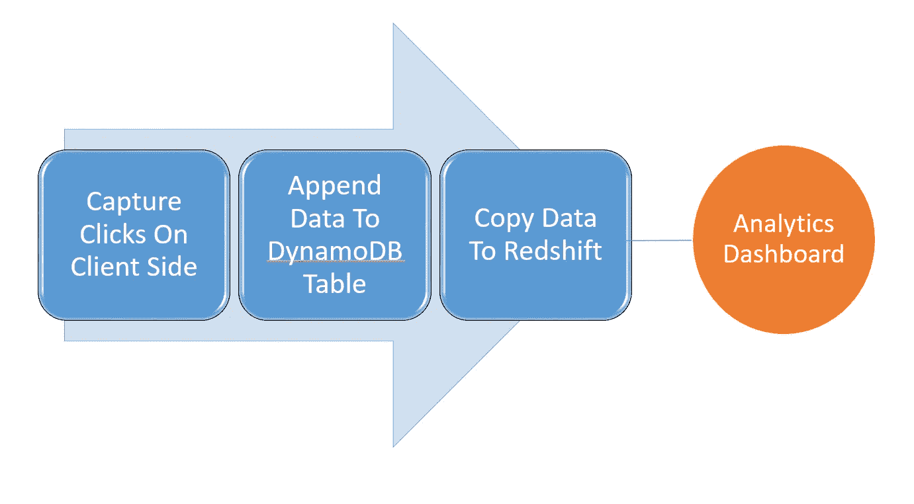
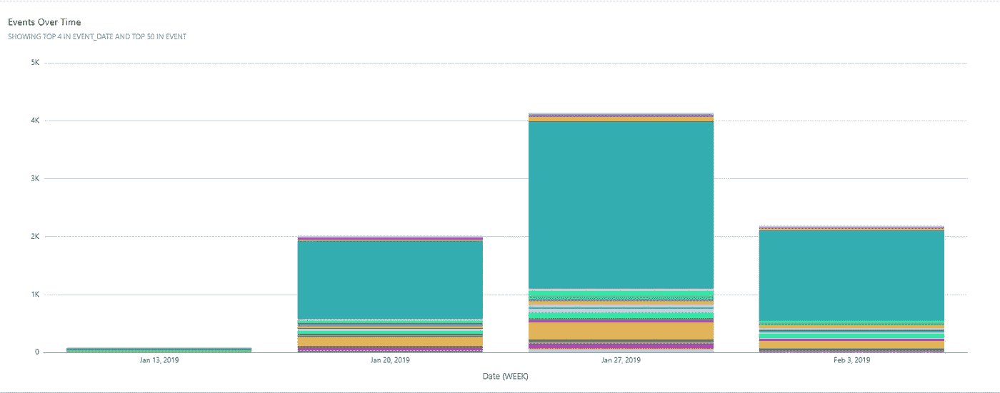
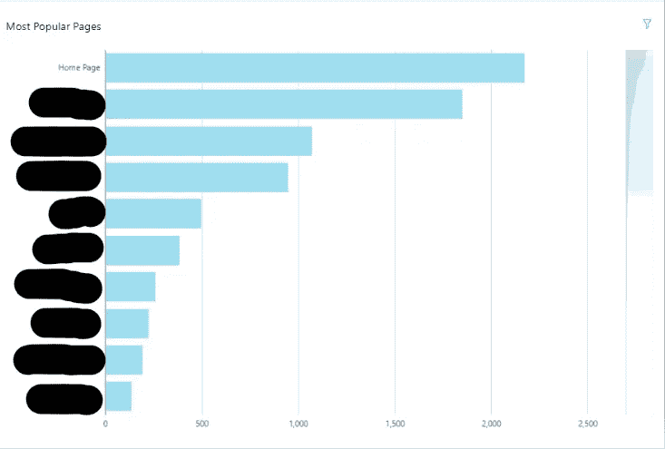

# 如何在一天内获得网站分析

> 原文：<https://medium.datadriveninvestor.com/a-very-simple-way-to-add-analytics-to-your-website-b25916d281bd?source=collection_archive---------9----------------------->

[](http://www.track.datadriveninvestor.com/1B9E)

我是一个简单的人。

我对生活要求不高。一个简单的网站和跟踪点击的能力。只是一些见解。不要太聪明。尤其是没有花哨的过于复杂的解决方案。

事实上，我真正需要的是我的网站的点击数，以及用户点击了哪些项目。我敢希望不用学习 50 种不同的微服务就能简单解决我的简单问题吗？

[](https://www.datadriveninvestor.com/2019/01/31/conversational-marketing-is-the-word/) [## 对话式营销是文字数据驱动的投资者

### 在购买之前，先谈一谈。这样做的营销人员将走在游戏的前面。这是保罗·因斯的前提…

www.datadriveninvestor.com](https://www.datadriveninvestor.com/2019/01/31/conversational-marketing-is-the-word/) 

幸运的是，我认为我能够想出一个相当简单的方法来添加分析。您所需要的只是客户端的一个 JavaScript 文件和一个用来存储数据的 DynamoDB 表。

对于我的分析解决方案，我所关心的是捕捉我的网站的哪个部分被点击，当人们点击它时在哪个页面，以及事件发生的日期。

以下是我们将如何做这件事。我们将在任何我们认为足够重要的组件(按钮/链接)上添加一个 onClick 事件，以便人们点击。onClick 事件将触发一个 JavaScript 函数，该函数将捕获事件(被点击的内容)、被点击的页面以及事件发生的日期。

我需要一个地方来储存这些信息。您可以使用 SQLite 或 NoSQL 数据库在本地完成这项工作。我使用 DynamoDB 表来记录我的点击次数。

因此，我们的函数将接收参数(event，page)，并在 DynamoDB 表中插入一个新行，其中包含这些参数和日期(可以很容易地从 JavaScript Date 函数中获得)。

以下是 JavaScript 文件:

```
AWS.config.update({
  region: "us-west-2",
  endpoint: 'dynamodb.us-west-2.amazonaws.com',
  accessKeyId: "ADD_ACCESS_KEY",
  secretAccessKey: "ADD_SECRET_ACCESS_KEY"
});var docClient = new AWS.DynamoDB.DocumentClient();function formatDate(date) {
  var day = date.getDate();
  var month = date.getMonth()+1;
  var year = date.getFullYear();return month + '/' + day + '/' + year;
}function createItem(event, page) {
    var curDate = new Date();
    var params = {
        TableName :"MyAnalyticsTable",
        Item:{
            "ID": String(Date.now()),
            "Page": page,
            "Event": event,
            "Date": formatDate(curDate)
        }
    };
    docClient.put(params, function(err, data) {
        if (err) {
            document.getElementById('textarea').innerHTML = "Unable to add item: " + "\n" + JSON.stringify(err, undefined, 2);
        } else {
            document.getElementById('textarea').innerHTML = "PutItem succeeded: " + "\n" + JSON.stringify(data, undefined, 2);
        }
    });
}
```

我们来分析一下。第一部分只是设置配置，以便与我们的 DynamoDB 表(应该提前创建)对话。在这个例子中，这将是一个超级简单的表，只有 4 个字段:id(存储行所需的唯一 ID……您可以为此使用 Unix 时间戳)、event、page、date。

我假设你对 AWS (Amazon Web Services)有一些基本的了解。我特别假设您知道如何创建 DynamoDB 表和 I am 用户(以访问该表)。

您需要提供您所在的地区、访问密钥、保密访问密钥和端点。我所在的地区是 us-west-2 和端点 dynamodb.us-west-2.amazonaws.com，但这可能会对您有所不同。

您可以在 AWS 的 IAM 中创建一个用户，授予对 DynamoDB 的访问权限。

因为出于这个目的，我只希望用户具有写访问权限，特别是只能够向特定的 DynamoDB 表追加新数据而不删除旧数据，所以我必须使用一个特殊的策略:

```
{
    "Version": "2012-10-17",
    "Statement": [
        {
            "Sid": "VisualEditor0",
            "Effect": "Allow",
            "Action": [
                "dynamodb:DescribeReservedCapacity*",
                "dynamodb:List*",
                "dynamodb:DescribeTimeToLive",
                "dynamodb:DescribeLimits"
            ],
            "Resource": "*"
        },
        {
            "Sid": "VisualEditor1",
            "Effect": "Allow",
            **"Action": "dynamodb:PutItem",**
            "Resource": "arn:aws:dynamodb:us-west-2:**123456789**:table/**MyAnalyticsTable**"
        }
    ]
}
```

此策略授予对 MyAnalyticsTable 的写(仅追加)访问权限。您还需要提供完整的 arn，您可以在 DynamoDB 表的 Overview 选项卡中找到它。一旦有了这些，请确保将此策略附加到您的 IAM 用户。

是的，我知道。尽管我用心良苦，事情已经变得越来越复杂了。

但是一旦你有了这个装置，它会很棒的。您只剩下一件事了，就是将 JavaScript 函数添加到您的 HTML 代码中。

首先，您将在页面顶部导入这个 JavaScript 函数。因为您正在与 Dynamo 对话，所以您还必须添加一些 Amazon 依赖项。幸运的是，它只有两行(按此顺序):

```
<script src="[https://sdk.amazonaws.com/js/aws-sdk-2.7.16.min.js](https://sdk.amazonaws.com/js/aws-sdk-2.7.16.min.js)"></script>
<script src="./js/clicked.js"></script>
```

是的，我把我的 JS 文件叫做 clicked.js .非常原创。我知道。

现在，您可以将 clicked.js 函数作为 onclick 事件传递到一个标记中，并捕获对它的任何点击。例如，假设我想记录一个链接点击:

```
<a onclick="createItem('Event Name', 'Page Name')">My Fancy Link</a>
```

我将传入事件名称和页面名称的参数。我们可以根据组件进行更改(因此，对于其他组件，它可以是 createItem(“其他事件名称”、“其他页面名称”)。

现在，一旦这个链接被点击，createItem()函数将被激活，并将这些参数追加到我们的 DynamoDB 表中。将创建具有以下字段的新行:作为唯一 id 的 Unix 时间戳，例如 1238924689、“事件名称”、“页面名称”、日期，例如“2019 年 1 月 18 日”。

相信我，点击一个事件，然后刷新 DynamoDB 表，看到它被捕获，感觉棒极了！

仅此而已。记录点击的简单方法。也非常全能。你可以把这个功能添加到任意多的组件中，通过这个组件/页面组合，你将能够对你的网站是如何被使用的有一个深入的了解。

您还可以通过操作 clicked.js 函数来更改/添加想要捕获的字段。例如，假设您需要事件发生的时间和日期。只需在 item 下添加另一个带有事件时间的字段(再次使用 Date 函数)，您也将能够捕捉到该事件！

**问:这与谷歌分析解决方案有可比性吗？**

没有。但是我花了一天时间来实现，而且效果很好。

**问:它能扩展吗？**

答:我不知道。它对我的用例非常有用。我怀疑，对于很多用例来说。正如某位智者曾经说过的:*过早地为规模优化是一种反模式。*

问:嗯——您在脚本中使用了访问键，而不是 IAM 角色。并且您为外部用户提供了写入生产表的能力。那很糟糕。

答:同意。请改用 IAM 角色。见鬼——如果你的观众是全世界，就不要看我的解决方案。我的用例是一个内部网站，我的受众是我的同事，他们不会攻击或入侵(大部分情况下)。

我也只是给了 append only 对我的 DynamoDB 表的访问权，这个表会被定期清除(稍后会详细解释原因)。请理解，这是一个黑客这样做的方式，并不打算用于大规模项目。

# **分析数据**

现在有了数据，就可以分析了！您可以使用许多解决方案来可视化使用 DynamoDB 的数据。您可以使用 Python 来获取数据，并使用 matplotlib 或 seaborn 等库进行可视化，甚至可以将数据移植到 Tableau 或 PowerBi，并构建精美的仪表板。见鬼——你甚至可以将数据导出为 csv 格式，并使用老式的 Excel。

坚持使用 AWS 生态系统，我最终使用了 Quicksight。这是亚马逊的场景。这实际上是一个非常好的产品，我怀疑在未来几年将会非常受欢迎。也比 Tableau 便宜很多。

不幸的是，Quicksight 不与 DynamoDB 对话！说真的——哇！您可能会认为一个 AWS 服务会首先与另一个 AWS 服务对话，但在这种情况下并非如此。

所以我们必须把数据转移到别的地方。我用红移作为我的中途停留目的地。幸运的是，Quicksight 确实能与红移对话，而且连接起来相当简单。

幸运的是，在 DynamoDB 和 Redshift 之间移动数据也相对简单。您可以使用 Redshift 的 COPY 命令将数据大容量导入到红移表中。

这样做时要记住的一点是，如果不小心，DynamoDB 的读写开销会增加。这就是为什么我在红移加载成功完成后从 Dynamo 中擦除脚本中的数据。这样，我只使用 COPY 命令添加新数据。但是，如果您最终使用这个工作流，您应该留意成本，以确保它们对于您的项目是合理的。

我的整个过程是这样的:



I tried Powerpoint…

我有一个 Python 脚本将 DynamoDB 表复制到我的红移表中，然后删除 DynamoDB 数据:

```
import psycopg2
import boto3
import sysACCESS_KEY='ADD_ACCESS_KEY'
SECRET_ACCESS_KEY='ADD_SECRET_ACCESS_KEY'def load_redshift():
 # append new data to Redshift
 con=psycopg2.connect(dbname= '', host='', 
 port= '', user= sys.argv[1], password= sys.argv[2])cur = con.cursor()
 cur.execute("COPY TABLE FROM 'dynamodb://MyAnalyticsTable' \
 CREDENTIALS 'aws_access_key_id=%s;aws_secret_access_key=%s' \
 REGION '' \
 READRATIO 50;" % (ACCESS_KEY, SECRET_ACCESS_KEY))con.commit()
 cur.close()
 con.close()def delete_dynamo():
 # delete data in Dynamodb Table
 client = boto3.client(
     'dynamodb',
     aws_access_key_id=ACCESS_KEY,
     aws_secret_access_key=SECRET_ACCESS_KEY,
 )dynamodb = boto3.resource('dynamodb', region_name='us-west-2')
 table = dynamodb.Table('MyAnalyticsTable')scan = table.scan(
     ProjectionExpression="#k",
     ExpressionAttributeNames={
         '#k': 'ID'
     }
 )with table.batch_writer() as batch:
     for each in scan['Items']:
         batch.delete_item(Key=each)print("Deleted Old Data From Dynamodb")if __name__== "__main__":
 '''This is a Python script to Copy Data to Redshift GAL Analytics Table from DynamoDB and then delete the data form Dynamodb.
 We want to delete the old data to minimze computation on the COPY command and consequently our cost.
 Run This script as python analytics.py username password where username and password are your Redshift Credentials to your cluster.'''
 try:
  load_redshift();
 except:
  print("There was an error uploading data to Redshift")
  sys.exit(1) 

 print("Uploaded Data To Redshift")

 delete_dynamo();print("Done")
```

您可以使用 psycopg2 来访问 Python 中的红移表，使用 boto3 来访问 DynamoDB 表。呃——我试着把名字降到最低。但是这个设置将使您能够运行 python 脚本并将数据移植到 Redshift。我已经将我的设置为使用我的红移集群的用户名和密码作为脚本的参数来运行:

```
python analytics.py username password 
```

每当您想要获取最新数据或将其设置为每天或每周运行的 cron 作业时，您都可以手动执行此操作。然后，您可以手动刷新 Quicksight 以获取仪表盘的最新数据，或者设置在计划的 python 作业完成后立即进行计划的刷新。

您可以制作的基本图表的一个示例可以是一段时间内的总体页面点击/事件:



Page Hits Over Time Broken by Categories You Define

或者在您网站上最受欢迎的页面上显示一个简单的图表:



Most Popular Pages (The specific pages are blacked out for privacy)

或许有一种方法可以让这个过程更加流畅，那就是使用一种奇特的流水线工具，比如 airflow。如我所说。这是一个不成熟的解决方案。但这很有效。

如果你每天有几百万的点击量，这个过程有意义吗？大概不会。它从来都不是有意的。您甚至可能希望更加健壮，捕获表之间的差异，并通过使用一个奇特的 lambda 函数来追加差异。

你做你的。我是个简单的人。

希望像我这样简单的人会发现这很有用。

干杯。