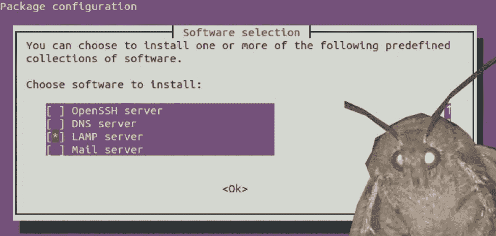
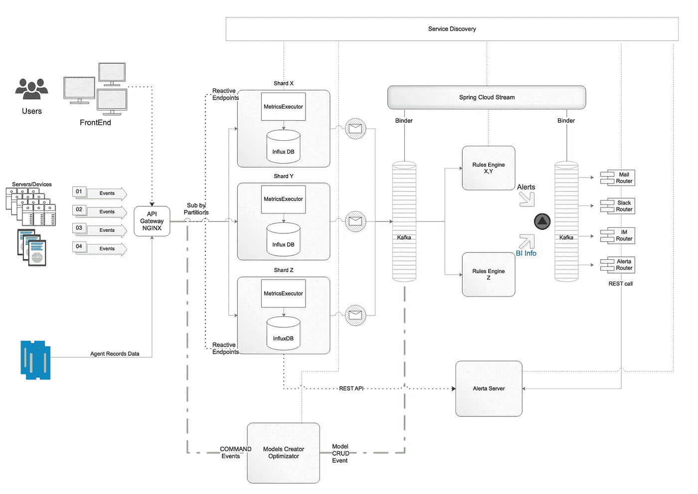
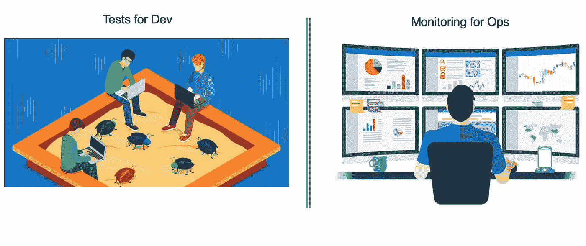
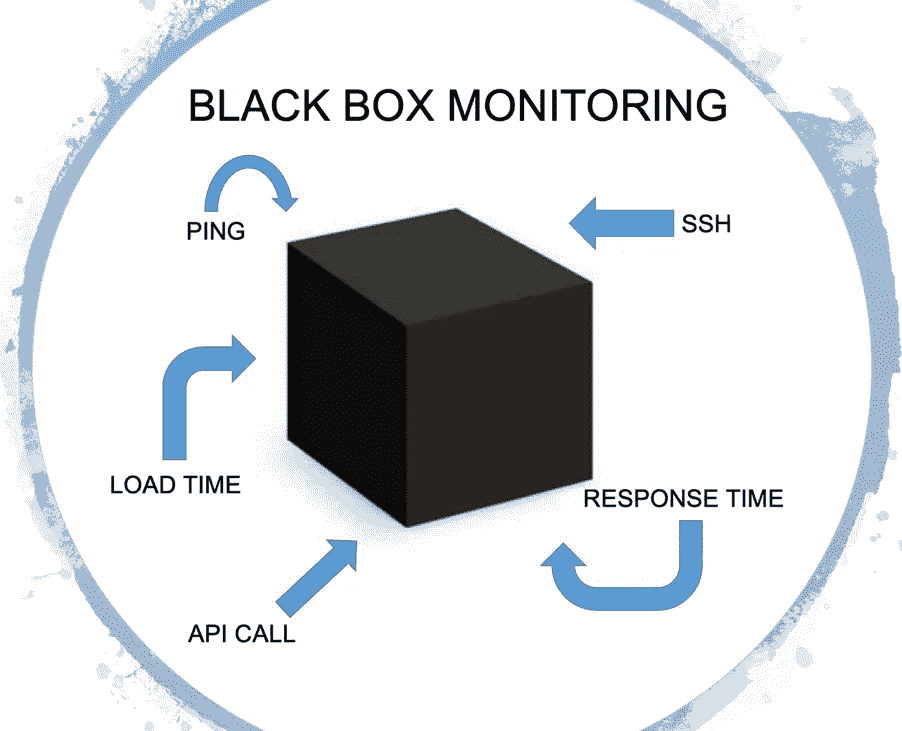
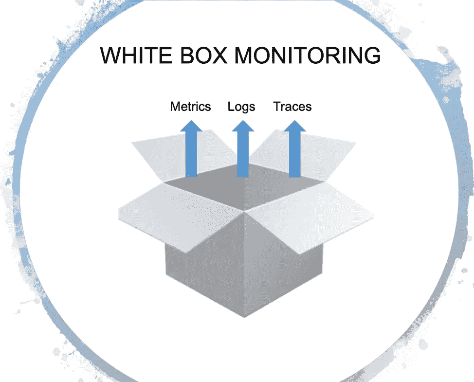
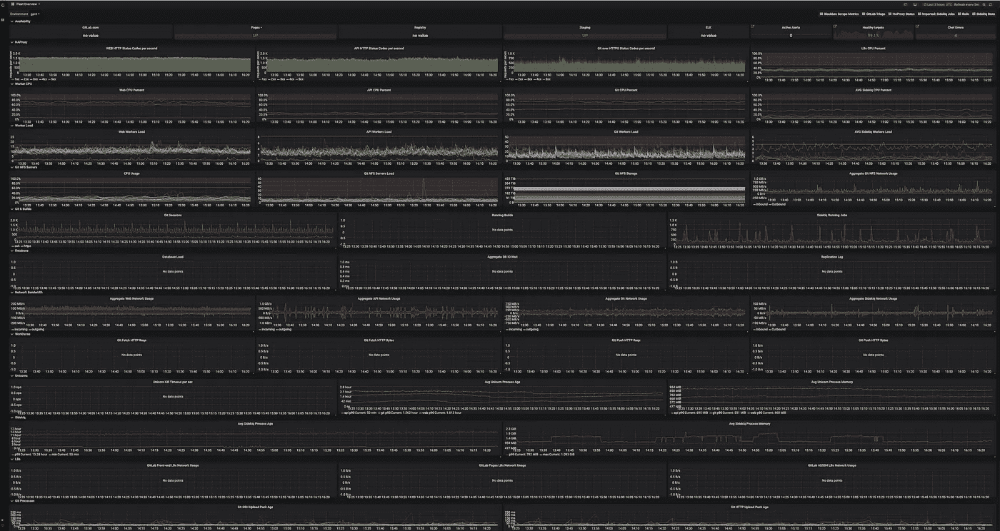
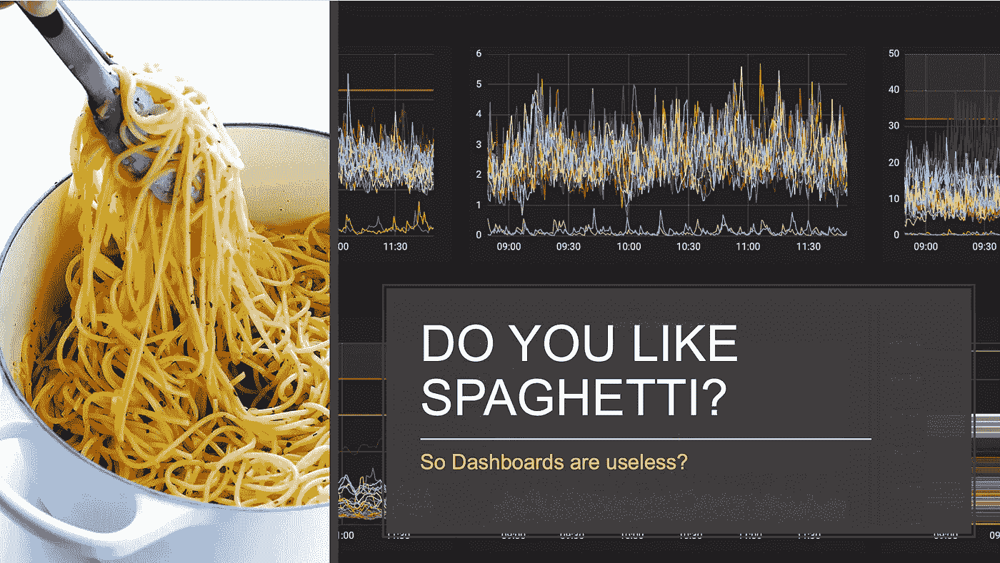
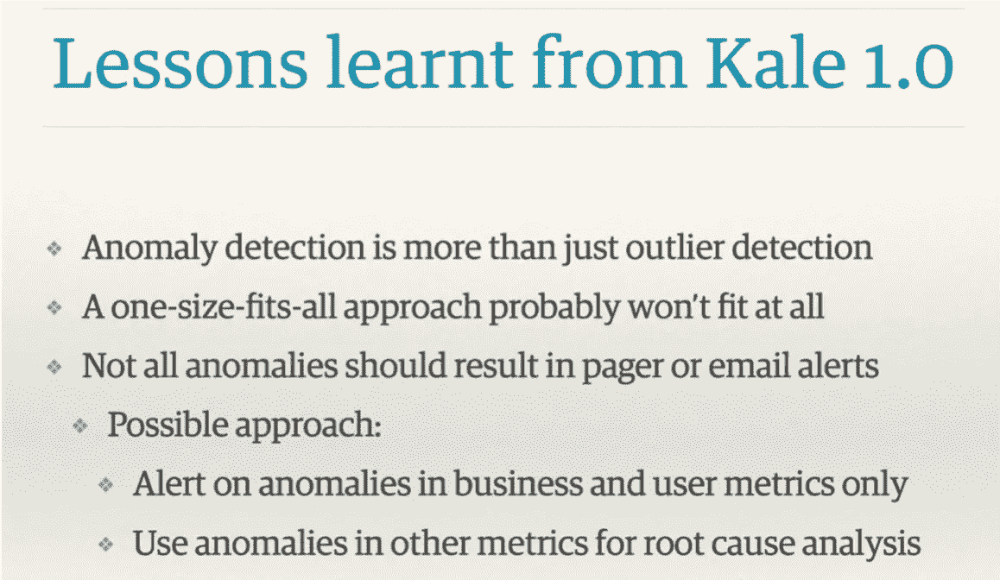
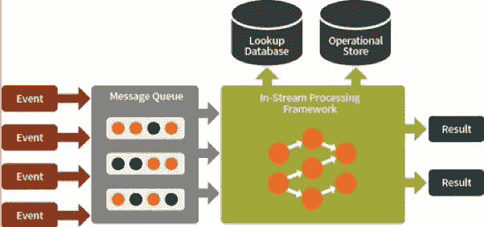

# 实践中的可观察性愿景

> 原文：<https://medium.datadriveninvestor.com/a-vision-towards-observability-in-practice-43948e2f4f1f?source=collection_archive---------5----------------------->

2019 年软件基础设施的一个关键趋势是可观察性。[https://hub . packtpub . com/key-trends-in-software-infra structure-in-2019/](https://hub.packtpub.com/key-trends-in-software-infrastructure-in-2019/)

它最近获得了很多关注。

# 什么是可观测性？

关于这个术语有很多讨论和笑话。例如:

> *——为什么称之为监控？这已经不够性感了。*
> 
> *—可观察性，因为将运营更名为开发运营还不够糟糕，现在他们也在开发监控。*
> 
> DevOps 的新查克·诺里斯。
> 
> *—我是一名工程师，可以帮助向组织中的其他工程师提供监控。太好了，这是 8 万美元。
> 我是一名架构师，可以帮助为云原生的、基于容器的应用程序提供可观察性。
> >牛逼！这是 30 万美元！*

[*辛迪·斯里达哈兰*](https://medium.com/@copyconstruct)

如果有的话，监控和可观测性的区别是什么？

# 回顾过去…

几年前，我们主要在物理服务器上运行软件。我们的应用程序是构建在 LAMP 或其他堆栈上的整体。检查正常运行时间就像定期发送 pings 命令和检查应用程序的 CPU/磁盘使用情况一样简单。

# 根本性的变化

主要的范式转变来自基础设施和建筑领域。云架构、微服务、Kubernetes 和不可变基础设施改变了公司构建和运营系统的方式。

由于采用了这些新思想，我们建立的系统变得越来越分散和短暂。

虚拟化、容器化和编排框架负责提供计算资源和处理故障，为硬件和网络创建了一个抽象层。

从底层硬件和网络转向抽象意味着我们必须关注于确保我们的应用程序在我们的业务流程环境中按预期工作。

# 什么是监控？

监控对于操作来说就像测试对于软件开发一样重要。事实上，测试在沙盒环境中对照一组输入检查系统组件的行为，通常有大量被模仿的组件。

主要问题是，生产中可能出现的问题的数量无法通过任何方式的测试来覆盖。一个成熟、稳定的系统中的大多数问题都是未知的——这些未知不仅与软件开发本身有关，也与现实世界有关。

# 黑盒监控与白盒监控

有两种监控方法。

在黑盒监控的情况下，我们将系统或部分系统视为黑盒，并在外部进行测试。这可能意味着检查 API 调用、加载时间或系统不同部分的可用性。在这种情况下，关于系统的信息量和对系统的控制是有限的。

白盒监控指的是我们从系统内部获取信息的情况。这不是一个革命性的想法，但它最近获得了很多关注。

所以，可观测性只是白盒监控的另一个名字？不完全是。

# 为什么我们需要一种新的监控方式

通常，监控和可观察性的概念是有区别的，后者被定义为以某种方式收集关于基础设施/应用程序状态和性能跟踪的数据的东西([https://thenewstack . io/monitoring-and-Observability-what-the-difference-and-why-it-matter/](https://thenewstack.io/monitoring-and-observability-whats-the-difference-and-why-does-it-matter/))。

或者，按照 *honeycomb.io* 的说法:

> 您正在根据已知基准检查系统的状态和行为，以确定是否有任何行为不符合预期
> 
> "您可以编写 Nagios 检查来验证一些东西是否在已知的良好阈值内."
> 
> "你可以用 Graphite 或 Ganglia 构建仪表板，将有用的图表集合起来."
> 
> "所有这些都是了解你的系统的已知和未知的极好工具."

[https://www . Honeycomb . io/WP-content/uploads/2018/07/Honeycomb-Guide-Achieving-Observability-v1 . pdf](https://www.honeycomb.io/wp-content/uploads/2018/07/Honeycomb-Guide-Achieving-Observability-v1.pdf?utm_source=facebook.com&utm_medium=social&utm_campaign=*honeycomb*-vypustili-malenkuyu-knizhechku)

一个由 New Relic、HP 和 AppDynamics 等产品组成的大型生态系统已经形成。所有这些工具都非常适合低级和中级监控或解决性能问题。

然而，它们不能处理对高基数数据的查询，并且在与第三方集成问题或具有在现代虚拟环境中工作的大量服务的大型复杂系统的行为相关的问题的情况下表现不佳。

# 为什么仪表板没有用

事实上，他们不是。但前提是你知道何时何地观看。不然还不如看 YouTube。

仪表板不可伸缩。

想象一下这样一种情况，您有一堆与您的基础设施(例如，cpu_usage/disk quotas)和应用程序(例如，JVM allocation_speed/GC Runs)等相关的指标。这些指标的总数很容易增长到数千或数万。您所有的仪表板都是绿色的，但是第三方集成服务出现了问题。您的控制面板仍为绿色，但终端用户已经受到影响。

您决定将第三方集成服务检查添加到您的监控中，并在电视机上获得一系列额外的指标和仪表盘。直到下一个案子出现。

当被问及为什么客户不能打开一个网站时，回答通常是这样的:

# 仪表板的分类

虽然采用系统不同部分的遥测是一种常见的做法，但它通常以仪表盘上画的一串意大利面条结束。

这些是 GitLab 对公众开放的运营指标。

 [## 格拉夫纳

### 1.这可能是由反向代理设置导致的。2.如果您在子路径下托管 grafana，请确保您的 grafana.ini…

dashboards.gitlab.com](https://dashboards.gitlab.com/d/mnbqU9Smz/fleet-overview?refresh=5m&orgId=1) 

这只是整个仪表盘大军中的一小部分

它看起来像一幅挂毯，很容易掉线。

# 日志聚合

绝大多数现代 IT 公司都使用 ELK Stack 或 Splunk 等日志聚合工具。这些仪器对根本原因分析或验尸非常有帮助。它们还可以用于监控从您的日志流中得出的一些情况。

然而，这是有代价的。现代系统会生成大量日志，流量的增加会耗尽 ELK 资源，或者将 Splunk 的计费率提高到天上去。

有一些采样技术可以把所谓的无聊日志的量降低几个数量级，把异常的都省下来。它可以提供关于正常系统行为的高级概述以及任何有问题事件的详细视图。

# 从日志到事件模型

通常，日志行反映系统中发生的事件。例如，建立连接、身份验证、查询数据库等等。执行所有阶段意味着一项工作已经完成。定义事件作为一项逻辑工作，可以被视为与特定服务相关的服务级别目标的一部分。我所说的“服务”不仅指软件服务，还指某些物理设备，如传感器或物联网世界中的其他机器。

它也是领域驱动设计原则的补充。服务或域之间的隔离和责任共享使得事件特定于系统每个部分中的每项工作。

例如，登录服务事件可以由具有自己的动态上下文的*成功登录、失败登录*来分隔。

度量和事件应该围绕系统中的流程构建一个故事。

可以以这样的方式对事件进行采样，即在正常系统行为的情况下，只存储其中的一小部分，而所有有问题的事件都按原样存储。基于特定服务的目标，事件被聚合并存储为关键性能指标。

它可以将服务目标指标及其相关的元数据整合在一起，利用问题之间的即时联系。

这些数据揭示了系统中未知的东西。

这是一种软件工具吗？是的。然而，当您比较来自调试级日志记录和完整检测的数据量时，将日志拆分成事件可以让您在生产环境中畅饮消防水，而不会淹没在数据和成本中。

“将事件定义为一项工作可以被视为与特定服务的目标相关联。”

# 为什么我们还没有准备好全面的人工智能解决方案

人工智能是吸引创业投资的一个好词。然而，魔鬼总是在细节中。

## 1.再现性

完全基于机器学习的系统(所谓的完全人工智能方法)的问题是，因为它在不断学习新的行为，所以没有可重复性。例如，如果您想了解某个条件导致警报的原因，您不能调查它，因为模型已经改变了。任何依赖于行为的不断学习的解决方案都面临这个问题。

当您操作高粒度的数据或指标时，优化系统本身是必不可少的，但是如果没有可再现性，很难做到这一点。

## 2.资源消耗

对于任何一种持续的机器学习，你都需要大量的计算资源。通常，这采取批处理数据集的形式。对于某些产品，处理 200 000 个指标的最低要求是 v32CPU 和 64 Gb RAM。如果您想要将指标的数量增加一倍，您需要另一台满足相同需求的机器。

## 3.你还不能完全自动化地扩展深度学习

根据 Samreen Hassan Massak 撰写的硕士论文(尚未完全完成)，数千个指标的训练过程需要数天的 CPU 时间或数小时的 GPU 时间。您无法在不超出预算的情况下扩展它。

## 4.速度

像 Amazon Forecast 这样的解决方案，其功能就像接收数据并等待计算结束的批处理服务，并不适合这种情况。

## 5.清楚

基于谷歌的经验:

“最常捕捉真实事件的规则应该尽可能简单、可预测和可靠。”

[https://landing . Google . com/sre/sre-book/chapters/monitoring-distributed-systems/](https://landing.google.com/sre/sre-book/chapters/monitoring-distributed-systems/)

当模型或规则不断变化时，你会失去对系统的理解，它就像一个黑匣子。

# 异常=警报？

假设您有数千个指标，如果您想要有良好的可观察性，您需要收集高基数数据。系统的每一次心跳都会在你的指标群中产生统计波动。

[https://berlinbuzzwords . de/15/session/signatures-patterns-and-trends-time series-data-mining-etsy](https://berlinbuzzwords.de/15/session/signatures-patterns-and-trends-timeseries-data-mining-etsy)

从 Etsy 的羽衣甘蓝项目中可以吸取的主要教训是:

关于指标异常的警报最终会导致大量的警报和手动操作阈值和手工制作的过滤器。

# 为什么我们需要流方法

获得可观察性并让未知的未知成为焦点需要高度精细的数据，这些数据可以按数据中心、构建版本、服务、平台和传感器类型进行分类。将它们以任意组合的方式聚集在一起就其本质而言是组合的。

即使您仔细设计了您的度量标准和事件，您最终也会得到大量的度量标准和事件。在这种规模的实时操作中，常规查询或批处理作业会有很大的延迟和开销。

# 需要考虑的事项

对无限数据流执行的任何操作都是相当大的工程努力。你需要处理与分布式系统相关的问题。

在高级别上监控事件、服务级别目标或 KPI 时，您需要做出反应，而不是不断地查询您的数据，而是对可以水平扩展的流进行操作，从而在不消耗大量资源的情况下实现较大的吞吐量和速度。

一些流框架，如 Apache Storm、Apache Flink 和 Apache Spark，是面向元组处理的，而不是面向现成的时间序列处理的。

分布式系统的语义也存在问题。

假设您在不同的数据中心进行了大量部署。您可能遇到网络问题，存储 KPI 指标的代理无法转发这些指标。过了一会儿，比如说 3 分钟，代理将数据发送给系统。并且该新信息应该基于该条件触发动作。我们是否应该将这个数据窗口存储在内存中，并且不仅检查向后的情况，还检查向前的情况？这个去同步窗口应该有多大？实时操作数千个指标使得这些问题变得非常重要。在流处理系统的情况下，您不能在不降低速度的情况下将所有内容存储在数据库中。

分布式系统中时间序列数据的实时流分析是棘手的，因为涉及系统行为的事件可能是无序的，基于该数据可能出现的条件取决于事件的顺序。这意味着至少一次语义可以很容易地实现，但是当只有一次语义时，就很难实现了。

# 根据谷歌 SRE 工作手册，监控策略的可取特征

> 现代设计通常涉及分离收集和规则评估(使用类似 Prometheus server 的解决方案)、长期时间序列存储(InfluxDB)、警报聚合(Alertmanager)和仪表板(Grafana)
> 
> “谷歌基于日志的系统处理大量高度细化的数据。在事件发生和在日志中可见之间有一些固有的延迟。对于对时间不敏感的分析，可以使用批处理系统处理这些日志，使用即席查询进行询问，并使用仪表板进行可视化。这种工作流的一个例子是使用云数据流来处理日志，使用 BigQuery 来进行即席查询，使用 Data Studio 来处理仪表板。”
> 
> “相比之下，我们基于指标的监控系统从谷歌的每项服务中收集了大量指标，提供的信息要少得多，但几乎是实时的。这些特征在其他基于日志和指标的监控系统中相当典型，尽管也有例外，比如实时日志系统或高基数指标。”
> 
> “在理想情况下，监控和警告代码应该遵循与代码开发相同的测试标准。虽然 Prometheus 的开发人员正在讨论开发用于监控的单元测试，但目前还没有一个被广泛采用的系统允许你这样做。
> 
> “在谷歌，我们使用一种特定领域的语言来测试我们的监控和警报，这种语言允许我们创建合成的时间序列。然后，我们根据派生的时间序列中的值，或者特定警报的触发状态和标签存在来编写断言。”

 [## 现场可靠性工作手册

### 2016 年，谷歌的网站可靠性工程书籍引发了一场关于生产运营意味着什么的行业讨论…

books.google.ee](https://books.google.ee/books?id=fElmDwAAQBAJ&pg=PT88&lpg=PT88&dq=Monitoring+Jess+Frame,+Anthony+Lenton,+Steven+Thurgood,&source=bl&ots=h76liC_qH3&sig=FZ9ZZKzsOwdxwir_pjh9nwCOx1U&hl=en&sa=X&ved=2ahUKEwjdtsXhsKnfAhXwtYsKHVu4C5gQ6AEwBnoECAIQAQ#v=onepage&q=Monitoring%20Jess%20Frame%2C%20Anthony%20Lenton%2C%20Steven%20Thurgood%2C&f=false) 

非常感谢[慈善专业](https://twitter.com/mipsytipsy)和[辛迪·斯里德哈兰](https://medium.com/u/87c8c84f24b1?source=post_page-----43948e2f4f1f--------------------------------)

感谢西格丽德·马森的帮助。

## 来自 DDI 的相关故事:

 [## 用 7 个步骤解释深度学习

### 和猫一起

medium.com](https://medium.com/datadriveninvestor/deep-learning-explained-in-7-steps-9ae09471721a)  [## 数据科学和软件工程哪个更有前途？

### 大约一个月前，当我坐在咖啡馆里为一个客户开发网站时，我发现了这个女人…

medium.com](https://medium.com/datadriveninvestor/which-is-more-promising-data-science-or-software-engineering-7e425e9ec4f4)