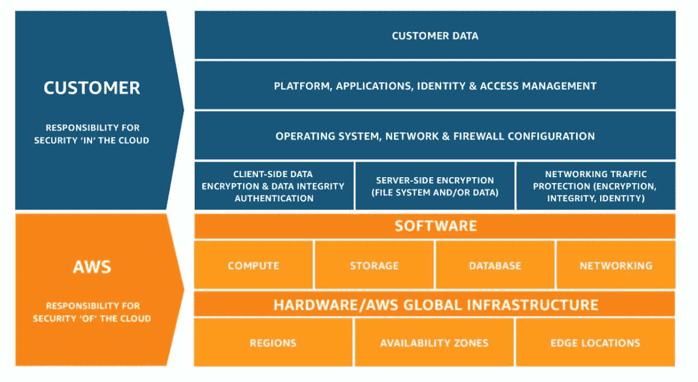

# 云中漫步:AWS 的云安全策略

> 原文：<https://medium.datadriveninvestor.com/a-walk-in-the-clouds-a-cloud-security-strategy-for-aws-32d2a187bce2?source=collection_archive---------3----------------------->

# 第 1 部分:保护 Amazon ECS 中的容器

> “云中城堡没有建筑规则。”——吉尔伯特·切斯特顿

# 介绍

仅在过去一年，影响亚马逊网络服务(AWS)租户的违规事件数量就创下了历史新高。然而，由于云服务提供商(CSP)是一种共同责任模式，这些违规行为的责任不会落在亚马逊身上，而是落在这些云工作负载的系统和数据所有者身上。

这是关于保护 AWS 云中工作负载的战略计划的多部分系列的第 1 部分。第 1 部分定义了一个可行的计划，用于保护部署到弹性云 2 (EC2)实例或通过 Amazon FarGate 部署的容器。

 [## 信息图:云之旅|数据驱动的投资者

### 聪明的企业领导者了解利用云的价值。随着数据存储需求的增长，他们已经…

www.datadriveninvestor.com](https://www.datadriveninvestor.com/2018/09/22/infographic-journey-to-the-clouds/) 

首先，定义术语是为了向不熟悉什么是微服务、API、容器、容器编排和其他相关 AWS ECS 技术的读者介绍。然后，详细介绍了保护部署在 ECS 中的容器的实际计划，将 AWS 向租户提供的安全控制从第三方解决方案中分离出来，这些解决方案应被视为策略的一部分。

今天，不管是好是坏，我们有无数的 AWS 违规的经验参考数据。从最近的 Capital One 数据泄露事件，到埃森哲 7 月份在 S3 存储桶中的数据泄露事件，再到三星的 Smart Things 源代码因在三星 Gitlab 存储库的源代码中错误的硬编码 S3 存储桶密钥而被泄露。这份清单还在继续，而且在年底前好转之前，肯定会变得更糟。

然而，随着这些违规行为给数据所有者带来的伤害，也带来了教训，以及对不想成为同样头条新闻的其他人的行动呼吁。本系列的动力正是为了让您远离数据泄露的头条新闻。本文旨在帮助您了解在 AWS 中强化和保护云工作负载的安全控制措施，并为您的领导团队提供更广泛的保护云中工作负载的计划的基础。

# 在一个统一的世界里

在我们讨论如何保护微服务容器之前，您需要首先完全了解我们是如何做到这一点的。微服务之旅始于单片应用(也称为单片)。

monolith 就是一个巨大的、无所不包的应用程序，所有的功能都集成在一个应用程序中。我喜欢把巨石比喻成一群厨师在厨房里一起做一锅炖菜。厨师类似于开发人员，他们都在开发一个应用程序，开发人员可能会破坏其他开发人员正在开发的代码的其他部分，或者只是为了维护网站的某个特定部分(例如，Amazon.com 网站的家具部分)而关闭整个应用程序。

微服务脱离了一群厨师做一锅炖菜的概念。取而代之的是，每个厨师都在各自的食谱上工作——一个专注于腌制蔬菜，另一个专注于制作肉汤，等等。在微服务中，单一的整体将被分解成多个部分，例如，应用程序或网站的每个部分都由不同的开发团队维护。Amazon.com 网站就是一个例子。不同于从单个服务器运行的单个网站，它将被分成多个部分，其中站点的每个部分由不同的团队维护，并且每个部分在不同的容器中运行，所有这些都通过应用程序可编程接口(API)进行通信。

这将允许 Amazon.com 网站的不同部分由不同的团队分别维护，防止意外覆盖其他开发人员的代码，不得不关闭整个网站来更新或维护网站的不同区域，等等。

# **容器中的数字**

为什么世界正迅速从单一思维模式转向微服务，证据就在布丁中。[在 IBM 2017 年进行的一项研究中，](https://www.ibm.com/cloud-computing/info/container-development/?cm_mmc=OSocial_Blog-_-Cloud_Cloud+Platform-_-WW_WW-_-ContStudy&cm_mmca1=000023UL&cm_mmca2=10008005&) 59%的受访组织通过将 monoliths 迁移到微服务，提高了应用质量并减少了缺陷，而 57%的组织还减少了应用停机时间和相关成本。

根据 IBM 的研究，生产企业工作负载的容器使用率预计将在未来三年内从 25%增加到 44%。部署将大量转向混合云和对内部部署的支持，即减少仅在公共云上部署的无服务器容器化环境。

随着容器化企业的发展，黑客将继续关注容器爆发，这是一种战术，随着攻击面的不断增加，对手使用这种战术来突破容器并在容器主机之间转移，这就需要您更好地了解如何保护它们。

数据是新的货币，根据最近的报告，它现在比石油更有价值。一种新的商品催生了一个利润丰厚、快速增长的行业，促使反垄断监管者介入，以约束那些控制其流动的人。一个世纪前，有争议的资源是石油。如今，数据处理巨头——数字时代的石油——也提出了类似的担忧。这些巨头——Alphabet(谷歌母公司)、亚马逊、苹果、脸书和微软——看起来势不可挡。他们是世界上最有价值的五家上市公司。它们的利润正在飙升:2017 年第一季度，它们的净利润总计超过 250 亿美元。亚马逊获得了美国在线消费总额的一半。谷歌和脸书几乎贡献了去年美国数字广告的全部收入增长。

对手一直在寻求通过他们的非法商业模式扩大收入，或者创造新的目标，窃取和货币化这种新的数据商品。由于数据的价值取决于数据的敏感性，PHI 和 CUI 肯定会受到他们的关注，还有什么比从存储在公共云中的位置获取数据更好的呢？

本系列的第一篇文章介绍了如何保护运行在 Amazon ECS 中的 Docker 容器。第 2 部分介绍了保护 AWS S3 存储桶，第 3 部分介绍了保护 Amazon EC2 实例，最后第 4 部分介绍了保护 AWS 云中的 API。

# 对集装箱的威胁

集装箱面临的威胁越来越多。如今，这些威胁包括面向公众的容器上的应用级 DDoS 和跨站点脚本攻击；被入侵的容器试图下载额外的恶意软件，或扫描内部系统的弱点或敏感数据；容器突破，允许跨容器、主机或数据中心的未授权访问；一个容器被迫用尽系统资源以试图减慢或破坏其他容器；引入恶意进程的应用程序的实时修补；以及使用不安全的应用程序来淹没网络并影响其他容器。

必须在容器的构建过程、装运过程和运行时过程中进行防护，这将在本系列的第一部分中讨论。

# 分担责任

云服务提供商(CSP)采用共享责任模式，也就是说，在 CSP 的责任和租户的责任之间有一条清晰的界限。

许多组织错误地认为 CSP 负责定期修补和监控他们在云中运行的服务器。然而，这与事实相去甚远。下图说明了 CSP 租户和 CSP 本身(AWS)之间的责任划分。

在解释如何保护运行在其中的容器之前，让我先揭开 Amazon ECS 的神秘面纱。

# 亚马逊 ECS

亚马逊 ECS(弹性容器服务)是一种容器编排服务，很像 [Kubernetes](http://www.kubernetes.org/) ，它支持 Docker 容器的部署，使租户能够在 AWS 上运行容器化的应用程序。

名称又能代表什么呢一切。亚马逊称之为弹性，因为与弹性类似，它会根据流量和利用率需求自动扩展和收缩。租户甚至可以通过定制的 API 发出 API 调用来启动和停止支持 Docker 的应用，并且为了增加安全性，支持 Amazon 身份访问管理(IAM)角色、安全组和负载平衡器。

ECS 还支持其他 AWS 服务，包括 CloudWatch，这是 AWS 提供的一种监控服务，用于监控应用程序及其基础设施；CloudFormation 是一项服务，它可以帮助您建模和设置您的 Amazon Web Services 资源，以便您可以花更少的时间来管理这些资源，并将更多的时间专注于运行在 AWS 中的应用程序；CloudTrail 是一项服务，可以对您的 AWS 帐户进行治理、合规、运营审计和风险审计。CloudTrail 提供了您的 AWS 帐户活动的事件历史，包括通过 AWS 管理控制台、AWS SDKs、命令行工具和其他 AWS 服务采取的操作。

总而言之，Amazon ECS 是您用来在 Docker 中部署容器化应用程序的基础设施，这是我们接下来将重点关注的安全和加固。

# 安全计划

*漏洞和补丁管理*

与您假定的现有网络安全计划类似，漏洞和补丁管理是维护 ECS 中 Docker 容器的安全状态的强制要求。随着 Docker 中新漏洞的发现，将会有新的补丁和版本发布，这就要求您要么应用补丁，要么在发布时进行升级。

使用专门构建的漏洞扫描器来扫描与容器相关的漏洞是您年度预算中必不可少的一部分。确保除了您云或本地扫描器之外，您还添加了一个容器漏洞扫描工具。

作为一种选择，可以考虑使用 [NeuVector](https://neuvector.com/container-security-platform/) 解决方案，它可以在整个 CI/CD 流程中扫描漏洞，从构建到交付再到运行。使用 Jenkins 插件在构建过程中进行扫描，您可以监控注册表中的映像，并运行自动化的安全合规性测试，通过准入控制防止部署易受攻击的映像，同时还可以监控生产容器。

*仅运行批准的图像*

容器可以配置为仅运行已批准使用的签名图像。这可以通过 Docker 通用控制平面(UCP)来实现，它强制应用程序只使用由您信任的 UCP 用户签名的 Docker 映像。当用户尝试将应用程序部署到集群时，UCP 会检查应用程序是否使用了不可信的 Docker 映像，如果是这样，将不会继续部署。通过对 Docker 映像进行签名和验证，您可以确保集群中使用的映像是您信任的映像，并且没有在映像注册中心或从映像注册中心到 UCP 集群的途中被更改过。

要将 UCP 配置为仅允许运行使用您信任的 Docker 映像的服务，请转到 UCP web UI，导航到管理设置页面，在左侧窗格中，单击 *Docker 内容信任*。在那里，选择*只运行签名的映像*选项，只允许部署使用您信任的映像的应用程序。

通过此设置，UCP 允许部署任何映像，只要该映像已经过签名。谁在图像上签名并不重要。

*运行时安全*

容器本身是不可变的，这意味着对正在运行的容器实例的任何更改都将在映像上进行，然后进行部署。这允许更简化的开发，并在部署时有更高的信心。

容器生命周期的最后一部分是部署到生产，对于许多组织来说，这一阶段是最关键的。通常，生产部署是容器生命周期中最长的一段时间，因此需要持续监控威胁、错误配置和其他弱点。一旦容器开始运行，能够快速、实时地采取行动以减少潜在的攻击是至关重要的。简而言之，生产部署是极其重要的基础设施，对组织及其客户来说非常重要。

运行时安全性的一个选项包括 AppArmor (Application Armor)，它是一个 Linux 安全模块，保护操作系统及其应用程序免受安全威胁。要使用它，系统管理员需要将一个 AppArmor 安全配置文件与每个程序相关联。

一个商业选项是 [NeuVector](https://neuvector.com/container-security-platform/) ，它能够发现正常的连接和应用程序容器行为，并自动构建安全策略来保护基于容器的服务。将进程和文件系统监控与第 7 层网络检查结合使用，可以阻止未经授权的容器活动或来自容器的连接，而不会中断正常的容器会话。

*嵌入的秘密*

在 Docker 中，秘密是任何一个 blob 数据，比如密码、SSH 私有密钥、TLS 证书或任何其他敏感的数据。当您向 swarm 添加一个秘密时，Docker 通过相互认证的 TLS 连接将该秘密发送给 swarm manager，利用在引导新的 swarm 时自动创建的[内置认证机构](https://docs.docker.com/engine/swarm/how-swarm-mode-works/pki/)。

构建更安全的应用程序的一个关键因素是拥有与其他应用程序和系统通信的安全方式，这通常需要凭据、令牌、密码和其他类型的机密信息，通常称为应用程序机密。Docker 发布了一个名为 Docker Secrets 的工具，这是一个容器原生解决方案，通过将秘密分发直接集成到容器平台中来加强容器安全的可信交付组件。

有了容器，应用程序现在是动态的，可以跨多个环境移植。这使得现有的秘密分发解决方案不够充分，因为它们主要是为静态环境设计的。不幸的是，这导致了应用程序秘密管理不善的增加，使得找到不安全的、自主开发的解决方案变得很常见，例如将秘密嵌入到 GitHub 这样的版本控制系统中。

您必须采取措施确保机密不是硬编码的，而是安全地分发和存储的。

*实施集装箱防火墙*

借助第 7 层网络检查，可以检测并阻止容器上的 DDoS 和 DNS 等应用程序级攻击。实时检测和警报为动态容器环境增加了一层网络安全。像传统的裸机服务器和虚拟机一样，在您的容器安全策略中不应该忽略主机防火墙。

# AWS 安全控制

AWS 已经提供了本地安全控制，可以用来加强 ECS 中运行的容器，使其更能抵御攻击。这方面的例子包括使用 IAM 设置对单个容器的访问权限。此外，还可以通过 IAM 进一步限制资源，使其只能被特定的容器访问。

二十多年来，我一直在向唱诗班宣讲通过微分段实现安全网络架构的重要性。AWS 使您能够通过应该用于隔离工作负载的网络分段来实现容器隔离。

微分段所实现的是限制恶意软件或黑客破坏 Docker 容器所造成的损害的能力，防止其影响或感染 ECS 环境中的其他主机。

容器可以选择性地运行在虚拟实例之上。该模型允许用户限制资源消耗、网络和特权，也可以选择使用 SELinux 构建。

另外，像 Docker Bench 这样的工具是一个强化脚本，可以确保您的 Docker 容器不会违反一系列 Docker 安全最佳实践——类似于针对 Docker 的 Bastille Linux 脚本。

# 摘要

本系列的第一部分主要关注在 Amazon ECS 上运行的 Docker 容器应该采取什么样的强化和安全措施。在下一部分中，我们将解决 S3 存储桶的安全性问题。

# 喜欢和分享

你支持我继续内容开发和影响网络安全工作的最好方式是喜欢并分享我的文章。

# 关于我

我是 Aite Group 的高级分析师，通过评估行业趋势、创建细分分类、确定市场规模、准备预测和开发行业模型，对影响金融服务、医疗保健和金融科技行业的网络安全问题进行重点研究。我通过公正、客观和准确的研究和内容开发，为这些行业提供网络安全市场的联合和定制市场研究、竞争情报和咨询服务。根据我对当今影响这些行业的当代网络安全问题的研究，我撰写研究报告和白皮书，并提供咨询服务，包括询问、简报、咨询项目、研究结果演示以及预约演讲，我经常在每年的网络安全会议、研讨会和圆桌会议上发表主题演讲。

我还是 Brier & Thorn 董事会的主席。此前，我是应用手表和 Netstream 的 CEO 我在 M&A 交易的公司出售给国际市场的上市公司。

我的职业热情是会见世界各地的杰出领袖并向他们学习，分享我对重塑全球市场的颠覆性力量的看法。我的长期目标是帮助尽可能多的组织制定和执行他们的战略计划，并关注他们风险增加的领域；跨越组织边界有效管理风险，并使他们能够追求明智的风险承担，以此作为长期价值创造的手段。

查看我将要参加的会议，在[http://www.alissaknight.com](http://www.alissaknight.com)查看我的最新内容日历，在[http://www.youtube.com/c/alissaknight](http://www.youtube.com/c/alissaknight)访问我的 YouTube 频道，了解更多精彩内容！

# 参考

Kosaka，G. (2019) *如何保护 AWS 集装箱并使用 ECS 进行集装箱安全保护。*检索自[https://neu vector . com/cloud-security/how-to-secure-AWS-containers/](https://neuvector.com/cloud-security/how-to-secure-aws-containers/)