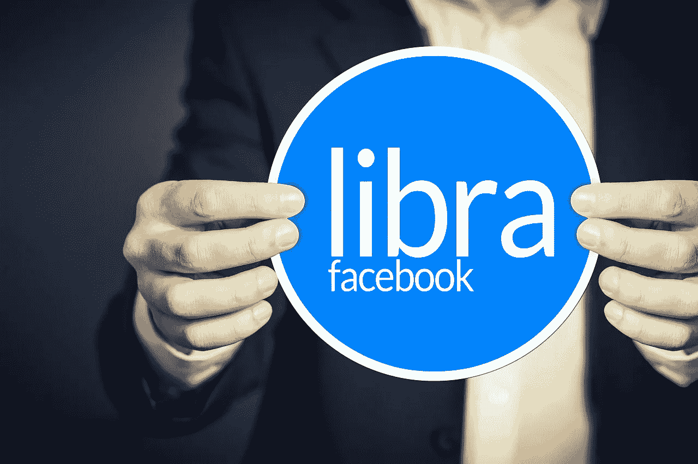

# 关于脸书天秤座的争议

> 原文：<https://medium.datadriveninvestor.com/a-word-on-the-controversy-of-facebooks-libra-298e608cf846?source=collection_archive---------16----------------------->

Image by [Gerd Altmann](https://pixabay.com/users/geralt-9301/?utm_source=link-attribution&utm_medium=referral&utm_campaign=image&utm_content=4283995) from [Pixabay](https://pixabay.com/?utm_source=link-attribution&utm_medium=referral&utm_campaign=image&utm_content=4283995)

对于比特币的价格和趋势来说，2019 年就像过山车一样。

2019 年 11 月， [Blockshow Conference Asia](https://blockshow.com/) 就 2020 年的加密预测进行了讨论。在谈论 2020 年之前， [Fundstrat Global Advisors](https://www.fundstrat.com/) 的管理合伙人兼研究主管 Thomas Lee 谈到了他对 2019 年观察到的加密货币价格趋势的立场。

## 为什么比特币没有在 2019 年底达到历史高点？

根据托马斯的说法，2019 年加密货币有两个阶段。这一年的第一部分最好用干粉来形容。很多在 2018 年平仓的原始加密投资者将其重新投入美元，这是一个巨大的干粉。他说这是帮助比特币达到 9000 美元的原因。

 [## 总部位于瑞士的 ETP 进入加密交易市场|数据驱动的投资者

### 虽然金融市场几乎没有沉闷的时刻，特别是在引入…

www.datadriveninvestor.com](https://www.datadriveninvestor.com/2019/03/10/swiss-based-etp-enters-the-crypto-trading-market/) 

然后，我们有了看起来非常好的发展脸书的天秤座，如果它持续下去，今年真的可以增加采用。但这并没有发生，因为我们开始看到一系列的挫折，尤其是来自白宫的挫折。

托马斯表示，比特币本可以在今年年底前创下历史新高，但它可能在美国遭遇了太多监管挫折。这就是为什么我们现在回到了 8000 美元的水平。

## 天秤座会在 2020 年成功发射吗？

在所有能够推出自己的加密货币的组织中，脸书似乎是一个不错的选择。

> 托马斯表示，“我认为 Libra 是 crypto 最重要的项目之一，因为它真的是美国主流比特币采用的路线图。全球三分之一的财富(100 万亿美元的家庭财富)由美国控制。即使它是一枚稳定的硬币，我们也必须记住，任何稳定硬币的主要用途是推测其他东西的价格。因此，如果 Libra 成功了，这将是 crypto 的巨大胜利。”

但随着 2019 年底的临近，我们看到脸书仍然缺少最关键的元素，那就是信任。

> “我认为 Libra 或脸书犯的错误是没有得到监管机构和传统金融行业的认可。任何时候都有一个受到高度监管的行业，无论是航空公司、医疗保健、金融还是电信，你都需要让监管机构参与到每一步。这才是银行真正擅长的。这就是为什么银行有许多金融服务界的民主党成员。我不认为脸书也打了那场比赛。但是游戏还没有结束。他们可以进行投资，我认为这是他们需要进行的投资。”他补充道。

## 一些人可能对天秤座有所保留

问题是，马克·扎克伯格可以通过脸书监控你在互联网上做的任何事情。现在他想更进一步，用他的加密货币 Libra 监控你花钱的方式。

Libra 可能是加密货币最终被大众使用的原因。脸书本质上是想让天秤座成为下一个贝宝，让你更容易花钱或汇款。所以，如果你想买东西，或者给你海外的朋友寄钱，当你和天秤座一起做的时候，你就不用担心汇率，高额的交易费，或者等待时间。其目标与比特币等其他加密货币非常相似，只是其他公司从未真正支持比特币。

脸书可以解决这个问题，因为脸书是一家巨型公司，它也有能力让其他大公司支持他们的加密货币。但 Libra 和比特币等其他加密货币有一个很大的区别。天秤座不分散。其实恰恰相反！

这就是它的含义..

像比特币这样的加密货币本来应该是去中心化的。这实质上意味着比特币本应由 it 用户，也就是像你我这样的普通人来管理和控制。另一方面，天秤座不会被用户控制。它将被像脸书、维萨、万事达和优步这样的大公司所控制。

如果你想成为控制天秤座的大公司之一，你所要做的就是向脸书的天秤座协会支付 1000 万美元。

想知道脸书是否提供天秤座贷款？这里最大的问题是，你相信脸书会控制你的钱吗？有些人可能会认为脸书已经在监视他们的一举一动，所以他们不妨也把钱包给脸书。但是其他人可能不同意。

如果你想在 Libra 发布时使用它，你可能需要下载脸书、它的 Messenger 应用、Whatsapp 或者 Libra 应用。这意味着脸书会从各个角度监视你。这对投资者和公司来说真的很有趣，因为这可能会再次改变广告的游戏。

在演讲的最后，托马斯·李补充了一句话，让所有的密码爱好者充满了喜悦。他引用了，

> “我相信天秤座会成功发射，所以我认为这显然将是一个非常大的利好。”

*原载于 2019 年 12 月 5 日*[*【https://opinined.com】*](https://opinined.com/a-word-on-the-controversy-of-facebooks-libra/)*。*