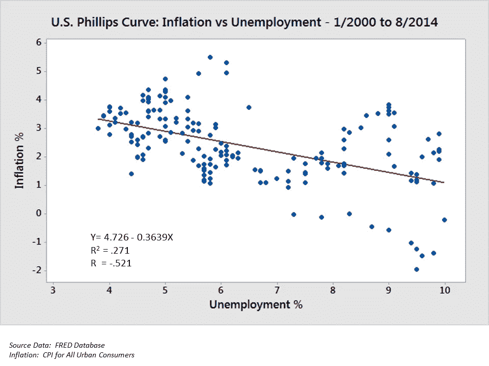
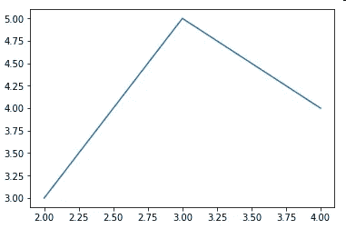
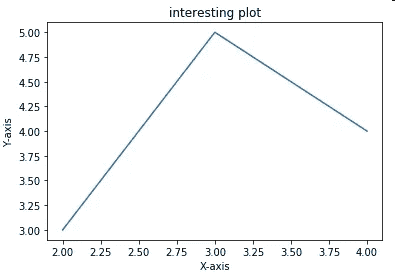

# 使用 python 实现 A-Z 数据可视化(第 1 部分)

> 原文：<https://medium.datadriveninvestor.com/a-z-data-visualization-using-python-part-1-4d4337630a63?source=collection_archive---------18----------------------->

数据可视化是建立预测(机器学习)模型的最重要的事情之一。数据可视化是指通过将数据或信息编码为图形中包含的可视对象(例如点、线或条)来传达数据或信息的技术。

*“数据可视化的主要目标是通过图形方式清晰有效地交流信息。这并不意味着数据可视化需要看起来很无聊才能有功能，或者非常复杂才能看起来很漂亮。为了有效地传达想法，美观的形式和功能需要携手并进，通过以更直观的方式交流关键方面，提供对相当稀疏和复杂的数据集的洞察。然而，设计师经常无法实现形式和功能之间的平衡，创造出华丽的数据可视化，却无法服务于他们的主要目的——交流信息”——Friedman(2008)*



一个散点图，说明在不同时间点测量的两个变量(通货膨胀和失业)之间的负相关关系。

# **让我们开始吧:**

我们将使用[matplotlib](https://matplotlib.org/)(python 中的一个绘图库)。

首先我们需要在电脑上安装 matplotlib。如果你不知道如何安装 matplotlib，点击[这里](https://www.youtube.com/watch?v=teYDMT_vLHo)。

安装 matplotlib 后打开 Spyder(我们要用 [Spyder](https://www.spyder-ide.org/) (用于编程)。

让我们导入库！

```
*#import the library* *import matplotlib.pyplot as plt* 
```

导入库后。让我们在图上画一些随机数。

```
#create a random list X & Y
X = [2, 3, 4]
Y = [3, 5, 4]#using plot method in matplotlib to plot a graph
plt.plot(X, Y)
```

您可以随时通过在 windows 中单击 **ctrl + i** 来检查 spyder 中的方法

**MAC 中的 cmd + i** 。

为了显示绘图，我们在 matplotlib 中使用了`plt.show()`方法。

```
#display a graph
plt.show()
```

在 spyder 编辑器中选择所有代码，在 mac 中按 ctrl + enter 或 cmd + enter 来运行代码。Wallah…你在 matlpotlib 策划了你的第一个阴谋。

输出或图形将如下所示:



first plot

让我们给情节添加更多的细节

我们将用`plt.xlabel()`、`plt.ylabel()`来标注图形的 x 轴& y 轴。

对于标题，`plt.title()`

```
#adding label & title to graph
plt.xlabel('X-axis')
plt.ylabel('Y-axis')
plt.title('interesting plot')
plt.show()
```

运行代码。



你可以在这里找到我所有的代码

*快乐观想；)*