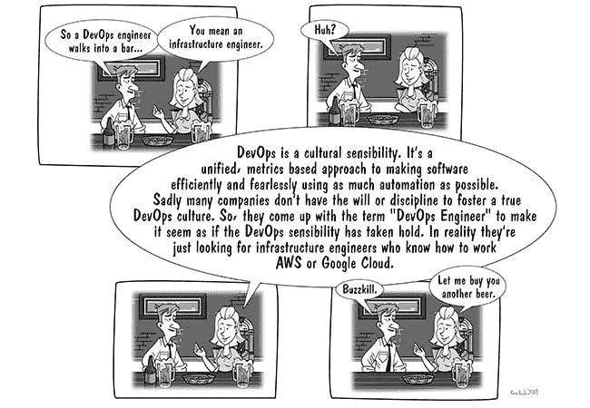
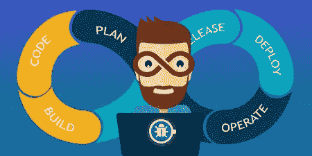
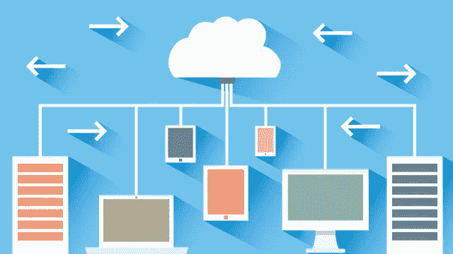
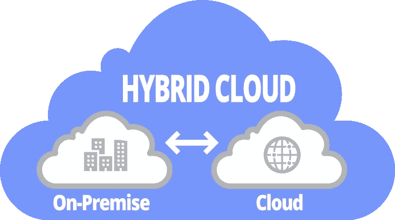
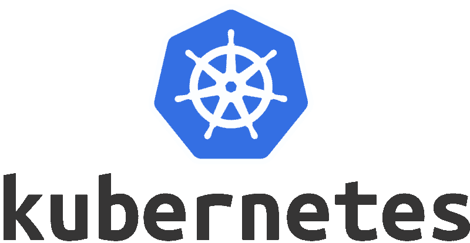

# 云计算的 A-Z

> 原文：<https://medium.datadriveninvestor.com/a-z-of-cloud-computing-7c70fe9730bb?source=collection_archive---------4----------------------->

> 嘿范姆！标题只是让我的媒体帖子获得更多关注的一种花哨方式。我将介绍到目前为止大多数可用的工具和服务，但不是全部，也不是按照任何字母或时间顺序。谢谢你的理解。

这件作品的灵感来自我的一位同事。他解释说，他似乎不明白为什么 Devops 或云领域的人们总是想出创新的方式来命名该领域的功能和更新。他谈到这个领域出现的所有技术术语，如 PaaS、IaaS、K8s、VPC、无服务器、容器化等，都让他不知所措，他无法理解我们所做的一切。因此，我认为有必要对当今云计算领域中的大多数工具、产品、服务和微服务做一个简短而简明的概述。

因此，我心想，除了尝试概述 AWS、Azure 和 GCP 等流行的云计算服务提供商提供的云计算资源、工具和服务之外，还有什么更好的方式来让云计算新手了解这个领域。我选择 AWS 作为案例研究之一，因为他们拥有最大的客户群记录。与 Azure、GCP 和其他公司不同，AWS 目前在全球云计算市场占有最大份额。为什么是 GCP？因为谷歌云平台拥有强大的计算能力。作为一个新生事物，GCP 在易用性、安全性以及平台上的创新工具、产品和服务方面都是首屈一指的。

Lak Lakshmanan (高级数据科学家@GoogleCloud)曾经说过，全球生产的三分之二的 CPU 都被谷歌购买，用于他们在世界各地的数据中心。

## **扫兴的人**

在我们开始之前。关于“DevOps 工程师”这个名字标签，有一种普遍的误解。对于这个领域的许多专家来说，他们确实告诉你这是一个“时髦的头衔”。你可能指的是基础架构工程师或云解决方案架构师。你的热门招聘广告会列出“DevOps 工程师职位”的某些标准，这些标准要求有经验，如使用 K8s 处理容器编排，在生产过程中设置应用洞察力的监控和记录等。尽管这听起来不错，也有一定的真实性，但并不完全正确。

DevOps Buzzkills cartoon

DevOps 工程师在一个真正将 DevOps 作为一种文化的组织中的角色解释如下。首先，让我们简单解释一下 DevOps 需要什么，以及 DevOps 工程师在 IT 组织中的角色。

**什么是 DEVOPS**

在我看来，DevOps 是一些 IT 组织吸收的一种理念，目的是在公司的日常活动中，在开发人员和操作人员之间架起一座桥梁，作为实现更快地生成高效代码的目标的一种手段。

DevOps 本身就是 Developer 和 Operator 两个词的组合给 DevOps。

但是教科书上对 DevOps 的定义到底是什么呢..

根据 Pierluigi Ritti(高级基础设施工程师)

> DevOps 被用来定义一场因减少公司开发和运营团队之间的障碍而产生的运动。

DevOps 的目标是缩短上市时间。这意味着采用 DevOps 实践，以减少所需的时间，从识别新需求到为客户投入使用的时间。

DevOps 之旅引入了持续集成和持续交付等实践，这有助于缩短上市时间，更快地生产出质量更好的软件。目标是拥有一套实践，可以用来减少 IT 组织中不同部门之间的沟通瓶颈。你可以在我的文章[这里](https://medium.com/faun/devops-vs-sre-what-you-need-to-know-4079e78a1873)中了解更多关于开发者——运营商的斗争。

**世卫组织是 DEVOPS 的工程师？**

(Cartoon: DevOps Engineer)

> DevOps 工程师代表了开发人员和操作团队之间的一种桥梁。在大多数情况下，DevOps 工程师承担的角色是系统管理员和开发人员的混合，这是非常好的，因为这些工程师必须具备建议和管理来自这两个学科的问题的必要知识。

在某些情况下，DevOps 工程师的职责与持续集成和交付有关。与该职位相关的另一项职责是基础设施管理，通常是基础设施即代码(IaC)，但这些天来，由于 docker containers 和 Kubernetes，DevOps 工程师现在将大部分时间用于管理开发团队伙伴 Docker containers，并帮助在公司范围内实施最佳 DevOps 实践。DevOps 是云的同义词，对云很重要。因为云开发要求软件始终是实时的，并且被设计为发布更快、质量更高。

现在我们已经对 DevOps 和 DevOps 工程师的工作做了一点公正的解释。我想从揭开云计算的神秘面纱开始。

**云计算**

我脑海中的云计算是一个全球可用的虚拟化数据中心，充满了出租用于商业用途的计算资源，更好的是通过互联网向客户提供按需计算资源。

然而，让我们用国家标准与技术研究所(NIST)的定义如下:

> 云计算是一种支持对可配置计算资源(例如，网络、服务器、存储、应用程序和服务)的共享池进行无处不在、方便、按需的网络访问的模型，可配置计算资源可以通过最少的管理工作或服务提供商交互来快速供应和释放。

**云是有弹性的:**这是一种云特性，允许无缝的向上和向下扩展。

**云是计量的:**这是云的特性，允许人们只为使用的东西付费。

**云是一种自助服务应用**:云是一种自助服务应用，这意味着与传统的内部数据中心相比，减少了对 IT 专家的需求，传统的内部数据中心需要支付维护工程师的费用，他们帮助管理组织数据中心中可用的大量堆积的服务器和计算资源硬件。云服务提供商帮助维护和管理其他硬件复杂性，而您只需关注您的应用程序及其可扩展性。

**IAAS**

众所周知，基础设施即服务(IaaS)是一种通过互联网提供虚拟化计算资源的云计算产品。IaaS 平台的常见例子有 AWS EC2 计算资源平台、谷歌计算引擎和微软 Azure 平台。

**虚拟化**

虚拟化只是将物理计算资源通过互联网逻辑划分为可租用的结构。有多种方法可以分割计算资源，如服务器、存储、操作系统、网络和数据库。

**虚拟机**

我肯定我们中的一些人以前一定听说过 VM 这个词。它只是虚拟机的缩写。虚拟机在虚拟机管理程序上运行，它是物理服务器的一个基于软件的实例，其中来宾操作系统可以访问模拟的虚拟计算机硬件。

简单地说:虚拟机是基于计算机架构的软件仿真，提供物理计算机的功能。

**集装箱**

容器是操作系统级的虚拟化，其中操作系统内核提供独立的用户空间来运行特定的应用程序。据 AWS 网站；容器共享安装在服务器上的操作系统，并作为资源隔离的进程运行，确保快速、可靠和一致的部署，而不管环境如何。

容器运行在虚拟机内部，启动时间比虚拟机更短更快。集装箱已经用 **Docker 集装箱普及了。**

**另一方面，**Docker 容器是一个映像，它是一个轻量级的、独立的、可执行的软件包，包括运行应用程序所需的一切:代码、运行时、系统工具、系统库和设置。

## 云产品的类型

以下是不同类型的云产品。

**私有云**

私有云是在内部运行的，是您自己的数据中心，位于您自己的大楼中，拥有自己的基础架构。这种云产品的优势在于，您的数据不会在公共云空间中移动，这将降低数据泄露或黑客攻击的可能性。

一个**私有云**通常通过单个组织的内部资源进行管理。

**公有云**

公共云是一种计算类型，服务提供商通过互联网向公众提供资源。资源因提供商而异，但可能包括存储功能、应用程序或虚拟机。公共云允许可扩展性和资源共享，否则单个组织不可能实现这一点。

这主要是公开分发的 IaaS 云产品，如 AWS EC2 计算资源、Azure 虚拟机或 Google 计算引擎。

**混合云**

Hybrid Cloud Illustration

重要的事情先来。这不是一个真实的位置，就像一个可以查看混合云服务的平台。混合云的意思是，在您的私有云与公共云之间有一个连接，它们协同工作。它涉及将工作负载从组织的私有云增加到服务提供商的公共云产品。例如，您可以在您的私有云上托管您的组织数据库，并在公共云域上拥有 web 服务器。GCP 目前推出了 Anthos(一个托管的容器化工具，用于将 IaaS 工作负载从私有云迁移到 GCP 公共云产品)。

**VPC**

**虚拟专用云(VPC)** 就是在**公共**云环境中分配的按需可配置的共享计算资源池，在使用资源的不同组织之间提供一定程度的隔离。

这就是云产品。

现在你可能已经听说过其他的首字母缩写词，如 SLA 或 SLO，并想知道它们是什么意思。

嗯…

**服务水平协议**

SLA 是服务水平协议的首字母缩写。它定义了云服务提供商(无论是 AWS、Azure 还是您订阅的 GCP)将为您提供的云资源消费者的性能和可用性水平。SLA 还有助于告诉他们在无法提供商定的服务级别时将采取什么措施。

## 负载平衡

负载平衡是指创建了两个或更多相同的服务器或服务器集群，以便在负载过大或一个或多个服务器出现故障时，其余的服务器可以协助或接管处理负载。这是创建高度可用的应用程序和服务的一种方式。

**云中的存储**

举几个例子，流行的 IaaS 存储服务是 AWS S3 桶、Azure Blob 存储和谷歌云存储服务。

**对象存储:**它非常适合非结构化数据(不以传统方式存储的数据)，例如视频文件、音乐文件等。

存储可以在虚拟机内部完成。每个虚拟机都有自己的存储设备。

存储也可以在虚拟机外部完成。每个虚拟机都可以访问外部存储，如数据块或对象存储。

**云中的数据保护**

数据保护和灾难恢复解决方案有 Carbonite、Zerto、Infra-scale 等等。

## **加密**

在云服务架构上保护数据安全的方法之一叫做加密。加密是将信息或数据转换成密码文本的过程，除了拥有密钥的人之外，任何人都不容易理解。

## PaaS

这项服务主要面向开发者。它只是一个平台，开发者专注于代码，而服务提供商根据需要帮助管理和处理其他资源，如服务器、存储、网络、操作系统、中间件或数据库。PaaS 产品的例子有 [AWS Elastic Beanstalk](https://aws.amazon.com/elasticbeanstalk/) 、 [Google App Engine](https://cloud.google.com/appengine/) 和 [Heroku](https://www.heroku.com/) 等等。

## SaaS

这些是基于 web 的轻量级客户端应用程序，托管在云上，帮助组织和个人更轻松、更快速地完成日常活动。Saas 软件例子有 [GSuite](https://gsuite.google.com/intl/en/features/?utm_source=google&utm_medium=cpc&utm_campaign=emea-ng-all-en-dr-bkws-all-hv-trial-e-t2-1007172&utm_content=text-ad-none-none-DEV_c-CRE_167615330310-ADGP_Hybrid%20%7C%20AW%20SEM%20%7C%20BKWS%20~%20EXA_1:1_NG_EN_G%20Suite_GSB01_g%20suite-KWID_43700016305019417-kwd-7564271891-userloc_9076657&utm_term=KW_g%20suite-ST_g%20suite&ds_rl=1244687&ds_rl=1259922&gclid=Cj0KCQjwuNbsBRC-ARIsAAzITufoQkmMsYmVs9coMPpMUA5U3NRAsuf7vKbGm-SfQChKyVktMC7VKAcaAvQMEALw_wcB&gclsrc=aw.ds) 、 [Microsoft Outlook、](https://outlook.live.com/owa/)和 [SalesForce](https://www.salesforce.com/) 等等。

## **FaaS**

传统的定义是简单的功能即服务(FaaS)是云计算服务的一个类别，它提供了一个平台，允许客户开发、运行和管理应用程序功能，而无需构建和维护通常与开发和启动应用程序相关的基础架构的复杂性。按照这种模型构建应用程序是实现“无服务器”架构的一种方式，通常在构建微服务应用程序时使用。使用 FaaS，开发者只为被调用的函数付费。FaaS 架构的一个典型例子是 AWS Lambda、Google Cloud Function 等等。

## **CI/CD**

如果不提到 CI/CD 方式的自动机，我们似乎无法破译所有的技术术语或归因于云计算的非技术人员的技术行话。

> CI/CD 是持续集成和持续开发的缩写。这是一种开发实践，要求开发人员将代码集成到一个中央共享存储库中。

每次开发人员提交代码时，它都会与其他代码集成，并通过测试的执行来验证。每当我们将代码提交到集中共享的存储库时，CI 就开始了。这意味着每次我们改变一些东西，例如，一个 HTML 页面上的标签，或者一个变量，我们测试整个解决方案，因为我们在每次提交时都测试解决方案。我们可以在构建中更快更容易地找到错误并修复它们。这就是 CI/CD 软件开发咒语的全部内容。我们使用 Jenkins 作为云服务器资源来处理 CI/CD 流程。

因此，CI/CD 链就是简单的开发—测试—部署。

**码头集装箱**

Docker 可能是最著名的容器化软件。它提供了一定程度的

虚拟化称为操作系统级虚拟化。 **Docker 容器被称为**映像，它是一个轻量级的、独立的、可执行的软件包，包括运行应用程序所需的一切:代码、运行时、系统工具、系统库和设置。

使用 Docker，我们可以轻松地为 CI 和 CD 创建我们的流程，因为当我们提交代码时，我们可以直接创建和编译 Docker 映像，并在测试中发布它。

**KUBERNETES**

> Kubernetes，有时被称为 K8s，是由 Google 开发的开源平台，由云原生计算基金会管理。它用于管理和扩展集群中的容器化应用程序(Docker)。

现在，由于 Docker 容器在集群中不断增加，需要在生产中管理和监控这些容器，因此需要一个名为 Kubernetes 的容器编排服务。谷歌声称，在他们决定将其开源之前，他们已经在内部使用了多年的容器管理软件。

**POD**

这只是一组具有共享 IP 地址的 Docker 容器。

**标签**

这些用于创建密钥对值，以识别资源集群，例如 pod。

**部署**

部署用于声明和管理 pod 和副本集的状态。

Kubernetes 是一个容器编排器，用于自动化容器化应用程序(例如 Docker)的部署、管理和伸缩。该容器在 pod 中定义。这提供了高层次的抽象，将容器化的应用程序分组。pod 是每个 Kubernetes 应用程序的基本构建块。豆荚帮助我们释放容器。我们可以释放容器，而不是一次释放一个容器。一个 pod 在定义中可以有多个容器，这有助于一次释放多个容器。

因此，从 IaaS 解决方案到 PaaS 到 SaaS 到 FaaS，再到现在的集装箱化。我希望我已经能够给你一个概述，这些术语归因于空间意味着什么。