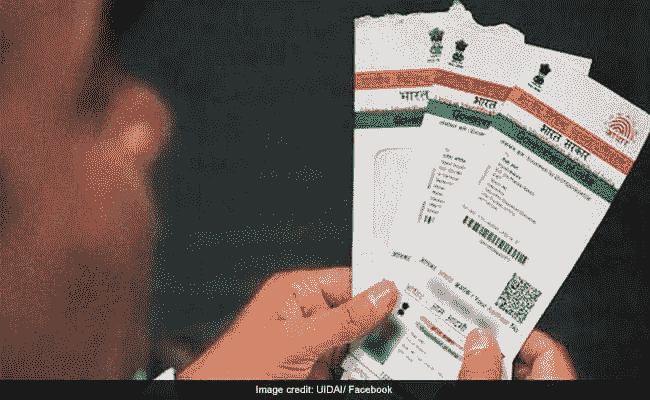
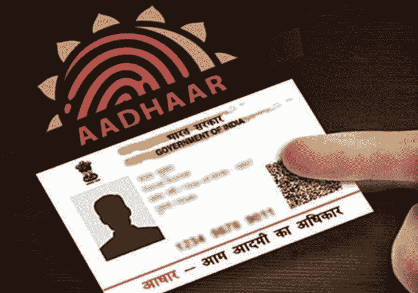
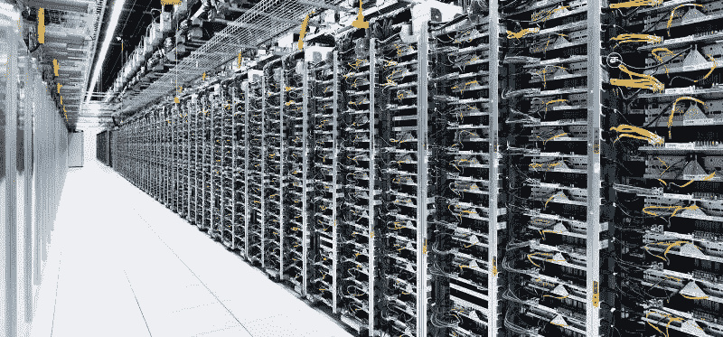
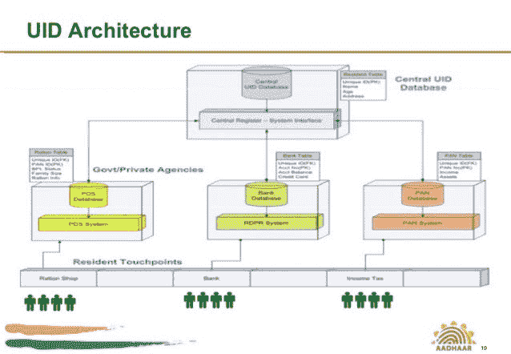
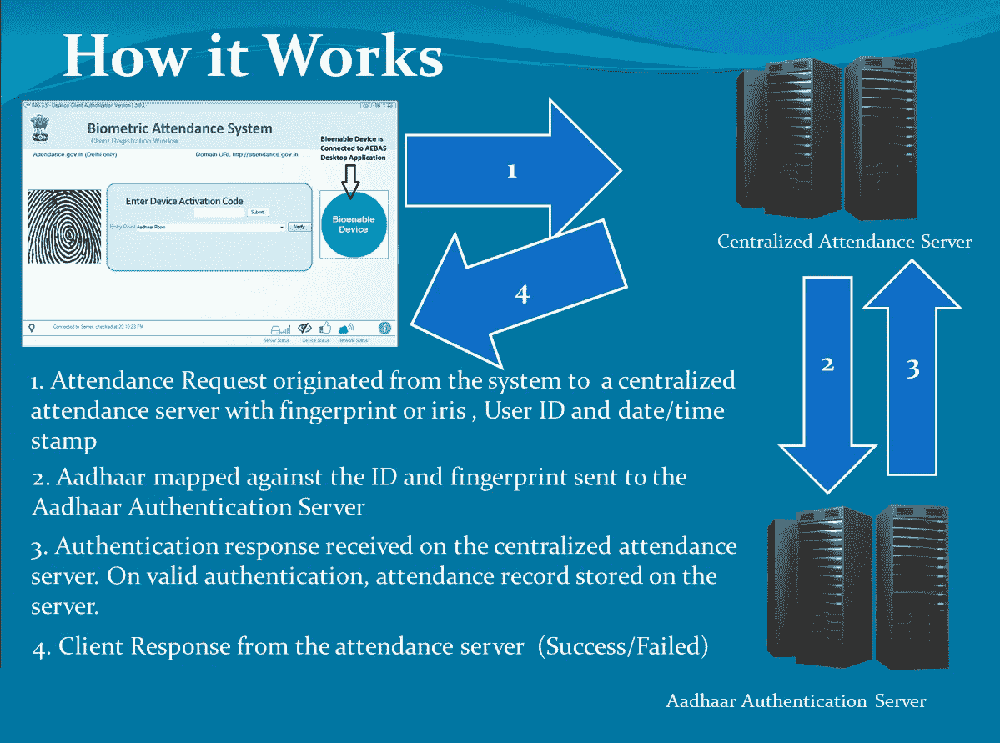
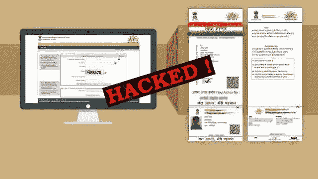
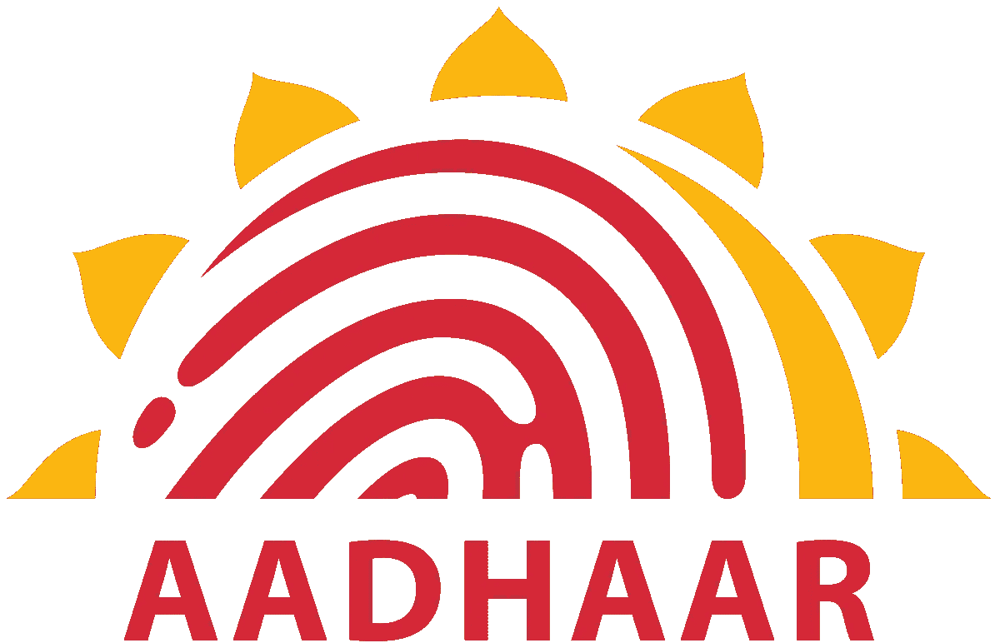

# AADHAR-印度的数字身份和世界上最大的生物识别系统

> 原文：<https://medium.datadriveninvestor.com/aadhar-indias-digital-identity-and-world-s-largest-biometric-system-9ce81ebb4b8b?source=collection_archive---------2----------------------->

如题，曾经在国际舞台上吸引了众多目光的 **Aadhar 政策**是**世界上最大的生物识别系统**。

AADHAR 于 2009 年 1 月 28 日在*开始了它的旅程，作为**印度唯一识别机构(UIDAI)** 和 *UPA 1 政府*的一个宠物项目。这是一个独特的 12 位数字号码，发给每一个注册的印度居民。这个 12 位数字包含了*个人的生物特征信息、地址、出生日期和所有主要信息*。尽管有这么大的风险，拥有 AADHAR 并不能证明你的公民身份。超过 11.9 亿人已经登记，他们的身份证已经发放，这大约占印度人口的 93%。*

政府实施 Aadhar 是为了减少对其他居住证明的依赖，如配给卡，同时也是为了将印度的数据数字化。这个方案后来被莫迪扩展到了个人身份卡、手机号码和更多的 T21。这引起了很多争议，比如隐私问题，单一依赖等等。

## 技术方面

一份文件将包含*姓名、地址、出生日期、10 次指纹扫描、2 次虹膜扫描和一张照片*。细节储存在一个中央数据库中。

> AADHAR 的数据储存在哈里亚纳邦本加卢鲁和马内萨尔的大约 7000 台服务器上。

用户可以通过扫描*二维码*获得电子 *PDF 格式或 XML* 格式的数据。

## 为什么是阿达尔？

政府非常清楚拥有大量人口不同细节的硬拷贝的局限性。此外，UIDAI 认为，Aadhar 将实现数据的数字化和集中化，这将使其易于访问，并可以解决假身份证的问题。

首先，Aadhar 与银行账户相关联，这将有助于消费者注册 **LPG 连接**，并使现有消费者转向电子补贴行动。Aadhar 还被强制用于新的银行账户、学校和大学入学以及申请政府计划。Aadhar 还为印度政府的云系统**的 **Digi Locker 系统**的使用铺平了道路，这确实是一个值得称赞的系统。**

****

> **Infosys 的创始人南丹·尼勒卡尼是这个庞大项目的带头人**

**Aadhar 还用于介绍*生物识别出勤记录、国家犯罪记录局数据库、护照申请等***

## **争议**

**尊敬的印度最高法院做出裁决，T2 政府不能强制要求使用政府服务。它还表示，*收集、使用和存储公民的生物特征* *是对个人隐私的侵犯。这引起了很多关于阿达尔政策的问题。直到 2018 年 9 月, ***SC 才表示 AADHAR 在宪法上是有效的。******

> **值得注意的是，SC 压制了 aadhar 卡的多种用途，说它根本不是机构录取、发行新 sim 卡和使用 CBSE 的强制性规定。**

****

**另一个主要的争议是关于 aadhar 应该链接到 PAN、电话号码等的链接过程。对于为何启动这一举措以及这一举措的现状，既没有愿景，也没有重要的理由。**

> **IEEE Spectrum 在 2018 年 3 月版发表了一篇文章。这是关于隐私和数据安全的问题**

> ****引用光谱**——随着 Aadhaar 的成长，该计划也被证明容易受到欺诈。今年 1 月，论坛报报道称，村级 Aadhaar 登记代理正在以低至 8 美元的价格出售个人信息。第三方在中央存储库中汇编此类数据的能力可能是 Aadhaar 系统的弱点之一。**

## **澄清**

> ****引用光谱**——几天后，印度唯一身份认证机构(UIDAI)表示，它将提供面部识别以及用户生成的虚拟身份证号码来验证个人身份，因此用户不必在每次交易中透露他们的 Aadhaarnumbers。**

**这种方法的主要缺点是用户永远无法接近警察或法院，因为只有 UIDAI 可以这样做。**

**有人还声称，将 aadhar 与其他敏感数据联系起来，也将再次侵犯其安全性。尽管如此，UIDAI 立场坚定，表示 **AADHAR 永远不能被黑，直到地球上有生命存在。证明他错了的是法国黑客埃利奥特·奥尔德逊公开了他的所有细节。****

> **参考:-[https://twitter.com/rssharma3/status/1023119411568201730](https://twitter.com/rssharma3/status/1023119411568201730)**

## **结论**

****

**AADHAR 是否安全或者是否侵犯隐私确实是一个大问题。抛开这一点，它可以被标记为 UPA 和 NDA 帽子下的一根金色羽毛。这标志着印度的数字革命，同时整个 UIDAI 团队所付出的巨大努力也值得称赞。**

## **推荐阅读**

** [## 什么是地理信息系统

### 你需要知道的关于 GIS 的一切，它的基本工作，在工程中的作用及其应用。

medium.com](https://medium.com/geekculture/geographic-information-system-gis-743889bebb02)  [## 北斗——中国建成自己的 GPS，成为第三个拥有 GPS 的国家

### 中国的新举措是在亚太地区与美国的 GPS 相抗衡。

medium.datadriveninvestor.com](/beidou-china-completes-building-its-own-gps-the-third-country-in-the-world-to-have-so-d046710a3a87)  [## 对无线电世界的探索

### 了解无线电的起源、历史和技术

medium.com](https://medium.com/iete-sf-mec/a-dive-into-the-world-of-radios-718c31e74165)**