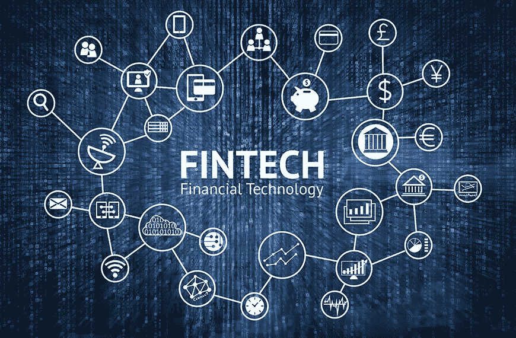

# ABCD 正在推动金融科技

> 原文：<https://medium.datadriveninvestor.com/abcds-driving-fin-tech-db0986b1ddee?source=collection_archive---------1----------------------->

picture from financialtribune.com

在过去的几年里，替代金融已经慢慢地以两种主要方式改变了金融服务的提供和这种服务的提供者。新商业模式和新技术。理解让另类金融蓬勃发展的四项关键且相互关联的技术至关重要。这些可以被称为推动金融科技的 ABCDs，即人工智能，或人工智能，区块链，云计算和数据。

银行长期以来依赖并产生了大量的信息。这些信息包括来自和关于客户的信息，他们的身份，他们的交易，他们的净值，甚至他们的关系和位置。然而，在过去，这些数据大多是通过客户和银行员工填写的纸质表格收集的，不容易进行搜索或分析。信息从纸张到数据，从书面到数字和 0 的数字化意味着这些信息可以更容易地存储、传输、搜索、处理、分析和显示。这种数字化使在线资本市场更容易创建和运营，收集者可以更具成本效益地为需要资本的人处理和分析数据。然后，他们可以在新平台上展示相关信息，让潜在的资本提供者做出自己的投资决策。同时，在线客户活动的数字表单填写和跟踪允许这些在线平台以及虚拟银行和电子经纪公司以更少的人工和空间资源更快地扩展。客户数据包括在线行为，如登录和交易的时间和位置，以及其他在线活动，如网页浏览、电子商务和社交媒体使用。越来越多的离线行为也通过物联网设备(如可穿戴智能手表、智能汽车和智能家居设备，如亚马逊 Echo)的物联网数据进行跟踪。例如，在全球最大的零售商沃尔玛，每小时处理 2.5 的数据。一个 pb 是 10 个字节，后面有 15 个“0”。客户数据被称为新的石油，被采集者和用户买卖，并越来越多地为人工智能引擎提供燃料。

过去，金融机构等企业不得不使用不同的企业级软件来构建他们的 IT 系统，这些软件是以很高的成本开发或许可的，并且托管在本地的大型服务器上。然而，随着云计算的诞生，软件驻留在由公司运营的服务器上的数据中心，这些公司被创建来管理这些服务器，这些服务器还提供增值服务，如网络安全保护。这意味着替代金融提供商等新企业不再需要为昂贵的基础设施投入高额资金，可以专注于改善客户体验，并可以根据其增长率动态调整服务器使用。

云计算也让新的商业模式蓬勃发展。软件即服务或 SaaS 业务绕过了软件开发和销售的传统供应商模式，这种模式要求以更高的前期费用销售软件许可证，并在每次推出新版本或升级时再次销售。驻留在云中的软件现在可以基于订阅模式以较低的前期成本进行营销。软件升级可以持续自动进行，这给了客户更换供应商的又一个理由。这意味着在线资本市场以及像英国斯塔林银行这样的新兴虚拟银行需要更少的前期成本来构建新的商业模式。这也意味着用户界面可以更快、更经济地推出，同时扩展到新的管辖区域。此外，云使联网的物联网设备能够收集数据，并通过智能手表、声控扬声器、智能家居和智能汽车等新接口向客户提供更多服务，包括金融服务。云计算现在可以有效地为零售企业提供机构级的技术支持。

分布式账本技术或 DLT 继续对替代金融产生不断发展的影响。复式记账法最古老的例子可以追溯到 1494 年的方济各会修士卢卡·帕乔利。卢卡·帕乔利是意大利数学家，在欧洲被称为“会计和簿记之父”。他是第一个使用复式记账系统出版作品的人，复式记账系统允许以标准化的方式对债权人和债务人进行可靠的记录。神秘的中本聪在 2008 年发表的比特币白皮书在建立一种加密货币方面也具有类似的革命性，这种加密货币试图解决一种基于软件的货币固有的双重支出问题，而不需要可信的权威机构或中央服务器。Nakamoto 创建了一个通过点对点网络分发的分类账，以块的方式记录交易。每个块由网络中的不同节点计算机通过解决密码数学难题来验证，此时，具有新的密码散列、时间戳和数据的新块将被添加到对所有用户透明的链中。块上的数据是不可变的，并且实际上不能被改变，除非链中的所有先前的块通过网络多数的一致意见或协议被改变。

区块链是加密货币背后的底层技术，加密货币已经大幅扩展到比特币之外。通过这种方式，这种技术创造了一种新形式的数字资产，以及一种为新项目筹集资金的新的替代金融方法，所谓的加密交易所正在成为新形式的在线资本市场。此外，区块链技术可以构成新的资本市场基础设施的基础。纳斯达克使用区块链技术来保护私人公司所有权和转让的记录。2017 年 12 月，澳洲 ASX 宣布将使用区块链技术替换其股票交易所注册、结算和清算系统。区块链技术的一个更大胆的应用可能是创建分散自治组织(DAO)、全自动商业实体(FAB)或分布式自治公司(DAC)。DAO、FAB 和 DAC 是同一概念的不同名称。Dao 是自治组织，允许通过智能合同在特定条件下自动执行，具有基于利益相关方计算机上的开源软件的创新治理机制。尽管这有些牵强，但如果全面实施，DAOs 及其去中介化的努力不仅会影响风险资本市场，还会影响股份公司的概念，甚至政府的一些职能。

制造机械仆人的铁匠赫菲斯托斯和融合了智能机器人思想的青铜人塔罗斯的古希腊神话中都提到了智能类人机器的概念。人工智能一词是 1955 年在现在著名的达特茅斯夏季研究研讨会上创造的。对于人工智能来说，有两种广泛的类型，与执行特定任务的算法相关的窄或弱人工智能，以及反映更广泛的人类智能和决策的一般或强人工智能。此外，人工智能中还有不同的分支，包括自然语言处理或与语言相关的 NLP，以及机器学习，其中系统通过数据训练而不是基于规则来学习经验。机器学习中有许多技术，包括由人脑启发的加权互联思想节点组成的神经网络，以及深度学习，指的是基于深层神经网络的算法。用于图像识别的计算机视觉是机器学习的一个很好的例子。

人工智能的蓬勃发展得益于一系列事件，这些事件使《财富》和《福布斯》将 2017 年命名为人工智能年。首先，研究人员开始使用相对便宜的图形处理单元或 GPU，而不是人工智能算法处理所需的昂贵的大型超级计算机，这些图形处理单元或 GPU 最初是为并行使用时计算能力增强的视频游戏开发的。其次，数据存储成本持续下降，同时通过在线活动和互联设备以惊人的速度收集数据，从而允许收集、存储和使用更多结构化和非结构化数据来训练机器。第三，大多数主要的云公司，如亚马逊的 AWS，谷歌云，微软的 Azure，IBM 云和阿里巴巴的阿里云，都将人工智能纳入了他们的服务，通常包括一些开源基础上的机器学习框架，以允许他们的客户进行实验并纳入他们的运营。例如，人工智能正在迅速改变替代性金融用户界面，从面部和语音识别到生物识别身份管理，再到可以提供个性化建议的聊天机器人。需求、定价和预测分析的算法匹配也在使用。人工智能还允许一些替代金融公司创建新的商业模式，专注于分析客户数据，而不是建立平台来提供金融资金流。例如，一些最初以 P2P 贷款公司起家的中国公司已经转向提供信用分析和评分，为机构投资者和贷款机构进行的市场贷款服务。

这些技术是金融科技行业成为未来几年最令人兴奋的行业之一的原因。