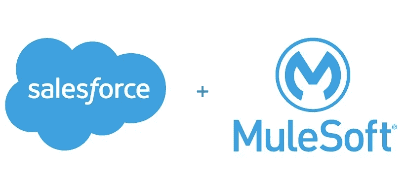

# 关于 Salesforce 收购 MuleSoft:市场视角

> 原文：<https://medium.datadriveninvestor.com/about-salesforces-acquisition-of-mulesoft-a-market-perspective-2170c0dc99ba?source=collection_archive---------1----------------------->

昨天，Salesforce 宣布，已经达成以 65 亿美元收购 MuleSoft 的最终协议。这一消息令人意外，导致 MuleSoft 股票在市场交易时段上涨 22%以上，迫使纽约证券交易所暂停交易几分钟。该交易是 Salesforce 有史以来最大的收购，应该会受到其企业客户的欢迎。MuleSoft 通过强大的集成和 API 管理功能补充了 Salesforce 产品套件，使其比竞争对手更具优势。

除了市场炒作之外，Salesforce 对 MuleSoft 的收购对企业软件领域的不同部分都有重大影响。Salesforce 和 MuleSoft 都在几个企业软件市场拥有强大的影响力，这笔交易肯定会影响云、SaaS 和集成前景。让我们探讨一下在收购后这些细分市场会发生怎样的变化。

# 华尔街视角

我们先从最简单的观点来分析这笔交易。华尔街似乎很喜欢 Salesforce 和 MuleSoft 的组合。收购的消息传出后，MuleSoft 的股价大幅上涨，在今天开市前一直稳步上涨。不喜欢什么？Salesforce 将以每股 44.89 美元的现金和股票价格收购一家一年前以每股 17 美元上市的公司。

就 Salesforce 而言，收购 MuleSoft 是实现其 200 亿美元目标的坚实基础。这家软件巨头的股票小幅下跌了 2%，主要是因为该公司正在借款 30 亿美元来完成收购。

# 云市场前景

MuleSoft 的加入让 Salesforce 在与微软、亚马逊和谷歌等云市场领导者的竞争中获得了独特的优势。集成是 AWS、Azure 和谷歌云平台上最薄弱的环节之一。Azure 最近推出了 Logic Apps，进军该领域，但集成服务虽然具有创新性，但仍落后于 MuleSoft 的 Anypoint 平台。类似地，谷歌云通过最近收购 Apigee 拥有强大的 API 管理能力，但集成仍然是一个薄弱环节。通过添加 MuleSoft，Salesforce 可以将市场上最复杂的集成平台即服务(iPaaS)堆栈引入其产品套件，从而弥合与云领导者之间的差距。

# SaaS 的视角

集成是任何 SaaS 实施的关键要素。与微软、甲骨文或 SAP 等竞争对手相比，MuleSoft 的加入为 Salesforce 业务云产品带来了与众不同的功能。只有微软整合了 Dynamics365 和 LogicApps，似乎有能力与 Salesforce-MuleSoft 二人组竞争。

# iPaaS 市场前景

对 MuleSoft 的收购消除了 iPaaS 市场中最强大的独立公司。很自然地认为 Salesforce 的竞争对手一定在评估应对收购的方案。从这个角度来看，创新的 iPaaS 和 API 管理初创公司，如 SnapLogic 或 Mashape，可能会成为 Salesforce 竞争对手的直接目标。我认为微软不是一个可能的收购者，因为这个雷德蒙德巨人一直在积极投资自己的堆栈。然而，亚马逊、谷歌甚至阿里巴巴可能很快就会寻找收购对象，为 Salesforce-MuleSoft 联合平台提供防御阵地。