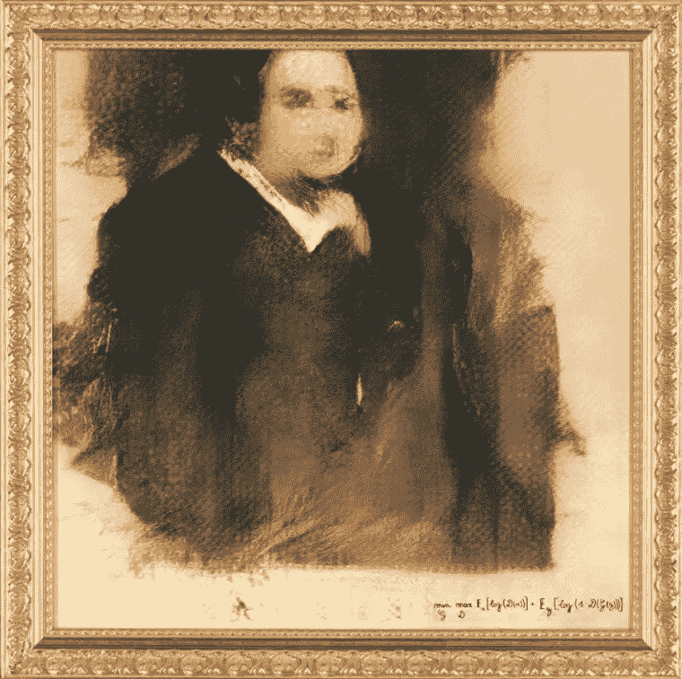
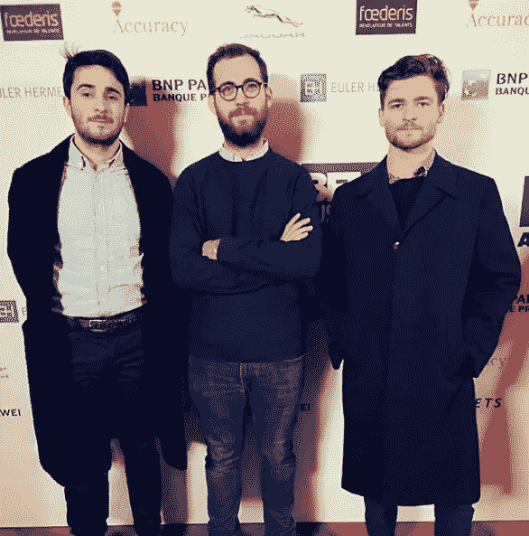

# 关于刚刚在佳士得拍卖的人工智能肖像

> 原文：<https://medium.datadriveninvestor.com/about-that-ai-created-portrait-that-just-sold-at-christies-d4fef1c314d3?source=collection_archive---------38----------------------->

## 事情并不像看上去的那样

[Portrait of Edmond de Belamy. Credit: Christie’s](https://www.christies.com/features/A-collaboration-between-two-artists-one-human-one-a-machine-9332-1.aspx)

10 月 25 日，周四，一幅利用生成性对抗网络()[制作的肖像画在佳士得](https://www.theverge.com/2018/10/25/18023266/ai-art-portrait-christies-obvious-sold)拍卖行以**43.52 万美元的价格售出。**

这幅肖像画由法国艺术集体创作，不到 7 分钟就被一位匿名电话竞标者买走。

现在，让我们解决两件事情。

## 什么是生成性对抗网络？

SkyMind 简单地将 [GANs](https://skymind.ai/wiki/generative-adversarial-network-gan) 定义为，“由两个网络组成的深度神经网络架构，一个对抗另一个(因此是‘敌对’)。”

自 2014 年由伊恩·古德费勒发明[以来，GANs 已经被应用于从创造动漫角色到文本到图像合成的方方面面。点击](https://www.technologyreview.com/s/610253/the-ganfather-the-man-whos-given-machines-the-gift-of-imagination/)查看 [Hackernoon](https://hackernoon.com/) [对伊恩·古德菲勒的采访。](https://hackernoon.com/interview-with-deep-learning-researcher-and-the-ganfather-dr-ian-goodfellow-cd300863ecff)

## **明显背后的人是谁？**

[Credit: Obvious’ Instagram](https://www.instagram.com/obvious_art/)

Gauthier Vernier、Pierre Fautrel 和 Hugo Caselles-Dupré。

这三个人自称是“三个 25 岁的童年好友”，他们用甘斯创作了 11 幅肖像系列，名为*La famile de Belamy*。

他们把自己描绘成试验先锋，他们的目标是通过艺术来“解释和民主化”人工智能。

然而，很明显，从 GitHub 下载了由 Robbie Barrat 开发的代码，做了许多人认为是微小的修改，然后用它来创作在佳士得拍卖的肖像。因此，虽然他们可能会引起轰动，但也有许多[在争论明显的‘完整性](http://fortune.com/2018/10/26/ai-art-christies-robbie-barrat-obvious/)和原创性。

在艺术的世界里，如果你不是原创的，你是什么？

嗯……有很多“艺术家”不是原创的。但他们不会被载入史册。他们没有远见。不幸的是，“有远见的艺术家”似乎是媒体青睐的明显的绰号。

虽然显而易见，佳士得的成功销售值得称赞，但我们不要夸大其词。他们做了大量的跑腿工作，他们很好地塑造了自己的品牌，营销(宣传)了自己，并最终以惊人的成功卖出了《埃德蒙·德·贝拉米的画像》。

但是 Caselles-Dupré甚至在《The Verge》中引用了他的话说，“如果你只是在谈论代码，那么没有很大比例的代码被修改。但如果你谈论在电脑上工作，让它工作起来，你会付出很多努力。”

考虑到三个 25 岁左右的男人决定利用 Robbie Barrat 在他 17 岁时开始的项目，Barrat 显然有一个光明的未来——充满了显而易见的男人只能梦想的成就。

真正值得称赞的是 GANs 的发明者 Ian Goodfellow 和创造所用算法的艺术家 Robbie Barrat。**显然。**

# 你认为佳士得 **在** [**拍卖的肖像值得炒作吗？**](https://www.christies.com/)

