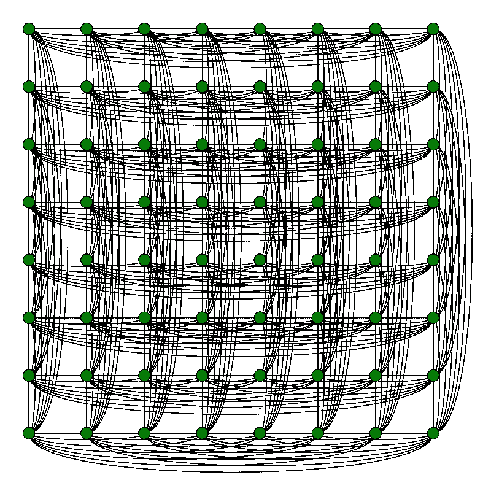
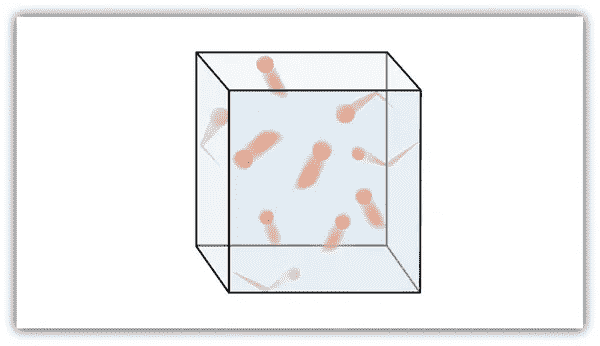
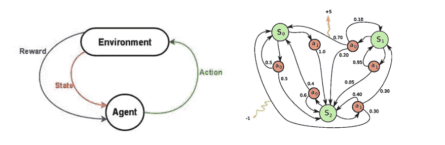

# 抽象和生命的等式

> 原文：<https://medium.datadriveninvestor.com/abstraction-and-the-equation-of-life-a11a73709218?source=collection_archive---------12----------------------->

## 我们的生活是我们每天做出的决定的结果，而这些结果几乎是随机的，而且是部分可控的。

在数学中，我们总是将问题/解决方案抽象成数学对象。这些数学对象帮助我们理解概念，并将推导出的推理应用于其他类似的问题。这些数学对象可以是图形、数字线或模拟模型。

 [## 人工智能与创意:作为创意引擎的 BigGAN |数据驱动的投资者

### 的确，2018 年可以被视为人工智能创造的创造力全盛时期的开始。当然可以…

www.datadriveninvestor.com](https://www.datadriveninvestor.com/2019/02/13/ai-creativity-biggan-as-a-creative-engine/) 

因此，如果你正在模拟一个国际象棋游戏中的一步棋，那么你不需要物理棋子来做，使用数学概念，你可以使用“图形模型”来做。图的顶点可以表示游戏中的可能位置，任意两个顶点之间的边可以表示合法的移动。下图显示了车在国际象棋中可能的移动(水平和垂直)。

[Rook’s Graph](https://en.wikipedia.org/wiki/Rook%27s_graph)

当设计一个模型时，我们只抽象出那些对理解其行为必不可少的特征，并且只处理那些不具体和不可触摸的对象。在其他使用案例中，在研究气体分子的行为时，我们用一个封闭的盒子来概括模型，其中一个分子由一个具有一定速度的点来表示，并应用一些假设，如恒定速度、弹性碰撞，然后，我们将同样的事情应用于“N”个分子，并尝试预测所有气体分子的行为。这使我们对气体分子的研究变得容易了。

Gas Molecule Model

这种抽象的概念就像骑自行车，不用担心保持平衡。事实上，这种抽象对于理解宇宙隐藏的秘密非常重要。此外，像复数( *i)、无穷大、*这样的概念可以更深入地理解，并且也有助于用神经网络对人脑建模。

但是我们能不能用一个数学概念来抽象我们的生活，这样我们就能更精确地理解它或者预测我们生活中的结果？

如果我们注意，在这个方向上没有真正的尝试，但是一个叫做**“马尔可夫决策过程”**的概念在某种程度上与我们的生活过程有关。我们的生活可以被定义为我们每天做出的决定的结果，而这些结果几乎是随机的，我们只能部分控制它们。

事实上，马尔可夫决策过程被用于模拟强化学习、机器人学、经济学中的优化问题。但是，人类生活可以很容易地抽象为马尔可夫决策过程，因为这一概念提供了一个框架，用于在结果部分是随机的，部分在决策者控制下的情况下对决策进行建模。

简单地说，马尔可夫决策过程是一组状态和动作，以及从一种状态转换到另一种状态的规则。如下图所示。右边是马尔可夫状态，左边是强化学习模型。

The Markov States and Reinforcement model

假设你是一个代理人，处在一个环境中。环境处于某种状态。代理可以在环境中执行某些操作。这些行为有时会带来回报。动作转换环境并导致新的状态，在该状态下代理可以执行另一个动作，等等。如何选择这些操作的规则称为策略。总的来说，环境是随机的。

上述概念基于马尔可夫假设，即下一个状态的概率仅取决于当前状态和动作，而不取决于前面的状态或动作。

> 因此，这就是我们的生活:我们每天做出的决定的结果，这些结果几乎是随机的，并且是部分可控的。

无论如何，这种强化学习被用于训练机器人，使计算机适应环境，并使人类更接近他们解决智能的目标。

要了解更多关于马尔可夫决策过程的信息，请查看它的[维基百科](https://en.wikipedia.org/wiki/Markov_decision_process)