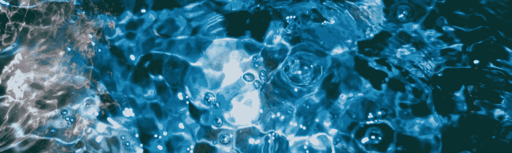

# 通过自我催眠加速学习

> 原文：<https://medium.datadriveninvestor.com/accelerated-learning-via-self-hypnosis-2bc1e9057948?source=collection_archive---------4----------------------->

Photo by [Ramón Salinero](https://unsplash.com/@donramxn?utm_source=medium&utm_medium=referral) on [Unsplash](https://unsplash.com?utm_source=medium&utm_medium=referral)

不久前，我偶然发现了这个概念，想知道我们可以通过自我催眠获得某种程度的加速学习能力，这一想法是否真实。我所发现的不一定是我预期会发现的，而且肯定比我预期的更有趣。

我们知道，在某种程度上，催眠被用来扩展思维，允许我们冒险进入我们通常不会进入的潜意识深处——记忆回忆就是最好的例子。有可能超越回顾展吗？更重要的是，在当前甚至可能是未来的背景下，是否有可能使用某些催眠技术来实时改善其他意识领域的大脑功能——例如知识的获取和积累、远见或直觉、记忆和决策能力？

在实际尝试自我催眠之前，我最初的期望是，仅仅通过建立一个意图，我们就在意识和潜意识之间撕开了一条缝，也就是说，我们有意识地努力记住我们正在学习的东西，或者更加注意，或者只是更加努力。换句话说，我认为自我催眠作为一种加速学习的工具的整个概念是一种非常简单的东西，被某种更奢侈的东西所掩盖。我很高兴地说，我只对了一部分，因为这个故事似乎还有更多。

我们首先要了解的是催眠的实践——如果不花几页纸的材料，我们无法全面解释这个问题。简单地说，催眠引导我们进入一种不同的意识状态。就像冥想一样，我们沉浸在一个意识领域中，由此我们可以更容易、更容易地过渡到一种与我们想要实现的任何目的相一致的思想状态。

也许最好通过在催眠和冥想之间画一个平行线来解释这一点。假设我们容易有压力——冥想让我们(如果我们愿意，如果我们有意识地付出努力)将我们的精神状态转化为一种平静和安详的状态，允许我们进入一种宁静的状态，并保持这种状态一段时间。冥想通过改变和重新构建我们的视角来做到这一点——通过提升我们对污染我们大脑的想法的认识:也许我们必须支付的账单，我们必须处理的工作，我们日常生活中容易在我们脑海中自由流动的分散注意力的想法。它把钟摆从表层意识摆到潜意识的深层水域。这类似于在一个聚会上，选择进入一个安静的房间呆一会儿。

同样，催眠也允许我们进入这个安静的房间，但与冥想不同，冥想的目的可能是放松我们，这个安静的房间可以是我们想要的任何东西。因此，我们被装备好，或者可以选择被装备好，通过任何工具来帮助我们实现我们的特定目的，我们的意图。因此，如果我们想进入一种高度专注的状态，借此我们可以记住在学习或研究过程中遇到的任何知识，我们无疑可以做到这一点。然而，这并不像简单地设定一个意图那么容易。这需要激活，激活我们的潜意识，在科学背景下理解这一点是一个棘手的问题。

> "你是你自己的心智程序的作者、制作人和导演."伊丽莎白·博赫克兹

催眠命令我们不可分割的潜意识注意力，我们的焦点，这来源于我们意识中更深更实质的部分。了解我们如何引发它的一个方法是，观察它是如何一直自动发生在我们身上的，是有意的还是没有我们的提示。例如，当我们做白日梦时，我们进入一种意识状态，在这种状态下，我们的创造力在发挥作用，我们的周围环境在某种程度上变得分散。同样，当我们喝醉时——这可能是为什么我们更容易表达我们的想法，说我们通常不会说或做的事情，因为我们的表面潜意识，以及随之而来的社交礼仪或克制或实用理性，都处于次要位置。当我们从事某些活动——写作、绘画、跑步、建筑等时，我们会进入这些不同的思维状态。对我自己来说，竞技体育往往会让我处于一种近乎催眠的思维状态，让我彻底摆脱跑腿、待办事项、财务或社交疑虑。这些只是我们意识转变的一些方式。

我们必须用形而上学的理解来接近意识。这不是简单的黑与白、地表与地下、左与右。它非常漂亮，用途广泛，可以根据我们的需要进行塑造和调整。

在无形的竞技场上解释要容易得多，对我来说，这足以表明这显然是可能的。实际上，事情变得有点模糊，因为在神经功能的背景下，一个解释被证明是相当难以捉摸的，但仍然存在。换句话说，我们可能不知道如何或为什么或在哪里，但我们知道谁和什么。不幸的是，我不是专业的催眠师、心理学家或任何种类的科学家(很明显)，所以我所能做的最好的事情就是从一个更有内涵和实质性的角度来解释这一现象:

> “二十多年来，使用活体人脑成像技术的研究已经开始探索催眠的神经关联。这些集体发现提供了一个扣人心弦的，尽管是初步的，关于催眠现象中潜在的神经生物学机制的解释...此外，趋同的发现暗示催眠暗示似乎会诱发特定的神经模式。这些观察表明，建议可能有能力针对焦点大脑网络。马修·兰德里和阿米尔·拉兹对活人大脑的催眠和成像。

催眠并不是对每个人都有效。这并不是说有些人比其他人更容易受到影响，只是有些人比其他人更专注于掌握他们自己意识的某些领域。正如有些人是视觉学习者，有些人有动觉倾向，有些人自动跳出框框思考，有些人在指导方针内工作得最好，有些人比其他人更容易进入甚至集中他们的潜意识。这也可以用来解释那些立即摒弃催眠的人和那些全心全意相信催眠的人之间的巨大分歧。

当我刚开始冥想时，我总是有困难。如果我没有娱乐或被目标驱使，持续的能量会让我无法长时间静坐。直到我真的想冥想，直到我开始构建一个奉献，我才能够有效地冥想。催眠的努力也是如此——参与者真的必须沉浸在奉献中。因此，当我们形成这个目的、这个驱力时，似乎我们被准许进入潜意识，而潜意识反过来回报给我们我们所寻求的:专注和极度接受的专注。这是一个归纳的过程。

因此，当我坐着尝试各种自我催眠的方法时，我开始编织一些结论。首先，我们应该少关心催眠是否是激发某种精神功能的有效手段，而简单地接受我们可以进入不同意识状态的想法。无论是通过冥想、催眠、从事某些活动，还是在某些动机下工作——把大脑想成这样的一维、甚至二维或三维机器是愚蠢的。

此外，毫无疑问，我们有能力真正实现我们下定决心要做的任何事情——如果我们想实现某种程度上的加速学习，我们可以用我们的意图作为船桨，用我们的专注作为独木舟来访问我们的潜意识。

最后，它是关于理解潜意识的真正潜力。我们倾向于认为潜意识不如意识，但这并不是一个公平的比较。每一个都有其重要的作用，无论如何，我认为潜意识是一个同伴，而不是一个陌生人在我们表面现实的阴影下工作。这是一个比我们大多数人倾向于认为的更有能力的超意识。困难在于理解和利用它。催眠术实际上只是进入潜意识的一种方式，是众多方式中的一种，它并不是对每个人都最包容的方式。

下次我们做白日梦的时候，或者下次我们发现自己完全沉浸在某种活动中的时候，我们应该注意我们的注意力是如何在不同的意识层次之间跳舞的。观察真的是一件令人惊奇的事情，通过观察，我们发展了更多的掌握和更多的技巧，能够将这个焦点重新分配到需要的地方。

# 继续读下去:冥想的沉浸感

*“If the ocean can calm itself, so can you.” ―* ***Nayyirah Waheed***