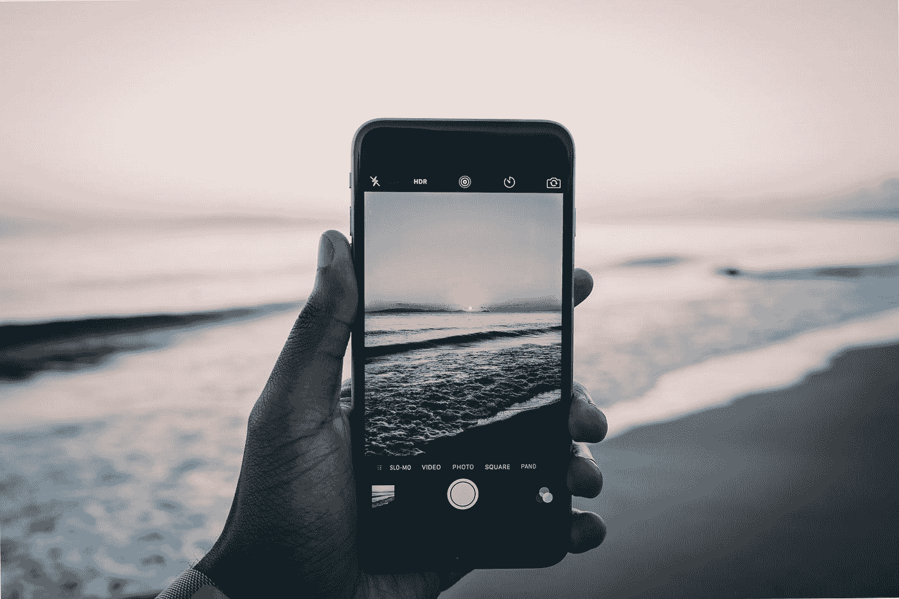
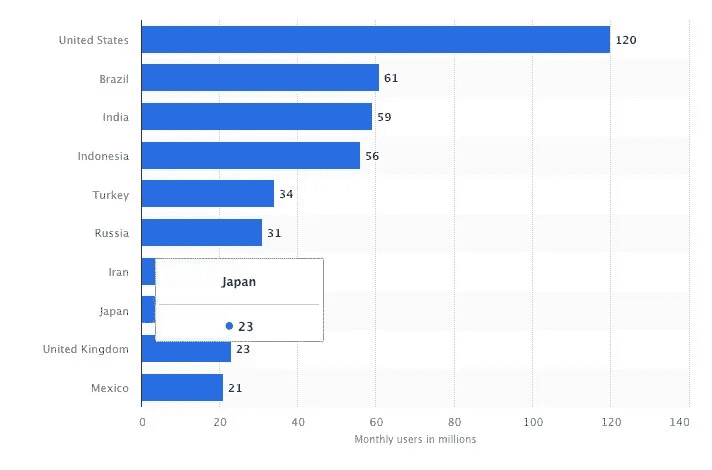
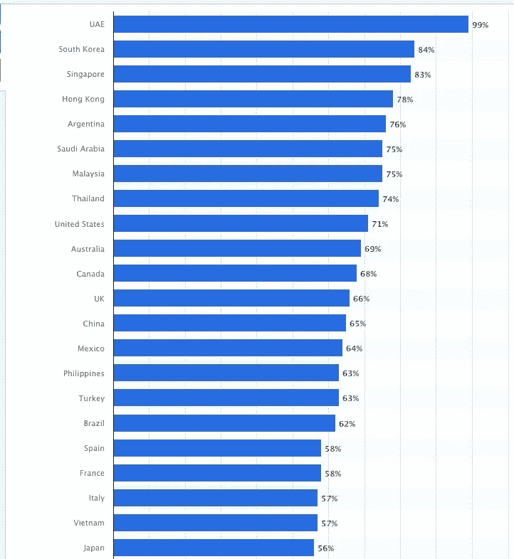
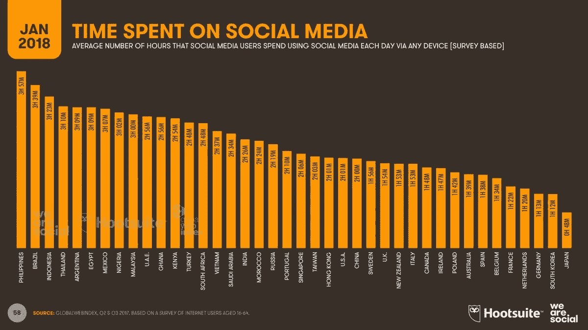

# 社交媒体上的口音在世界各地都不一样

> 原文：<https://medium.datadriveninvestor.com/accents-on-social-media-differ-worldwide-69619333be0a?source=collection_archive---------1----------------------->

## 政府和当地文化在网上有不同的影响力

Photo by [Nigel Tadyanehondo](https://unsplash.com/@nxvision?utm_source=medium&utm_medium=referral) on [Unsplash](https://unsplash.com?utm_source=medium&utm_medium=referral)

社交媒体是流动的。它因国而异，甚至因州而异，因省而异。

绝大多数在线互动都不是私密的，这使得在世界遥远的地方了解当地的敏感性和社交媒体偏好变得非常重要。

[公共关系讲师和社交媒体研究员卡伦·萨瑟兰](https://twitter.com/kesutherland777/)亲眼目睹了这些大陆漂移，并与营销企业家[马达琳·斯克拉尔](https://twitter.com/MadalynSklar)谈论它们。

 [## 通过保持真实来赢得观众

### 通过了解、喜欢和信任建立融洽关系

blog.markgrowth.com](https://blog.markgrowth.com/build-an-audience-by-keeping-it-real-47e13eb8102d) 

“从我访问过的国家来看，香港居民似乎是社交媒体联系最紧密的，”萨瑟兰说。" [We Are Social](https://wearesocial.com/us/) 将香港评为全球社交媒体普及率第五高的国家。所以，有道理。

“很明显，美国、越南、欧洲、新西兰和印度某些地区的收养率也很高，”她说。"因此，根据统计数据，不仅仅是香港."

这是按国家分列的 [Instagram 使用情况。](https://www.statista.com/statistics/578364/countries-with-most-instagram-users/)

萨瑟兰一直在研究为什么社交媒体平台的受欢迎程度因国家而异。

“脸书和 WhatsApp 是迄今为止最受欢迎的平台，”她说。“也许这是因为它们广为人知，有许多不同的功能，容易使用，而且相对来说用户友好。因此，它们具有广泛的吸引力。

 [## 计划者让社交媒体保持正轨|数据驱动的投资者

### 如果想达到并保持最高效率，忙碌的人会坚持使用系统。这是 Tweepsmap 和…背后的前提

www.datadriveninvestor.com](https://www.datadriveninvestor.com/2019/03/11/schedulers-keep-social-media-on-track/) 

萨瑟兰说:“显然，对于我还没有去过的国家，如中国，情况并非如此。”。“在那里，微信和 Qzone 等平台非常受欢迎。脸书在大多数地区已经被禁止。仅微信就有 9.02 亿日活跃用户。”

# 国际视野

她计划去更多的国家，已经去过越南、香港、印度、新西兰、库克群岛、斐济、英格兰、苏格兰、法国、西班牙、葡萄牙、美国、墨西哥和她的祖国澳大利亚。

这张图表显示了各个国家的社交媒体渗透率，全球平均渗透率为 42%。

萨瑟兰亲眼目睹了她的祖国与其他国家相比移动互联网的使用情况。

“从我去过的国家来看，澳大利亚处于中等水平，”她说。“在香港和越南等地，移动互联网的消费率极高。

萨瑟兰说:“在印度，城市的移动互联网使用率远高于农村地区。”。“然而，当我在葡萄牙的马德拉时，手机是存在的，但人们似乎不像我们在澳大利亚那样粘在手机上。这让我想起了大约五年前的澳大利亚。”

 [## 旅行在即，现在就制定计划吧

### 向前看，以避免金融陷阱，并有一个良好的旅行

medium.com](https://medium.com/datadriveninvestor/with-travel-on-the-horizon-make-plans-now-83e97b0fb269) 

不同的国家也有使用社交媒体的独特方式。

“越南胡志明市的人们在 Instagram 加入这一功能的几年前就已经把 Instagram 当作购物应用了，”萨瑟兰说。

“卖家会贴出物品的图片，”她说。“那些感兴趣的人直接给他们发了一条信息，告诉他们价格和送货细节。然后，一辆摩托车会把货物卸下来。买方货到付款。”

# 拔掉插头

所有的政治都是地方性的，社交媒体对政治家的影响最大。如果一个国家的领导人有权关闭社交媒体上显示的异议暗示，他们就会这么做。同样，这也因国家而异。

萨瑟兰说:“许多挑战是共同的——例如打通与目标受众的联系——但一些国家有额外的挑战。”。“例如，在越南，政府有时会关闭脸书，以防止它被用来组织公众抗议。

“脸书是越南最受欢迎的社交媒体平台，”她说。“营销人员将大部分广告支出集中在那里。想象一下，前一天它还在，第二天它就消失了。”

以下是《我们是社会的》花在社交媒体上的时间分类。菲律宾居世界之首。

“为什么？我只能猜测，“萨瑟兰援助。“也许在菲律宾，与他人联系的需求更强烈，技术更实惠、更容易获得。可能有很多因素。”

Wi-Fi 可访问性也影响着不同国家对社交媒体的使用和采纳。

“这是一个问题，除非你的手机上有碟形天线，”萨瑟兰说。“然而，当你在晴朗的天空下行驶在一个城市里，却听到 GPS 信号丢失’时，你会想知道这有什么区别。”"

 [## 网络安全威胁比恐怖更可怕

### 惊人的违规数据比看起来更糟糕

medium.com](https://medium.com/datadriveninvestor/cybersecurity-threats-scarier-than-scary-60fcc2f704c2) 

然而，Wi-Fi 因素似乎很重要。

萨瑟兰说:“我绝对认为 Wi-Fi 起了作用。“我也认为免费 Wi-Fi 有影响。例如，在越南、香港和印度，商店通常会显示 Wi-Fi 密码供顾客使用。或者询问密码也可以。

“免费 Wi-Fi 在澳大利亚并不普遍，也不容易分发，”她说。“我认为免费数据肯定会提高社交媒体的使用率。”

**关于作者**

吉姆·卡扎曼是[拉戈金融服务公司](http://largofinancialservices.com)的经理，曾在空军和联邦政府的公共事务部门工作。你可以在[推特](https://twitter.com/JKatzaman)、[脸书](https://www.facebook.com/jim.katzaman)和 [LinkedIn](https://www.linkedin.com/in/jim-katzaman-33641b21/) 上和他联系。