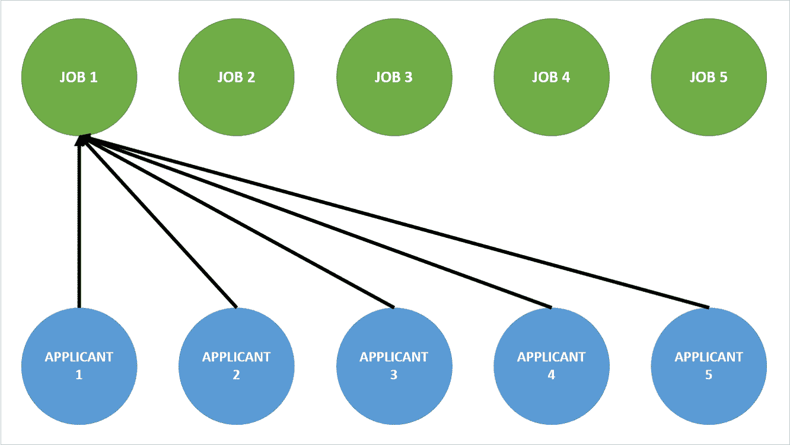
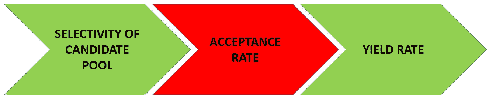

# 接受率毫无意义

> 原文：<https://medium.datadriveninvestor.com/acceptance-rates-are-basically-meaningless-53bc2260a097?source=collection_archive---------6----------------------->

注意:本文表达的观点仅是我个人的观点，并不代表我的雇主或任何其他人的观点。

每个公司和大学都想变得有选择性，更重要的是，他们想被公众认为是有选择性的。大学喜欢吹嘘他们的录取率，在一定程度上，他们在《美国新闻和世界报道》中的排名取决于他们的录取率有多低。接受率有其优点，但也被误解和误用。以下是几个原因:

1.**增加申请人中的“泡沫”**——许多人想知道为什么一些精挑细选的学校和公司仍然有“拓展项目”。如果他们收到了这么多申请，那为什么还要浪费时间和精力去申请更多的呢？这有多种原因:

即使在一个很大的人才库里，找到“合适的”学生或候选人也总是很难

增加学生群体或劳动力的多样性需要接触某些群体

他们需要增加申请人中的“泡沫”，以降低录取率，看起来更“有选择性”

“泡沫”申请人是最重要的，这也是一些大学录取率降低的部分原因。每个学校和公司都有“核心”申请人和“泡沫”申请人。核心申请人是那些花了几个月，在某些情况下几年准备申请的人。这可能是辅导，面试准备，广泛研究学校或公司。这些都是学校想要的人，但更重要的是，这些学生已经准备申请学校，不管学校的外联。**即使一所学校拥有高质量的学生，学校也不只是想表明他们在绝对水平上，而且在相对水平上也保持着高水平，这可以通过他们的录取率体现出来。**

2.**集体水平与个人水平的录取率** —假设你有 5 个人都在申请同样的 5 份工作，而这 5 份工作是专门为他们准备的。每份工作的个人录取率是 20%。从个人角度来看，这看起来是合理的选择。然而，在人才库级别，有 5 名申请人和 5 份工作，这是 100%的录取率。现在很有可能是一家公司说它没有找到合适的人来做这份工作，并决定根本不去填补这个空缺。**这种差异基本上可以归结为人们向**申请了多少工作和学校。申请一份工作的成本基本上是零，因此公司里充斥着求职者。根据《福布斯》的数据，平均来说，每一个职位都有 118 人申请，这意味着录取率不到 1%。这是否意味着那些公司是“选择性”的？不。学校的情况稍微好一点，因为申请大学的费用要高得多，包括大学论文、详细问题和申请费。然而，有一种“通用申请”,它允许学生使用一次性的通用申请来申请各种各样的学校。结果，据美国新闻报道，学生申请的大学数量在最近几年从 6-7 所增加到 15 所。一些公司和学校确实试图提高申请成本，以筛选出不那么不合格的候选人，但它们是例外，大多数学校宁愿拥有低录取率的声誉，也不愿撇去申请人中的“泡沫”。

***Figure 1*** *showing 5 applicants applying for 5 jobs. It shows how by everyone applying to multiple jobs, that artificially suppresses the acceptance rate for each job.*

**3。** **申请人群体的选择性** —哈佛的录取率约为 5%，高盛的录取率约为 3%，沃尔玛的录取率不到 3%[3]。那么这是否意味着沃尔玛比哈佛和高盛更有选择性呢？不，当然不是。他们从两个完全不同的候选人中挑选。当进行比较时，接受率只有很小的意义。甚至在比较学校录取率时，人们也经常拿红苹果和绿苹果做比较。他们比较公立学校和私立学校，技术学院和文理学院。公立学校总是会比私立学校有更高的录取率，因为它们更大，技术院校吸引的人与文理学院根本不同，所以两者之间的选择性并不重要。选择性是一个三阶段过程，如下图*图 2* 所示。候选人才库的选择性是第一个也是最重要的因素。你可以有一个最低的录取率，但如果它来自一个平庸的候选人群体，那么你的结果仍然是平庸的。

***Figure 2*** *showing the selectivity process and the stages involved. The acceptance rate is only the second step in the process and the other parts can arguably count for much more.*

4.即使一所大学的录取率很低，但那些被录取的申请人决定不去，那也没用。产出率是选拔过程的最后一步，因为它决定了一所学校最终能招到多少人。**记住申请工作或学校是一个双向过程，他们必须喜欢你，你也必须喜欢他们。**这个数字非常重要，但也可能被篡改。公司通常会有多个阶段的面试，在这个过程中，他们不仅会评估你的工作资格，还会评估如果他们给你一份工作，你是否会接受。这在校园招聘和申请学校时不太真实，但在日常求职中却非常真实。面试结束后，招聘人员或人力资源部门通常会给应聘者打电话，给他们一个口头邀请，并评估你对这份工作的兴趣程度。如果你没有表现出任何兴趣，那么他们极不可能给你一个提议。这样做，他们不仅降低了他们的接受率，而且提高了他们的收益率。下面我们来运行一个简单的案例:

假设我们有一个 100 名候选人的申请人池，一家公司想要向其中的 8 人发出聘用通知。在这 8 人中，有 6 人会接受。

**案例 1**——给他们所有人提供机会，让筹码落到他们想去的地方

接受率= 8/100 = 8%

收益率= 6/8 = 75%

**案例 2** —找出谁不会接受提议，而是拒绝他们。

接受率= 6/100 = 6%

收益率= 6/6 = 100%

换句话说，如果一家公司拒绝了将会拒绝他们的候选人，他们就会降低接受度，同时提高收益率。**所以考生也要记住这一点；如果一所学校或公司的录取率很低，他们也可能会拒绝那些不太可能接受他们录取通知的候选人。**

5.录取率的等级 —公司不仅仅接受在线申请，他们还会去学校，通过招聘会、研讨会和咖啡聊天与学生见面。**大学也是如此，不是每个人都要马上申请一所学校才能进去。**录取流程分为“提前录取”、“提前决定”和“常规录取”三个等级。无论是在公司还是在学校，所有这些层次都有非常不同的录取率。在常春藤盟校的情况下，提前录取率几乎是正常录取率的三倍。这并不意味着一所学校或公司正在降低他们的等级标准，因为在不同的情况下候选人也是不同的，但这确实意味着人们应该看看录取率，看看他们想走的路。如果你要对一所学校申请提前录取，那么就要看具体的录取率，而不是学校的总录取率。

所有这些例子清楚地表明，接受率已经变得多么被滥用、误用和误解，它们已经变得多么没有意义。它们只有在与候选池选择性和产率整体考虑时才有价值。

**来源:**

1.https://www . Forbes . com/sites/jacquelyn Smith/2013/04/17/7-things-you-possible-not-know-on-you-job-search/# fdcc 37838110

2.[https://www . us news . com/education/blogs/college-admissions-playbook/2015/09/09/what-rising-college-application-volume-means-for-the-class of-2020](https://www.usnews.com/education/blogs/college-admissions-playbook/2015/09/09/what-rising-college-application-volume-means-for-the-class-of-2020)

3.[https://www . the crimson . com/fly by/article/2016/6/29/acceptance-rate-lower-Harvard/](https://www.thecrimson.com/flyby/article/2016/6/29/acceptance-rate-lower-harvard/)

4.[https://www.ivycoach.com/ivy-league-statistics-by-college/](https://www.ivycoach.com/ivy-league-statistics-by-college/)