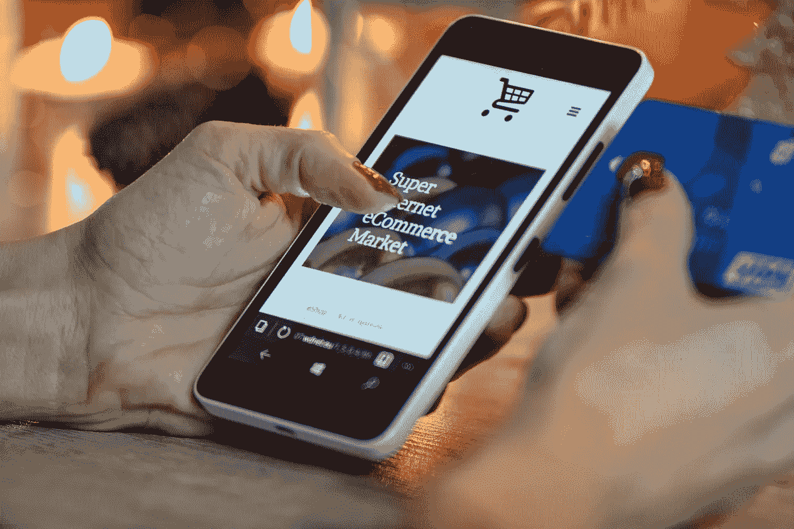
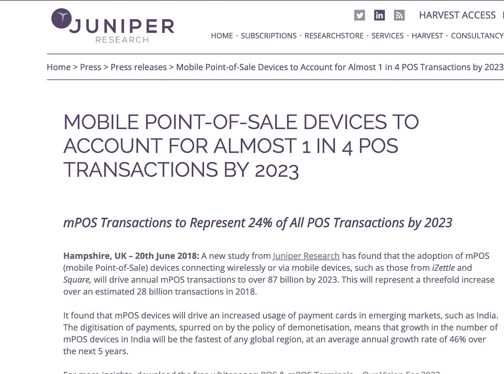
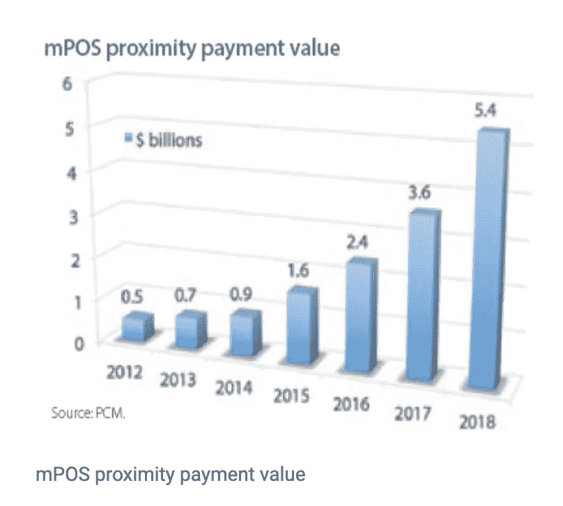

# 通过移动销售点(mPOS)接受付款—快速浏览

> 原文：<https://medium.datadriveninvestor.com/accepting-payments-via-mobile-point-of-sale-mpos-a-quick-tour-eeaf87471e90?source=collection_archive---------1----------------------->

## 我们为什么要讨论移动销售点，以及面向谁？

每当我们谈论支付和支付方式时，热门话题往往是数字钱包，尤其是 Apple Pay、Samsung Pay 和 Android pay 等..或者我们讨论支付网关，它将支付路由到不同的其他处理者和收单方，以处理支付。

这些都是很好的解决方案，使多个消费者和商家能够方便地接受支付。mPOS 使商家能够通过手机处理卡礼盒。像这样的机会:

 [## 2019 年移动应用开发之路|数据驱动的投资者

### 任何在移动应用程序开发行业工作的人，无论他们是专注于在伦敦开发 iOS 应用程序还是…

www.datadriveninvestor.com](https://www.datadriveninvestor.com/2019/01/15/the-path-of-mobile-app-development-in-2019/) 

1.任何规模的商家(大、中、小)都在通过增加销售渠道来拓展业务。一些商家，如*快餐车、房屋维修服务提供商、餐馆、贸易展览、诊所、零售商、酒店*会一直在移动，但他们接受交易的流行方法是通过现金。偏爱卡片的客户怎么办！！

> 商人只有一个需求**如何卖出更多的东西。**

2.消费者对信用卡和借记卡的使用呈上升趋势，并且仍然是最受欢迎的交易方式。

> 研究表明，你可能最终会用信用卡比用现金花更多的钱。

3.随着手机的日益普及，通过移动设备进行交易正成为商家的首选，这使他们能够更快地结账。因此，为什么商家不利用手机或平板电脑，因为它们也更容易携带！

> 移动电话允许商人随时随地做生意，他们可能找到客户。由于容易接近，他们可以在业务中成长。

**总之，mPOS(移动销售点)充分利用了所有这些重要领域，通过让商家能够随时随地或在店内支付，让他们的生活更加轻松，并帮助他们拓展业务！！**

## 那么，如果不是移动销售点，商家还有什么选择呢？

让我们首先了解在 mPOS 出现之前，商家可以使用哪些解决方案:

1.  电子收银机——尽管它适用于许多零售商和商家，但它确实存在一些问题。

*   它体积庞大，需要空间。如今的商家需要一种轻便的便携式设备，以便快速结账。
*   当今的商家希望为客户提供全渠道体验。也就是说，销售是通过电子商务、MOTO 进行的，在商店里他们会得到同样的体验。
*   今天的商家需要高级报告功能，以便他们能够跟踪他们服务最多的客户类型，并为他们提供更好的体验。

2.**传统 POS 系统** —

*   问题 1-需要物理固定在一个位置的重型终端。
*   问题 2-新商户加入这些系统非常耗时，且涉及成本。

3.**支付** **钱包** **经由消费者**——这也成为一种流行的支付方式。mPOS 的好处是它们可以在进行交易时支持钱包。

> 然而，基于钱包的交易的一个问题是摩擦:消费者需要拿出手机，解锁，打开应用程序，触摸支付按钮——使用信用卡更容易。

## **那么什么是 mPOS**

**mPOS** 是一种面向各种规模(小型-中型-大型)的商户的方法，让他们可以通过任何手机或平板电脑开始接受持卡支付。[根据最近的一项研究](https://en.wikipedia.org/wiki/Point_of_sale)，移动 POS (mPOS)终端有望取代当代支付技术，因为它具有多种功能，包括 ***移动性、前期低成本投资和更好的用户体验。***

> mPOS 历史
> 
> 伟大的想法往往始于解决一个看似很小的问题。
> 
> 在支付创新者 Square 的案例中，推出了数百个 mPOS 模仿者，小问题是工匠 Jim McKelvey 无法完成交易并出售价值 2000 美元的手工吹制玻璃。
> 
> 不是因为他没有买家，而是因为他的买家没有那么多现金——而且麦克维不收信用卡。
> 
> 因此，虽然麦克维失去了那笔 2000 美元的交易，但他和他的(朋友)兼联合创始人杰克·多西 Twitter 的创始人——最终还是有了一个 170 亿美元的想法(这篇文章付印时 Square 的市值)。使它成为从未售出的最有价值的一套玻璃器皿。[来源](https://www.pymnts.com/mpos-tracker/2017/square-jack-dorsey-cash-capital-first-data-vantiv-paypal-uk-apple-pay-debit-pymnts-mpos-tracker-mobile-payments-mobile-point-of-sale/)

**mPOS 市场**

[https://www.paymentscardsandmobile.com/power-mpos/](https://www.paymentscardsandmobile.com/power-mpos/)

## 那么移动销售点是如何工作的呢？

在我之前关于[支付生态系统-去神秘化](https://medium.com/datadriveninvestor/payment-ecosystem-demystified-beaa08d85959)的故事中，我已经提到了参与支付交易的玩家。通常，涉及四方:

*   将发起交易的消费者
*   接受交易的商家
*   收单方是哪家银行的商户
*   发卡行消费者的银行
*   连接所有这些的是像 Visa，Mastercard，AMEX 这样的网络

此类 mPOS 解决方案可来自收单机构(如 HDFC 银行)或收单机构处理器(First Data)或支付聚合机构/ISO(如 Square)或网络本身。

要实施 mPOS，企业需要一个互联网连接、一个信用卡和借记卡读卡器，以及一个下载到任何想要用于交易的设备上的应用程序。mPOS 还可以与额外的 POS 硬件配对，如条形码扫描仪和现金抽屉。将您的阅读器连接到移动设备，立即开始付款。

这种移动应用程序或 SDK 可以集成到商户应用程序中，该应用程序将处理所有支付用例，并通过蓝牙或 Wifi 或音频插孔读取卡，以便在读卡器上刷卡或刷卡。

## MPO 的创新

> Samsung Pay Touch 是一款新的应用程序，可与兼容的 Galaxy 手机配合使用，将它们转换为可用于接收非接触式支付的 PoS(销售点)终端。本质上，三星正在将其 Samsung Pay 服务从客户延伸到商家。[来源](https://en.businesstimes.cn/articles/116346/20190801/your-galaxy-phone-turns-into-a-payment-terminal-with-samsung-pay-touch.htm)
> 
> 通过 Mobeewave 平台，商家可以将购物金额输入智能手机，然后消费者可以在手机背面点击非接触式卡或移动钱包进行支付。购买的金额向消费者收取，就像使用该卡的任何其他结账过程一样。[来源](https://www.pymnts.com/news/pos-innovation/2018/contactless-card-payment-acceptance-technology/)
> 
> [**Payworks**](http://payworks.com/) 为各种全渠道支付提供商提供下一代支付网关技术，在云中运行并以软件即服务模式提供。[来源](https://www.pymnts.com/news/payment-methods/2018/payworks-funding-pos-technology-omnichannel/)

## 结论

而 mPOS 的承诺是为商家提供灵活、简单和安全的体验，这是一个机会。

与此同时，当整合所有渠道(在线、店内和移动)的销售以完全实现全渠道时，商家注意到了挑战。例如，商家将不得不考虑实现集成商务的标准化方式。

使用移动设备和卡终端，商家现在必须管理多种设备，随着交易的增加，他们还必须担心设备的电池寿命。

最后，也是最重要的一个方面，设备安全性在进行交易和保护设备安全时，商家必须确保设备符合 PCI 标准，并遵循 EMV 安全标准。