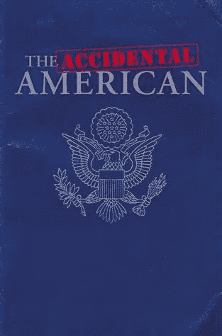

# 意外美国人和美国税收遵从

> 原文：<https://medium.datadriveninvestor.com/accidental-americans-and-us-tax-compliance-def6a773a064?source=collection_archive---------17----------------------->

Accidental Americans and US Tax

在欧洲，我们已经看到了相当一部分“偶然”成为美国人的人。他们中的许多人出生在美国，因为他们的父母在美国工作了几年，或者，也许他们出生在美国以外，父母是美国公民，后来成为美国公民。不管怎样，他们是美国公民，随之而来的是美国的纳税申报义务。

几十年来，这些偶然的美国人从不费心提交他们的年度美国纳税申报表。我听说过这样的情况，意外的美国人打电话给美国领事馆，他们被告知他们不需要申请。非美国银行不会问这个令人不安的问题，即这个意外的美国人是否在申报美国税收。事情就这样发展下去，直到发生了两件事。

1.  美国司法部(DOJ)从 2008 年开始追捕瑞士银行。DOJ 法案摧毁了从瑞士开始的“离岸”银行管辖区。DOJ 的这一行动对亚洲(新加坡和香港)、卢森堡、海峡群岛、英国和加勒比海地区的离岸银行中心产生了立竿见影的效果，因此他们将任何与美国有关联的个人(“绿卡”持有者、美国公民等)视为迫在眉睫的问题。
2.  美国于 2010 年通过了《海外账户税收合规法案(FATCA)》，该法案于 2014 年年中生效。FATCA 迫使非美国银行努力寻找在这些银行有账户的“美国人”，然后自动向美国报告账户的存在。这是一个游戏改变者，因为它让非美国银行(以及受托人、保险公司或任何金融中介)成为事实上的国税局(IRS)代理。

这当然是几年前的事了，人们会想象所有偶然的美国人都会 100%遵从。根据我的经验，情况显然不是这样。对于偶然的美国人来说，问题变成了:我如何解决这个不遵守美国税法的问题。

大约在 2014 年夏天，美国国税局发布了一项计划，通常是意外的美国人的完美解决方案:**简化的外国离岸程序。**

简化程序要求意外的美国人证明他们的不遵守是由于非故意的行为。非任性不是最容易定义的，我认为非任性的最佳同义词是‘疏忽’或‘粗心’，或‘邋遢’。当考虑这个非故意的标准时，最好请美国税务顾问来确定。

一旦你克服了棘手的非故意的问题，简化的程序确实提供了一种内心的平静，而且最基本的是回顾期只有三年。因此，一个偶然的美国人想回到国税局的怀抱，只需提交过去三年的纳税申报表，支付这三年的任何税款和利息，然后国税局就又是你的朋友了。这是一笔不错的交易，因为以前没有申报不会受到处罚。在其他欧洲国家，他们往往希望有十年的回顾期，这要痛苦得多。

当然，总有不止一种方法可以接近国税局。其中一个选择就是知情人士所说的“秘密”披露。这是一个偶然的美国人向 IRS 服务中心提交三到六年的过去纳税申报表，以通过修改以前的美国纳税申报表或首次提交原始纳税申报表来调整过去的不遵从行为。这是一个过时的策略，在某些情况下可能是合适的。

在一个偶然的美国人通过国税局的程序后，偶然的美国人最常见的问题是:我如何才能逃脱所有这些国税局的乐趣。唯一的答案是，他们必须放弃美国国籍，这给粗心的人带来了陷阱。