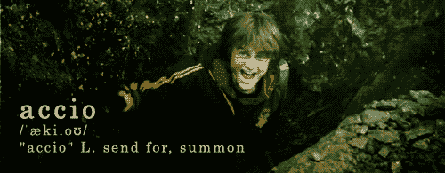
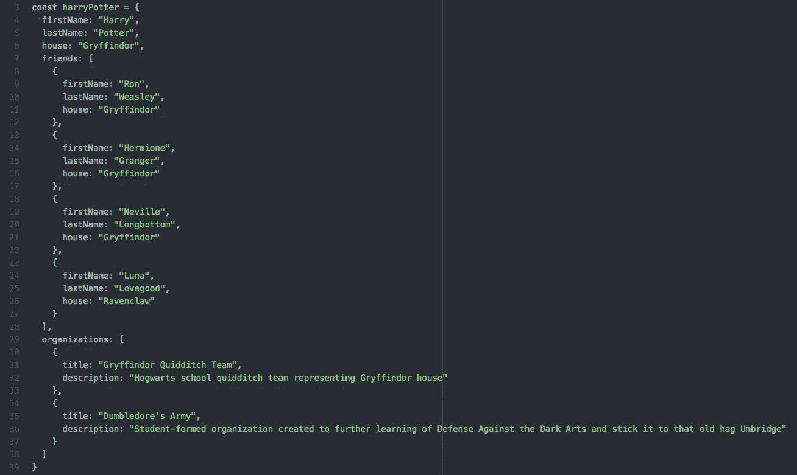
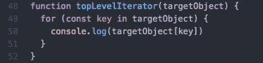
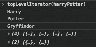
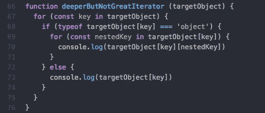
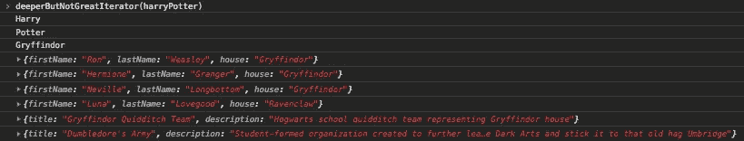
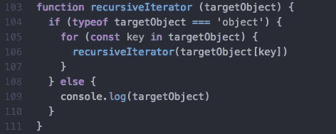
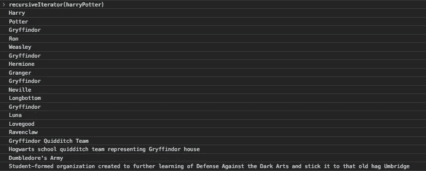

# Accio 递归！:您最喜欢的 JavaScript 咒语

> 原文：<https://medium.datadriveninvestor.com/accio-recursion-your-new-favorite-javascript-spell-7e10d3125fb3?source=collection_archive---------1----------------------->

# 咒语“Accio”允许一个女巫或男巫召唤一些东西给他们。强制转换 Accio 就像访问 JavaScript 对象中的值一样。

让我们以下面的对象为例:

“行动之家！”相当于访问`harryPotter.house`，以及“Accio Ron！”相当于访问`harryPotter.friends[0].firstName`。

不过，你会注意到，虽然我们的咒语保持简单，但当我们试图访问 Ron 时，我们的代码变得有点复杂。这是因为我们的数据是*嵌套*的。我们的顶层`key`不再指向原始数据类型，而是指向一个对象数组。

梅林的胡子，这越来越复杂了。

如果我们必须编写自定义代码来访问`targetObject`中的每个非对象值，事情将会变得难以控制。我们应该能够通过运行一段相当简单的代码来访问所有的原始值。难道不能像“Accio _____”这么简单吗？

让我们从一个简单的迭代器函数开始:

所以看起来我们要`console.log`这个对象中每个`key`的值。让我们来看看调用`topLevelIterator(harryPotter)`的输出:

嗯，这看起来不太对。我们成功地打印了前三个值，但是一旦我们的函数到达了*嵌套的*值，它就停止了我们想要的`console.log`。

看来我们需要深入一点。

我们试试这个`deeperButNotGreatIterator`功能怎么样？

如果我们遍历这个函数正在做什么，我们会看到它正在遍历`targetObject`的每个`key`，并检查`key`指向的值是否是`typeof`对象。如果是，它会更深入一层，遍历该对象以`console.log`它的值。听起来可能会给我们想要的东西。让我们通过运行`deeperButNotGreatIterator(harryPotter)`来试一试:

很接近，但是没有胡椒小鬼。

同样，当我们到达嵌套值时，我们没有得到我们想要的输出。但是，通过打印包含在`friends`和`organizations`所指向的数组中的每个对象，我们确实比上次更深入了一层。

我们*可以*给我们的函数添加另一个迭代，让我们更深入一层，但是，让我们想想这有多大的可伸缩性。编写函数以及带参数的函数的目的是，它可以被任何传入的参数重用。这意味着，在我们当前的实现中，我们需要知道`targetObject`、*和*的确切格式，根据`targetObject`有多少嵌套对象，我们最终可能会得到一个非常笨拙的函数。

要是有一种方法能让我们的函数遍历未知深度和数量的嵌套对象就好了…Accio 递归！

# 递归

**递归函数是调用自身的函数。**

使用递归，我们可以编写这个简短的函数，它将返回`targetObject`中的所有原始值，而不管它们在`targetObject`的哪个级别！但是要注意，如果你的`targetObject`太深，你的代码可能会爆炸(也就是说，你的咒语会适得其反)，所以这个概念不应该被认为是可靠的。

我们来试着解剖一下这个`recursiveIterator`函数是干什么的。我们传入一个`targetObject`，如果这个`targetObject`是`typeof`对象，我们将遍历它的每个`key`并将它的值作为参数传递给——等等——函数`recursiveIterator`!

如此循环，直到我们得到的值是*而不是* `typeof`对象，在这种情况下，我们的`else`语句将执行，我们将`console.log`该值。

让我们检查运行`recursiveIterator(harryPotter)`的输出:

我们做到了！

总之，递归是适度遍历嵌套数据结构的强大工具。它让你的代码保持干爽、简洁和可伸缩。我们的`recursiveIterator`函数确实做了我们想要它做的事情，而且它几乎和转换“Accio primitive values of`harryPotter`object”一样简单

