# 准确性陷阱！注意查全率，查准率，F 值，AUC

> 原文：<https://medium.datadriveninvestor.com/accuracy-trap-pay-attention-to-recall-precision-f-score-auc-d02f28d3299c?source=collection_archive---------0----------------------->

这篇文章包含了解释准确性，回忆，精度，f 分数，AUC 概念的例子。

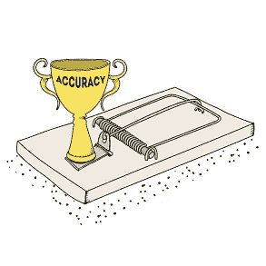

假设你正在研究一个机器学习模型来预测这个人是否是人乳头瘤病毒阳性。

测试组由 20 名患者组成，其中 3 名为阳性(感染)。表-1 显示了它们的实际状态和模型的预测得分。

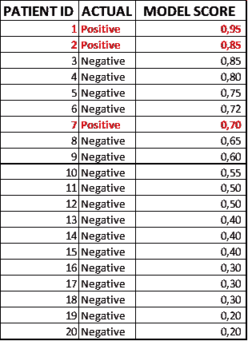

Table-1 Test Set with Actuals and Prediction Scores

在上线之前，你要选择门槛。表-2 有两列用于阈值选择。这些列包含所选阈值的真阳性、真阴性、假阳性和假阴性行。

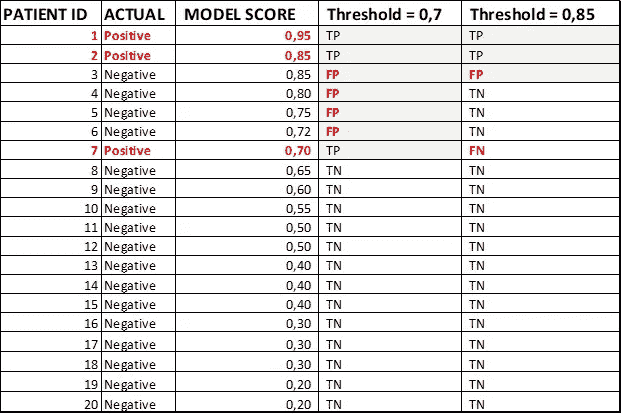

**当您选择阈值= 0，7:**20 个测试结果中的 7 个将被预测为阳性，这些患者应该进行一些其他测试，20 个中的 13 个将被预测为阴性，以便他们可以愉快地离开医院:)。精度是 0.80。

**当您选择阈值= 0，85:**20 个测试结果中的 3 个将被预测为阳性，这些患者应该进行一些其他测试，20 个中的 17 个将被预测为阴性，以便他们可以愉快地离开医院:)。精度为 0.90。

**结果**是否可以假设阈值应该是 0，85，因为精度更高？那肯定是个错误。想象一下，一种疾病会影响万分之一的人。如果我们的预测模型告诉每个人都健康，它是 99.99%准确。它是一个好模型吗？绝对没有。

让我们检查其他概念，以作出更好的决定。表 3 是对混淆矩阵的解释。

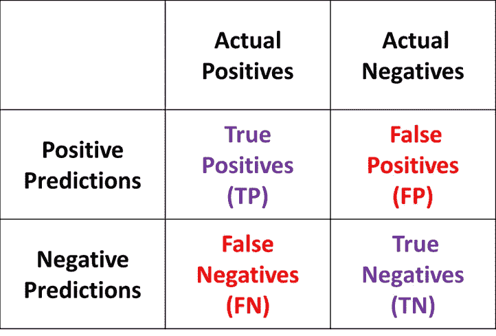

Table-3 Confusion Matrix Explained

表 4 是阈值= 0.7 时的混淆矩阵。

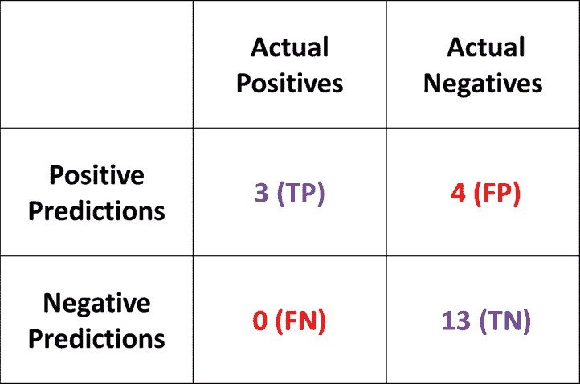

Table-4 Confusion Matrix for Threshold = 0,7

让我们计算阈值= 0，7:

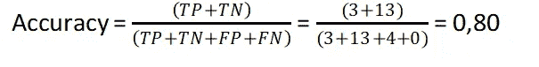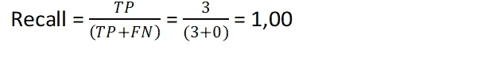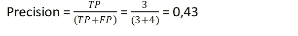

在进入细节之前，让我们计算一下阈值= 0.85。因此，将通过比较两个阈值来回顾这些概念。表 5 是阈值= 0.85 时的混淆矩阵。

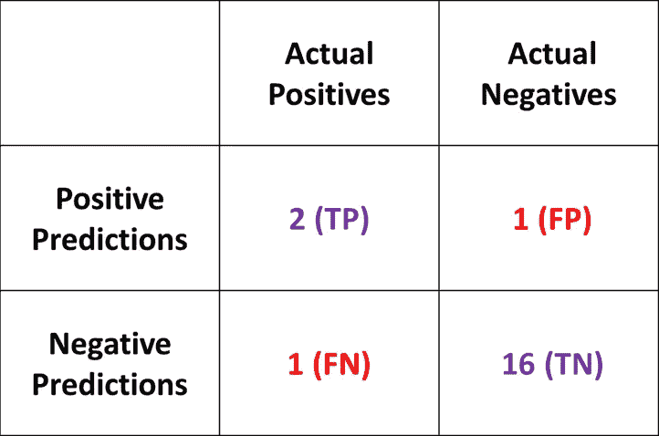

Table-5 Confusion Matrix for Threshold = 0,85

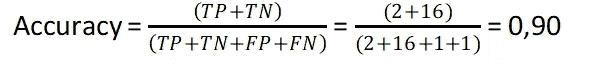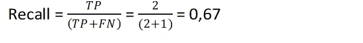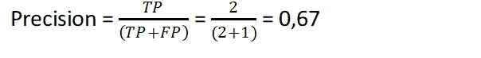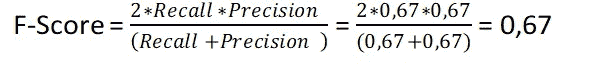

如果不选择精度更高的模型，我们会用哪个来决定？回忆？精度？

这取决于你能容忍什么样的谎言？

*   你能容忍“假阴性”吗？假阴性意味着告诉病人他们是健康的。
*   你能容忍“假阳性”吗？假阳性意味着你必须告诉健康人他们生病了。

在第一种情况下，人们可能会死亡。在第二种情况下，人们会担心，会进行一些额外的测试，以了解他们是健康的。因此，“假阴性”在这里是不可容忍的。

回忆告诉我们，只有实际的积极的预测准确性。这意味着我们对病人的预测是多么正确。这在那种情况下很重要。这就是为什么我们要尽量减少假阴性，也就是说我们要尽量提高召回率。它可以降低我们的精度，但这已经足够了。这就是为什么我们选择阈值= 0，7，因为它有一个完美的回忆。

召回是相当可观的，但是在什么情况下我们可以追求精确呢？

当不能容忍“假阳性”时，应该支持精确度。垃圾邮件检测模型就是一个很好的例子。

*   你能容忍“假阴性”吗？这意味着你将一封“垃圾邮件”标记为“非垃圾邮件”,人们将在他/她的收件箱中看到一封垃圾邮件。
*   你能容忍“误报”吗？这意味着你将一封“非垃圾邮件”标记为“垃圾邮件”,人们将不会在他/她的收件箱中看到这封真正的邮件。

当然，我们不能容忍第二种。由于精度是关于肯定预测的性能指标，在这种情况下，我们试图通过减少假肯定的数量来最大化精度。这也会降低我们的精度，但可能是值得的。

**f 分呢？**

这是回忆和精确的调和平均值。对此可能有两种评论:

*   这是召回和精确之间的平衡。
*   它是准确性的替代物。

**AUC—ROC 是什么意思？**

ROC(接收器工作特性)是通过连接不同阈值的 x 轴= FPR(假阳性率)和 y 轴= TPR(真阳性率)的点绘制的曲线。这意味着你为你的模型选择不同的阈值，计算 TPR 和 FPR，绘制 ROC 曲线，计算曲线下的面积。AUC(曲线下面积)是 ROC 曲线下的面积。图 1 是 AUC-ROC 曲线的一个例子(参考文献 1)。

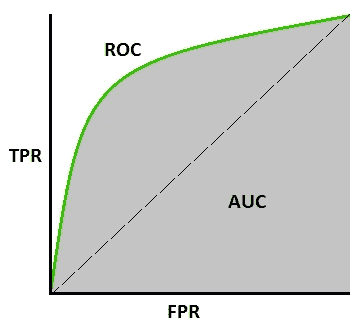

Image-1 Typical AUC-ROC Curve

**我们为什么需要这条曲线？**

两个主要原因如下:

*   它告诉我们我们的模型在区分这两个阶层方面有多好。对于我们的情况，类是生病或健康的，积极或消极的。
*   这有助于我们选择最佳阈值。

AUC = 0，5 意味着你的模型随机分离了两种可能的结果。AUC 最大为 1.0，这意味着完全分离。

**我们模型的 AUC-ROC 曲线**

这是 TPR 和 FPR 的公式。表 6 显示了我们的模型的不同阈值的 TPR 和 FPR 的值。图 2 是我们模型的实际 AUC-ROC 曲线。

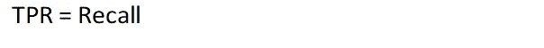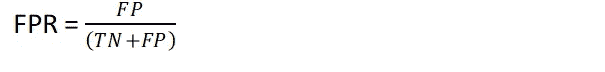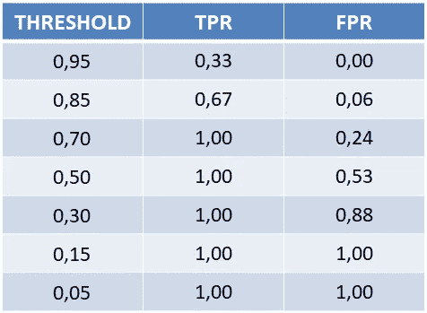

Table-6 TPR and FPR for different Thresholds

Image-2 AUC-ROC Curve for Our Model

**总之；**

*   对于这个模型，threshold = 0，70 看起来不错。
*   仅仅用准确性来评估你的分类模型是错误的。
*   根据问题选择评估参数非常重要。
*   请记住，测试永远不会 100%准确:)。

如果你有任何进一步的问题，请不要犹豫，写信给:haydarozler@gmail.com

ref-1:[https://towardsdatascience . com/understanding-AUC-roc-curve-68b 2303 cc9 C5](https://towardsdatascience.com/understanding-auc-roc-curve-68b2303cc9c5)