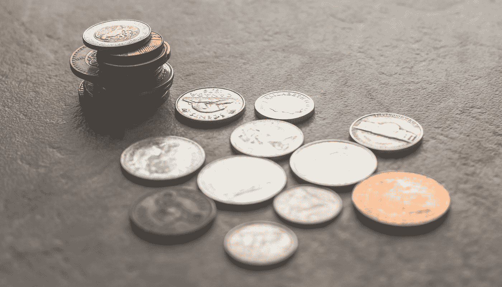
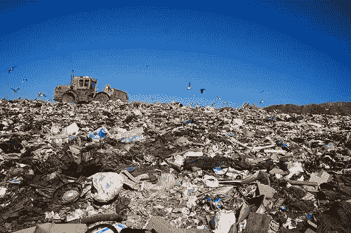
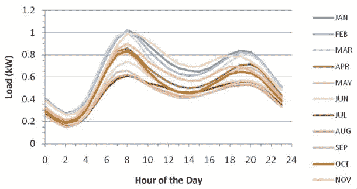
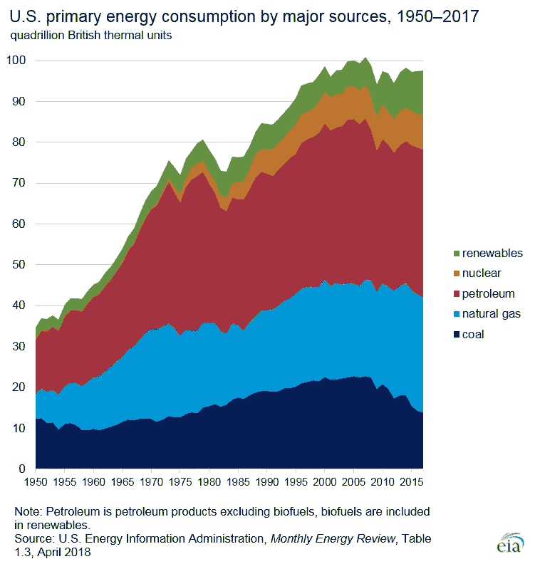

# 应对气候变化和省钱的行动

> 原文：<https://medium.datadriveninvestor.com/actions-you-can-take-to-fight-climate-change-and-save-money-c3471c183f48?source=collection_archive---------9----------------------->

Photo by [Steve Johnson](https://unsplash.com/@steve_j?utm_source=medium&utm_medium=referral) on [Unsplash](https://unsplash.com?utm_source=medium&utm_medium=referral)

我能真正做些什么来阻止气候变化？个人不作为，那还有什么意义？政府和公司制造了所有的污染，难道他们不应该付费吗？这些问题虽然在气候变化的讨论中很普遍，但却是错误的。一个人可以采取有所作为的行动——个人不能完全依赖他人来解决这场全球危机。政客们犹豫不决，除非他们认为这能让他们再次当选，而公司只有在他们认为这能增加利润时才会采取行动。一家公司在气候变化问题上看似大胆的立场，通常是一个经过深思熟虑的决定，以展示他们如何倾听社会的关切。一个人可能看起来没有那么大的力量，但是人类比你想象的更像群居动物。一个人做出不同行动的决定会像野火一样传播开来，并可能改变世界。

## *不一定要大*

以消除使用塑料吸管的流行观点为例。禁止塑料吸管不会拯救地球，但人们希望通过**而不是**使用塑料吸管，你会以不同的方式思考你对环境的整体影响。淘汰塑料吸管这一小步，会导致不用塑料袋，塑料水瓶，少吃肉，少坐飞机，改变购买习惯。然而，人们担心，只关注救命稻草可能会使整体情况变得更糟，因为人们会通过在其他事情上作弊来奖励自己。例如，如果你觉得不用塑料吸管很好，你可以在杂货店用塑料袋。小事情可以累积起来，但也可能导致雄心壮志的减少。

 [## 气候变化、ESG 和对更好数据的追求|数据驱动的投资者

### 在地球上许多地方经历了另一个令人难以置信的炎热夏季后，来自 S&P 的最新发现…

www.datadriveninvestor.com](https://www.datadriveninvestor.com/2018/08/24/climate-change-esg-and-the-quest-for-better-data/) 

## *不要强迫人们接受你的信仰*

It takes Trask in landfills 1000s of years to decompose, a lasting legacy for our planet

如果你嘲笑人们，他们就不太可能被说服。这就是为什么在脸书问题上争论是徒劳的，尽管会让你感觉更好。让人们接受你的想法的最好方法是坚持自己的信念。当人们问你为什么这样做时，你可以解释为什么你认为它很重要，这将有助于扩大他们的理解。例如，你可以决定少吃肉，当朋友问你为什么时，你可以解释反刍动物(牛、山羊和绵羊)是温室气体的较大排放者之一。或者要求朋友和家人不要购买太多的物质礼物，因为生产衣服和其他物品需要大量的能源——其中许多没有被使用或最终被填埋。令人震惊的是，我们目前处理垃圾的计划只是将垃圾堆积成一大堆，让它们在那里呆上几千年。垃圾填埋场在 20 世纪 40 年代才在美国流行起来，并且由于全球化和产品的廉价易得而变得越来越大。普通美国人每天扔掉 4.5 磅垃圾，或者一年扔掉 1650 磅垃圾，足够装满他们自己的一辆自动倾卸卡车。意识到你的消耗和随后的浪费是找到减少它的方法的重要的第一步。

## *根据你的价值观投资*

越来越多的基金专注于与人们对气候变化的价值观相匹配的投资。选择不分散的基金似乎很危险，但有几个因素可以减轻这些担忧。首先，越来越多的趋势是投资对抗气候变化的公司，这应该有助于使这些股票成为明智的投资。其次，这些绿色指数基金仍分布在数百家公司之间，将进一步降低遗漏不良气候因素行业的风险。投资者的另一个工具是投票支持投资者主导的气候变化政策，并鼓励指数基金经理也推动这一政策。在过去的几年里，已经有几个这样的例子，例如埃克森美孚被迫报告其对气候变化的影响，以及投资者努力改变亚马逊的气候战略。

## *开始改变你的购买习惯*

推动强劲经济的部分原因是消费主义。然而，我们在回收利用方面做得比大多数人所认为的要差得多。将近一半我们回收的东西从来没有得到再利用，而是进入了垃圾填埋场，我们回收的东西需要大量的能量来清洗，然后加热熔化和重整。我们捐赠的很多东西，尤其是衣服，不能重复使用，都被送到了垃圾填埋场。我们小时候都学过三个 R:减少、再利用、回收，但不知何故，只有最后一个 R 留了下来。减少你购买的东西，创造性地重复利用物品，往往比回收更有意义。

非物质购买也对我们的碳足迹有很大影响。度假是很棒的，但是尽量减少你坐飞机的次数，除此之外，你可能会错过一些离家不远的精彩冒险。

试着意识到吸血鬼的电力消耗。注意你的冰箱和冰柜是否比需要的温度低，你的暖气或空调是否在不需要的时候开着，或者灯在没人用的时候开着。

你不愿意就不需要变成素食者，但是人类不需要每天都吃肉，更不需要每餐都吃肉。试着限制肉的份量，也许每隔一天才吃一次肉。

这些策略不仅有助于拯救地球，还有助于降低成本。在许多方面，成为一个更好的气候公民是减少预算的一种方式——只要确保你不会把所有的积蓄都花在燃烧化石燃料的活动上！

*改变用电习惯*

America’s power usage fluctuates greatly by the time of day

美国的能源使用通常在一天中有两个高峰，第一个是在早上人们离家去上班的时候，第二个是在人们下班回家的时候。这些峰值是由于人们在家里和工作中运行大量高能量物品——想想冰箱、烤箱、咖啡机、电视、电脑等。电力公司必须预测每天的能源使用量，并产生一个超过需求的能量缓冲，这样我们就不会停电。然而，我们不能简单地在不使用的时候关掉发电厂，比如整个晚上，然后很快又把它们打开。相反，最终发生的是，在某个时候，我们产生了过多的能量。能源机构正在努力通过使用能量储存来解决这个问题，比如将水泵入水坝或者将能量储存在电池中。但作为个人，你现在可以做的是在上午 8-10 点和下午 5-7 点的高峰时段减少用电，而不是在晚上给你的设备充电，例如，尝试通宵运行洗碗机和烘干机等电器。在美国的一些地方，甚至根据一天中的不同时间有不同的电价。夜间最低，高峰时最高。

Most U.S. energy consumption is burning fossil fuels

## *没有单一的解决方案，需要彻底的改革*

在美国，我们不能说气候变化是“其他地方”的问题。从工业革命开始，发达国家几十年来一直在排放有害的温室气体，虽然排放量已经开始下降，但我们有责任帮助发展中国家向清洁和增长型经济过渡。我们应该开发污染更少的新产品，并发现储存能源和捕获排放的创新方法——这些技术可以帮助实现可持续的未来。对于个人来说，你能做的最重要的事情之一就是采取上面提到的小行动，继续了解什么可行，什么不可行，并传播知识。