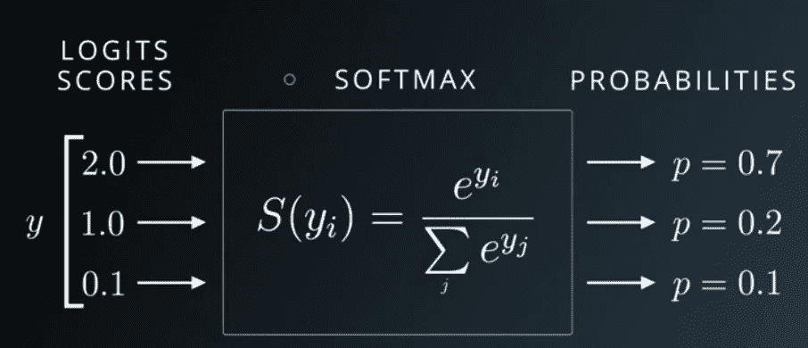

# 人工神经网络中的激活函数

> 原文：<https://medium.datadriveninvestor.com/activation-function-in-artificial-neural-network-e03b4a2b953d?source=collection_archive---------1----------------------->

在上一篇文章中，我们讨论了人工神经网络的基本原理，并简要讨论了激活函数。在本文中，我们将详细讨论激活函数。

 [## 深度学习基础-重要概念

### 深度学习是机器学习的子领域，使用受大脑神经系统结构和功能启发的算法

medium.com](https://medium.com/datadriveninvestor/deep-learning-fundamental-important-concepts-59d7ae90901b) 

激活函数是人工神经网络的重要组成部分。激活功能受到我们大脑活动的启发。

例如，当你高兴的时候，大脑中不同的神经元会被激活，当你悲伤的时候，不同的神经元会被激活。ANN 使用相同的概念来激活 ANN 的下一层中的神经元。我们可以将下一层中神经元的激活表示为 0(未激活)或 1(激活)。

 [## 深度学习用 7 个步骤解释-更新|数据驱动的投资者

### 在深度学习的帮助下，自动驾驶汽车、Alexa、医学成像-小工具正在我们周围变得超级智能…

www.datadriveninvestor.com](https://www.datadriveninvestor.com/2019/01/23/deep-learning-explained-in-7-steps/) 

在随附的短片中，吴恩达教授解释了激活功能及其用途。请看一看。

下面是常用的激活函数类型。在本文中，我们将讨论最流行的激活函数(Sigmoid，Tanh，Softmax 和 ReLU)。

1.  乙状结肠的
2.  热卢
3.  双曲正切
4.  二进制步骤
5.  身份
6.  泄漏 ReLU
7.  Softmax

## 乙状结肠-

Sigmoid 是最常用的激活函数，用于二分类问题语句或人工神经网络的输出层。Sigmoid 计算将给出 0 到 1 之间的输出。因此，如果由 Sigmoid 激活函数计算的数字接近 0，则 ANN 中的下一个神经元将不会被激活，如果接近 1，则下一个神经元将被激活。

**乙状结肠如何工作？**

对于大多数负输入，sigmoid 会将输入转换为非常接近 0 的数字。

对于大多数正输入，sigmoid 会将输入转换为非常接近 1 的数字。

对于相对接近 0 的输入，sigmoid 会将输入转换为 0 到 1 之间的某个数字。

数学上，Sigmoid 总是试图保持激活接近 0 或 1。假设神经元的权重计算为 0.5，那么根据公式 f(x)=1/2 =0.5，sigmoid 将计算为 0。

sigmoid function

## 坦恩-

双曲正切函数是对逻辑 sigmoid 的重新调整，其输出范围为-1 到 1。它提供一个以零为中心的输出。因此，较大的负值会映射到负输出。类似地，零值输入映射到接近零的输出。

此外，tanh 的梯度比 sigmoid 更陡。多用于二元分类。

数学上，我们可以写

tanh(x)= 2 * f(2x)1

## Softmax-

Softmax 函数获取一个任意实数值的 N 维向量，并生成另一个实数值在(0，1)范围内的 N 维向量。

Softmax 激活函数主要用于多类分类，而不仅仅是两类 0 或 1(二元分类)。举个例子，如果你把一张图片传给神经网络，它有多张动物图片(狗，猫，熊猫..)在一个图像中，那么如何使用二进制分类对其进行分类呢？Softmax 是多类分类的答案。

基本上，Softmax 会告诉你输出层上特定元素的概率。在我们的例子中，狗有 70%的机会，猫有 20%的机会，熊猫有 10%的机会。

## ReLU-

激活函数并不总是计算 0 和 1 之间的输出，事实上 ReLU 将输入本身转换为 0。

所以如果输入小于等于 0，那么 ReLU 会输出 0。如果输入大于 0，ReLU 将只输出给定的输入。ReLU 是当今使用最广泛的激活函数之一，用于神经网络的隐层。

数学上，我们可以写

relu(x)=max(0，x)

[https://machinelearningmastery.com/](https://machinelearningmastery.com/)

# 选择正确的激活功能

Sigmoid、Tanh 和 Softmax 函数通常在分类器的情况下工作得更好。你可以在人工神经网络的输出层使用 sigmoid。

ReLU 函数是一个通用的激活函数，目前在大多数情况下使用。ReLU 常用于神经网络的隐含层。

作为一个经验法则，你可以从使用 ReLU 函数开始，然后在 ReLU 没有提供最佳结果的情况下转移到其他激活函数。

谢谢:)