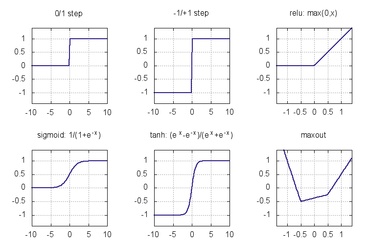

# 人工神经网络及其激活函数

> 原文：<https://medium.datadriveninvestor.com/activation-function-is-any-non-linear-function-applied-to-the-weighted-sum-of-the-inputs-of-a-a4326956cebf?source=collection_archive---------7----------------------->

*激活函数*是应用于*神经网络*中*神经元*输入的加权和的任何非线性函数。正是这些非线性激活函数的存在，使得神经网络能够近似几乎任何函数！

人工神经网络用于逼近未知函数，只给出某些点的函数值。任务是通过使用这些给定点来学习函数(或近似值),并通过学习技巧尽可能地进行归纳。使用类似梯度下降的迭代技术来学习参数。

*深层或浅层*神经网络的目的是模拟复杂函数(或拟合数据以进行预测)，也称为学习。如果你熟悉傅立叶分析([傅立叶分析——维基百科](https://en.wikipedia.org/wiki/Fourier_analysis))，你会知道基函数 sin(nx)和 cos(nx)的线性组合可以帮助建模*任何*函数。另请注意，正弦和余弦函数的范围是-1 至+1。这个数学模型是可靠的，不透气的。

因此，第一直觉可能是线性混合各种*激活*，其值范围从-1 到+1(因为这是正弦和余弦函数的范围)，因此我们可以有一个相当好的近似。让神经网络变得更深会让我们更加精确。所以我们可以选择一个 *tanh* 激活函数。

如果我们无论如何都要线性混合激活，那么为什么不使用范围从 0 到 1 的激活呢？范围-1 到+1 是通过乘以适当的权重实现的。所以我们选择了*s 形函数*。

然而，计算 sigmoid 函数及其用于反向传播的导数是麻烦的。**所以函数可微是关键！**最好挑一个看起来几乎像恒等函数 f(x)=x 的函数，但这个函数是线性的，线性函数的任何组合永远是线性函数。它不能模拟非线性函数。那我们该怎么办？剪掉负范围，并将其绑定到 0。激活范围是从 0 到∞，这个函数最容易求导。

因此，整流线性单元(ReLU)恰好是目前用于此目的的最流行的激活函数。

因此，泰勒级数和傅立叶级数是函数逼近技术。神经网络也是函数逼近(通用函数逼近)。

更多详情请看这里:[http://neuralnetworksanddeeplearning.com/chap4.html](http://neuralnetworksanddeeplearning.com/chap4.html)