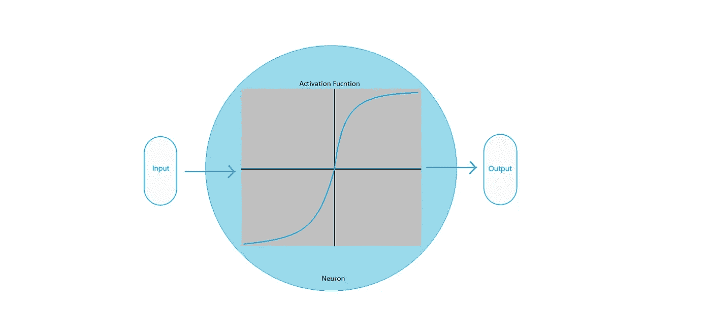
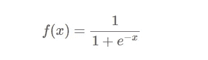
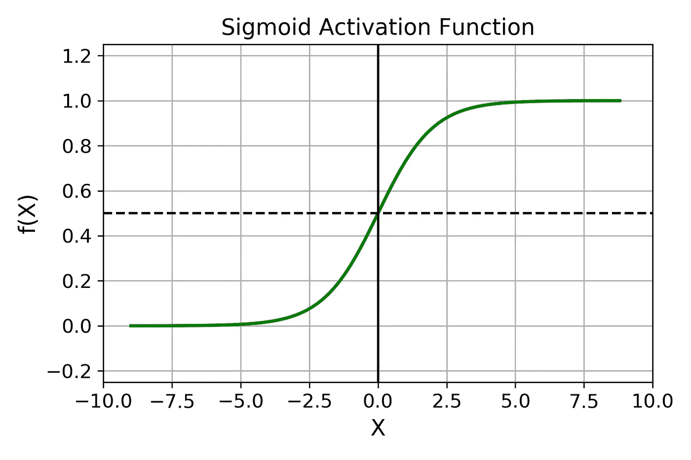
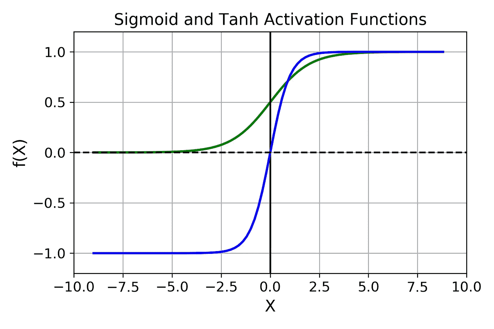
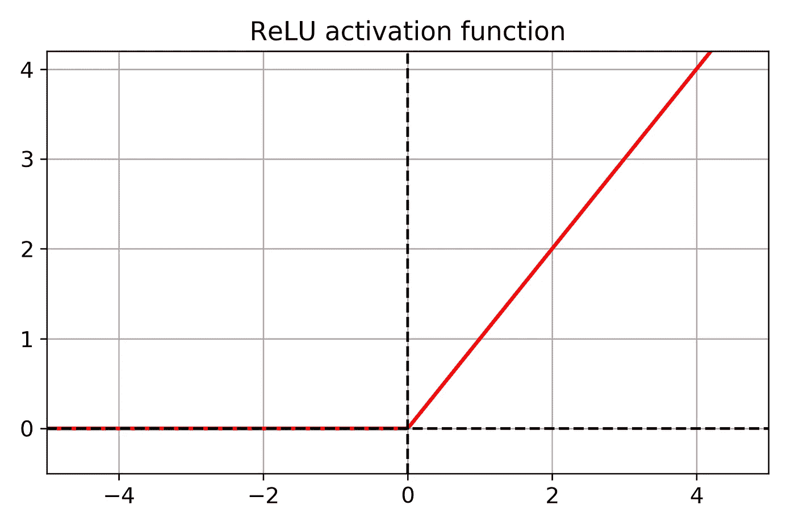

# 神经网络中的激活函数

> 原文：<https://medium.datadriveninvestor.com/activation-functions-in-neural-networks-797e88e41763?source=collection_archive---------11----------------------->

当我自己开始人工神经网络和深度学习时，每当在任何地方弹出术语'*激活函数*时，我总是会绊倒。一旦我明白了，接下来的事情，*它们实际上是如何工作的？*还有，最重要的激活功能是什么，哪些是最好的？所有这些问题都将在这里得到解答。所以，坐着别动，继续读下去。

# 什么是激活功能？

在你进一步阅读之前，去网上搜索一下关于神经网络的激活函数的定义。你会得到无数的答案，所有的答案都以不同的方式讲述着同样的事情。但是每个答案中的微小变化会让你觉得每个都是不同的定义。

 [## DDI 编辑推荐:5 本机器学习书籍，让你从新手变成数据驱动专家…

### 机器学习行业的蓬勃发展重新引起了人们对人工智能的兴趣

www.datadriveninvestor.com](https://www.datadriveninvestor.com/2019/03/03/editors-pick-5-machine-learning-books/) 

那么，什么是*激活功能呢？*首先要记住，它其实是一个函数，或者说是一个数学公式。好吧，它是做什么的？它决定了一个神经元是否会被激发。当神经网络的隐藏层中的所有神经元激活时，输入加上偏差的加权和成为该层的输出。然后这个输出成为下一层的输入。下图将有助于澄清一些事情:

Simple working of Activation Function

唯一要记住的是，你可以对单个神经网络使用相同的激活函数。但是您可以通过对隐藏层和输出层使用不同的激活函数来获得更好的结果。本文稍后将详细介绍这一部分。

# 线性激活函数

线性激活函数产生与输入成比例的输出。输出是输入的加权和。其形式为*f(x)= x。*如果你绘制一个线性激活函数的图形，你将得到类似如下的结果:

A Linear Activation Function

这样的函数也被称为*恒等函数。*但是这样的函数在训练神经网络中并不是很有用。这背后有一个非常强大的原因。当您使用线性激活函数时，即使有数百层的*深度神经网络也会像单层神经网络*一样运行。这就是所谓的 ***单层感知器。*** 这里重要的一点是，线性函数的合成仍然会给出一个线性函数。

那么，这是否意味着线性激活函数是完全无用的？显然不是。它们用于并将用于线性回归，在这种情况下，您需要来自连续但有些线性变化的数据集的输出。

# 非线性激活函数

正如你在上面看到的，为了训练神经网络，我们需要非线性的激活函数，因为线性的不能帮助模型泛化。在本节中，您将了解一些最常用和最重要的非线性激活函数。

# 乙状结肠或逻辑激活功能

Sigmoid 激活函数是一条 *S 形*曲线。它是 [**物流功能**](https://en.wikipedia.org/wiki/Logistic_function) 的特例。数值范围在 0 和 1 之间，最适合预测*概率，也最适合*分类。该函数具有以下等式:**

****

**当你看到下面的 s 形函数图后，事情会变得更加清楚:**

****

**Sigmoid Activation Function**

**Sigmoid 函数是可微的。此外，与阶跃函数或二进制阶跃函数不同，sigmoid 激活函数给出了在每一步上网络是否实际上向输出移动的指示。非常适合反向传播。**

**但是现在这种激活功能在大多数情况下已经失去了效用。这是因为它饱受 ***消失渐变问题的困扰。*** 这个问题的主要概述是，*对于很高和很低的 X 值，f(X)不变。这意味着模型很难在这些点上训练，并且函数不会太有效地工作。***

# **双曲正切激活函数**

*****tanh*** 激活函数几乎与 sigmoid 激活函数相似，但其范围为-1 至 1。也是 *S 形*且可微。它有以下等式:**

****

**您可以观察下面的图来比较 sigmoid 和 tanh 激活功能:**

****

**Sigmoid and Tanh functions**

**与逻辑函数相比，双曲正切函数的一个更好的特性是其输出以 0 为中心(归一化)，这可以加速收敛过程。但大部分就这样了。它在所有其他方面几乎与乙状结肠激活功能相同。它主要用于分类目的。**

# **ReLU 激活功能**

**整流线性单位或通常称为 ReLU ( *ReLU(z) = max(0，z)* )可能是最著名的实用激活函数之一。**

**在人工神经网络(ann)上投入了这么多努力的主要原因之一是复制人脑的功能(真正的神经网络)。人脑似乎大多是在乙状结肠功能的基础上运作的。这就是为什么乙状结肠/逻辑激活功能以前如此流行的主要原因。**

**现在，众所周知，对于人工神经网络，ReLU 激活函数给出了更好的结果，并且计算速度也很快。如上述函数所示，只有最大值会在网络中向前传播。但是，仍然有一个问题。该函数在 0 处不可微，因为它以锐角从 0 处射向最大值。这在训练阶段提出了一个问题，主要是在反向传播时。**

****

**Plot of ReLU**

# **Softmax 激活功能**

**从上面的讨论中你一定注意到了，人工神经网络主要用于分类，无论是数字(0 和 1)还是标签(疾病和非疾病)。激活功能也支持这一点。但是对于输出层来说， *Softmax* 函数是个不错的选择。通过使用 softmax 激活功能，可以通过替换单个功能来修改输出层。输出将对应于类别的计算概率。**

# **正确的选择**

**一般来说，对于隐藏层，ReLU 激活函数应该比其他函数工作得更好。与逻辑函数和双曲线函数相比，它的计算速度更快。此外，当输入值很大时，ReLU 不会造成任何问题。从图中可以清楚地看到没有饱和。**

**而对于输出层，如果是分类任务，那么 softmax 激活功能就真的很好用。**

# **尾注**

**仅此而已。如果你喜欢这篇文章，然后评论，分享和喜欢它。如果你有任何问题或建议，请随时提出你的想法。在 [**Twitter**](https://twitter.com/SovitRath5) 上关注我，获取定期更新。**

**标签:[人工智能](https://debuggercafe.com/tag/artificial-intelligence/)，[人工神经网络](https://debuggercafe.com/tag/artificial-neural-networks/)，[深度学习](https://debuggercafe.com/tag/deep-learning/)，[神经网络](https://debuggercafe.com/tag/neural-networks/)**

***原载于 2019 年 4 月 1 日*[*debuggercafe.com*](https://debuggercafe.com/activation-functions-in-neural-networks/)*。***