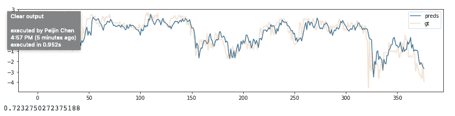

# 自适应标准化和模糊目标——时间序列预测技巧

> 原文：<https://medium.datadriveninvestor.com/adaptive-normalization-and-fuzzy-targets-time-series-forecasting-tricks-4e6cd453649a?source=collection_archive---------0----------------------->

Photo by [Stock Photography](https://unsplash.com/@aplaceforcreation?utm_source=medium&utm_medium=referral) on [Unsplash](https://unsplash.com?utm_source=medium&utm_medium=referral)

时间序列预测确实不容易，尤其是当你有非线性的、潜在的混沌动力时——在经济或金融时间序列的情况下，它会变得更难，因为你有人类在整个事情的背后。

在过去的一年里，我一直在为时间序列建模，有两个大问题困扰着我。一个是处理像 S&P500 这样的非平稳时间序列——尽管在不同的时间尺度上存在各种振荡和模式，但在这些振荡中存在大量的振幅和频率调制。换句话说，模式是存在的，但它们不是超级有规律的，即使它们存在了几年，也不能保证现在的动态在几年后仍然适用。

我决定通过这样的假设来解决这个问题，即 S&P500 在本地是静止的，而最近的过去比遥远的过去对未来有更大的影响。当然,“局部稳定”回避了**局部是如何局部的问题。**我决定尝试使用 44 天(2 个月的交易时间)的窗口来标准化这个时间序列，也就是说，要标准化一个数据点，取过去 44 天的时间，找出它的平均值和标准差，然后通过减去平均值并除以标准差来标准化该数据点。

第二个问题是你想做什么样的预测？我决定做一个自回归实验——没有外生变量——只有一个变量及其滞后。

设置如下——取 44 个数据点，预测未来。**但是我们应该预测什么呢？**选择一些具体的东西——比如提前 1 步或 4 步预测似乎没有意义，因为市场的动态会发生变化，四天内可能发生的事情在未来可能需要或多或少的时间。

 [## DDI 编辑推荐:5 本让你从新手变成专家的机器学习书籍|数据驱动…

### 机器学习行业的蓬勃发展重新引起了人们对人工智能的兴趣

www.datadriveninvestor.com](https://www.datadriveninvestor.com/2019/03/03/editors-pick-5-machine-learning-books/) 

这就是为什么我决定尝试**模糊目标**——不是在任何超级技术或贝叶斯意义上，只是在从一个范围内随机选择一个目标值的意义上。在你输入 44 天后的 5 天里，**随机选择一个值来代表目标。或者，你可以利用这 5 天的时间，找出中间值或平均值，并以此作为目标。如果你要进行随机选择，你甚至可以做出不止一个选择——这是一种基本的数据扩充形式，与计算机视觉中的随机翻转或裁剪没有什么不同，也与监督分类问题中使用的合成少数过采样(SMOTE)方法没有什么不同。下面是这种原始自适应规范化的代码。**

Training Data: SPY (an ETF that tracks the S&P500) from 2009–2016, then adaptive normalized.

接下来是创建随机的模糊目标:44 天的收盘价，然后随机选择未来 5 天的收盘价。这个过程重复 3 次，以创建一个扩充数据集。

Randomly picking a target from between 1–5 days in the future.

模型: ***岭回归***from***sk learn***—alpha(正则化)为 0.01。

测试数据—***2017 年 1 月 1 日至 2019 年 1 月 1 日*** 。我故意在培训/验证数据的结束和测试数据的开始之间留出一年的间隔。使用上述方法对测试数据进行标准化。(记住，如果您想要创建一个 44 天的测试输入，您实际上需要 88 天的数据，因为您需要前 44 天来规范化第一个实际数据点。)完成此操作后，我们使用模型对测试数据进行预测，下图显示了结果:

你可以看到蓝色的模型预测和浅橙色的地面实况。请记住，基础事实也是模糊的——从连续 5 个收盘价中随机选取一个点。然而，72.3 的 R2 分数似乎不错，也许太好了。希望，那些对时间序列预测和回归感兴趣的人可以复制这一点，或者在其他数据集上进行实验，看看它是否可行。

当然，还有最后一步——逆变换。取你的预测，乘以最近 44 天的标准差，再加上最近 44 天的平均值。希望这一切都行得通，并且…如果你通过这个计划变得非常富有，请告诉我！

***PS —我想找一份机器学习或者数据科学的工作。我住在纽约。如果你有任何线索，请给我发信息。我喜欢继续研究时间序列或序列(比如在 NLP 中)。感谢阅读！***