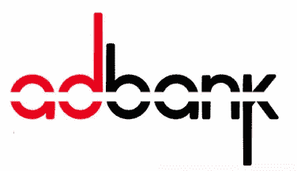
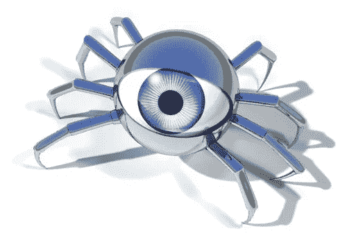
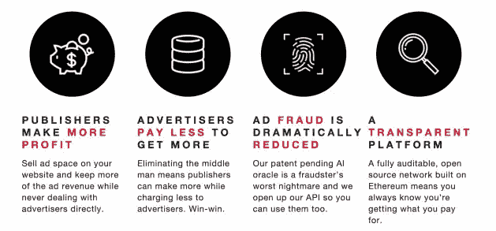

# Adbank 与 Howdoo 的合作伙伴

> 原文：<https://medium.datadriveninvestor.com/adbank-partner-with-howdoo-9c13c16e84fc?source=collection_archive---------7----------------------->

在之前的文章中，我已经提到了如何做的主题。

社交媒体领域的主要新玩家将在区块链分散化。为您的个人数据提供安全保护，并提供一系列我们以前从未见过的功能，再加上您可以通过参与该平台获得 [Howdoo](https://t.me/adbanknetwork) 代币(uDoos)的事实，这是一个必然的赢家，它将颠覆并彻底改变我们今天所知的社交媒体。

你可以在这里和这里阅读我以前的文章[。](https://medium.com/datadriveninvestor/a-safer-place-on-the-internet-4054e7a2a4f4)

好吧，让我带你慢慢走进 [Adbank](https://adbank.network) 的世界。

Adbank 是一个革命性的解决方案，旨在消除广告中的中间人。

传统上，一家公司会找一个中间人，这个中间人收取高额佣金，为他们的客户和出版商牵线搭桥。 [Adbank](https://adbank.network) 完全消除了流程中的额外成本和复杂性。

目前的在线广告市场价值 2200 亿美元。其中的 20%到 50%最终落入了这些渴望佣金的中介的口袋。

[Adbank](https://adbank.network) 可以比作数字广告的优步，正如 Adbank 首席技术官凯龙星在 [YouTube](https://www.youtube.com/watch?v=e6vrlODdRgQ) 上如此雄辩地描述的那样(认真查看视频，真的很搞笑)。它让公司通过对等网络与出版商直接联系。

基于区块链，他们能够利用智能合同和分散式分类账，消除在线广告行业普遍存在的欺诈行为。

他们的平台是开源的，完全可审计的。这很重要！超过 50%的网络流量是机器人(是的，超过 50%！)，Adbank 的人工智能解决方案保证广告到达正版人群。这是广告业向前迈出的重要一步，提供了一种成本有效且高效的目标定位方法，这是前所未有的；此外，完全透明，可以准确识别资金的支出地点和时间。

许多经纪人经常使用机器人和算法来欺骗网站，让它们认为自己是人类访客。他们制造高流量的假象，然后利用这种假象向客户收取更高的费用。

这个行业效率如此之低，我们需要整顿一下。Adbank 似乎有一个解决所有问题的解决方案，并且无疑提供了巨大的市场价值。

ADB 是 Adbank 令牌，由广告商购买并支付给出版商。

每个 ADB 令牌代表一个或多个广告。出版商在实时广告竞价系统中使用这种新的广告经济的货币将广告出售给广告商。

Adbank 和 Howdoo 的合作是天作之合。那些选择在 Howdoo 上看广告的人会得到 uDoos 的奖励，而那些接触到 Howdoo 用户的广告商将会获得有针对性和成本效益的成功。

要了解有关 Adbank 或 Howdoo 的更多信息，请参阅以下详细信息:

Howdoo [网站](https://howdoo.io)

Howdoo [电报](https://t.me/howdooHQ)组

Adbank [网站](https://adbank.network)

Adbank [电报](https://t.me/adbanknetwork)组

