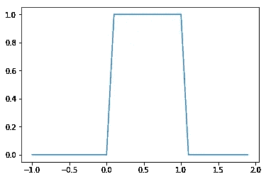
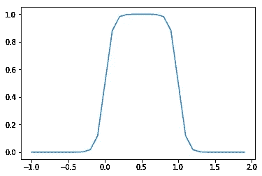
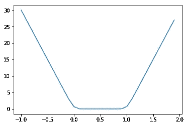

# 向回归问题添加范围约束

> 原文：<https://medium.datadriveninvestor.com/adding-a-range-constraint-to-a-regression-problem-aa88825caaee?source=collection_archive---------13----------------------->

我正在训练一个算法来预测一个折扣，这个折扣在 1%到 100%之间。我发现，一些预测值超出了这个范围，要么是负值，要么大于 1。我想更新我的成本函数来惩罚超出范围[0，1]的预测。

因此，我添加了一个先验概率分布，它在[0，1]范围内是均匀的，在其他地方为零:

为了使函数可微，我们改变了 sigmoid 函数的步骤。

*p*(*y*)=*σ*(*ϕy*)*σ*(*ϕ*(1—*y*))

这导致成本函数中的附加项:

*c*=*logσ*(*ϕy*)*logσ*(*ϕ*(1*y*))

如我们所见，在有效区间内，附加项的导数为零，但在有效区间之外，我们有将成本函数推向有效区域的斜率。我在我正在处理的问题(价格错误检测)中测试了这种方法，效果相当不错。并且，由于我使用的是 TensorFlow，所以我不需要担心在计算偏导数时出错，因为 TensorFlow 替我做了计算！