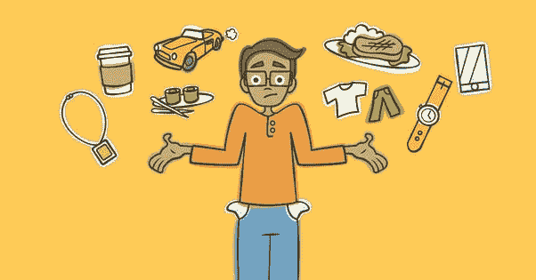

# 采用这些生活方式的改变来增加每月的储蓄

> 原文：<https://medium.datadriveninvestor.com/adopt-these-lifestyle-changes-to-increase-monthly-savings-ddf1b5ced74a?source=collection_archive---------8----------------------->

Stressed with lifestyle expenses?

**生活方式**是社会、文化、群体或个人所确立的一种生活方式。这包括描述一个人如何度过时间的行为、互动、消费、工作、活动和兴趣的模式。生活方式的规模日益扩大。我们努力跟上这种新的生活方式。如今在**生活费用**的名义下，我们继续在不必要的东西上花费。我们认为这些费用是强制性的，以保持我们的**地位不变。我们小时候有这种生活方式吗？我们的父母花了很多钱来保持他们的高地位吗？他们对此感到困扰吗？**

这种保持现代生活方式的压力消耗了我们的积蓄。但是我们不应该忽视为未来储蓄。

 [## 外汇投资如何帮助偿还债务|数据驱动的投资者

### 外汇是对外汇市场的投资，不同国家的货币在外汇市场上进行兑换

www.datadriveninvestor.com](https://www.datadriveninvestor.com/2019/02/13/how-forex-investment-helps-to-repay-your-debts/) 

**节约**是美德。而且我们要把它转化成一种**习惯**。一旦任何活动变成了习惯，你经常做的努力就会减少，你会继续有效地做下去。储蓄转化为投资让钱为我们工作。我们应该从第一张薪水支票开始为未来存钱。

大部分时候我们都是在所有的开销都满足之后才想到储蓄的。通过这种方式，我们永远无法保存。如果我们身边有钱，开销是一定会发生的。开销是永无止境的。我们应该扭转这种局面。这意味着我们应该把每月收入的一部分存起来，把剩下的花掉。

储蓄率取决于你的年龄和你的责任。20 至 30 岁的人比 40 多岁的人能存更多的钱，因为他们的家庭责任比 40 多岁的人少。

你应该至少把月收入的 20%到 30%存起来。如果你是单身，肩上没有重大责任，那么储蓄率应该超过 50%。但是实际上，我们能存下月薪的 20%到 30%吗？答案可能是否定的。如果我们在支出模式上做些改变，我们可以存更多的钱。

以下是控制我们生活开销的方法。

*   写下你的每一笔开销。写下来会帮助你知道你的钱去了哪里。
*   费用有两种。第一类是**固定费用。**包括房租、社会抚养费、学费、固定药费、女佣工资、财产税、保险费等费用。第二个是**可变费用**，包括食物、交通、电力、电话、娱乐、杂货等。在改变生活方式时，我们应该关注固定支出，尽量减少可变支出。
*   费用也可以分为**需求和**需求。你应该明白什么是你的需要，什么费用是你想要的。尽量避免频繁地在酒店、短期度假、郊游、看电影、聚会等方面花费。这将有助于我们关注您的需求并节省资金。
*   推迟你的大宗采购，直到非常紧急的时候。过一段时间后，你自己会意识到这根本不需要。这尤其适用于电子产品和服装。
*   尽可能使用公共交通工具。如果您有后付费移动连接，请将其更改为预付费，这有助于密切关注您的移动使用情况。
*   按时支付你的水电费以避免罚款。
*   开始使用借记卡**而不是信用卡**，通过它你可以在每次消费后看到银行余额。
*   如果需要的话，开始用现金支付，因为当我们花现金而不是塑料钱时，现金会更紧张。
*   尝试寻找其他收入来源来支付你的开销。你可以把你的爱好转化成课程，可以从事自由职业项目，学费等等。
*   决定你的优先事项。储蓄首先从你的头脑开始，然后写在纸上。你需要把储蓄放在比维持生活方式更重要的位置。
*   与此同时，努力提高你的技术和教育技能去找一份收入更高的工作。

希望这些能帮助你控制生活开销，存更多的钱。

拯救快乐！！！