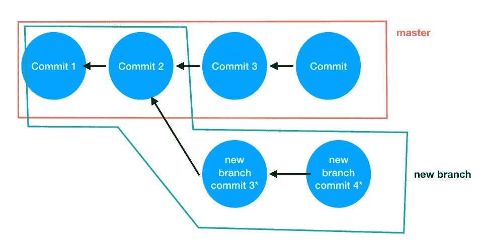
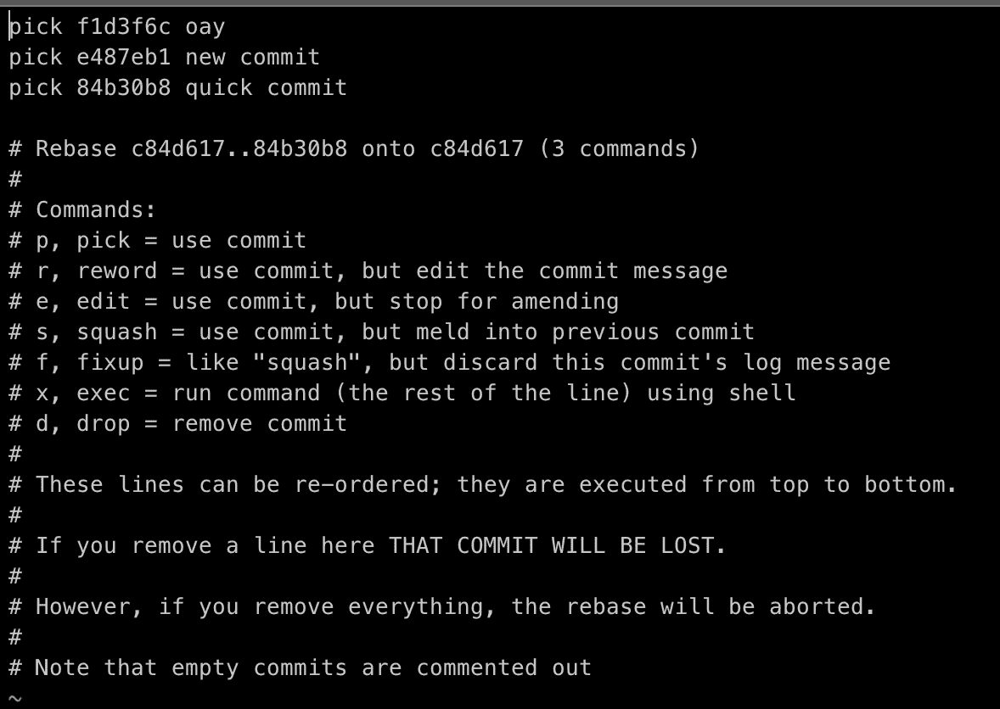
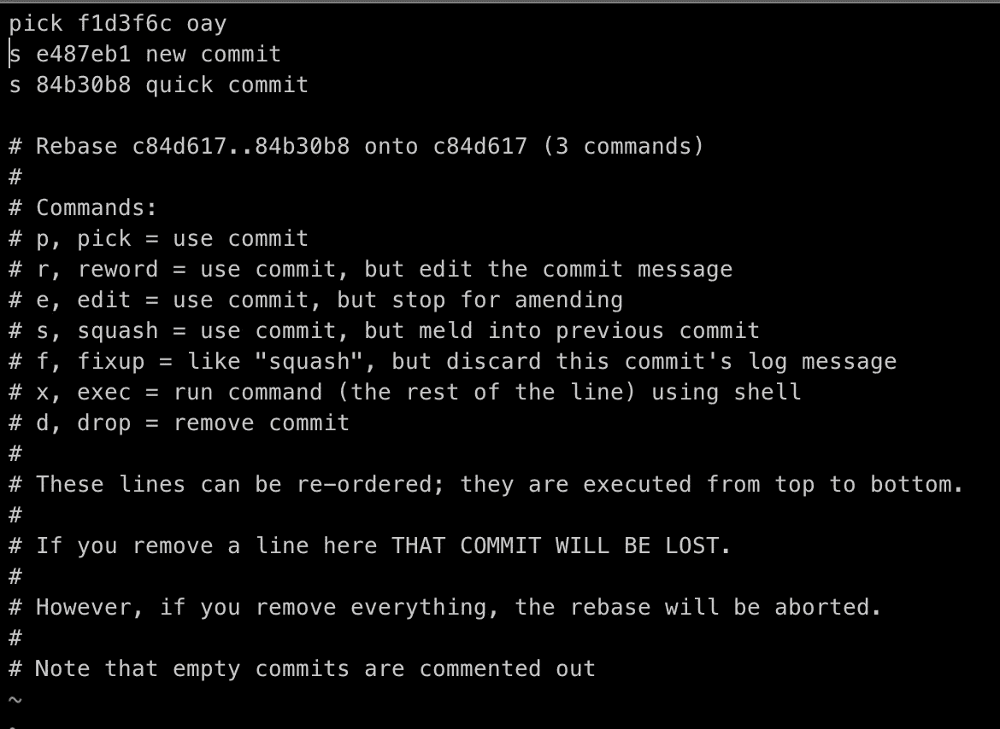
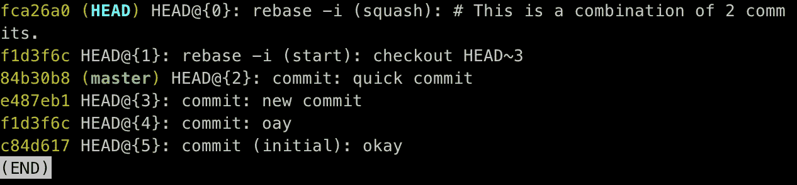

# 可以提高生产力的高级 Git 命令

> 原文：<https://medium.datadriveninvestor.com/advanced-git-commands-that-can-boost-your-productivity-707476a2a06?source=collection_archive---------7----------------------->

除了`git add`和`git commit`我们还能学到什么？



我们都曾在某个时候与 git 进行过斗争。我们都知道当我们因为搞砸了 Git 而失去所有进展时的那种感觉。我们都知道，当我们总是需要向同事寻求帮助时，我们感觉有多糟糕。

今天是改变这一切的一天；).这篇文章将介绍一些你可以在工作中使用的基本的高级 git 命令。我们将讨论四个主要的 git 命令——精选、重置、恢复、引用日志。这篇文章还将谈到挤压，分割和撤销更改。

[](https://www.datadriveninvestor.com/2018/08/06/ai-forecast-disruption-then-productivity/) [## 艾预测:“颠覆，然后是生产力”|数据驱动的投资者

### 人们越来越担心，随着机器学习和互联网的普及，所有白领工作都将消失

www.datadriveninvestor.com](https://www.datadriveninvestor.com/2018/08/06/ai-forecast-disruption-then-productivity/) 

这篇文章不适合刚开始学习 Git 的人。它要求您对 Git 有所了解。说了这么多，让我们开始吧！

# 背景

在深入研究这些命令之前，我们只需要理解 Git 的一个简单概念。Git 由提交树组成。一个分支是一系列提交。考虑 git 树的一个简单方法是考虑 n 元树。每个 treenode 都有一个指向其父节点的指针。从根到任何叶节点的每条路径都是一个分支。这里的叶节点是该分支内的最新提交，通过迭代地跟踪其父节点指针，我们可以获得该分支的所有提交的序列。


话虽如此，我们现在可以开始 git 之旅了。

# GIT 命令

## Git 樱桃采摘

此命令将选定的提交添加到当前分支。它创建一个新的提交副本，但不删除原始提交。

**为什么以及何时摘樱桃？**

1.  当我们意外地在错误的分支中提交，并且我们想要将该提交移动到正确的分支时。(这比你想象的更常见，尤其是当你同时在多个分支上工作的时候)
2.  当我们想测试新提交在另一个分支上是否工作正常时

**例子:**

```
a-b-c-d-e    master: a-b-c-d-e
 \
  q-w-l      feature: a-q-w-l**Let's say now we want to apply commit-l to the master branch,
we do the following:**git checkout master
git cherry-pick <hash-of-commit-l>**Then we will get the following:**a-b-c-d-e-l  master: a-b-c-d-e-l
 \
  q-w-l      feature: a-q-w-l
```

## Git 重置

该命令移动分支指针，使其指向该分支内的另一个提交。

**git 复位的原因和时间**

1.  当我们需要回到之前的提交时。当新的提交有错误并且我们需要恢复这个变更时，这可能会发生。
2.  当我们需要将多个提交合并(挤压)成一个提交时。
3.  当我们需要将一个提交分成多个更小的提交时

**git 复位和 git 硬复位的区别**

*Git reset:* 当我们使用这个命令时，分支指针指向之前的提交，但是恢复的提交更改仍然在这里。

**例如:**

```
 **we have a branch: a-b-c-d
and we go back two commits by using** 'git reset HEAD~2' **or** 'git reset HEAD^^'**Then the branch now become:**
a-b    
**but the changes of commit-c and commit-d will become untracked.****Now we can add the changes and form a new commit by doing:**
git add -A
git commit -m 'new commit'**Then the branch will become:**
a-b-e
```

*Git reset - hard:* 当我们使用这个命令时，分支指针指向过去的提交，恢复的提交更改消失了。因此，我们不能使用硬重置来压缩或拆分提交。当您不小心使用了`git reset --hard`并且丢失了更改时，您可以使用`git reflog`回到之前的状态。更多细节将在 reflog 部分讨论。

## Git Rebase

该命令用于将当前分支重设为新分支的基础

重定基础的过程:找到新的基础→精选所有未复制的变更到该基础上→重新分配分支指针。

**直观解释:**

```
a-b-c-d-e  master_branch: a-b-c-d-e
 \
  x-y-z    new_branch: a-x-y-zgit checkout new_branch
git rebase master_branch**The git trees now becomes:**a-b-c-d-e         master_branch: a-b-c-d-e
         \
          x-y-z   new_branch: a-b-c-d-e-x-y-zHere, we use the current master_branch as the base, and then we are cherry-pick the three commits in the new_branch and apply it to the master_branch. The new_branch now becomes a-b-c-d-e-x-y-z
```

**git rebase 的原因和时间:**

1.  当我们需要将提交压缩成一个提交时
2.  假设我们从主分支出来做一些事情，现在主分支已经被更新了，我们需要在当前分支中包含所有新的变化，我们在更新的主分支上对它进行重新设置。

**示例:**

```
a-b-c-d-e-f
```

假设现在我们想将 d-e-f 合并到一个提交中
我们可以做:`git rebase HEAD~3 -i`，我们将看到类似下面的内容:



然后，我们可以选择通过执行以下操作将提交-84b30b8、提交-e487eb1 和提交-f1d3f6c 压缩为一个提交 f1d3f6c:



## Git 参考日志

该命令返回最近使用的提交 sha-hash 列表以及对它们执行了什么操作。与`git reset`结合，这是我们需要撤销某件事情时最有用的命令之一。

**为什么以及何时使用 git reflog**

1.  当我们通过合并、重定基础或重置来打乱分支时。我们可以使用 git reflog 在该操作之前检查提交散列，并通过使用`git reset <SHA-hash>`返回到它。
2.  当我们使用`git reset --hard`

当我们使用 git reflog 时，我们通常是这样的:



**示例:**

假设我们不小心使用 git reset - hard 弄乱了分支，我们需要找回那些更改，我们可以做以下事情:

1.  git 参考日志
2.  在我们做那个操作之前找到散列
3.  git 复位<hash></hash>

这允许我们返回到之前操作的提交。

# 一些有用的提示

## 挤压和分裂

有三种方法可以做提交壁球

1.  git 重置
2.  git rebase -i
3.  git commit - amend(当我们忘记在最近一次提交中包含一些内容时使用，我们可以简单地使用这个命令来修改最近一次提交或更改提交消息)

**有一种方法可以做拆分:**

1.  git 重置

## **撤销更改:**

**有两种方法可以撤销更改**

1.  git revert(这将创建一个 revert commit。通常更好，因为这会创建一个新的提交并记录所发生的事情)
2.  git reset - hard(这不会创建新的提交，它只是删除不需要的更改，不会留下日志)

# 概述

在这篇文章中，我们了解了:

1.  **精选:**该命令将现有提交添加到分支。
2.  **复位:**该命令将分支指针移动到另一个位置。它可以用来挤压提交。它还可以用于撤消更改。
3.  **重置:**该命令将当前分支重置为其他分支/提交。它可以用来分割和挤压提交。
4.  这个命令显示了最近提交的列表。它可用于返回到某些提交和撤消操作。