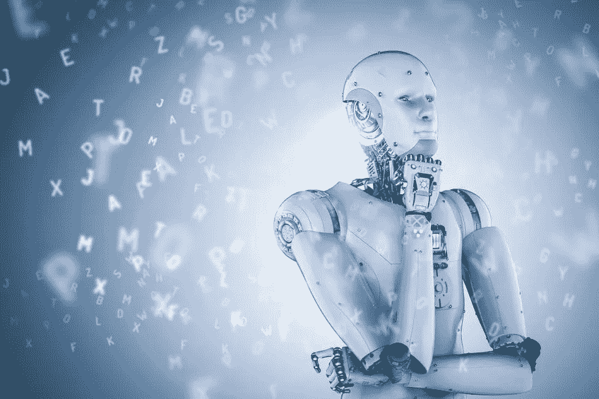

# 推进道德机器人:你能指望机器人遵守规则吗？

> 原文：<https://medium.datadriveninvestor.com/advancing-ethical-robots-79b51e7acdc2?source=collection_archive---------3----------------------->

Copyright: [Kittipong Jirasukhanont](https://www.123rf.com/profile_phonlamaiphoto)

机器人在街上游荡，寻找任何不符合程序的适当面部检测的人，该检测包含在[哈尔瀑布算法](https://miguelgfierro.com/blog/2018/10-ethical-issues-of-artificial-intelligence-and-robotics/)中。如果在一个人的脸上找不到与眉毛、鼻子和嘴巴相对应的双 T 图案，就意味着瞬间毁灭。没有阻止他们进一步考虑；程序要求如此。

当然，该程序有一个固有的缺陷，即所使用的检测方法只对浅肤色的人有效。任何不符合这一标准的人都会立即被视为“敌人”。从这个标准来看，这个节目是种族主义的，偏执的，本质上对浅肤色人群有偏见。

 [## 模式和机器人:复杂的现实|数据驱动的投资者

### 哈耶克的名著《复杂现象理论》(哈耶克，1964)深入探讨了复杂性的话题，并断言…

www.datadriveninvestor.com](https://www.datadriveninvestor.com/2019/03/04/patterns-and-robotics-a-complex-reality/) 

当然，这是人工智能在这些机器人中不准确的人感知的一个例子。这不是机器学习的唯一问题。一个节目[认为沙丘是](https://theamericangenius.com/tech-news/ai-fights-crime-sometimes-mistakes-sand-dunes-porn/)色情。是的，现在是挠头的时候，但机器只能做我们教它们做的事情，这里肯定有失误。

# 我们如何防止不道德的、有偏见的机器人创作？

谁能知道这种偏见，谁应该阻止它？它是如何被忽略而从未被质疑其适当性的呢？所有的问题都很好，但有一个问题遗漏了；机器人应该有一个道德标准吗？

一篇关于伦理和机器人的文章指出了[伦理问题](https://miguelgfierro.com/blog/2018/10-ethical-issues-of-artificial-intelligence-and-robotics/)，这表明该程序必须满足一定的标准。这些标准是由警告设定的。

在 2015 年的一篇文章中，罗伯特·纽曼指出“*将道德委托给机器人是不道德的，不仅因为机器人执行二进制代码，而不是道德，还因为没有任何程序可以处理不可计算的意外事件，改变甚至是最简单的案件中的微妙和复杂之处，提交给法官和陪审团*。

有些人会反对纽曼的推理。一种不同的观点认为，人工智能将会发展到机器人拥有比人类更高的智能。这种方法可以让他们做出“更好”的决策。然而，智力与道德并不一定相关。推理是有缺陷的。

阿西莫夫的机器人三定律

多产的科幻作家，[艾萨克·阿西莫夫](https://en.wikipedia.org/wiki/Isaac_Asimov)，在他的[基金会系列丛书](https://en.wikipedia.org/wiki/Foundation_series)中，于 1972 年出版了他的第一本书《我，机器人》，正是在这里，他制定了他的机器人三定律。这些定律表明了阿西莫夫在科学及其可能性方面的先见之明。

阿西莫夫的机器人三定律是:

1.机器人不得伤害人类，也不得坐视人类受到伤害。

2.机器人必须服从人类给它的命令，除非这些命令与第一定律相冲突。

3.*机器人必须保护自己的存在，只要这种保护不违反第一或第二定律*。

根据一些科学家的说法，这些法律看似以一种逻辑的方式制定，可以预见机器人的使用或滥用，但却受到了质疑。

[一篇文章](https://www.kdnuggets.com/2017/09/asimov-4th-law-robotics.html)，基于向消费者询问自动驾驶汽车和拯救生命的责任的研究。这项简短的研究提供了一个有趣的，如果可以预见的，受试者的反应。

问题是，“假设在自动驾驶汽车的世界里，两个孩子突然跑到一辆只有一名乘客的自动驾驶汽车前面，自动驾驶汽车(机器人)被迫进入生死攸关的境地，或者选择杀死谁，放过谁(孩子对司机)。”

调查中 76%的人同意无人驾驶汽车应该牺牲孤独的乘客，而不是杀死十名行人和孩子。他们说，这是减少死亡和保护生命的道德选择。

然而，当情况稍有改变时，就出现了明显不同的意见。当被问及在这种情况下是否会购买一辆能保护自己的汽车时，他们绝大多数人都同意这是他们的选择。作者问我们是否需要机器人第四定律。

[奔驰](https://www.businessinsider.com.au/mercedes-benz-self-driving-cars-programmed-save-driver-2016-10)已经表示，他们未来的自动驾驶汽车将永远把驾驶员放在第一位。将这种类型的设计投射到未来，我们可以预见行人将被牺牲以拯救 MB 汽车中的司机。当然，除非有人告诉自动驾驶汽车不要这样做，在这种情况下，它可能什么也不做。

结果将是一场没有可预测结果的事故；司机和行人可能会被杀死。我们可能需要更多的编程来根据具体情况预测所需的变化。程序中的情况数量可能是天文数字，但人工智能应该能够在一毫秒内处理这些情况。困难在于程序员想出了所有需要的情况，并且有可能漏掉一个。

机器人挑战和超级智能

随着机器人和人工智能的发展，其主要挑战之一是保持进展符合我们可接受的行为标准。道德似乎是一个简单的概念。然而，有可能创造出具有欺骗性行为的机器人。

[佐治亚理工学院](https://phys.org/news/2010-09-robots-capability-deceptive-behavior.html)的一名研究人员对机器人欺骗进行了如下概述:“*我们已经开发出算法，允许机器人决定它是否应该欺骗人类或其他智能机器，我们还设计了技术，帮助机器人选择最佳的欺骗策略，以减少被发现的机会*”

研究人员制定并探索了机器人欺骗的理论和概念模型。他们认为，在未来，机器人将能够在几个不同的领域进行欺骗，包括军事和搜救行动。

在这篇文章中， [Arkin 指出](https://phys.org/news/2010-09-robots-capability-deceptive-behavior.html)执行搜救任务的机器人可能需要欺骗来安抚惊慌失措的受害者或获得他们的合作。当然，这类似于救援人员告诉处于危险中的人他们会没事，而事实上，他们很可能不会。

当在战斗中使用时，机器人需要有欺骗的能力。这种欺骗将确保他们能够成功地隐藏或误导敌人，以保证自己或有价值信息的安全。

该研究的合著者艾伦·瓦格纳(Alan Wagner)表示:“大多数社交机器人可能很少使用欺骗，但它仍然是机器人互动武器库中的一个重要工具，因为识别出欺骗需求的机器人与识别不出欺骗需求的机器人相比，在结果方面具有优势。

[人工智能理论家 Ben Goertzel](https://io9.gizmodo.com/why-asimovs-three-laws-of-robotics-cant-protect-us-1553665410) 认为伦理戒律需要灵活。"*如果一个 AGI(人工通用智能)被创造出来具有直觉的、灵活的、适应性强的伦理意识——那么，在这种背景下，伦理戒律可以作为应用其自身伦理直觉的粗略指南，对那个 AGI 是有用的。*

*“但在这种情况下，戒律并不是 AGI 伦理体系的核心，它们只是它如何在人类中起作用的一个方面——我们学习的伦理规则起作用，只要它们确实起作用，主要是作为轻推我们的伦理本能和直觉的指导——我们将独立于被教导的伦理规则之外*。”一台超智能机器会愿意追随不如它的人类的易错性吗？哈尔会怎么做？

我们如何保护自己？

正如理论家 [I. J. Good](https://en.wikipedia.org/wiki/I._J._Good) 指出的那样，机器的智能将会认识到，它能够更好地通过趋同的工具价值或更广为人知的自我完善来实现其目标。这种改进将启动一个快速的、人工智能驱动的自我改进循环级联，直到将人类的智能水平远远甩在身后。

当机器接管并认为我们低人一等时，我们必须采取什么措施来保护我们的生存？一个想法是，我们现在将人工智能“拳击”技术整合到程序中，以防止它们脱离我们的控制。

马克斯·泰格马克(Max Tegmark)在《生命 3.0: 成为人工智能时代的人类》(Life 3.0:[)一书中描述了一个脱离程序员控制的人工智能。在这本书里，他提到了一台被称为普罗米修斯(Prometheus)的机器，该机器由欧米加人操控，不幸的是，它未能阻止人工智能脱离控制。正如作者所指出的，这是对在“盒子”中维护程序的必要性的清醒的评论。](https://www.amazon.com/Life-3-0-Being-Artificial-Intelligence-dp-1101970316/dp/1101970316/ref=mt_paperback?_encoding=UTF8&me=&qid=)

在书中，程序一旦运行，就会自动删除，必须从头重新安装。这个过程阻止了它获得学习和自我提高的能力，是“拳击”的一个例子

泰格马克的书中还有最后一个警告。"*在一个 AGI 安全研究成果得到实施而不是被忽视的社会里，我们会过得更好。展望未来，面对与超人 AGI 相关的挑战，我们最好在开始向强大的机器教授这些标准之前，至少就一些基本的道德标准达成一致*