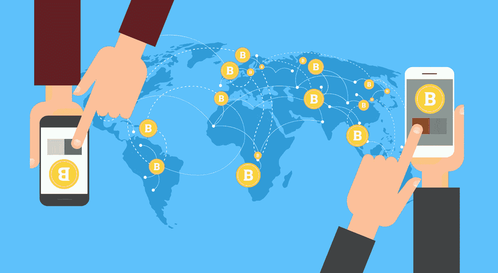
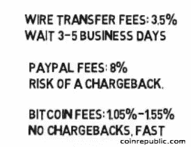

# 使用加密货币进行资金转移的优势。

> 原文：<https://medium.datadriveninvestor.com/advantages-of-money-transfer-using-cryptocurrency-9e1f32da4fbe?source=collection_archive---------0----------------------->

First Published at [OkayPay.com](https://okanepay.com)

大多数人依靠银行进行国际汇款和在线汇款服务，这在某种程度上被认为是最安全的方式，然而如果你曾经经历过通过这些企业向海外汇款的过程，你就会知道这并不总是一帆风顺的。银行会争辩说，没有最安全的方法来做到这一点，T2 反击 T4、区块链和加密货币带来的革命。根据 [Find，2016 年](https://news.find.exchange/how-cryptocurrency-will-change-the-way-you-send-money/#fn1)[桑坦德银行](https://www.cnbc.com/2018/01/31/santander-earnings-q4-2017.html)从转账费用中获得了 10%的利润。交流新闻。那么，我们应该期待银行说些什么呢？

**让我们来看看传统汇款服务的步骤:**

首先，你走进一个汇款点，告诉他们你想汇款，告知你要汇款的人的名字，他们居住的城市和国家。他们会收集你的信息，并为你做其他一切事情，以确保你的钱到达你想要的目的地。一些公司可能会额外收取当天转账的费用，但通常可能需要几天，费用可能会根据您发送的金额以及您希望资金到达目的地的速度而有所不同。你也可以在网上转账，这通常需要同样的步骤。这很简单，但是费用可能很高，而且到达时间很慢。

如果你是通过银行电汇，你将不得不提供更多的信息，账号，路由号， [SWIFT 代码](https://www.google.com.br/url?sa=t&rct=j&q=&esrc=s&source=web&cd=2&cad=rja&uact=8&ved=2ahUKEwiknMSUt8_eAhUEkJAKHYFJA5MQFjABegQICxAE&url=https%3A%2F%2Fwww.chase.com%2Fpsmhelp%2Findex.jsp%3Fpg_name%3Dshared%2Fhelp%2Fpage%2FWire_BankCodeLookupGuide&usg=AOvVaw2KD0JOtE1MqVpZ4nnRHsGe)等等。并且支付比汇款服务高得多的费用。转机可能需要 3-5 天以上才能到达您选择的目的地。

我用过一次银行电汇，再也没用过了。有人通过银行电汇给我汇款，这从来都不是一帆风顺的。这是一件麻烦事。

所以，我在 20 多年前开始使用汇款服务，这些年来我在不同的国家生活过，汇款已经成为我生活的一大部分。今天，我习惯了这些术语，它是如何工作的，以及商店开门和关门的时间，以及它的价格。在大约一年前加密货币出现在我的生活中之前，我从未停下来思考我是否应该信任所有这些不同的公司来转移我的钱，或者是否有更好的方式来这样做。

那时我意识到我所谓的*简单*恰好更像*方便*而不是简单，仅仅因为它是我所知道的全部，并且它暂时达到了目的。但是进化是不可避免的，现在我们有了新的更好的东西，然而，这是以前从未见过的东西。所以一开始，可能不会觉得这样更好或者更容易。

我的观点是，我们必须知道有一个学习期，当遇到新事物时，它会挑战我们所知道的，教会我们一些我们没有东西可以比较的东西。在我们这个时代，我们必须学会对科技领域的意外事件有所期待。

区块链和加密货币技术恰好是一个与传统金融系统完全不同的概念，就像我们第一次听说互联网时一样，它是新的、现代的、快速的，但它对每个人来说都不那么酷或容易。

*我想你明白了。*

**让我们看看转移加密货币会是什么样子(假设你没有加密货币或者需要购买更多的加密货币):**

整个过程都是在线的。假设你想发送 [WCO](https://winco.io) 加密，使用你的信用卡/借记卡，你发送你的法定货币到一个加密[交易所](https://blog.winco.io/category/exchange/)购买 [WCO](https://winco.io) ，并从那里发送到你的目的地/接收者的钱包。

收件人将在*秒*内收到钱。然后，他或她将把 WCO 带到一个交易所，将其兑换成法定货币(假设这是他们愿意做的)，并将钱直接提取到他们的银行账户。已经完成了。

如果你已经拥有加密货币，你可以跳过转换过程，这样会更快。使用 cryptos 进行资金转移的过程与众不同:

没有中间人；
快如闪电；
高级别安全；
随时；
来自世界任何地方；你想给谁就给谁；
你想要多少就有多少。

> 可能很难通过汇款服务或银行电汇将 10，000 美元汇至另一个国家，但将其转换为加密货币，您可以在区块链上几秒/几分钟内将这笔钱汇给任何地方的任何人。

加密货币转账的主要优势是费用和速度。

尽管这个过程似乎比传统的货币转账多了几个步骤，但目前，在加密货币成为主流之前，这个系统将主要服务于那些需要优先考虑*费用*和*速度*的人。直到最终转换不再需要，技术会随着我们的采用而改变。另一个好处是你可以自己做所有的事情——有些人觉得这很好，有些人觉得不太好。

传统的汇款服务通过对存款、取款和转账收费来赚钱。还有，他们在兑换你的钱的时候也在汇率上赚钱。例如，BRL/美元，如果今天 1 美元等于 3.75 美元 BRL，经纪人的汇率可能是 1 美元兑换 4，000 巴西雷亚尔，这样他们就可以赚取额外的现金。

使用加密货币时，你必须留意交易价格；当你把钱寄给另一个国家的人时，你要兑换两次。首先，当您购买加密货币时，使用您当地的法定货币发送加密货币；其次，当接收者将加密货币兑换成他或她的当地法定货币时。

如果你不想赔钱，这是一个你必须意识到的过程，以便在交易平台上做最好的交易。请注意，这仍然是一个动荡的市场，你可以让它为你的优势。

大多数加密货币钱包和交易所不收取押金。取款和转账使用像 [Okane Pay App](https://okanepay.com) 这样的应用，你只需支付交易额的不到 1%。在区块链上交易也要收费，根据你在平台上停留和交易的时间长短，收费为几美元(收款人也一样)。与传统方法相比，它肯定更便宜。

西联汇款是世界上最受欢迎的汇款方式之一，如果用信用卡/借记卡支付，网上汇款 100 美元需要 12.99 美元，并且当天到达。发送所有其他选项需要 2 到 6 天，费用从 0.99 美分到 110.00 美元不等。(最多只能发送 5，000 美元。)

例如，如果我想从巴西给我在美国的女儿寄 100 美元，这将花费我 0.99 美分，并且需要 6 天才能到达。如果我想为她的 16 岁生日汇 10，000 英镑，我必须在一个月内汇 5，000 英镑，下个月再汇 5，000 英镑，如果我想在两天内把钱寄到那里，每笔交易我要付 110 英镑。

> *这种服务适合你吗？这都是关于你的优先事项。你需要资金转移为你做什么？你需要它快吗？需要贱吗？你需要它安全吗？以上全部？*

据 coinrepublic.com**消息，贝宝**收取高达 8%的交易手续费，客户可以在 60 天内要求退款。换句话说，你得到报酬，使用这笔钱，如果付钱给你的人决定要回他们的钱(他们可以要求任何东西)，PayPal 将从你那里收回这笔钱，即使他们必须进入你的银行账户存档。*哇*。我也用贝宝收款，虽然我从未遇到过欺诈问题，但费用非常高。

> 加密货币转账是不可逆的，它保护收款人免受任何类型的欺诈。

电汇费用从 25 美元到 45 美元+美元不等。

我认为加密转账唯一真正的缺点是加密货币还没有法定货币流行，这使得转换过程更加困难，但是想象一下一旦加密货币成为主流，这个过程会变得多快、多便宜、多方便？

> 加密货币和区块链的结合正在扰乱汇款业务，尤其是国际汇款业务。这只是一个时间问题，直到它变得流行和有效。

使用 cryptos 进行资金转移的优势在于不依赖任何政府。这是一个至关重要的优势，公众必须了解它的力量，让它势不可挡。

将钱从一个国家转移到另一个国家既慢又贵。这可能需要几天时间，需要几个中间人、中介，以及每一个人的报酬，这使得加密货币转移成为一种有吸引力的替代方案，可以减少传统货币转移带来的费用和限制。

> 当你减少了中介并以闪电般的速度配对时，你就有效地降低了成本！

在区块链使用加密货币进行资金转移意味着更大的金融自由、更低的成本、更多的隐私、更少的限制、更少的欺诈问题、更高的安全性以及任何交易的即时结算。一旦它获得了应有的地位，它就能代表更多，即使它对某些机构构成威胁。进化迫在眉睫。

我已经准备好安全快速的转账了，你呢？

请在评论中告诉我们你的想法。从你的角度让我们知道利弊。你认为这项技术怎么样？你会试一试吗？为什么？你正在使用什么样的服务向海外汇款？

说说你的经历。

[奥凯恩薪酬团队](https://okanepay.com)

# 加入我们的社区:[脸书](https://www.facebook.com/OkanePay-199777494229807/)，[推特](https://twitter.com/OkanePay_)，&，[媒体](https://medium.com/@OkanePay)

*免责声明:我们的团队努力为您带来加密货币市场的最佳内容，但这仅是我们的观点而非法律建议，可能与其他观点有所不同，因此请不要在没有完成您自己的研究以了解利润可能性和风险的不确定性之前做出任何决定。*