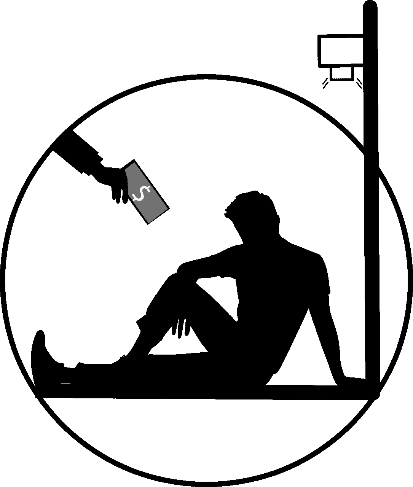
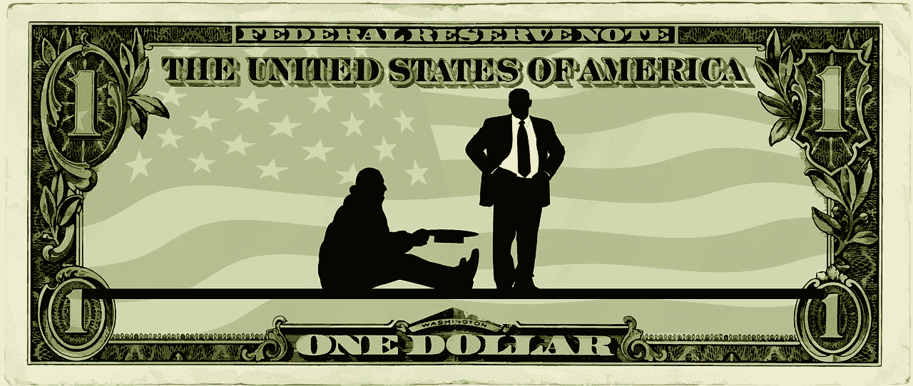
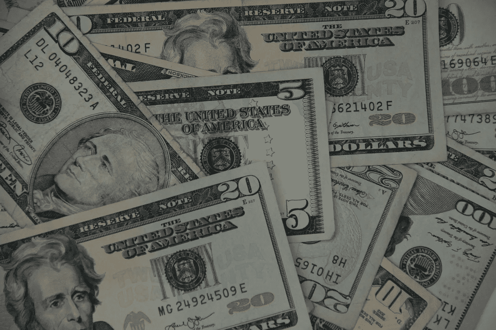
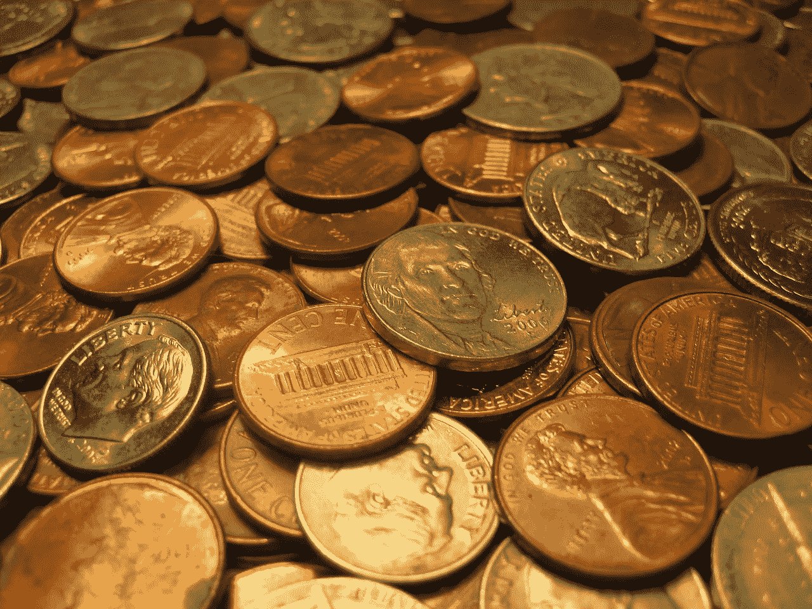
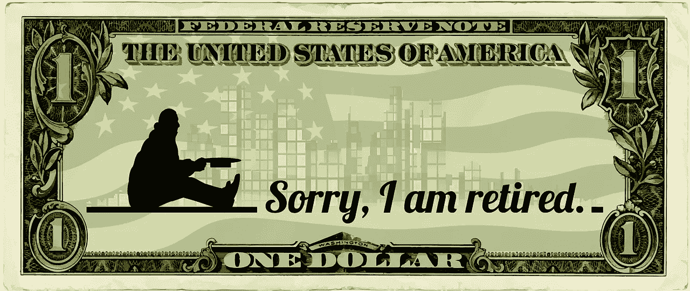

# 基本收入的优势

> 原文：<https://medium.datadriveninvestor.com/advantages-to-basic-income-41f39f224b33?source=collection_archive---------9----------------------->

基本收入有很大的优势，这使得这种制度在美国不可避免。

事实上，这些优势正是民主党总统候选人喜欢[杨安泽](https://marketmadhouse.com/whats-wrong-with-andrew-yangs-basic-income-scheme/) (D-New York)的原因；和美国参议员[卡玛拉·哈里斯](https://marketmadhouse.com/democrat-presidential-front-runner-embraces-basic-income/) (D-California)，正在提议基本收入计划。因此，那些认为基本收入是一个疯狂的想法或希望它消失的人将会失望。

基本收入因其固有的优势而得以保留。此外，我认为在美国和大多数国家，某种形式的国民基本收入是不可避免的。

# 基本收入的优势包括:

## 基本收入将很快到达那些需要它的人手中。所有政府需要做的就是支付现金给人民，这是山姆大叔非常擅长的。

## 我们可以很快实现基本收入我们需要做的就是开始寄钱。

 [## 不管准备好了没有，革命就在我们面前——数据驱动的投资者

### “对于技术如何影响我们的生活和重塑经济，我们必须形成全面的全球共识……

www.datadriveninvestor.com](https://www.datadriveninvestor.com/2019/02/12/ready-or-not-the-revolution-is-upon-us/) 

## 基本收入会刺激经济，因为它会让普通人有更多的钱花在大街上。

## 基本收入不需要额外的基础设施，因为它可以通过现有的项目支付，如社会保障或退税。

## 基本收入不需要额外的官僚机构。相反，它可以通过银行系统或 PayPal 等数字钱包支付。那些没有银行账户或智能手机的人可以用预装的 Visa 或万事达借记卡支付。

## 会计和官僚监督成本将是最小的，因为这是唯一涉及到分配金钱的活动。

## 基本收入可以与那些目前没有获得资本主义和技术的人分享这些好处。

## 基本收入的好处很快就能感受到。相比之下，传统的解决方案，如减税、公共工程、额外的政府工作和失业工人的再教育，可能需要几年或几十年才能产生效果。

## 那些需要钱的人很快就会拿到钱。

## 基本收入通过减少对官僚机构的需求和增加普通人的选择来增加自由。例如，基本收入领取者可以决定在哪里花钱和买什么。

## 基本收入可以作为对奴役的赔偿；和其他针对非裔美国人的罪行，却不惩罚白人。其实大部分白人；许多白人民族主义者喜欢基本收入，因为他们也会收到。

## 基本收入可以达到传统政府计划无法达到的水平。这包括农村白人、郊区穷人、农村穷人、土著美国人、许多非洲裔美国人、中产阶级下层和工作穷人。

## 基本收入可以作为有工作的穷人和零工经济中的人的安全网。

## 基本收入可以在不增加官僚机构的情况下增加现有的项目，如社会保障。

## 基本收入可以代替养老金，因为大多数工人不再享有养老金。

## 基本收入可以将资本主义的利益重新分配给每个人，而不会限制企业的运营。

## 通过将华尔街和大型科技公司的钱重新分配给每个人，基本收入可以限制反科技激进分子和偏执狂的吸引力。

## 通过让资本主义为所有人买单，基本收入可以限制社会主义者、马克思主义者、法西斯主义者、共产主义者、卢德分子、反犹分子、种族主义者、民族主义者、文化保守主义者、宗教狂热分子和其他反资本主义激进分子的吸引力。

## 像加密货币这样的新技术可以让以极低成本或零成本向每个人分配基本收入成为可能。

## 基本收入可以减轻收入不平等的影响，防止社会动荡。

## 与再教育相比，基本收入可以更快、更有效地缓解技术失业的影响。

## 例如，基本收入将帮助一位 50 岁的失业卡车司机或秘书。另一方面，正如杨安泽向乔·罗根正确指出的那样，重新培训一名 52 岁的卡车司机或秘书编写计算机代码是一种幻想。

基本收入因其优势而得以保留。每个人都需要了解基本收入，因为这是我们政治中的下一个大问题。