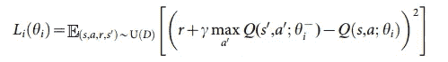
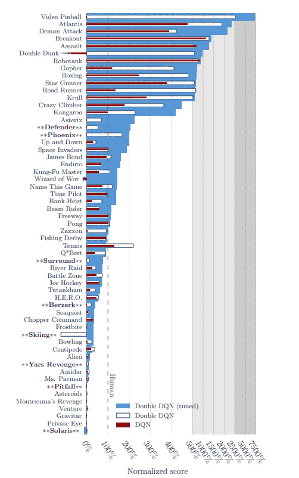
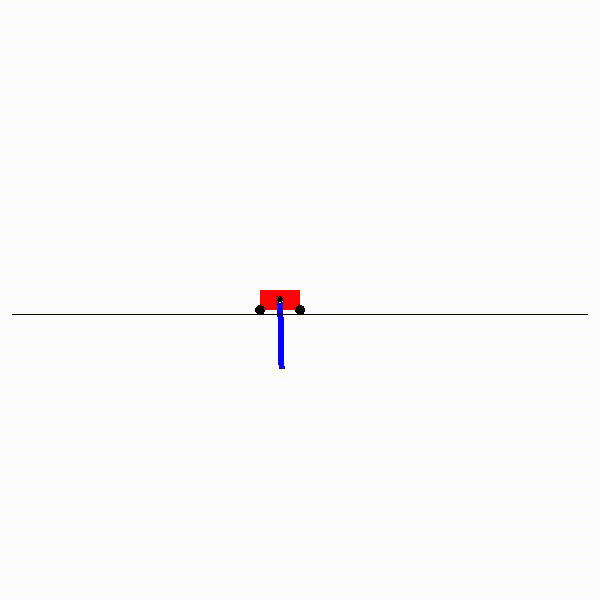
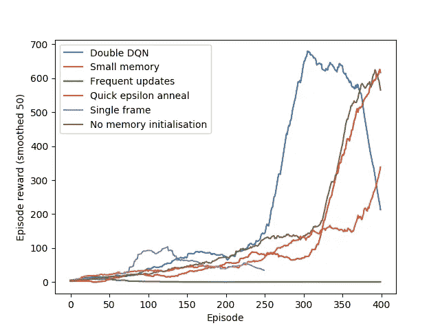

# 强化学习历险记 2:DQN

> 原文：<https://medium.datadriveninvestor.com/adventures-in-reinforcement-learning-ii-dqn-9673e4349516?source=collection_archive---------2----------------------->

在上一期文章中，我列出了进行强化学习课程的计划，并在此过程中实现了几个明确的算法。我们实现了一个基本的搜索算法，它很容易找到一个能够解决 CartPole 环境的神经网络。

在本帖中，我们将实现一个*深度 Q 网络* (DQN)和*双深度 Q 网络*(双 DQN)*。正如我们上次解决 CartPole 一样，在同样的挑战中应用一个复杂得多的模型几乎没有什么好处:我们通过在定制的 *CartPoleSwingUp* 环境中工作来加快事情的进展。

[](https://www.datadriveninvestor.com/2019/01/23/deep-learning-explained-in-7-steps/) [## 深度学习用 7 个步骤解释-更新|数据驱动的投资者

### 在深度学习的帮助下，自动驾驶汽车、Alexa、医学成像-小工具正在我们周围变得超级智能…

www.datadriveninvestor.com](https://www.datadriveninvestor.com/2019/01/23/deep-learning-explained-in-7-steps/) 

为了确保我以一种可管理的方式学习强化学习，我决定首先实现一个版本的 DQN，它直接将状态信息作为输入。完整的 DQN 模型——从视觉信息中学习玩雅达利游戏——将在以后的文章中介绍。

我们将利用自动微分和 GPU 优化，在 PyTorch 中实现 DQN，可能还有所有未来的工作。

[此处提供代码。](https://github.com/TTitcombe/DQN)

# DQN —基础知识

让我们先来简单了解一下 DQN 背后的理论。

[深度 Q 网络于 2014 年](https://storage.googleapis.com/deepmind-media/dqn/DQNNaturePaper.pdf)首次发布，将经典 Q 网络扩展到深度学习时代。

q 值代表在状态 *s* 下做出动作 *a* 后可以给予的最大奖励。

dqn 使用深度神经网络直接从状态信息估计 Q 值*。该模型为每个动作输出一个 Q 值，我们选择给出最高 Q 值的动作，以便在环境中执行得最好。*

该模型通过计算我们的未来回报和模型在给定状态下预期的回报之间的损失来学习。



*s* 是初始状态， *a* 是执行的动作， *r* 是收到的奖励， *s`* 是下一个状态， *gamma* 是折扣因子(通常为 0.99)。

为了鼓励探索，我们使用*ε-贪婪*策略来选择行动；在每一步，我们生成一个随机数，如果它小于ε值，我们采取随机行动，否则，我们从模型中采取行动。ε从 1(保证随机性)开始，并在若干帧上线性退火到一个小值。

这项工作成功的一个关键因素不是深层网络，而是使用了一种*重放记忆*:从过去的行动中取样，并在这些历史状态上训练模型。重放记忆在打破模型将从中学习的高度依赖的体验方面是至关重要的。如果没有重放记忆，模型将永远不会重新评估过去的状态，并将陷入局部最小值。

DQN 引入的第二个重要的修改是使用一个*目标模型*来计算目标值，并且每隔 *C* 帧用主模型的权重更新目标模型。让目标模型滞后会降低目标和 Q 值之间的相关性。

DQN 是一个*无模型*算法，因为它没有被提供任何关于状态间转换的信息——它必须自己学习。

# DQN——实施

*注:代码已改编为介质；完整代码参见*[*GitHub repo*](https://github.com/TTitcombe/DQN)

基本网络是一个简单的前馈神经网络(记住，在这个阶段，我们只接受状态信息，而不是环境的渲染帧作为输入)。DQN 的论文对所有 Atari 任务使用相同的超参数和模型，这表明算法有一定程度的鲁棒性，使得模型的确切格式不重要。

```
import torch.nn as nn
import torch.nn.functional as Fclass DQN(nn.Module):
    def __init__(num_inputs, num_actions):
        super().__init__()
        self.linear1 = nn.Linear(num_inputs, 128)
        self.linear2 = nn.Linear(128, 256)
        self.linear3 = nn.Linear(256, 64)
        self.linear4 = nn.Linear(64, num_actions) def forward(self, x):
        x = F.relu(self.linear1(x))
        x = F.relu(self.linear2(x))
        x = F.relu(self.linear3(x))
        return self.linear4(x)
```

我们从这个 PyTorch 实现中改编了重放内存。我们使用一个*队列*来轻松创建一个滚动的记忆窗口。

```
from collections import deque, namedtupleTransition **=** namedtuple('Transition',
                        ('state', 'action', 'next_state', 'reward'))class ReplayMemory:

    def __init__(self, capacity):
        self**.**capacity **=** capacity
        self**.**memory **=** deque(maxlen=capacity)def update(self, *****args):
        self.memory.append(Transition(*args))

    def sample(self, batch_size):
        return random**.**sample(self**.**memory, batch_size)

    def __len__(self):
        return len(self**.**memory)
```

我们在每一步使用线性退火的ε贪婪策略从我们的模型中选择一个动作，并用我们的观察更新重放记忆。注意，当我们调用`step`时，我们对环境应用了一个包装器来将 4 个帧堆叠在一起。

```
import random
import torchfrom cartpoleswingup import CartPoleSwingUpEnvSKIP_N = 4  # We feed four frames into the model togethereps_max = 1.0
eps_min = 0.1
eps_frames = 10_000
eps = lambda x: max(0.1, eps_max - x*(eps_max-eps_min)/eps_frames)memory = ReplayMemory(10_000)
model = DQN(4 * SKIP_N, 2)env = CartPoleSwingUpEnv()
state = env.reset()
is_done = True
frame = 0while not is_done:
    if random.random() < eps(frame):
        action = env.action_space.sample()  # choose randomly
    else:
        with torch.no_grad():
            action = model(state).max(1)[1].item() next_state, reward, is_done, _ = env.step(action)
    memory.update(state, action, reward, next_state)
```

`max(1)`返回沿第一轴的最大元素，`[1]`返回火炬张量的第一个元素:最大元素的索引。

将这段代码扩展为在连续帧数的循环中运行是微不足道的。

DQN 的最后一步是在每一步之后根据过去的经验训练模型。

```
def update_model(model, target_model, memory):
    # Get a sample of Transitions
    samples = memory.sample(32)
    # Turn it into a Transition of samples
    samples = Transition(*zip(*samples)) # Get rewards    
    rewards = torch.cat(samples.reward) # Find indices of non-final states
    non_terminal_indices = torch.tensor(tuple(map(lambda s: s is not      None, samples.next_state))) # Get the non-final states
    next_states = torch.cat([ns for ns in samples.next_state if ns is not None]) # Get highest Q values of next states
    max_q = target_model(next_states).max(1)[0].detach()    # Targets are rewards + Q values (for non-final states)
    additional_qs = torch.zeros(32)
    additional_qs[non_terminal_indices] = max_q
    y = rewards + additional_qs.unsqueeze(1) * gamma
```

# 双 DQN —基础

在 DQN 之后不久发表的 Double DQNs 试图最小化由目标值中的 max 算子引起的高估 Q 值的问题。

双 DQN 对目标值进行了非常简单的更改:


请注意，我们使用主模型来选择最佳行动，然后使用目标模型来评估回报。动作和价值的这种分离导致价值估计误差的显著减少。

实现一个微小的变化就能显著提高性能！



van Hasselt, Guez, Silver (2015)

# CartPoleSwingUp

如前所述，我们将在 CartPoleSwingUp 环境中尝试我们的双 DQN，CartPole 的老大哥稍微复杂一些。在*摆起*中，杆子从挂在车上开始。代理人必须移动手推车，将竿子摆到直立位置，然后像横竿一样保持平衡。

这个环境不包括在 gym 中，所以我们必须使用自定义实现。我[创作了一个版本](https://github.com/TTitcombe/CartPoleSwingUp)，改编自[哈德曼鲁的](https://github.com/hardmaru/estool/blob/master/custom_envs/cartpole_swingup.py)(改编自[这个版本](https://github.com/zuoxingdong/DeepPILCO/blob/master/cartpole_swingup.py))，它被赋予了与 DQN 兼容所必需的离散动作空间。我还修改了奖励函数，只在杆子与地面垂直 60 度以内时产生正的奖励，并产生稀疏的奖励，以允许奖励削波；这些变化还消除了购物车位置对奖励的依赖，从而释放了对解决方案的约束。

# 结果

我们在 CartPoleSwingUp 环境中运行双 DQN，滑动重放内存包含 10000 个内存，使用贪婪的 epsilon 策略，其中 epsilon 在 10000 帧内从 1 线性退火到 0.1，并每 1000 帧更新一次目标模型。大约 50，000 帧后，我们几乎掌握了环境，如下图所示。



即使没有 GPU，这个模型也不需要很长时间来训练，这证明了与使用丰富的图像信息相比，直接访问轻量级状态空间的好处。

在训练时，我试图让超参数尽可能接近原始论文的超参数，但根据 CartPoleSwingUp 环境的相对复杂性，缩放与帧号相关的值，如 epsilon anneal。

原始论文没有详细说明这些值是如何选择的:它只是指出它们在整个实验中保持不变，显示了这些值对环境细节的稳健性。

我对各种超参数的相对重要性进行了快速的调查，通过改变:记忆容量；退火的帧数ε；退火ε的方法；和目标模型更新之间的帧数。我还移除了内存初始化，并运行了一个没有跳帧的实验。

下图显示了剧集奖励(在 50 集内平滑)与剧集编号的关系:



这个图最显著的特点是，如果我们保持模型不断更新目标模型(“频繁更新”，绿线)，学习会出现灾难性的失败。保持目标与模型不相关显然是 DQN 成功的关键因素。

不出所料，只使用单帧信息(“单帧”，紫线)也产生不良结果:没有历史，模型不可能学习动量的概念，这对于将杆子摆动到直立位置至关重要。你在第 100 集左右看到的局部最大值很可能来自于模型学习总是向一个方向发射:如果它做得足够快，杆子只会升得足够高以获得一个小分数。

此图还展示了内存如何促成成功的模型(“小内存”，橙色线)。重要的是，因为 CartPoleSwingUp 是一个更简单的环境，它比 Atari 代理需要更少的内存来捕获状态空间；因此，随着环境复杂性的增加，内存容量变得更加重要。

# 后续步骤

与上一篇文章相比，这是一个很大的进步——我们在这里实现的东西激发了现代人对强化学习的兴趣。

令人欣慰的是发现代码并不太难实现:几篇关于 DQN 的论文简洁明了地解释了你需要的一切。困难在于找到导致稳定的——或者至少是可接受的——解决方案的训练参数。

随着我们面对越来越复杂的环境/挑战，培训代理将很快变得非常重要。现在，我们还不错，但是在我们处理 Atari 游戏的时候，我们必须在训练过程中提高效率。

在下一篇文章中，我们将在 Atari 环境中实现决斗 DQN (DDQN)和优先体验重放(PER)——试图复制 DQN 论文的结果！