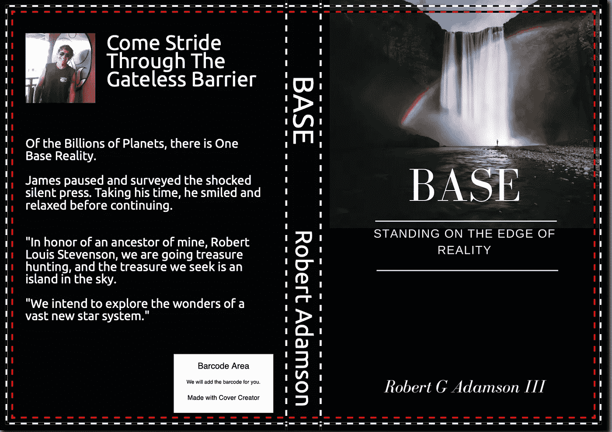
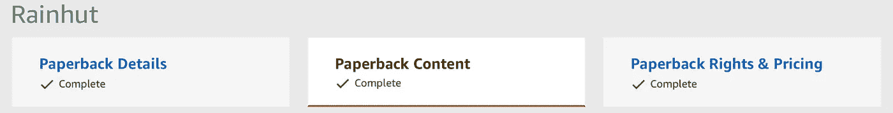
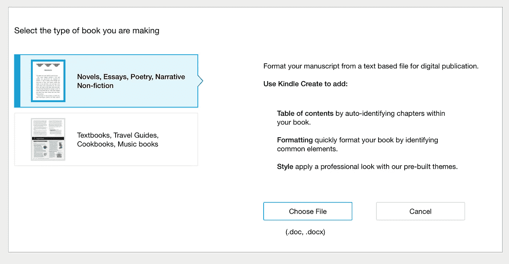
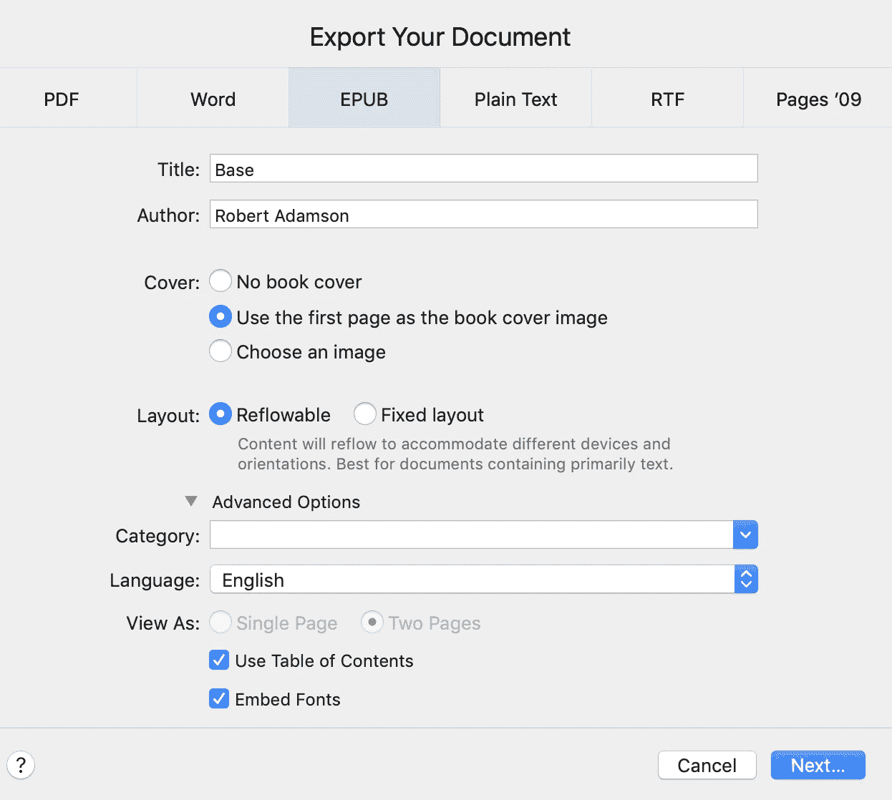
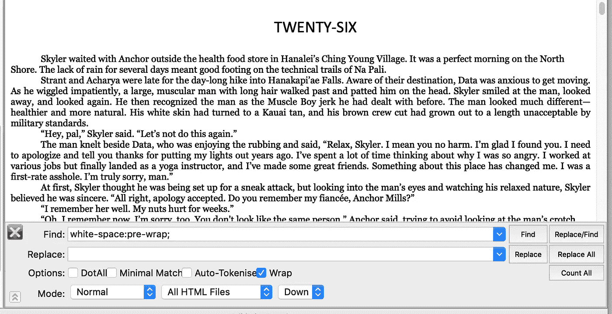
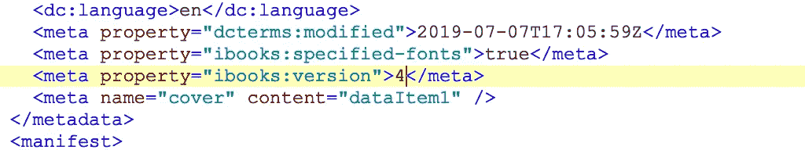
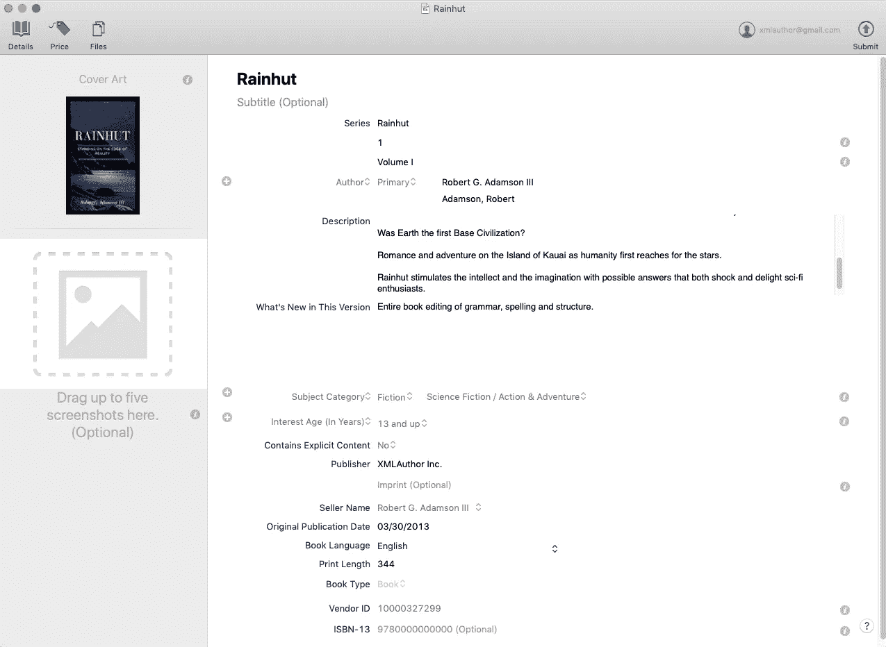

# 自助出版的艺术

> 原文：<https://medium.datadriveninvestor.com/adventures-in-self-publishing-ae0ab5dfb097?source=collection_archive---------4----------------------->

马克·维克多·汉森写了《心灵鸡汤》——这本书让他赚了数百万美元，并衍生出无数的副产品。他的书被拒绝了 140 次。尽管如此，马克拒绝接受拒绝。

幸运的是，今天你可以自助出版。你会想要创建一个格式良好的手稿，并准备在亚马逊 Kindle、亚马逊平装本、苹果图书、谷歌 Play 和许多其他网站上发布。好消息是纸质书和电子书的自助出版都是免费的。坏消息是，解决方案无处不在。

你用口语写一份手稿。然后你想创建一个电子书文档。通用电子书是一个。ePub 文件。但是现在有两个版本:ePub2 和 ePub3。

亚马逊有一款名为 [Kindle Create](https://www.amazon.com/Kindle-Create/b?ie=UTF8&node=18292298011) 的产品，支持导入 Word 文档。Kindle Create 的问题是输出是专有的。它创建了一个 KPF 文件发布到亚马逊 Kindle Direct。你也可以选择在他们的网站上发布关于 KDP 的内容。网上出版是从你的平装书开始的好地方。

苹果有三个制作 ePub 文件的工具:Pages 和 [iBooks Author](https://www.apple.com/ibooks-author/) 用于编辑，iTunes Producer[用于发布你的文档。iBooks Author 生成的 ePub3 文件可能已经过时，它生成的 ePub 将 Word 中的章节都集中到了一起。因此，请坚持使用新页面将 Doc 文件转换为 ePub。只需打开你的书在网页和出口。这很容易，而且做得很好。](https://www.apple.com/ibooks-author/)

一些网站会把你的文字手稿拿到网上生成电子书。他们还会为您向多个分销商发布。您需要查看的两个是 [Draft2Digital](https://www.draft2digital.com) 和 [SmashWords](https://www.smashwords.com) 。

但同样，问题是他们从你的手稿中产生的最终电子书很好，但很有限。不过他们确实有一些不错的排版设计可供选择。

你想知道的另一个工具是 [Sigil](https://www.techspot.com/downloads/5797-sigil.html) 。Sigil 是一个开源的 ePub 编辑器。这个工具可以让你接触到 ePub 的内部。

众多的发布工具和策略令人困惑。但是这里有一些解决方案和想法**(1–10)**是我在出版我的第一本书时发现的。然后我会跟进一些很酷的提示。

**一——我用 MS Word** 写了最初的手稿。我建议获取最新版本。我用了单词语法检查器，但发现完全没有，所以我拿了一本[语法](https://app.grammarly.com)。除非你是弗吉尼亚·伍尔夫的后代，否则你应该让你的电脑帮忙。Grammarly 是我发现的最好的语法检查工具。

在 Word for Windows 上，语法上直接插入。但在 Word for Mac 上却不是这样。Grammarly 的人指责史蒂夫·乔布斯让 Mac 单词的语法检查变得不可能。奇怪的是，苹果没有写 Word。无论如何，在苹果电脑上，现在你必须从 Word 复制到 Grammarly 的应用程序，然后再复制回来。

**二——在** [**上注册账户【KDP (Kindle 直出版)**](https://kdp.amazon.com/en_US) 。获得一个帐户是免费的。Kindle 是最好的起点，因为他们拥有 80%的自助出版市场。

**三—** **先建立你的亚马逊平装本**。稍后我会向你展示如何从这份原稿生成 Kindle 和电子书。查看此处的文档后，在亚马逊 KDP 上找到一个 Word 模板。我用所有亚马逊能接受的必要规范折磨自己之后，发现了这些模板。

第四，你需要一个封面。KDP 封面制作人并不伟大。它在字体和设计上受到限制。但是有一个 KDP 封面模板可以接受你自己导入的封面。Canva 是设计封面的绝佳地点。我从 [Pexels](http://pexels.com) 抓取了一张免费的封面照片，并与 Canva 一起使用。接下来，下载 PDF 格式的 Canva 封面，用 Photoshop 把它转换成 JPG，上传到 KDP 封面制作公司。你可能想为封面聘请一名设计师，但迄今为止，我得到的免费结果是这样的:

我应该指出，您需要根据您从 KDP 模板中选择的手稿本纸张尺寸来检查正面图像尺寸的规格。然后在 photoshop 中使用这些尺寸来调整 Canva 封面。

五——在 KDP 出版有三个步骤。这些步骤如下所示:

这些步骤很简单。在选项卡 1 上填写您的详细信息，在选项卡 2 上上传您的 Word 手稿并制作封面，然后在选项卡 3 上设置您的定价。最后一步有点棘手。当我得到一个定价错误，说我不能出版，因为我需要修复突出显示的错误时，我很兴奋终于可以出版我的书了。但是当然，就我的运气而言，没有突出的错误。

我注意到每个国家都把我的美元价格转换成了他们的货币。这很方便，但如果你仔细看，每个国家都有最低价格。我的日本价格低于他们的最低价格。所以我提高了他们的价格，书出版了。在没有任何解释的情况下处理 bug 总是很有趣。

六点——现在是时候制作你的数字 Kindle 电子书了。让我们使用 [Kindle Create](https://kdp.amazon.com/en_US/help/topic/GHU4YEWXQGNLU94T) 将 Word 原稿转换成 Kindle 电子书。首次启动 Create 时，系统会要求您选择一个 Word DOC 或 DOCX 文件。

转换后，您有机会自定义您的目录。目录对于电子书来说很重要。使用 Create 应用程序并对 Kindle 图书进行调整很有趣。甚至有一个预览可以帮助你看到这本书在移动设备上的样子。

最后，当您发布时，Create 会生成一个用于上传的. KPF 文件。参见第二个选项卡-在线内容选项卡。KDP 允许你出版 Kindle 版本和平装版。这两种书都有如上所示的三个步骤标签。

稍后我会告诉你几乎在任何地方都使用的通用 ePub 格式，所以不要太依赖 Kindle Create。不过，创造是一个很好的起点。

**七——别忘了苹果**。这些电子书可以在你所有的苹果设备和电脑上阅读。他们是苹果大市场的一部分，所以你想去那里。

正如我提到的，苹果有一个类似于 Kindle Create 的产品，叫做 iBooks Author。这款免费应用可以导入 Word 文档，并准备发布到 iTunes。但是将 Word doc 直接导入 IBooks Author 是非常奇怪的。如果您导入到 ePub 模板中，您的章节会聚集在一起。您希望每一章都有自己的 XHTML 文件。

进入新的 Pages 应用。Pages 现在允许您导入 Word 文稿、创建目录、进行修改以及导出电子书以发布到 iTunes Connect 或任何其他地方。所以，现在，这是我们的解决方案。

但是苹果的页面在导出到 ePub 的时候有一个问题。如果你在网上搜索，你会发现一些作家抱怨 Pages 导出的 ePubs 每段之间都有一个空行。如果你决定缩进每个段落的第一行，就像大多数书一样，那么这是一个多余的新段落通知，也是对空间的极大浪费。

所以让我们用 Sigil 来解决这个问题。记住，Sigil 是 ePubs 的低级编辑。

用 Sigil 打开你生成的 ePub 页面，四处看看。然后，如果您双击 content.opf 文件，您会看到 Pages 生成了 3.0 版的 ePub。另外，看看字体部分。如果您在文稿中使用了任何非标准字体，Pages 会自动将这些字体嵌入到 ePub 中。现在，任何浏览电子书的人都会看到使用完全相同字体的文本。

这一切都很棒，Pages 似乎是最终的 ePub 生成器。但是现在在你的 xhtml 文件(你的章节)中寻找“空白:预换行；这是罪魁祸首。你要做的是在每一章中用空来代替它。

在 Sigil 中，你可以对所有的 xhtml 文件进行全局修改。请看下面我用来解决这个讨厌问题的快照。通过查找和替换空白:预换行；什么都不用，你可以看到所有段落之间的空行都将被删除。

**八——向苹果发布你的电子书的时间到了**。[为 Apple Books 创建一个 iTunes Connect 账户](https://itunesconnect.apple.com/WebObjects/iTunesConnect.woa/wa/bookSignup)。如果您是应用程序开发人员，当您登录时，您将不会在 iTunes Connect 门户中找到任何图书。这是因为您需要仅为图书创建单独的 Itunes Connect 帐户。你必须为书籍和应用程序使用不同的电子邮件地址。在我看来，这很令人困惑，但没人在乎我们这些开发者怎么想。

一旦你有了 iTunes Connect 帐户，你就可以简单地登录并上传你的电子书。epub)，就像在亚马逊上一样，对吗？**错了！要将您的电子书发布到 iTunes Connect，您需要一个名为 [iTunes Producer](https://itunespartner.apple.com/en/books/tools) 的特殊应用程序。我没开玩笑。无论如何，这个应用程序将接受您从 Pages 导出的电子书，并将其发布到 iTunes Connect。**

*   **更新**最新的 Pages 现在允许您使用云帐户直接发布到 iTunes Connect，但您应该导出到 ePub，以便您可以在任何地方发布同一本书。

再来一招。Itunes 要求您维护 ePubs 的版本号。如果您尝试使用 iTunes Producer 重新发布图书，您会收到一条错误消息，提示此版本已经发布。

使用 Sigil 也可以解决这个问题。打开 *content.opf* 文件。然后寻找 ibooks.version 标签。简单地用 Sigil 更新它。请看下面的快照，我把 epub ibook 的版本升级到了 4。

Using Sigil to change ibooks version number

有趣的是，iTunes Producer 也有三个类似于亚马逊 KDP 的选项卡:详细信息、价格和文件。但在这里，你上传你的封面图片细节，你上传你的电子书在文件标签。这是制片人的快照。

….更多有用的信息…

**ISDN** (国际标准书号)

在出版之前，你需要一个 ISDN。你的书的每个平装本和数字版都需要一个唯一的 ISDN 号码。在美国，只有一家合法的 ISDNs 分销商。 [Bowker](http://www.bowker.com) 是 ISDNs 的独家供应商。

他们有销售 ISDNs 的网站 [MyIdentifiers](http://www.myidentifiers.com) 。
一些团体从 Bowker 批量购买，然后以比 Bowker 更好的价格转售。您可以在售后市场购买这些号码，但您无法证明自己是发行者。这意味着你将需要为每个经销商，如亚马逊，苹果，谷歌，Barns & Noble，提供不同的 ISDN。

我决定从 Bowker 购买一批 ISDNs，这样我的平装书和数字书就各有一个标识符，不管这本书在哪里发行。

**九— EPUB 汇总**。如果您想要一个构建电子书的通用解决方案，请生成一个 EPUB 文件。将 EPUBs 上传到任何地方，包括亚马逊、谷歌和苹果。我推荐的生成和编辑 EPUB 文件的网站和 app 有 [Draft2Digital](http://www.draft2digital.com) 、 [SmashWords](https://www.smashwords.com) 、Pages 和 [Sigil](https://www.techspot.com/downloads/5797-sigil.html) 。

SmashWords 是世界上最大的非亚马逊电子书分销商。

同样，一些网站专门帮助你自助出版。我找到的一个不错的就是 [Draft2Digital](http://www.draft2digital.com) 。D2D 提供免费的转换工具，可以把你的原始 Word 文档转换成 EPUB2 文件。他们甚至会把你的书推向不同的渠道，比如亚马逊和苹果，收取大约 10%的 rev 分成。您可以选择希望他们发布的渠道。他们的诀窍是生成 EPUB2 文件。你可以免费下载他们生成的文件。

我用的是草稿的免费转换工具，因为它可以自动处理像在每个新章节上放置首字下沉这样的事情。他们的**免费工具**可以在不使用发行伙伴关系的情况下获得。

**十—嵌入字体**。字体嵌入将使您超越标准字体，在出版物中使用您想要的任何字体。嵌入对于儿童书籍或任何可以使用各种文本设计的书籍来说都是极好的。自定义字体是大幅提高电子书质量的简单方法。

不过，发布到 Apple Books 时有一个问题。Apple 要求 EPUB3 文件格式和 content.opf 文件中的唯一标签:

真

有一款叫做 [Jutoh](http://www.jutoh.com) 的产品非常适合制作 EPUB3 书籍。然而，与 Draft2Digital 不同，Jutoh 并不是免费的。

我喜欢名为 [Sigil](https://www.techspot.com/downloads/5797-sigil.html) 的开源 EPUB 编辑器。我用它来调整 EPUB 的内部。它可以与 EPUB2 和 EPUB3 一起使用。您可以使用 Draft2Digital 或 Jutoh 生成 EPUB2 或 EPUB3，然后使用 Sigil 编辑 EPUB。这里有一个窍门。Jutoh 有免费试用版，输出可以用 Sigil 编辑，去掉他们的水印。但如果你喜欢这个应用，它有有用的设计功能，价格也很合理。

亚马逊 Kindle 和 Google Play 接受 EPUB2 中的嵌入式字体；目前只有苹果要求 EPUB3 进行字体嵌入。

使用 Sigil 嵌入字体非常简单。在 Sigil 中打开 ePub。在 Sigil 文件浏览器的左侧，有一个名为 Fonts 的文件夹。从顶部菜单中，选择文件/添加/现有文件。这将把字体添加到 ePub Fonts 文件夹中，并将字体包含在 ePub 清单中。现在，您可以使用您的自定义字体，并确保任何最终用户都会看到完全相同的字体，因为您的自定义嵌入字体会像魔术一样显示或安装在最终用户的操作系统中。剩下的就是转到 ePub 使用的 CSS 文件，并在文档中使用新嵌入的字体。

**下面是如何使用嵌入式字体:**

如果您的 ePub 不包含 CSS 文件，请创建一个。

使用 Sigil 打开 CSS 文件。在 Styles 下查找 ePub 文档中使用的 CSS 文件。如果有多个 CSS 文件，请为要使用嵌入字体的页面选择一个。在 CSS 文件的顶部插入一个 [@font](http://twitter.com/font) -face 部分。例如:

[@ font](http://twitter.com/font)-face {
font-family:indie flower；
font-weight:正常；
字体样式:正常；
src: url(../Fonts/indie flower . OTF)；
}

定义字体之后，只需声明文档的哪些元素将使用新字体。如果您希望整本书都使用您的自定字体，请使用正文，如下例所示。这是标准的 HTML/CSS 字体使用。更多信息见[www.w3schools.com](http://www.w3schools.com)。

body
{
font-family:" indie flower . OTF "，serif
}

但是，如果您使用 Pages 或 iBooks Author，字体嵌入是自动的。选择您的操作系统和页面上安装的任何字体，只要是非标准字体，iBooks Author 都会为您嵌入到您的 ePub 中。

确保许可和专有自定义字体，并确保您的 ePub 图书是合法的。

**这里有一些关于字体嵌入的链接**

【https://ebookflightdeck.com/handbook/fonts 

[https://kobowritinglife . zendesk . com/HC/en-us/articles/115001092067-Embedding-Fonts-in-your-eBooks](https://kobowritinglife.zendesk.com/hc/en-us/articles/115001092067-Embedding-Fonts-in-your-eBooks)

[http://www.marraii.com/ebook-font-embedding/](http://www.marraii.com/ebook-font-embedding/)

[https://www . oreilly . com/library/view/epu b-3-best/9781449329129/ch04 . html](https://www.oreilly.com/library/view/epub-3-best/9781449329129/ch04.html)

[http://bbebooksthailand.com/blog/using-fonts-ebooks.html](http://bbebooksthailand.com/blog/using-fonts-ebooks.html)

[https://www . the book designer . com/2019/03/fun-with-fonts-getting-ebook-typefaces-right/](https://www.thebookdesigner.com/2019/03/fun-with-fonts-getting-ebook-typefaces-right/)

 [## 如何在电子书中嵌入自定义字体？

### 在嵌入自定义字体之前，请确保您已经获得了必要的字体许可证。一旦获得，请前往购买>…

acepub.com](https://acepub.com/how-to-embed-custom-fonts-in-ebooks/) 

# 技巧

*   写不止一本书。第一本书很难。事情变得容易了，你会进步的。我正在写另一本书，它非常有趣。
*   从一个出版商开始，然后再研究其他出版商。Kindle 是大头。他们拥有 80%的市场份额，所以亚马逊是一个很好的起点。
*   EPub 让你无处不在。仔细想想，ePub 只是一个盒子里的 HTML 网页。这不是必要的，但你可能想刷你的 HTML。此外，使用 Sigil 这样的应用程序进入你的 ePub。亚马逊和其他所有人都允许你上传你的 ePub 文件。在亚马逊上，人们可以购买你的书，并在他们的网络浏览器上阅读。
*   在亚马逊上，出版一本纸质书不需要任何成本。他们按需印刷，你得到更多的报酬。
*   用笔名自发布也可以。我没开玩笑。你想用什么名字都行。
*   探索电子邮件营销解决方案。有代销商可以帮你推销电子书并获得报酬。检查 [ActtiveCampaign](https://www.activecampaign.com) 和[convert kit](https://convertkit.com)。
*   在亚马逊上，让你的书更容易被搜索到。标题和副标题中最多可以使用 200 个字符。写一个很长的描述。
*   考虑用 Mix.com 来传播你的书。
*   [KDPRocket](https://kdprocket.com) 是选择关键词的有用工具。
*   因为你可以为你的书选择多达十个类别，所以选择一个模糊的类别，它会使你的书成为畅销书。我现在正在研究这个想法。
*   少担心篇幅，多关心内容——质量胜于数量。
*   参加一些写作方面的大师班。像丹·布朗这样的职业选手会泄露他们的秘密。
*   在你出版一本书后，你担心你可能会忘记你是如何做到的，写一篇文章，把你所有的笔记都写下来，告诉你如何自己出版。这个有个名字，但我忘了叫什么了。
*   T **ry 营销你的书**。我自己也需要用到这个提示。我骑车经过一条偏僻街道上卖柠檬水的几个孩子。他们没有买主，非常难过。后来我骑车经过一些孩子，他们在徒步旅行者经过的拐角处扎营。他们有一个装满现金的箱子。我在想我是否应该叫警察来保护他们。我知道这是一个教训。

# P个人结论

1.  在亚马逊 KDP 上选择一个模板，用 Word 写你的书，包括任何你想要的许可字体，因为 ePubs 支持字体嵌入。
2.  使用语法来编辑你的书。
3.  获得你自己的 ISDNs，即使它们是免费的或者一些出版商不需要。
4.  使用 Pages 将 Word 文档导出到 ePub3(向后兼容)。Pages 会自动将任何非标准字体嵌入您的 ePub。这样，最终用户将始终看到您在写书时使用的完全相同的字体。
5.  将新的 ePub 上传到亚马逊 KDP、Google Play、Apple Books(iTunes connect)、Draft2Digital、SmashWords 等。

[**……作者登陆页面……**](http://robadamson.net)

亚马逊有你应该建立的作者中心，但是你不允许指向你的书可以买到的其他地方。因此，拥有一个自己的基本登录页面是一个好主意，其中包含指向您的分销商的链接。我用 Wix 建了我的，但是不管你喜欢哪个建站者都可以建一个。参见[我的创作](http://www.robertgadamson.com)作品集网站的例子。

感谢阅读！

> "专业作家是不放弃的业余作家."
> 
> —理查德·巴赫