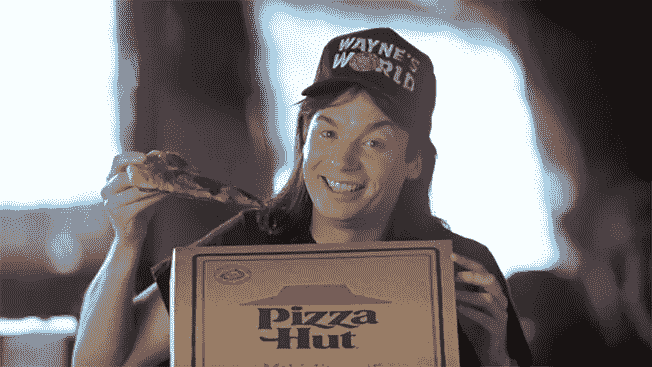
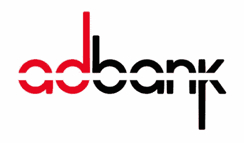
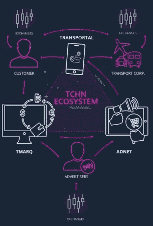

# 广告、旅游和区块链

> 原文：<https://medium.datadriveninvestor.com/advertising-travel-the-blockchain-b0e6f53560fe?source=collection_archive---------37----------------------->

当我们试图在电视上观看我们最喜欢的节目或电影时，广告是我们生活中的祸根。由于我们对广告公司的厌恶，它们会干扰、分散注意力，并迅速降低价值。电视上的普通节目或电影每小时会播放 15 到 25 分钟的广告(取决于你在哪个国家)。我的意思是，现在我们有多少人在看地面电视，如果我们看，我们会使用像 Tivos 这样的设备，它可以识别广告的开始和停止，并为我们过滤掉它们。像网飞和亚马逊以及其他付费订阅的选择为我们提供了一种新的观看方式，而不会给我们带来垃圾信息，更不用说那些非法下载无广告内容的人了。

我们都很熟悉在电影开始前冲到电影院，却被无关的广告轰炸，这些广告是关于本地产品和服务或即将上映的电影，我们至少在 20 分钟内没有兴趣。

多年来，公司被迫寻找其他方法来影响我们，包括潜意识广告、产品植入、网页上的弹出广告以及其他方式。

虽然有些人认为这些方法仍然有效，并提供良好的回报，但我们大多数人都不是那么容易上当受骗，在多年暴露于这些阴暗的策略后，他们的有效性正在消失。

广告商需要找到新的方式来接触他们的观众，而我们作为消费者需要一种激励来真正注意、观看他们或与他们互动。

区块链和符号化为许多新的和现有的行业和技术创造了新的激励，这些行业和技术可以吸引我们进行新水平的营销和广告互动。

我们已经看到分散平台通过营销提供激励和被动收益。一个新的社交媒体平台 Howdoo 就是其中之一。If 向其用户提供了阻止所有广告或显示特定类别广告的选项，以此获得代币作为回报。

然后是 [Adbank](https://adbank.network) ，它去除了中间人，增加了透明度，确保广告客户接触到他们的目标受众，而不是在线机器人。

还有其他新兴项目和技术利用了区块链的令牌化和透明性。我一直在研究的一个领域是旅游。在我看来，瞄准同意的观众的理想时机是他们在旅行的时候。坐在出租车上、火车上或飞机上；为什么不激励旅行者与广告互动，用代币奖励他们呢？这确保了广告公司吸引了消费者的注意力，并且消费者被奖励了代币，代币可以被持有、交易或用于支付旅行或娱乐。

观看和参与广告的选择权将掌握在消费者手中，这是理所当然的。

我发现的一个项目正计划提供这一点。Tachain 正在创建一个全面的旅游生态系统，允许旅行者计划他们的旅程，并通过出租车、公共交通和航空公司预订交通工具。除了提供有用的规划和管理工具，Tachain 还为旅行者提供了通过与广告互动来获得 TCHN 代币的机会。TCHN 代币可用于支付旅行费用或享受 Tachain 平台提供的娱乐活动。

使用智能合同，Tachain 正在创建一个生态系统，其中包括以下组件:

*   ***TRANSPORTA*** *L:消费者和旅游公司用来预订和管理旅行的 app。旅行者将有额外的优势，审查服务。*
*   ***TMARQ*** *:各方可以买卖 TCHN 代币的交易所。这包括消费者、司机、广告商、运输代理和运输公司本身。*
*   **:消费者用于观看广告并与之互动、参与营销活动和抽奖的平台，广告主将在此发布其广告和营销内容。**

**

*从 2018 年 10 月开始，Tachain 在菲律宾马尼拉向 3000 辆出租车介绍他们的平台，从而证明他们有一个可用的产品。*

*目前还不清楚 Tachain 是否计划与优步这样的公司合作或与之竞争，以及他们会对市场产生什么样的影响，但他们将区块链和符号化引入旅行这一事实肯定会引发争论，并进一步为区块链技术提供现实世界的用例。*

*更多信息，你可以访问他们的网站 https://tachain.io 或者加入他们的[电报组](https://t.me/Tachain_EN)。*

****免责声明:*** *本文纯属个人观点。我不认可我所写的任何公司或品牌。我使用它们只是为了演示，说明一个观点或作为一个例子。这不是财务或任何其他形式的建议。永远做你自己的研究。**