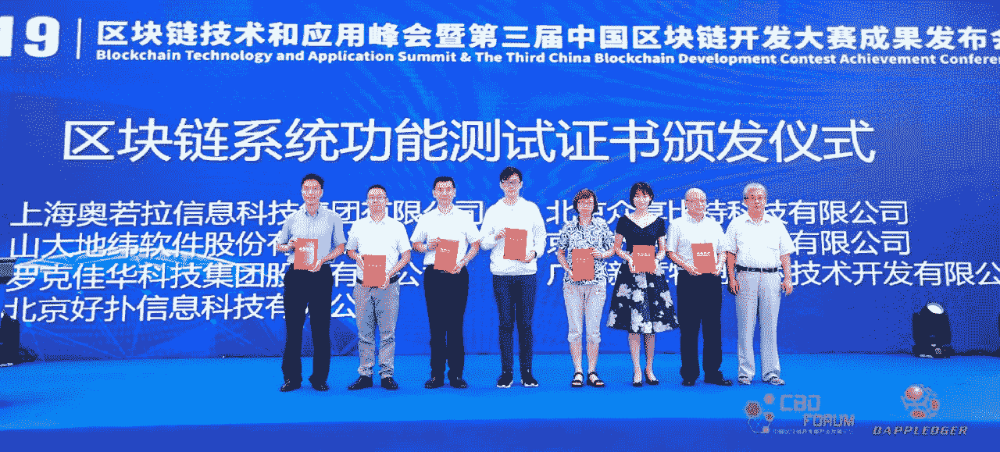
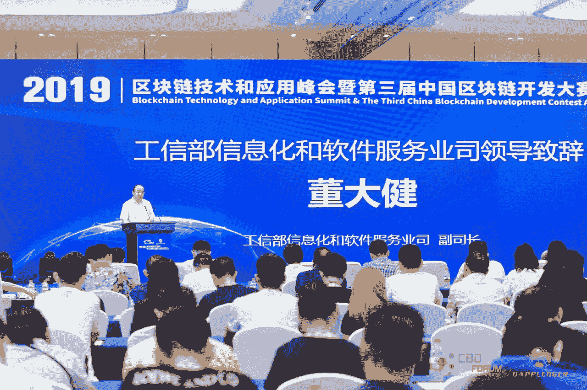

# Aelf 成为首家获得 CESI 认证的区块链组织！！

> 原文：<https://medium.datadriveninvestor.com/aelf-becomes-the-first-blockchain-focused-organisation-to-receive-certification-from-cesi-e4cc1a093280?source=collection_archive---------11----------------------->

中国电子标准化研究所(CESI)是工业和信息化部(MIIT)下属的主要智库之一。中国电子标准化研究所(简称 CESI)成立于 1963 年 7 月，是 MII 直属的非营利性机构。CESI 主要关注电子信息技术领域的标准化、合格评定和测量活动。

在过去的几年里，CESI 提出了一个愿景，在智能合同、隐私和存款方面引入三个区块链标准，以更好地指导该国区块链行业的发展。

 [## 十大区块链课程|数据驱动的投资者

### 渴望在区块链发展吗？你想知道区块链是如何工作的，但不知道在哪里？或者就是太多了…

www.datadriveninvestor.com](https://www.datadriveninvestor.com/2019/03/08/top-10-blockchain-courses/) 

在 2018 年的一次[采访](http://www.sohu.com/a/257892625_354973)中，CESI 研究室主任李矿业表示，这些标准将以协会为基础，而不是国家标准，国家标准将是国家和国际标准发展的基础。他补充说，到明年年底，CESI 将发布这些标准。

李采进一步指出

> “基本上，国内外都没有引进或实施过区块链标准。区块链的安全问题是一个需要首先解决的相对紧迫的问题。

从企业的角度来看，这一发展非常重要。它帮助世界各地的众多组织采用、整合并投资于政府认证的优质区块链项目，从而提高他们所经营业务的整体水平。

迄今为止，CESI 在全球范围内只认证了 30 个项目，包括联想和支付宝。

最近，在区块链的第一家创业公司中，Aelf 获得了这家著名政府机构的认证。

接受荣誉后，Aelf 的首席执行官和创始人马浩博说:

> “这项认证不仅显示了我们开发人员的质量和核心能力，也显示了我们区块链平台的质量和核心能力。它旨在满足大型企业对质量的严格要求，以确保它们能够以客户期望的性能运行。”

他还解释说，这种认证是其他政府应该注意到的，并用来帮助他们不断发展的监管解决方案。

# 关于自我

？lf 是一个分散的自我发展的云计算区块链网络，旨在为区块链的商业应用提供高性能平台。

为了建立满足各种商业需求的区块链基础设施，lf 提供了一个高效的多链并行处理系统，该系统具有跨链通信和自我进化的治理能力。它带来了四大创新:

1)计算机集群上的可扩展节点

2)并行处理，最大限度地利用处理能力

3)通过独立和专门的侧链实现智能合同的资源隔离

4)可运行的互操作性，以及从不同共识协议(dpo—native、PoW、PoS)和私有/公共链中进行选择的灵活性

*风险警告:始终谨记，交易数字资产涉及重大风险，并可能导致您投资资本的损失。你应该考虑你的经验水平、投资目标，并在必要时寻求独立的财务建议。*