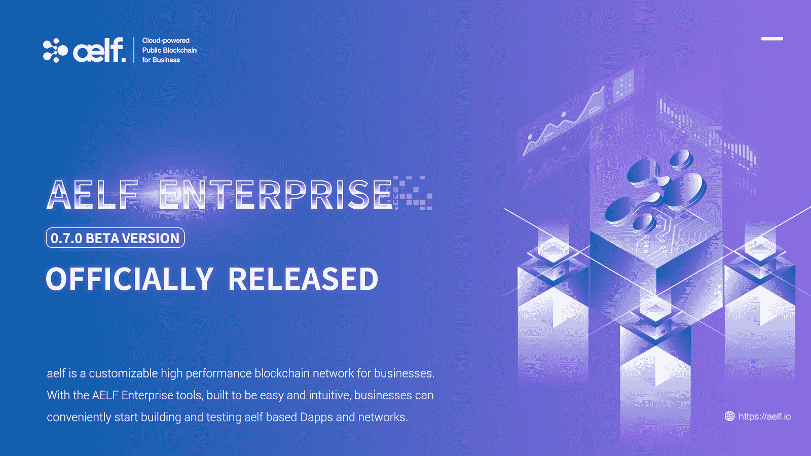

# Aelf 已经正式发布企业 Beta 0.7.0！！了解更多！！！

> 原文：<https://medium.datadriveninvestor.com/aelf-has-officially-released-enterprise-beta-0-7-0-learn-more-about-it-183c44f496f7?source=collection_archive---------8----------------------->

在密码世界里，大多数人关注的是代币价格的涨跌，这意味着大多数人完全忽略了发展的角度。对于一个项目来说，产品开发是最重要的组成部分，也是最不被重视的部分。持续改进、频繁升级、增加新功能、GitHub 活跃程度高等。，展示项目和团队逐月坚持他们承诺的路线图的承诺。

对我来说，从开发角度来看，最活跃的项目之一是 Aelf Blockchain。根据来自 [Santiment](https://santiment.net/blog/dev-activity-april-2019/) 的最新报告，Aelf 被评为 [GitHub](https://github.com/AElfProject/AElf) 活跃度最高的十大项目之一。

Aelf 最近通过 testnet v1.0 记录了 14968 TPS。Aelf testnet 是一个重要的里程碑，展示了 Aelf 在其 mainnet 发布前促进区块链商业采用的计划的进展，mainnet 将在未来几个月内分阶段发布。

 [## 数据驱动投资的兴起——数据驱动投资者

### 当 JCPenney 报告其 2015 年 2Q 的财务结果时，市场感到非常震惊。美国零售巨头…

www.datadriveninvestor.com](https://www.datadriveninvestor.com/2019/02/28/the-rise-of-data-driven-investing/) 

更进一步，4 月 30 日 aelf 正式发布了 Aelf Enterprise 0.7.0 Beta，号称“ ***为开发者量身定制的区块链的下一次进化”*** 。

aelf Enterprise 0.7.0 Beta 旨在满足区块链的所有需求。Enterprise 0.7.0 Beta 包括一个完全开发的区块链系统、开发套件、文档以及支持基础设施和服务。

**aelf 0.7.0 Beta 系统包括:**

1.自我企业

*   aelf 0.7.0 测试版
*   开发工具包 0.7.0 测试版

2.aelf 外部应用

*   aelf 区块链扫描仪 0.7.0 Beta
*   aelf 块浏览器 0.7.0 测试版
*   aelf 钱包 0.7.0 测试版
*   aelf JS SDK 3.0.0

3.aelf 浏览器扩展 0.7.0 测试版。

企业采用是目前缺少的最重要的加密领域之一。通过推出 aelf Enterprise 0.7.0，aelf 正在为区块链理工大学的大规模改编铺平道路。企业，一旦上船，强烈推动采用，以及它帮助更多的企业加入区块链的行列。

总而言之，最大的挑战是说服企业进行信仰的飞跃。除非产品质量可以与 IBM、Oracle、Azure 等相媲美，否则他们甚至不会考虑，因为这需要在人力和资金方面进行大量投资。由此可见，为了与这些大公司竞争，强调产品质量是多么重要

# 总结一下

> 企业版的主要目标是让开发者和企业能够轻松快捷地撰写智能合同——陈祝岭联合创始人 Aelf

如果你想对 aelf Enterprise 0.7.0 Beta 有更详细的技术观点，你可以在[这里](https://medium.com/aelfblockchain/aelf-enterprise-0-7-0-beta-officially-released-2a9c118b7ae1)阅读

# 结论

aelf Enterprise 0.7.0 Beta 是 aelf 的一个重大发展步骤，因为它为企业提供了一个全功能平台，企业可以在此基础上构建和测试 dApps。这也为他们提供了未来 Aelf 企业平台的第一手经验，该平台在设计时考虑到了部署企业解决方案。

# 关于自我

？lf 是一个分散的自我发展的云计算区块链网络，旨在为区块链的商业应用提供高性能平台。

为了建立满足各种商业需求的区块链基础设施，lf 提供了一个高效的多链并行处理系统，该系统具有跨链通信和自我进化的治理能力。它带来了 4 项关键创新:

1)计算机集群上的可扩展节点

2)并行处理，最大限度地利用处理能力

3)通过独立和专门的侧链实现智能合同的资源隔离

4)可运行的互操作性，以及从不同共识协议(dpo—native、PoW、PoS)和私有/公共链中进行选择的灵活性

*风险提示:我是 Aelf 的社区成员，对这个项目充满热情。我将不会收到同样的任何付款。请始终记住，交易数字资产涉及重大风险，可能会导致您投资资本的损失。你应该考虑你的经验水平、投资目标，并在必要时寻求独立的财务建议。*