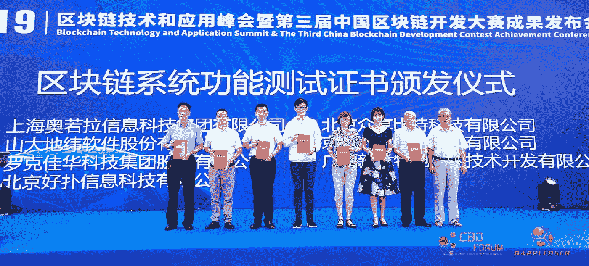
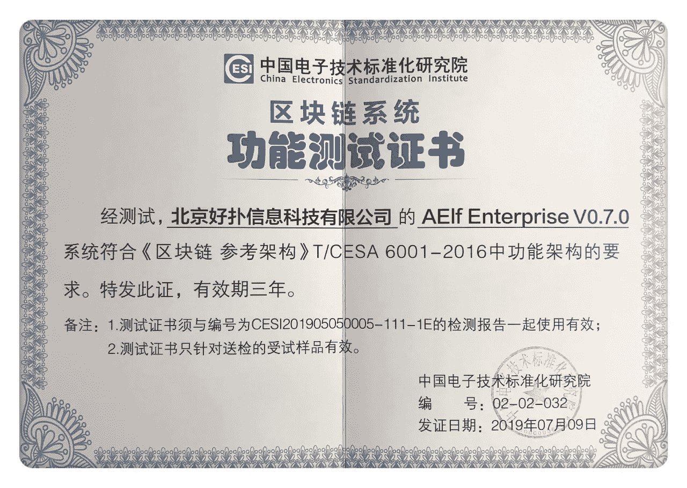
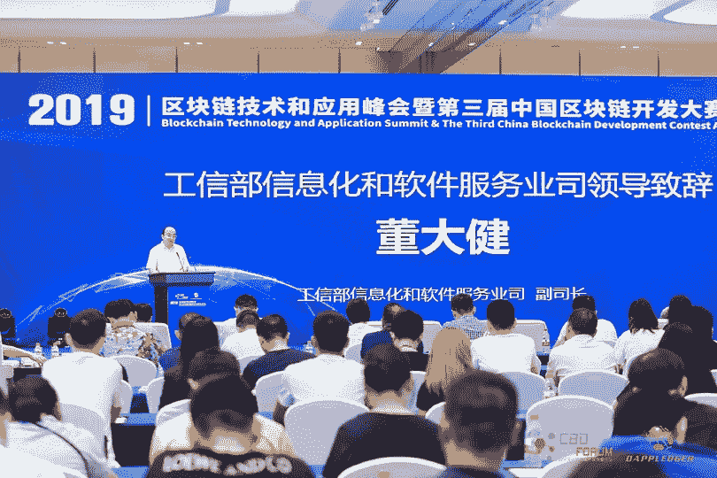
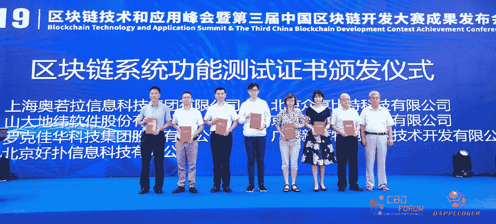

# Aelf 通过获得中国标准化协会证书加入联想和支付宝

> 原文：<https://medium.datadriveninvestor.com/aelf-joins-lenovo-and-alipay-by-receiving-the-chinese-standardized-institute-certificate-c2e9995a097d?source=collection_archive---------9----------------------->

## 继续他们最近的发展，通过获得中国政府颁发的标准化协会证书，Aelf 现在加入了一个非常精英的俱乐部。

***(声明:文章所表达的观点和看法仅属于作者，不一定反映 DDI 的立场。这篇文章无意成为投资建议。我们建议你通过多种渠道进行自己的独立研究。)***



当区块链科技在 2008 年登陆时，人们对它知之甚少。随着加密货币获得有意义的价值，它对比特币的服务吸引了公众的目光和政府。快进到 2019 年；政府正在努力监管一个主要是为了在没有中央控制点的情况下繁荣发展的系统。

在谷歌上快速搜索“政府和加密货币”，可以发现政府正在进行各种尝试来监管加密货币。对许多人来说，这甚至可能看起来像是政府反对区块链和加密货币。然而，由于政府试图控制分散的技术，法规正在制定中；同样的政府也在接受它们。

# 认证只留给最优秀的人

中国政府因其对加密货币的强硬立场而闻名。今年早些时候, [Wired](https://www.google.com/url?sa=t&rct=j&q=&esrc=s&source=web&cd=11&cad=rja&uact=8&ved=2ahUKEwjE2fOdw8rjAhUM3xoKHSF0AcIQFjAKegQIAhAB&url=https%3A%2F%2Fwww.wired.com%2Fstory%2Fchina-says-bitcoin-wasteful-wants-ban-mining%2F&usg=AOvVaw3lQJ3aeD-0ZFZToJxj-DZq) 发布的一篇文章甚至提到中国计划禁止比特币挖矿，这是其法律中似乎正在扼杀加密货币的最新举措。然而，在幕后，中国正在拥抱区块链技术和加密货币。



The official China Electronics Standardization Institute Certificate for Aelf | [Aelf Twitter](https://twitter.com/aelfblockchain/status/1153216554139451392)

中国政府支持的技术测试机构成立于 1973 年，**中国电子技术标准化研究所(CESI)** 一直在进行广泛的测试，以确定国内顶级区块链玩家的稳健性。这些测试被称为标准区块链系统功能测试、压力测试，并认证区块链符合标准。

自该机构成立以来，在接受测试的众多项目中，只有 30 个项目符合获得认证的既定标准。部分认证项目包括**联想、**以及最近 CESI 认证的最新项目 [**Aelf**](https://aelf.io/) **。**

CESI 提供的认证证实了所使用的项目或技术符合严格设定的技术和测试平台的可行性、有用性和稳健性标准。

# 为什么认证意义重大？

对公众来说，认证意味着认可和安全使用。因此，公众获得了对经过测试的技术的信任，并自由地使用它。

从行业的角度来看，认证过程和系统是中国政府支持区块链技术的证明。

近日，在数字金融开放研究项目的启动仪式暨首届学术研讨会上，中国金融领域的顶级人物之一，**王欣**对区块链科技在中国金融领域的潜力发表了一些积极的言论。

他指出:

> “我们需要加强数字金融解决方案的建设(基于区块链)。在隐私保护和防止恶意攻击的系统安全方面，当前的金融基础设施存在各种技术缺陷。”

对于**中国人民银行研究局局长和**货币金融局局长做出这样的声明，现有的系统很可能有利于区块链和其他相关技术的发展。

# 中国对区块链技术日益升温

就加密货币法律而言，中国仍被视为最严厉的国家之一，中国对区块链平台的认证过程是对其在该技术上所持立场的大胆声明。

通过制定标准的区块链系统功能测试，中国已经做了许多政府正在努力做的事情，接受区块链是未来的一部分。区块链平台测试的标准化使中国能够决定其境内区块链行动的标准。

中国政府采取的公开立场有助于巩固区块链教在中国的存在。被吹捧为最好的问题解决技术之一，各行各业都有机会与经过标准化测试的区块链平台合作。这可能会对区块链技术在中国的接受和使用产生积极影响。

# lf 现在在受人尊敬的公司里

目前没有义务参加标准的区块链系统功能测试。然而，通过参加考试，在中国经营的区块链公司证明了他们的信誉，并增加了他们在中国各行业工作的机会。



Members of the Aelf team proudly show off their new CESI certificates | [Aelf Twitter](https://twitter.com/aelfblockchain)

对于像 Aelf 这样的平台(最近通过了认证),它们有别于在该国运营的许多区块链平台。Aelf 提供了许多解决方案，可以应用于中国市场的任何行业。通过了复杂的测试，分数超过 90%，Aelf 在拥挤的区块链空间中脱颖而出。

Aelf 的创始人兼首席执行官马浩博意识到认证带来的地位。他说:

> “这项认证不仅显示了我们开发人员的质量和核心能力，也显示了我们区块链平台的质量和核心能力。它旨在满足大型企业对质量的严格要求，以确保它们能够以客户期望的性能运行。”

作为第一家获得该认证的国际化经营的区块链公司，Aelf 不仅在中国，而且在世界其他地方都脱颖而出。中国的例子可能会被其他国家效仿，这些国家可能会热衷于认证那些已经通过了严格测试的项目，如 Aelf 所经历的那样。

Aelf 现在加入了 30 个独家联盟，其中包括联想和支付宝等。

要了解更多关于这场持续争论的最新消息，请[使用此链接](https://aelf.io/?source=post_page---------------------------)。

***# aelf # DPoS #区块链# aelf #并行处理$ELF***

```
***Disclaimer:*** *Please only take this information as my* ***OWN*** *opinion and should not be regarded as financial advice in any situation. Please remember to* ***DYOR*** *before making any decisions.*
```

♂️你好，我叫萨尔。*如果你觉得这篇文章有用，并想查看我的其他作品，请务必鼓掌并关注我的* [*中型*](https://medium.com/@salmanmiah?source=post_page---------------------------) *和* [*LinkedIn！*](https://linkedin.com/in/salman-miah-57aa90a0/?source=post_page---------------------------) *😎*