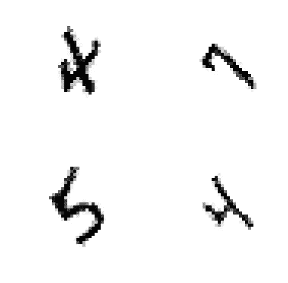
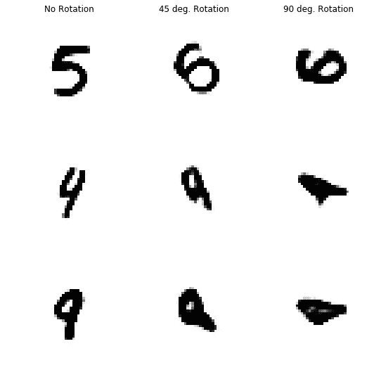
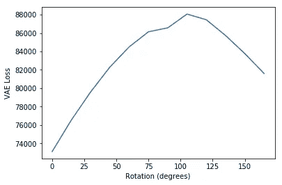
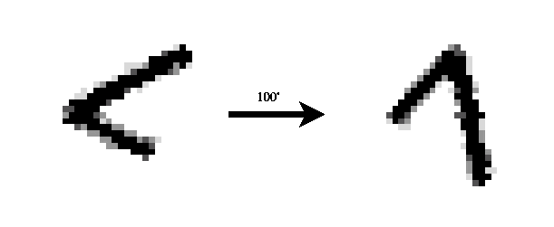
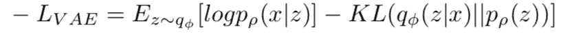
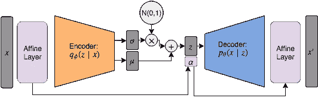
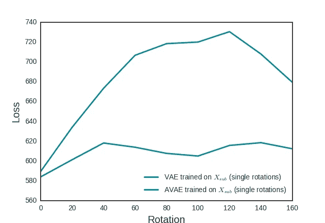
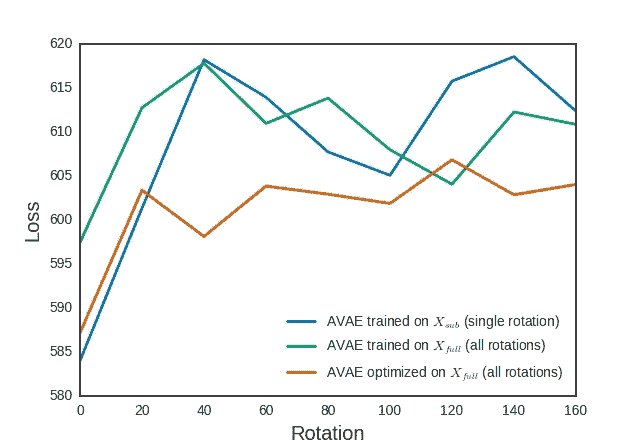
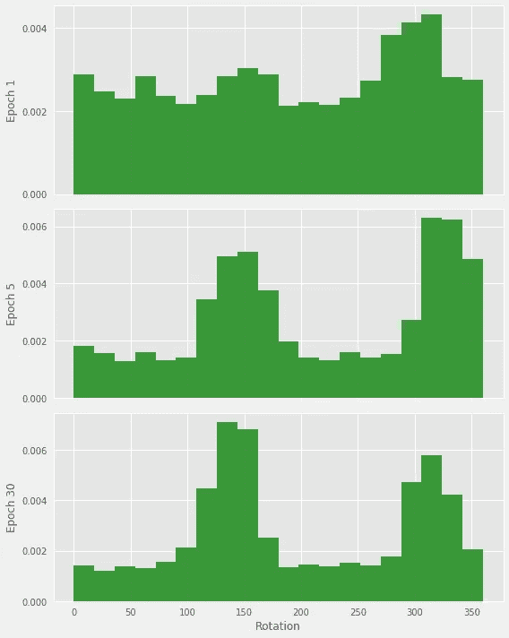
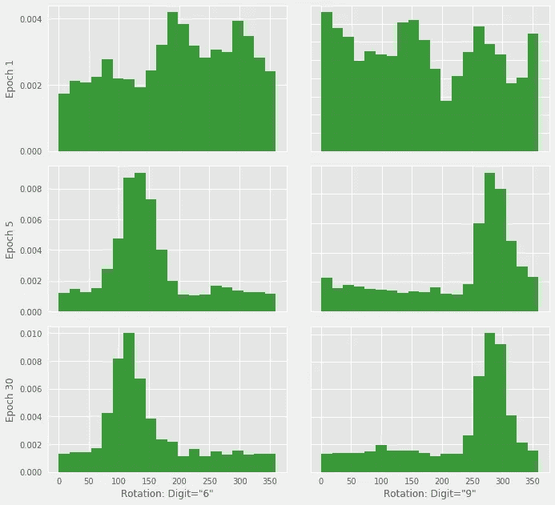

# 仿射变分自动编码器

> 原文：<https://medium.datadriveninvestor.com/affine-variational-autoencoders-f70a2e8c220c?source=collection_archive---------3----------------------->

# 变分自动编码器的局限性

深度学习模型很强大，但并不总是能很好地推广到非分布样本。例如，人们理解稍微旋转的数字没有问题:

Rotated MNIST

但是变分自动编码器(VAE)不能很好地概括这种分布上的变化。看看编码性能如何随着图像的旋转而下降:

*Images after being encoded by VAE after various rotations. Performance decreases with increased rotation.*

更详细地说，看看 MNIST 数字以不同旋转编码时的损失:

*VAE’s loss on various rotations.*

在训练数据集中，所有数字都以 0 为方向，随着数字进一步偏离这种分布，该模型的性能似乎会更差。当旋转 180 度**时，由于一些数字看起来相同，损耗达到峰值并减少。**

 [## 2019 年深度学习的终极学习路径及更多...-数据驱动型投资者

### 又一个美好的一周，一些好的教育内容将会到来。我最喜欢的&最受欢迎的帖子之一…

www.datadriveninvestor.com](https://www.datadriveninvestor.com/2019/01/07/the-ultimate-learning-path-for-deep-learning-in-2019-more/) 

通常来说，为了解决这个问题，我们使用**数据增强**，这基本上是在所有可能的旋转中馈送神经网络图像，并强制它理解完整的分布。还有一些其他方法可以实现这一点，但数据扩充是目前最常用的方法，其他方法也有其他限制。

# 这个怎么解决？

为什么机器学习模型要推广到旋转的图像，最流行的方法是在一堆不同的旋转中输入相同的图像？盲目地进行数据扩充会增加所需的模型复杂性，因为我们必须在不同的方向上学习所有这些表示。我们更愿意这样来学习只有一个旋转参数的表示，但是对于一个标准的 CNN 来说学习这个是很困难的。为什么我们可以理解旋转的图像，但神经网络却很难这样概括？

神经网络没有像人类那样理解旋转图像的内置方式，因此它们无法像人类视觉那样进行概括。但是，如果模型将学习一些抽象表示，然后执行一些“心理旋转”，就像 Geoff Hinton 在[中讨论的那样，“卷积神经网络有什么问题？”](http://www.youtube.com/watch?v=rTawFwUvnLE&t=19m50s) 1

一种流行的方法,[空间变换网络](https://arxiv.org/abs/1506.02025)试图通过应用学习的仿射变换将图像返回到其原始方向来解决这个问题。只要网络找出正确的转换，这是一个伟大的解决方案！不幸的是，如果模型最初是错误的，就没有办法返回并改进所使用的转换:

The STN is not guaranteed to get the optimal transformation

基于图像在我们看来有多“怪异”,我们想让图像越来越接近这个标准方向。但是在分类中，没有好的度量标准来衡量一幅图像有多怪异。我们最多能做的就是类似 softmax 输出的分类难度/熵之类的东西。

# 仿射变分自动编码器

但是当我们有了 VAE，就有了一个清晰的衡量图像“怪异”程度的标准，即损失！这种损失是:

我们可以在 vae 前后添加仿射变换层，对输入图像应用旋转，对输出图像应用反向旋转。然后，对于任何图像，我们可以找到使这种损失最小化的旋转。事实证明，在 VAE 中，这实际上相当于最大化数据可能性的下限(ELBO)，因此该过程实际上是将给定图像向训练分布移动，这正是我们想要的。

Affine Variational Autoencoder (AVAE). VAE with affine transforms added before and after the network.

在这种形式下，整个网络是美好的，可微的。因此，给定一个图像，我们可以使用 SDG 优化 **θ** ，就像我们优化网络参数一样！在实践中，存在一些局部最小值，因此需要一些随机重启。

利用这一点，我们很容易推广到旋转，并在增加模型复杂性和增加计算量之间进行权衡。事实上，这可以很容易地扩展到过去的旋转，并用于更普遍的仿射变换。

Performance of VAE compared to AVAE on rotated MNIST

AVAE 明显提高了性能。此外，因为我们只强制模型学习一个方向上的图像，所以与使用数据增强强制学习完整分布的 VAE 相比，AVAE 可以是更小的模型。

请注意，这需要在训练时将所有图像以某种规范的方向提供给模型，以获得小模型和良好概括的全部好处。这可不好！大部分数据集不是这样做的，人在学习的时候没有这个限制。我们如何绕过这一点，在训练期间学习数据分布子集的最小表示，并且在测试时推广到完整分布？

# 培训期间的优化

一种选择是在训练过程中优化变换参数 **θ** ，其中在对每批图像进行 SGD 之前，优化 **θ** 。直觉是，因为模型仅在旋转的子集或单次旋转时学习编码是最佳的，所以随着训练的进行，模型将逐渐开始在一些旋转时比其他旋转时更好地学习编码，并且最终模型将仅在单次旋转时训练。事实证明这是可行的，并且这个过程创建了一个性能更好的模型，而没有任何模型容量的强制增加:

Comparing AVAE performance using the dataset at a single cannonical orientation, at random rotations, and at random rotations using the optimization process during training. This training optimization process achieves lowest loss.

成功了！对于所有旋转，该模型的损失较低。为了确保成功，我们可以在训练过程中观察图像的旋转分布:

Distribution of rotations for digit “1” during training. As training progress, the model learns to encode at specific orientations.

我们看到，该模型开始时是随机旋转的，但逐渐了解到最好以类似的旋转对它们进行编码。因为这是针对 1 的，并且当旋转 180 时几乎相同，所以有两个峰相隔 180 。

Comparing distribution of rotations for digits “6” and “9” during training. As training progress, the model learns to encode at specific orientations.

我们也可以比较 6 和 9。该模型学会了以 180 度间隔旋转对这些数字进行编码，因为这些数字在旋转了这个量之后几乎是相同的，所以这是表示它们的最有效的方式。

# 讨论

我们已经有了一个 VAE，它使用计算而不是增加模型大小来推广旋转。不幸的是，这需要大量的计算。推理时间大约是标准 VAE 的 50 倍。这是完全未优化的，在优化过程中使用 STN 会非常快，只需几次随机重启。

注:*这并不是他在这里所说的，胶囊是一个更为宽泛的概念。我只是窃取了将图像转换成一些“有用的”帧的想法* [↩](https://gist.github.com/renebidart/a300122be80095e4abe0228bfb0b48a5#a2)

*代码在*[https://github.com/renebidart/avae](https://github.com/renebidart/equivariance)

*最初发布于*[*renebidart*](https://gist.github.com/a300122be80095e4abe0228bfb0b48a5)*. github . io .*