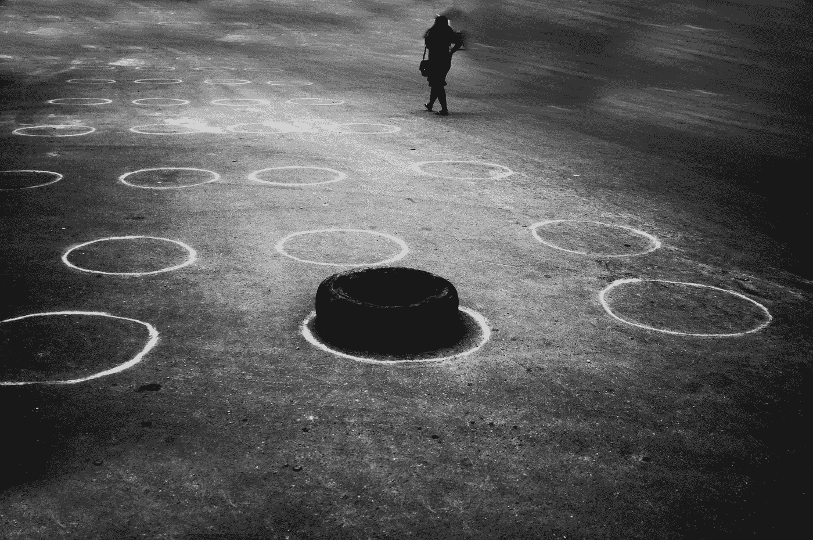
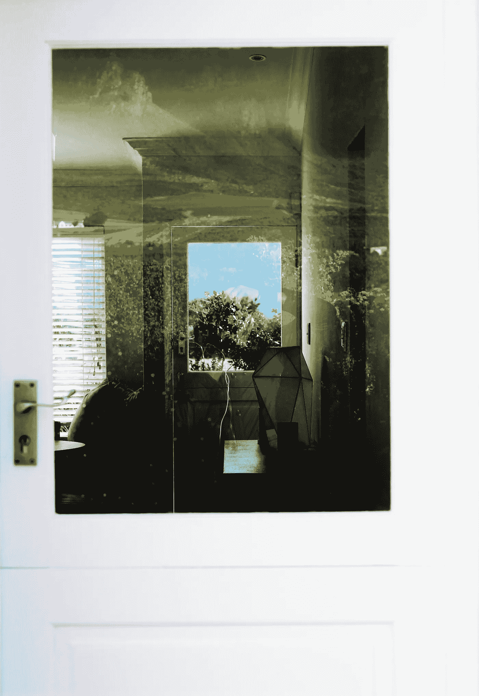
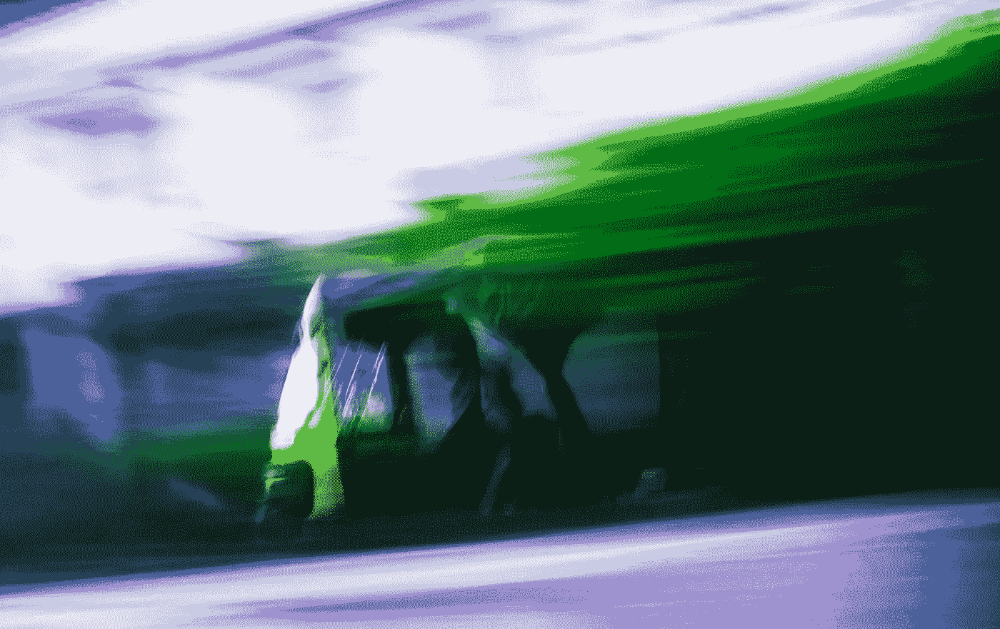
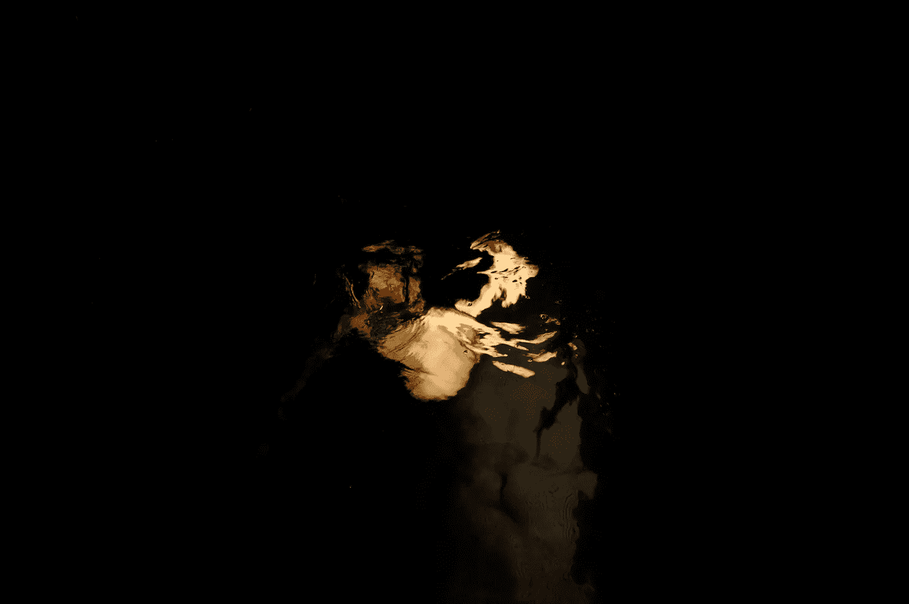

# 非洲情报；南方电力公司的人工智能。

> 原文：<https://medium.datadriveninvestor.com/african-intelligence-artificial-intelligence-at-the-electric-south-b818e5aad075?source=collection_archive---------6----------------------->

> 所有的经历，都以无边为界。我们旅途中的每一步都增加了我们的知识，但也揭示了知识是没有止境的。如果我们以神秘的方式重新发现它，平凡就是额外的。

> 沉浸式体验一直是“非洲人”的文化。我们已经非常清楚地意识到宇宙的构造状态，不仅仅是简单的准入，而是这些层面的实际协商，对现实的架构及其分层性质的意识，所以当我们说草药，即植物和树木已经入睡，因此应该在下班后不受草药医生咨询的干扰，我们在尘土飞扬的地板上倒酒给我们的祖先喝，所有这些和更多的都是断言我们对这些层面的知识的代理人。

从我的经历和背景来看，熟悉的传统类比帮助我从根本上确定了拥抱新媒体及其可能性的方法。我是一名摄影师，但我最喜欢诗歌。这直接影响了我的工作:我剥离并提炼出我希望我的视觉传达的特定情感。平庸是我喜欢关注的，因为它让我看到真正美丽的东西掩盖自己的平淡无奇的伪装，让我看到内在的美和诗意。这种哲学完全来自于承认约鲁巴人的视觉精神，即发展一种内在的眼睛“Oju Inu ”,从一个现实层面的窒息力量中解放出来。我还受到了我祖先中的抽象唯美主义者和艺术家的启发，他们对虚空宝石的信任让他们将制作精美的材料和雕塑提升为精神路由器，通过它天堂和地狱可以谈判。许多家庭尊敬某些阿姨和奶奶，不是因为她们年老时可爱的脆弱和优雅，而是因为她们在包装纸的褶皱里认为神圣的力量的故事。对于怀疑托马斯的人来说，一个关于孩子将强效混合物误认为沙拉和可食用蔬菜的谚语传遍了所有的路口和河边，让放置在十字路口供灵魂进食的仪式餐被视为不仅仅是美味的拼盘，如此富有诗意，如此身临其境。太有结构性了。

Constellations on wood, 2018

也就是说，在我的城市和当代现实中，我意识到到处都有看不到的东西。我一直在思考如何在我的作品中传达这一点。新媒体提供了转化这种经验和知识的可能性；吸引观众的眼睛、耳朵、皮肤、鼻子甚至心灵的可能性。我想像妮娜·西蒙一样对你施咒。这是一个咒语，它照亮并概括了受信任的、已经被接受的技术工具，而没有宗教情绪和异教政治。“这是一个虚拟现实工具包，而不是巫术！”我想有一天我会对观众说这句话。哈！"

技术正处于史诗般的测试阶段，这些新的工具和媒体为我们提供了一种更丰富的方式，通过一系列新的独特的讲故事风格和内容来参与生活。然而，这些媒介被如此多的世界末日场景所笼罩，这可能会限制我们拥抱它们的可能性，尤其是在非洲大陆。最近在开普敦举行的 Electric South VR/AR 研讨会旨在揭开新媒体的神秘面纱，并以我们社区能够理解和理解的语言讨论这些想法。

A door to Eden, 2018

***新媒体创作与策展的布道与框架。***

在“短暂的好奇心”领域，艺术家幸运地认识到现实的构造层，并以最原始的形式在媒介中使用它。宗教也对此进行了探索。不幸的是，宗教只承认短暂的力量，它没有利用这种意识来创造一种更可触知的、非分裂的、有形的结果或产品。这位艺术家在传播新媒体创作和策展框架方面发挥着至关重要的作用。

短暂的好奇:我感觉到风，但我看不见它；我知道爱是什么，但我也不知道爱是什么；音乐的一个好处是，当它响起时，你不会感到疼痛；等等。这些与过程中的科学好奇心有点不同，但它们走向了相同的尤里卡时刻，并被证明是同样有效和必要的见解，通过这些见解，随着人类被发现和理解，关于是什么让我们滴答作响的更多信息被发现和理解。

Twins, 2018

> 艺术家将如何为新媒体做到这一点？**通过** **探索他/她作为文化交汇点的角色。如果技术、艺术家和宗教意识融合在一起，我们将创造出一台极具人性的机器，它拥有孩子般的头脑，而不是孤独的反社会幻想家的冷漠。基本上，我们使用相同的老故事和场景来激发和激发我们的想象力，然后回顾和切断其自私的角度，如自我，虐待或优越的政治，然后使用当今的技术来建立那个世界，让人们体验。也就是说，不再有为了文化审视的自我搁置和展示，而更多的是一种邀请，进来吧——站在我的立场上。**

Blast Theory, 2017

***人工智能+非洲意识:不按常规玩追赶:***

我们的核心是我们的人性，为了更好的理解，我们可以称之为灵魂。这个天真而又睿智的实体是第一个人工智能。给它黑暗物质，它就会变形，给它光明，它就会发光。世界正在为下一次工业革命奠定基础，未来将使用的工具，如人工智能等，仍处于测试阶段，正在全球各地的小团队中进行修补。作为非洲人，更重要的是作为艺术家，我们也可以进入那里。

即使设备的开销成本和对更强大的技术驱动环境的访问现在还无法实现，我们仍然是对话的一部分。黑客和创造性的解决方案一直是我们的生存之道，这将是我们的优势，因为它将提供从未考虑过的视角。从目前来看，不参与对话是灾难性的，而不是参与的质量…

The artist is present and aware of his presence, 2018

我开始思考所有的可能性，我的城市变成了一个更大更新的画布，供我修补，由此刻板印象和单一故事的危险可以被质疑。

最初因为相机的方向而被忽略的真相可以被发现。所有这些都可以体面地展示，而不是像通常那样在典型的展览中被束之高阁。通过沉浸式思维的力量，利用辅助技术找到窍门和创造性解决方案，可以在城市规划、精神健康和探索创伤历史方面做很多好事。

同理心和协作驱动着新媒体，这将突破现有媒体因难以让你“穿上故事的鞋子”而笨拙处理的许多僵局和细微差别。

Dizzy Rascal dreamer, 2017

> 我离开了电气南方车间，思考提取我所学知识的最佳方法，还有很多内容要讲，但我会在未来几周内逐步分享。我将挑选这些新媒体中的每一个，并根据感觉将其分解，谈论可以访问的入口点和资源。我们必须通过这些流程创建一个知识共享链。这可以点燃兴趣之火，也可以推动创新方法，开辟新的领域，尽管挑战是存在的，但为什么要在这个修修补补的实验室里美化它呢？

Midnight Swim, 2017

伟大的想法可能看起来令人畏惧，我亲爱的非洲，但不要害怕。我花时间和那些为你创造解决方案的人在一起。美丽的心灵，这种福音需要的类型。

> Electric South 是在南非开普敦举办的 AR/VR 研讨会。该实验室旨在向艺术家介绍新的沉浸式技术，以拓展他们的艺术。Electric South 还资助、孵化和展示非洲创作者的作品——专注于创新的数字视觉故事、虚拟现实、移动和非小说。要了解更多信息，请在 twitter 上关注@electric_south，在 Google 上搜索 everything Electric South，在 Medium 上关注 inquire。

# DDI 推荐阅读:

*   人类不需要申请:人工智能时代的财富和工作指南
*   马克斯·泰格马克的《生活 3.0:成为人工智能时代的人类》
*   [*Python 人工智能:为 Python 初学者和开发者构建智能应用的综合指南*](http://go.datadriveninvestor.com/daib09/mbmp000101) 作者 Prateek Joshi