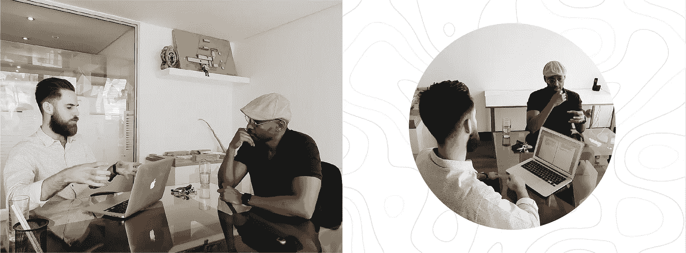
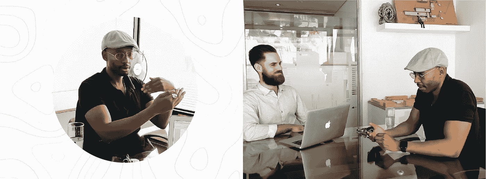

# 非洲领导阶层和性感城镇:莫肯娜·马卡访谈

> 原文：<https://medium.datadriveninvestor.com/african-leadership-and-sexy-townships-a-mokena-makeka-interview-cfedf352012a?source=collection_archive---------15----------------------->

作为世界经济论坛的年轻全球领导人和南半球城市运营方式的倡导者，Makeka 设计实验室主任 Mokena Makeka 甚至有幸在过去两年半的时间里担任市长水资源恢复委员会的成员。除此之外，这位屡获殊荣的建筑师还设计了著名的项目组合，包括开普敦会议中心和火车站，以及当地和国际上的其他开创性建筑。

我们有幸讨论了非洲和建筑的领导地位，以及这对新一代的专业人士和政治家意味着什么。莫克纳分享了他对行业创造力、技术官僚和母城市建筑突出性的看法。让我们开始吧！

# 建筑师作为领导者

建筑师很难按照我们所受的训练来运作。这是高度通才，但同时也是专业培训，所以我们有能力与土木工程师，景观设计师，结构工程师接触。我们是“首席多面手”，这就是“建筑师”的意思，是“首席技师”。我们对所有的行业都有感觉，而且我们是唯一能够把所有的行业整合在一起的人，因为建筑师必须对每个部分都有足够的了解，才能管理整体。

因此，在这种情况下，如果有一个世界理解建筑师的角色，它会更容易成为一个领导者。在一个已经被分解的环境中，你会发现建筑师可能已经被训练去做一些事情，但是经常发现一个敌对的专业环境或者一个敌对的立法环境。无论是城市规划者还是城市官员，不知何故，他们总是认为建筑师在试图制造累赘，所以他们自然而然地带着怀疑的态度加入到对话中。

> “我们有几十年分裂的建筑——所以当你说它可以团结人们时，人们认为你是一个梦想家。他们认为这很贵，你应该投资住房。”

我非常理解这里的建筑无法像巴黎或其他地方那样具有开创性。这不仅仅是资本的问题，而是社会对优秀建筑的理解。

# 永恒的价值观，永恒的伦理

客户来来去去。即使合同完成了，大楼还在。所以本质上，你的客户其实就是社会。你的客户比任何人都重要。虽然资本通过特定的客户流动，但现实是你试图创造的房地产，遗产，是更大的东西。

因此，就这些领导价值观而言，我试图鼓励我的员工当然要倾听客户的暂时需求。

领导力就是让他们对价值观有强烈的感觉，并且这些价值观比市长、部长或总统都要长久。你的价值观和道德观必须是永恒的。这当然意味着有时我们会和客户陷入不舒服的空间，因为他们不习惯这样。

# 性感小镇&南非建筑

很长一段时间以来，关于什么是非洲的建筑有一个非常奇怪的争论——就像如果它在城镇里，它就不可能是性感的，所有这些奇怪的，奇怪的限制创造力的想法。但我可以说，在过去的 15 年里，部分是因为社交媒体，部分是因为设计界的日益成熟(我也包括时尚和音乐)，非洲中心主义的自信爆发了，老实说，这种自信直到 2010 年才出现。

> " 20 年前人才短缺，但现在不会了。"

你所看到的问题更多地与私人领域有关，那里有私人资本，而国家没有真正跟上。我们还没有真正做出如此令人惊叹的公共建筑。这是一个挑战，但有足够的证据表明，我们这里确实有一些了不起的设计师。

我对此有信心，我认为当这个国家更相信他们的建筑师而不是富人时，我们可以开始问一些好问题，比如‘为什么我们的公交候车亭不是由建筑师设计的？’例如，在挪威，他们有一家设计货币的建筑公司。想象一下这在这里会有多好！

# 技术官僚的崛起

五十年代和六十年代的非洲领导层基本上是一种解放思想，而南非有点落后于形势。领导力在很大程度上是政治性的，关乎国家认同。

然后是我所属的这一代人，他们有机会获得学位，这使我们处于一个不同的位置。我们可以提供政治学习之外的领导力。如果你运用领导思维，你可以成为任何领域的领导者。

> “对我来说，非洲领导力不是对政治的叙述，而是塑造关于非洲的公共对话。”

领导力是指在你自己的能力范围内成为一名领导者，但也要有意识地成为一名非洲人——这不是一个限制性的术语——希望这一概念将影响政治空间。

大多数政治家都深深扎根于他们的政党，这通常是一种基于解放或保守心态的意识形态立场。当你开始让音乐家、科学家、工程师或画家竞选公职，而这些技术官僚的技能成为政府的一部分时，政府就会变得更加有效。

# 引领建筑环境

人们试图通过简化事情来降低复杂性，结果却犯了错误。

有趣的是，我们是一个拥抱复杂性的国家，因为我们有 12 种不同的语言，部落主义的复杂性，等等。我们成功地从这种复杂性中创造了南非。我觉得具有讽刺意味的是，我们无法在如何管理我们的城市的层面上处理复杂性，我们分散了事物，制造了更多的问题。

> “比起身份，我们更需要重视思想。”

眼光和领导力是非常难得的东西。你不需要 100 个曼德拉来改变一个国家。你只需要一两个，但是你需要他们让每个人都参与进来。我们需要认识到，我们的复杂性需要好的领导者，他们能够带来这些不同的声音。如果没有这一点，我们就会有糟糕的领导人，他们只关心自己的小圈子，而忽略了大局。

# 开普敦的怪癖万岁

作为一个城市，我们确实有怪癖。如果你看看已经出现的杜松子酒或巧克力场景——有如此多的符号适应开普敦的古怪。古怪是有市场的。建筑是缓慢的，所以我们将是第一个预测事物的人，但我们也将是最后一个改变的人。所以建筑在被构思的时候总是天生更加保守。

我喜欢创意社区正在做的事情。如果我们能培养出一个有利可图的创意阶层，那么他们的怪癖就会显现出来，我们将拥有一个更加有趣的城市。

我们绝对需要更多的古怪和大胆！作为一个创意社区，我们需要减少对彼此的批评。我们越鼓励实验，越不追求彼此，如果人们举手时不那么谨慎，我们就越有创造力。

________________________________________________________________

感谢 Mokena 分享了深刻的观点，并为非洲的积极变化做出了贡献。

这里是 [JA](https://l.facebook.com/l.php?u=http%3A%2F%2Fwww.ja-culture.com%2F%3Ffbclid%3DIwAR1v0TO6LHpN28tjvZbg3nrlCZTDWsWVXpV9EREvUIlI2dm5Q-Nq6T6hu-8&h=AT0dwHy_5xBftaggB9qbUgPfR8-TmIv1QjSp2zhyPLwR-s6vhGWTLhENfZoCzeVbs7_yQ6ktvw-k52BgaAvttxZv-icWWpDDaeOQ7guzJF1oWbNy2BZ4L50PRkpah7qmTJzdaWuyL3nEGbshpZuImw) 。我们相信，像 Mokena 这样的领导者可以激励未来的专业人士记住，如果以一种光荣和真诚的方式利用他们的职位，他们的职位可以带来积极的影响——为团队承担风险，并有勇气举起你的手，而不管你的同行的看法。

亲切问候，【www.ja-culture.com】JA-Team
T4