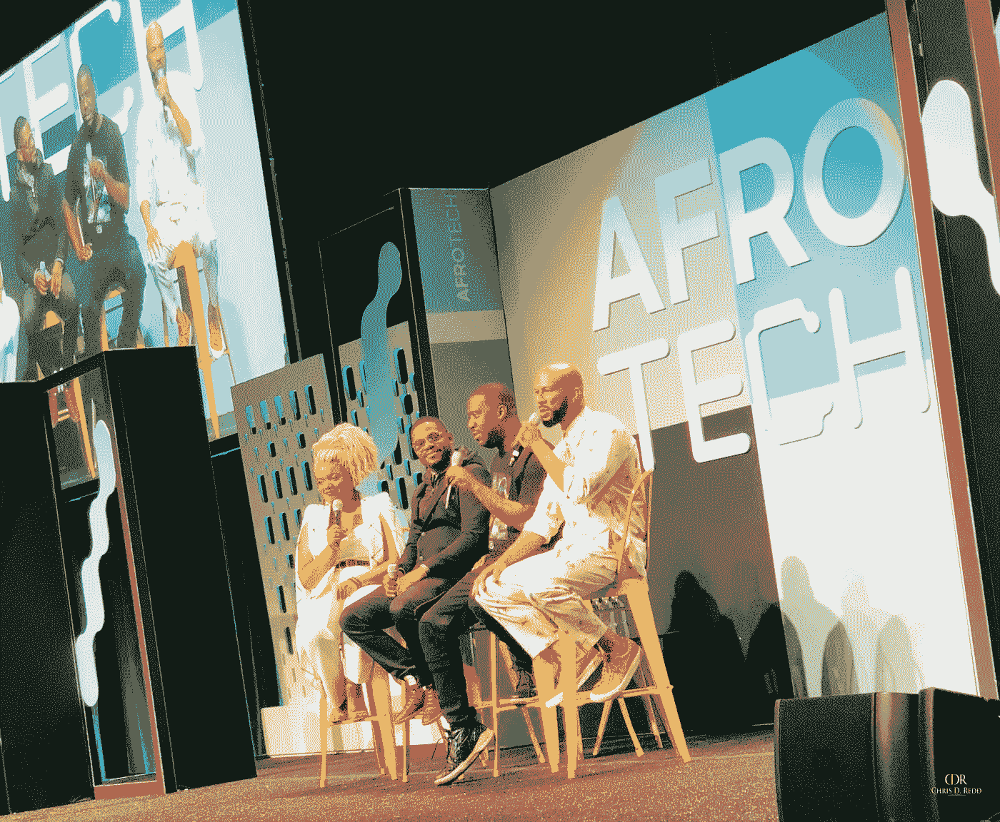
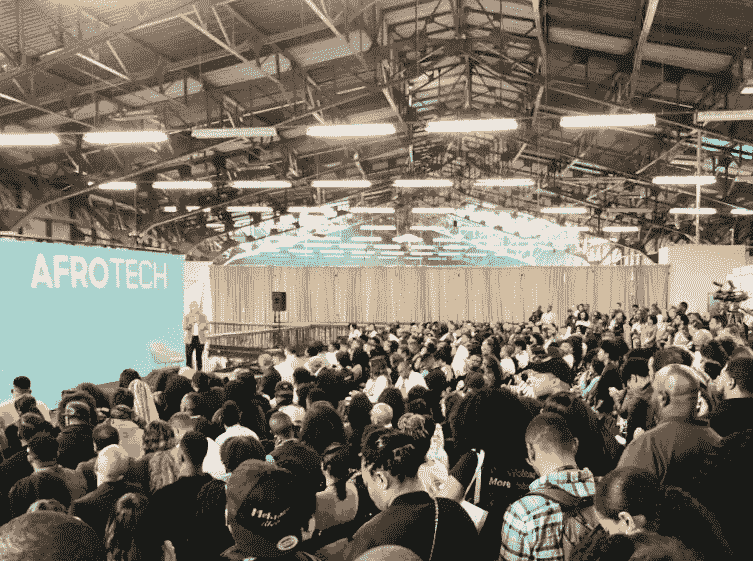
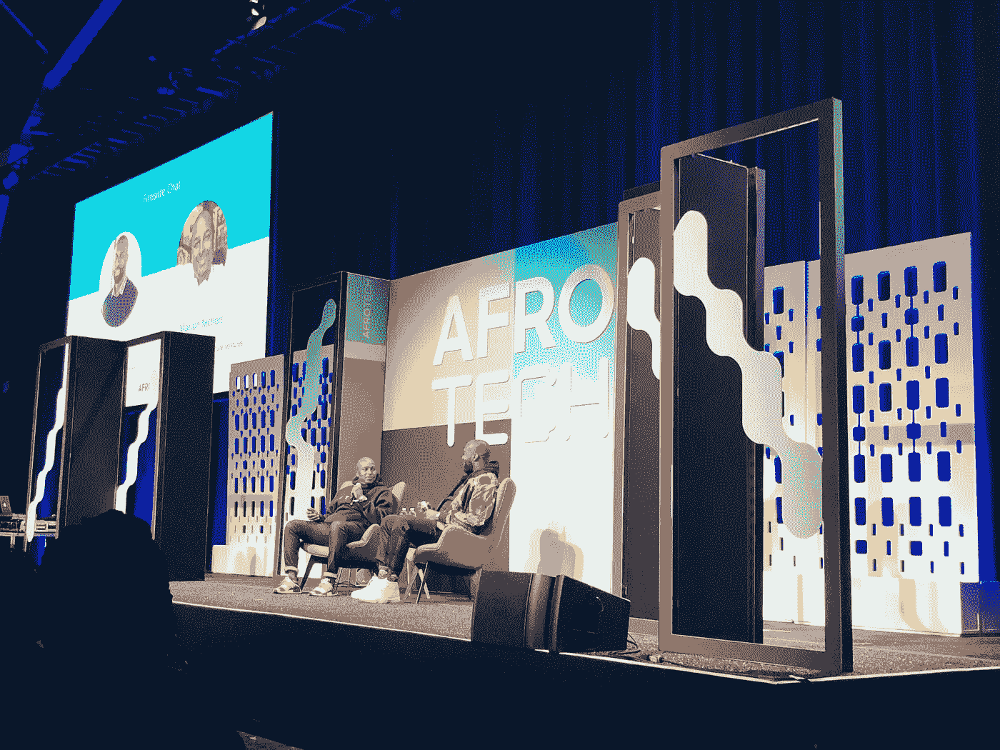

# AfroTech 2018:我的主要收获

> 原文：<https://medium.datadriveninvestor.com/afrotech-2018-my-key-takeaways-77721a1b4c35?source=collection_archive---------29----------------------->

近 4000 名黑人和棕色人种的企业家、投资者和专业人士聚集在旧金山，共同建设、发展和壮大。企业家和领导力赛道在艺术宫举行，设计赛道在 BeSpoke 举行。在过去的几年里，有一个反复出现的说法，即科技领域缺乏多样性。在参加了今年的 AfroTech 大会后，我可以肯定地说，我们在技术领域确实有很多黑人和棕色面孔。这种多样性大部分没有被看到，因为没有地方展示这一点。但是，感谢[摩根·德邦](https://medium.com/u/4996c04e1559?source=post_page-----77721a1b4c35--------------------------------)和[布拉维特](https://medium.com/u/2dbd1d2f0ce7?source=post_page-----77721a1b4c35--------------------------------)团队，现在有了 AfroTech，这有了一个很好的平台。当然，还有成长和进步的空间，但如果有一个能激发有色人种对科技的兴趣并为他们增值的基础，这种变化将会以指数级的速度发生。

自 2016 年首次举办以来，该会议每年都翻一番。今年，它吸引了许多顶级科技公司，如谷歌、LinkedIn、脸书和亚马逊。它包括令人惊叹的小组成员和发言者，如戴蒙德·约翰、拜伦·戴维斯、卡希娜·范·代克、[丹妮尔·莱斯利](https://medium.com/u/a4cf6a472f3b?source=post_page-----77721a1b4c35--------------------------------)和埃维特·泰勒。这种组合造就了一种古怪而充满活力的气氛。以下是我第一次 AfroTech 的一些关键收获。

1.  **没有管道问题**

[Mandela SH Dixon](https://medium.com/u/700fa597e17?source=post_page-----77721a1b4c35--------------------------------)

围绕科技领域多样性和包容性的讨论往往是这样的:人才库中没有足够的人才。事实并非如此。证据已经明确证明事实并非如此。管道问题是，许多顶级公司没有去正确的地区寻找这些才华横溢的多样化的个人。随着 AfroTech 提供了展示这一点的基础和平台，各公司正在迎头赶上，并有意努力脱颖而出，成为顶尖人才。WeWork、亚马逊、Stripe、Salesforce 和 Dropbox 等公司不仅在大会上积极招聘，还在晚上(招聘时间)举办活动，以进一步加强与与会者的互动。在场的公司真正投入了引进多样化的、有创造力的人才。

**2。** **渐进性**

我来自威斯康辛州的密尔沃基，现在住在肯塔基州的路易斯维尔，很明显西海岸比中西部更进步。这就是为什么许多有抱负的企业家和有色人种技术人员会搬到西海岸几年，如果不是永久的话。那里的生态系统是为了自由分享知识而建立的，同时具备快速学习和发展的基础设施。该地区的公司越来越重视真正支持行业中的有色人种。这种情况正在向中西部和其他地区蔓延，而布拉维特无疑是在海湾地区实现这一目标的领导者。为了进一步推动叙事的转变，我们中的许多人需要走到一起，在我们居住的其他地区复制生态系统。

**3。** **黑色公司募集大量风投**

[Marlon C. Nichols](https://medium.com/u/24bdbaf1c56c?source=post_page-----77721a1b4c35--------------------------------) and Baron Davis

坐在炉边与来自跨文化投资公司的[马龙·c·尼科尔斯](https://medium.com/u/24bdbaf1c56c?source=post_page-----77721a1b4c35--------------------------------)和来自黑人圣诞老人公司的拜伦·戴维斯聊天，有色人种公司正在筹集更多的风险投资。有几家公司已经获得了超过 1000 万美元的风险投资。一些已经达到这个门槛的公司是克里斯·班尼特创立的 Wonderschool、迪伊桑·伊米拉创立的 Mayvenn 和罗德尼·威廉姆斯创立的 Lisner。我们正处在一个换岗的时期，这些数字正在增长并成为常态。拜伦·戴维斯谈到了为什么会发生这种情况。总的来说，有更多有色人种投资者正在进入这个领域，引领这一变化。这是至关重要的。感谢像马龙·尼克尔斯、阿尔兰·汉密尔顿、查理斯·哈德森和保罗·法官这样的领导者，通过风险投资的支持来建立公司并取得成功的变革革命即将到来。

在科技领域，代表性是必不可少的，而 AfroTech 正是这一点的典范。今年的会议不仅有创纪录的与会人数，而且还增加了女性发言人和小组成员的代表。演讲者、小组成员和一个经过深思熟虑的事件的策划正是技术人员和志同道合的有色人种为了聚集、保持文化前进和创新变化所需要的。期待 2019 年在奥克兰与大家见面！