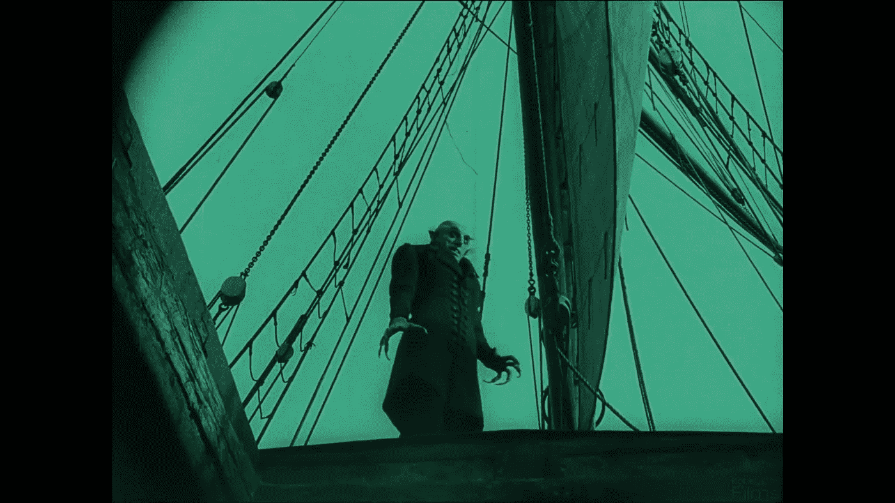
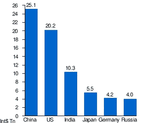
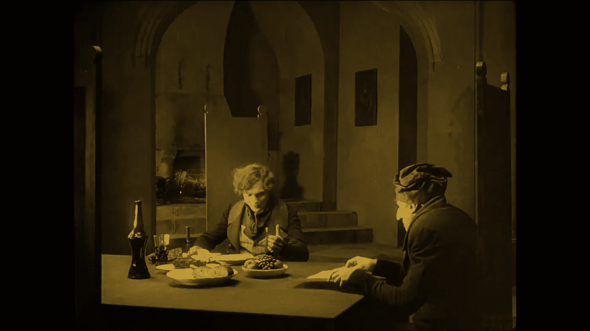
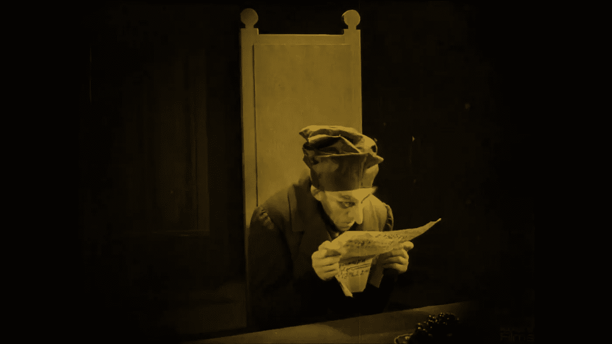
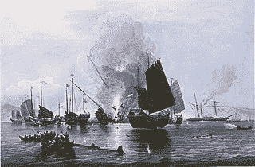

# 在帝国之后——吸血鬼回归

> 原文：<https://medium.datadriveninvestor.com/after-the-empire-the-vampires-return-3d3a6fefbd76?source=collection_archive---------10----------------------->

Source: kookyFilms. [Nosferatu screenshot](https://www.youtube.com/watch?v=oAX2WBzCh5Y).

## 解构德古拉

> 德拉库拉说:“‘这些朋友’——他把手放在一些书上——“对我来说是好朋友，在过去的几年里，自从我有了去伦敦的想法，给了我许多许多小时的快乐。通过他们，我了解了你们伟大的英国”——《布莱姆·斯托克，德拉库拉》。

大英帝国既不是死的也不是活的，不是僵尸也不是吸血鬼，我在之前的文章[自我之战](https://medium.com/datadriveninvestor/the-battle-for-the-self-1369e02637a6)中已经解释过了。也许我们都应该开始在脖子上戴大蒜，在口袋里放一串念珠。谁知道呢。英国的政客们仍然很害怕，或者两者兼而有之。现在，国防部长加文·威廉姆森想继英国退出欧盟之后在世界各地建立新的军事基地。[“*这是我们再次成为真正全球玩家的时刻，”*加文·威廉姆森如是说。可能的地点包括南中国海的新加坡或文莱，以及加勒比海的蒙特塞拉特岛或圭亚那，让人想起昔日的帝国。](https://www.independent.co.uk/news/uk/politics/brexit-uk-military-bases-caribbean-far-east-eu-global-player-a8703816.html)

这是烟幕弹。在英国华而不实的声明背后，是强大的山姆大叔。“美国在 160 多个国家都有军队，但是五角大楼隐瞒了确切的数字，”信息交换所说。

但正如我们所知，经济实力比军事实力更强大。所谓的“第三世界”或“发展中国家”正在接管。四百年来西方的统治和掠夺，由船只和大炮以及普遍的优越和例外主义意识形态所保障，即将结束。事实就是事实。基于购买力平价(PPP)的预测估计国内生产总值(GDP)显示，中国将在 2018 年超过美国 5 万亿。

Largest economies by PPP (purchasing power parity) GDP in 2018\. [Source: Wikipedia](https://en.wikipedia.org/wiki/List_of_countries_by_GDP_(PPP))

因此，当代英国的非理性恐怖场景，如英国退出欧盟、斯克里帕尔和由点击诱饵主流媒体推动的“俄罗斯，俄罗斯，俄罗斯”，之所以如此奏效，是因为存在一种潜在的普遍不安，即英国在世界舞台上的作用下降，或许是对其过去失败的新认识。

这种恐惧并不新鲜，这让我想起了哥特小说，它在十九世纪末经历了一次复兴。像《德拉库拉》*、*《杰基尔博士和海德先生》*、*《道林·格雷的画像》*这样的小说，依靠非理性、潜意识和神秘而繁荣，1897 年出版的布拉姆·斯托克的《德拉库拉》就是一个最好的例子。*

Murnau’s Nosferatu screenshot

弗吉尼亚大学英语系教授兼系主任斯蒂芬·阿拉塔认为，吸血鬼的故事不仅仅是恐怖和一些关于女性性行为的心理难题，因为当时它很流行，考虑到弗洛伊德心理学的出现。他指出，对于后维多利亚时代的哥特式建筑，我们需要考虑到围绕和贯穿文本的*文化背景。*”他在他的[论文](http://www.jstor.org/stable/3827794)“西方游客:“德古拉”和反向殖民的焦虑”，

> 以德古拉为例，背景包括十九世纪末英国作为世界强国的衰落；或者更确切地说，当代作家表达这种衰落的方式…..英国全球影响力的衰退、英国商品海外市场的丧失、德国和美国的经济和政治崛起、英国殖民地和属地的日益动荡、国内对帝国主义道德的日益不安——所有这些都削弱了维多利亚时代对英国进步和霸权不可避免性的信心。尤其是维多利亚后期的小说，充斥着这样一种感觉:整个国家——作为一个民族，作为一股政治和帝国力量，作为一种社会和文化力量——正在不可挽回地衰落。

因此 Arata 认为一个可怕的逆转发生了:*“殖民者发现自己处于被殖民者的地位，剥削者变成被剥削者，加害者变成受害者。”*

他认为这种恐惧不仅与种族、道德和精神上的衰落有关，这种衰落使这个国家容易受到更有活力的“原始”民族的攻击，而且也是对文化犯罪的回应*“在掠夺和入侵的他者中，英国文化看到自己的帝国行为以可怕的形式反映出来。”在另一个例子中，Arata 提到了 H. G. Wells，他在和他的兄弟 Frank 讨论了英国统治下塔斯马尼亚土著人口灭绝的问题后，有了创作《世界之战》的想法。*

> 因此，反向殖民叙事包含着对帝国主义意识形态进行有力批判的潜力，即使这种潜力通常仍未实现。作为幻想，这些叙事提供了一个为帝国罪恶赎罪的机会，因为逆向殖民通常被描绘成应得的惩罚，

所以 Arata。

我们还听说布莱姆·斯托克对大英帝国的历史有些兴趣，这在他最著名的小说中有所体现。一些评论家注意到，德古拉通过颠覆当代英国进步的科学世界，展示了原始人试图殖民文明世界的威胁。

Murnau’s Nosferatu screenshot

但是德古拉的精神已经在思想上和实践中占据了英国。这种破坏性力量以前在英国社会和其他几个欧洲社会中也存在。殖民列强之间摊牌的准备即将来临。第一次世界大战迫在眉睫。德古拉的毒药在欧洲到处都找到了肥沃的土壤。英国向世界上尚未开化的地区投射的邪恶的原始的和破坏性的力量已经居住在西方，在我的文章[“自我是如何丢失的”](https://medium.com/datadriveninvestor/how-the-self-was-lost-f34b83c3d79a)中讨论过。1897 年，当斯托克出版《德拉库拉》时，没有人能够想象阿多诺在谈到启蒙运动时提到的“灾难胜利”。它即将降临到一个在维多利亚时代备受珍视的文明上。

斯托克突出了德古拉的策略。当年轻的律师乔纳森·哈克到达伯爵的城堡时，他看到的不是一个原始而无知的人，不，他看到的是一个多才多艺的西方专家。图书馆里堆满了大量的英语书，涉及一个有教养的英国人会阅读的所有主题，历史、地理、政治、政治经济学、植物学、地质学、法律——所有这些都与英国和英国人的生活、习俗和礼仪有关。德拉库拉说:*“‘这些朋友’——他把手放在一些书上——“对我来说是好朋友，几年来，自从我有了去伦敦的想法，给了我很多很多小时的快乐，我已经知道你伟大的英国”。*

所以这里我们看到东方主义者哈克向东旅行，而西方主义者德拉库拉向西旅行。德古拉的兴趣和动机自然被描绘成邪恶的表现，掩盖了他侵略和剥削英国及其人民的邪恶计划。

催眠专家范海辛在中和德古拉的过程中发挥了重要作用，他预见到这是一个不断成长的怪物，不仅模仿英国帝国主义的做法，而且迅速超越他的老师。*“伯爵所体现的种族威胁就这样加剧了:他不仅比他的西方对手更有活力、更多产、更“原始”，他也变得更“先进”*而且很快就会所向披靡。

这是所有帝国不可避免的命运的脚本。被压迫和被剥削的人最终学会并发展了压迫者的方式。德古拉，一个对当今世界现象的恰当比喻，一个由美国领导的单极世界，现在正变成一个多极世界，由以前不发达的国家甚至殖民地组成。

正如 Zero Hedge 指出的那样，俄罗斯、中国、印度和伊朗确实已经成为西方的“龙骑士噩梦”。他们不仅在经济上变得更加强大，而且现在也处于在政治和军事上扩张的边缘。不仅如此，曾经遭受英国、法国、比利时和德国殖民主义及其种族灭绝行径沉重打击的前殖民地，特别是非洲的前殖民地，现在也乐于接受中国的援助来发展自己的国家。

[和平与安全问题学者迈哈里·塔德勒·马鲁博士写道，](https://www.aljazeera.com/indepth/opinion/africa-loves-china-190103121552367.html)

> ……中国经济快速成功增长的历史是一个典范，非洲可以从中吸取许多经验教训。中国确保政策主权的能力对非洲领导人和学者来说仍然具有相关性和高度吸引力。根据世界银行的数据，在大约 40 年的时间里，中国通过其非传统的发展道路使大约 8 亿人摆脱了贫困。值得注意的是，它已经实现了许多千年发展目标。
> 非洲人应该从中国的发展和主权剧本中吸取经验。他们可以管理好自己的家园，也可以充分利用大国和地区参与者之间的竞争，不管他们是来自西方、远东还是中东。就目前情况来看，中国已经赢得了非洲人的心。西方要么改变策略，要么永远追赶。

First Opium War. [Source Wikipedia](https://en.wikipedia.org/wiki/First_Opium_War)

那么，中国“吸取”了西方的知识血液了吗？正如《外交政策》所写的，“我们也是海盗:为什么美国是 19 世纪的中国，而且还在继续，

> 1812 年夏天，一艘载着弗朗西斯·卡伯特·洛厄尔和他的家人从英国返回家园的船被一个英国战争中队拦截，该中队将乘客和船员扣留在加拿大哈利法克斯的英国基地几天。洛厄尔的行李受到了几次严格的搜查，因为逮捕他的人被警告说，他可能偷了动力纺织机械的设计，这在英国是一种严重的犯罪。事实上，洛厄尔已经这样做了——但是，意识到了风险，他把这些设计牢记在心。

所以，没什么不寻常的。经济和政治间谍在工作，像往常一样官方否认。中国甚至在西方也有捍卫者，例如，经济学家拉里·萨默斯，

> 你问我中国的技术进步从哪里来？它来自了不起的企业家，他们从政府对基础科学的巨额投资中获益。“这来自于一个重视卓越、专注于科学和技术的教育体系，”比尔·克林顿政府的前财政部长、巴拉克·奥巴马的前经济顾问萨默斯说。这是他们领导力的来源，而不是在某个美国公司的股份。

但是穷人会去找富人，或者是恶有恶报。[旁观者](https://blogs.spectator.co.uk/2018/02/technology-theft-goes-both-ways-as-china-is-discovering/)写道，

> 然而，现在中国对黑客行为越来越认真，但只是作为被黑客，而不是黑客。突然间，他们有了想要保护的东西，并意识到成为领导者比成为一个可以走捷径获得成功的追随者要难得多。
> 
> 西方应该尽一切可能让中国人担心他们的秘密。毕竟，转变是公平竞争。华盛顿和伦敦应该密切关注中国在超级计算机、人工智能等方面的进步。可能会有一些珍闻传到我们的实验室和研究中心，为我们节省一百万英镑，一百万美元。中国人很可能会认为，试图窃取他们能得到的任何东西并不是一个好主意——这会给其他人一些想法。中文里的“厚颜无耻”怎么说？

在互联网时代，德古拉家族孵化出无数官方和非官方的黑客，有私人的，有公司的，有政府的，他们不仅吸食对手的智力血液。正如我在我的文章[多里安的算法](https://medium.com/datadriveninvestor/dorians-algorithm-cd685a96323c)中所展示的，我们作为个体也变得有价值了，我们的数字自我正等待出价最高的人来吸我们的血。德古拉的孩子已经咬过你了。检查你的智能手机上的那些小牙齿。

Vampire Bats. [National Geographic. YouTube](https://www.youtube.com/watch?v=oFAjf_kwwg0)

**参考文献**

阿拉塔，S. D. (1990 年，夏季)。西方游客:“德古拉”与反向殖民的焦虑。维多利亚研究，33(4)，621-645 页，摘自[http://www.jstor.org/stable/3827794](http://www.jstor.org/stable/3827794)

m . aus Lin(2018 年 2 月 16 日)。正如中国正在发现的那样，技术窃取是双向的。*旁观者。*检索自[https://blogs . spectator . co . uk/2018/02/technology-theft-goes-both-ways-as-China-is-discovery/](https://blogs.spectator.co.uk/2018/02/technology-theft-goes-both-ways-as-china-is-discovering/)

m . j . bel vedere(2018 年 6 月 27 日)。拉里·萨默斯称赞中国在科技领域的国家投资，称中国不需要从我们这里窃取。美国消费者新闻与商业频道。检索自[https://www . CNBC . com/2018/06/27/Larry-summers-China-done-need-to-steal-us-technology . html](https://www.cnbc.com/2018/06/27/larry-summers-china-does-not-need-to-steal-us-technology.html)

j .多尔西(2019 年 1 月 6 日)。欧亚大陆的崛起:地缘优势和历史陷阱。检索自[https://mideast soccer . blogspot . com/2019/01/the-rise-of-Eurasia-geography . html](https://mideastsoccer.blogspot.com/2019/01/the-rise-of-eurasia-geopolitical.html)

古怪的 216 电影。(2016 年 1 月 31 日)。诺斯费拉图| 1922，无声，全电影，高质量[视频文件]。从 https://www.youtube.com/watch?v=oAX2WBzCh5Y[取回](https://www.youtube.com/watch?v=oAX2WBzCh5Y)

Maru，M. T. (2019 年 1 月 6 日)。为什么非洲爱中国？检索自[https://www . aljazeera . com/indepth/opinion/Africa-loves-China-190103121552367 . html](https://www.aljazeera.com/indepth/opinion/africa-loves-china-190103121552367.html)

McQuade，J. (2017 年 9 月 27 日)。殖民主义是一场灾难，事实证明了这一点。对话。检索自[https://the conversation . com/colonialism-was-a-disaster-and-the-facts-prove-it-84496](https://theconversation.com/colonialism-was-a-disaster-and-the-facts-prove-it-84496)

莫里斯公司(2012 年 12 月 6 日)。我们也是海盗。FP。从 https://foreignpolicy.com/2012/12/06/we-were-pirates-too/[取回](https://foreignpolicy.com/2012/12/06/we-were-pirates-too/)

国家地理。(2009 年 12 月 18 日)。吸血蝙蝠咬人|国家地理【视频文件】。从 https://www.youtube.com/watch?v=oFAjf_kwwg0[取回](https://www.youtube.com/watch?v=oFAjf_kwwg0)

奥本海姆，M. (2017 年 9 月 8 日)。一位印度政治家宣称，温斯顿·丘吉尔双手沾满了和最残忍的种族灭绝独裁者一样多的鲜血。独立。检索自[https://www . independent . co . uk/news/world/world-history/Winston-Churchill-种族灭绝-独裁者-沙希-塔鲁尔-墨尔本-作家-节日-a7936141.html](https://www.independent.co.uk/news/world/world-history/winston-churchill-genocide-dictator-shashi-tharoor-melbourne-writers-festival-a7936141.html)

斯托克，B. (2019 年 1 月 18 日/1897 本)。德古拉(注释)[Kindle]。[Amazon.com](http://Amazon.com)

塔鲁尔，S. (2017 年)。不光彩的帝国:英国对印度做了什么。从[Amazon.com](http://Amazon.com)取回

伍尔夫，C. (2014 年 2 月 18 日)。美国抱怨别人窃取它的技术，但美国自己也曾是技术盗版者。PRI。检索自[https://www . pri . org/stories/2014-02-18/us-complaints-other-nations-is-偷窃-us-technology-America-has-history](https://www.pri.org/stories/2014-02-18/us-complains-other-nations-are-stealing-us-technology-america-has-history)