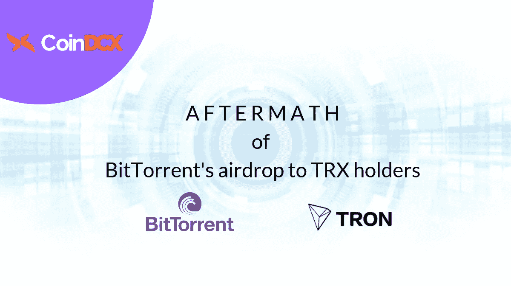
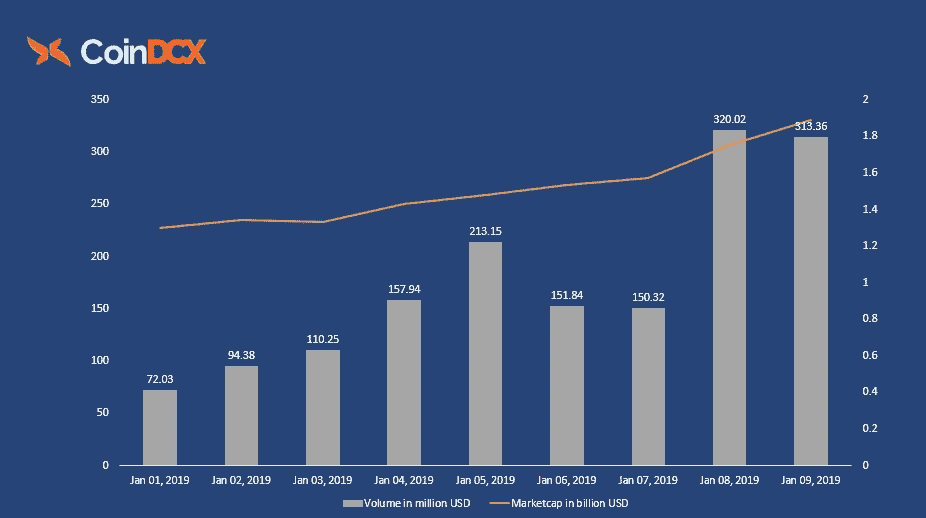
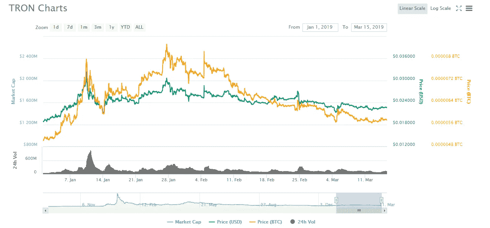
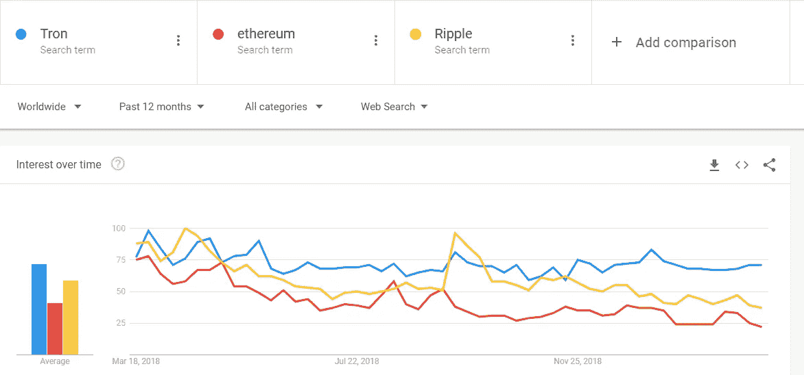

# 创的 BitTorrent (BTT)空投的后果

> 原文：<https://medium.datadriveninvestor.com/aftermath-of-trons-bittorrent-btt-airdrop-be82c76a2c17?source=collection_archive---------12----------------------->

## 解码创的成功

All you need to know about BitTorrent’s airdrop to TRX holders

*声明:内容来源于* [*CoinDCX*](https://coindcx.com/trade/home?utm_source=tronbttddi&utm_medium=tronbttddi&utm_campaign=tronbttddi) *。CoinDCX 不提升/降级任何公司/ICO。本信息或其他媒体中的观点、陈述、估计和预测仅属于作者个人。*

尽管围绕此次销售存在争议，BitTorrent 在仅持续 15 分钟的象征性销售中筹集了总计超过 700 万美元的资金。这是加密领域最快的销售之一，有趣的是，它是在空头还在潜伏的时候出现的。

然而，将 BitTorrent 令牌化被许多人视为 Tron 项目的另一种筹资机制。在[doge coin](https://twitter.com/ummjackson?ref_src=twsrc%5Egoogle%7Ctwcamp%5Eserp%7Ctwgr%5Eauthor)的联合创始人[杰克逊·帕尔默](https://dogecoin.com/)在推特上发表了他的观点后，这种负面情绪更加高涨。因为它从来没有作为一个论点被完全反驳过，所以这些推测可能有一定的价值。

Jackson Palmer, CEO of Dogecoin

BitTorrent 的代币销售在币安的 launchpad 上分两场同时进行，一场面向使用币安本地代币的买家(BNB)，另一场面向使用 Tron 的买家(TRX)，以利用 Tron 和币安的用户群。

 [## 冷存储的重要性——数据驱动的投资者

### 加密货币的出现带来了我们看待货币方式的范式转变。而不是依靠…

www.datadriveninvestor.com](https://www.datadriveninvestor.com/2019/03/14/the-importance-of-cold-storage/) 

# 孙正义营销妙招助推 TRX

与 [**币安**](https://www.binance.com/en) 合作是[创](https://tron.network/)的重大举措之一，在 BitTorrent 的代币销售中具有直接的进步意义。

就在 500 亿代币净销售额 720 万美元的大甩卖日之后，BitTorrent 官方宣布，他们将于 2019 年 2 月 11 日向 TRX 持有者首次空投超过 100 亿代币，相当于总发行量的 1.1%。

向 TRX 持有者免费空投 BTT 代币，导致越来越多的人被添加到 TRX 代币持有者的名单中，从而将 TRX 的表现提高了 20%以上。

此外， [Tron](https://tron.network/) 的市值从宣布空投日期前后的 13.3 亿美元飙升至 16 亿美元，在北方增加了 2.7 亿美元的收益，这简直相当于 BitTorrent 收购价格的 140%以上。

Tron’s (TRX) Market cap pump due to BitTorrent’s airdrop

> [想知道这些数据从何而来？探索 CoinDCX](https://coindcx.com/trade/home?utm_source=tronbttddi&utm_medium=tronbttddi&utm_campaign=tronbttddi)

Tron (TRX)在一个仍在努力从加密冬天中恢复的地区表现良好的要点是加密市场根据新闻移动的指标。BitTorrent 炒作在 2019 年 2 月的第一周推高了 Tron 的价格，而比特币、以太坊和 Ripple 等顶级硬币都在下跌。

Tron coin price trend

# 创成了全城的话题

Tron 在过去 12 个月的交易数量、账户、价格变动和对谷歌趋势的兴趣等领域取代了以太坊和涟漪。

Tron vs Ethereum vs Ripple market search trend

# 贾斯汀·孙的创:在有价值的地方打王牌

区块链空间仍然年轻，尽管这项技术令人兴奋，但它仍处于进化的初级阶段。

Tron 通过收购 BitTorrent，利用了一个完美的时机来满足日益增长的互联网民主化需求，BitTorrent 拥有数亿不断下降但强劲的用户基础。这一战略性收购确实向全球数百万用户介绍了区块链技术。

Justin Sun 声称，与 BitTorrent 的 BTT 协议合作可以让内容创作者以更快、更经济的方式传播他们的作品。

Tron 自诞生以来一直与一个又一个组织合作。与 BitTorrent 的合作可能是这种连胜的高潮，但当然，这可能是迄今为止对双方最重要的一次。因为 Bittorrent 的复兴可以归功于这次收购，因为在经历了近十年的低迷后，它现在见证了流量的飙升。

# 创(TRX)的愿景

Tron 和区块链空间的许多其他项目一样，是一个热情的倡议。然而，这个有趣的案例是，该项目由营销策划人 Justin Sun 领导，并得到了中国投资者的支持。

[Tron 的](https://tron.network/)革新互联网的想法自 2017 年 9 月诞生以来，已经以多种方式发展，这并不是很久以前。当然，所取得的成功很大一部分归功于该公司与不同垂直行业的其他公司的战略合作伙伴关系。

# 合作使市场变得有利

## Tron 的主要合作伙伴

除了重磅收购 BitTorrent 和与[币安](https://www.binance.com/en)达成重大合作协议，Tron 还与 Satowallet、vSport Chain 和百度建立了合作关系。

与[**sato wallet**](https://satowallet.com/)**的合作伙伴关系帮助 Tron 通过在其平台上集成快捷、简单和安全的加密服务，建立了一个忠实的用户群。**

**首先，与中国最受欢迎的搜索引擎百度合作，提高了区块链在全球各行各业的应用。其次，这种合作关系也允许 Tron 从百度购买大部分云计算资源。**

**加强与 vSport Chain 的合作伙伴关系实现了 Tron 的主要目标，即在最常规的人类活动中增加区块链的采用率。**

## **底线**

**抛开围绕 BitTorrent 收购的猜测和争议，公平地说 Tron 是一项有前途的努力。然而，为了保持这种方式，项目必须与其日期标记的前景保持同步。**

**人们开始使用 P2P 平台访问内容只是时间问题。一旦主流观众意识到有形性不是价值的先决条件，而区块链的技术可以以一种经济高效的方式实现这一点，当前的市场领导者，如网飞、HBO 或 T21，将不得不经历流失率。**

> **[喜欢你看到的？](https://coindcx.com/trade/home?utm_source=tronbttddi&utm_medium=tronbttddi&utm_campaign=tronbttddi)**
> 
> **[访问 CoinDCX 了解更多信息](https://coindcx.com/trade/home?utm_source=tronbttddi&utm_medium=tronbttddi&utm_campaign=tronbttddi)**