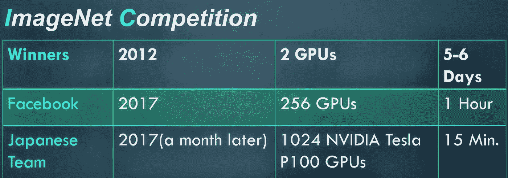
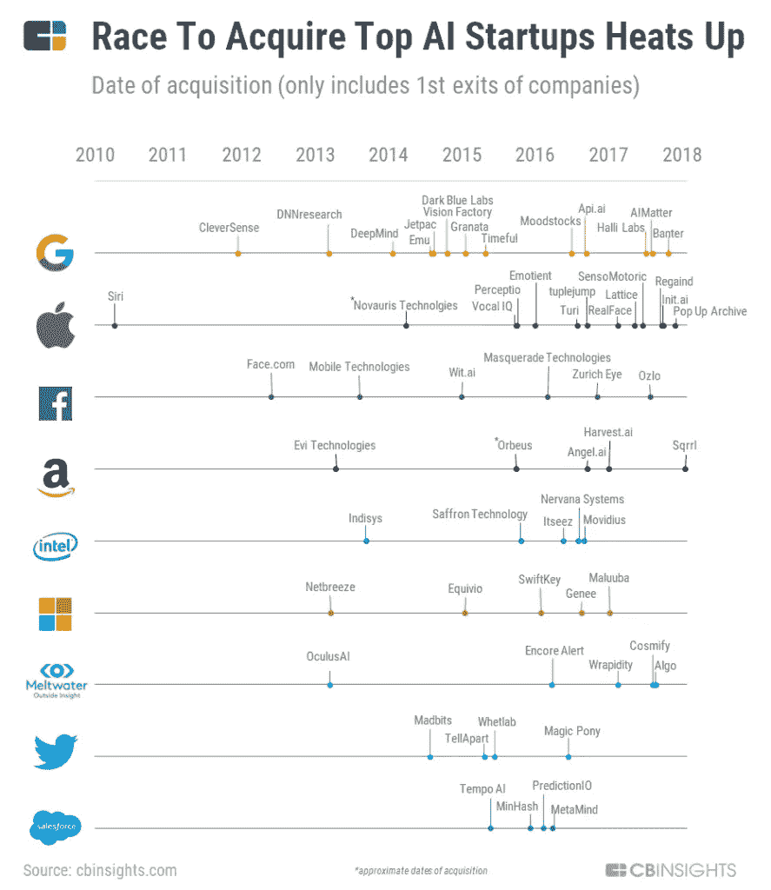
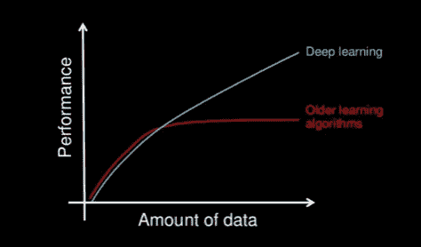
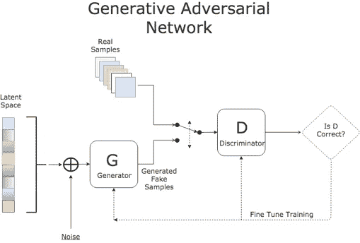
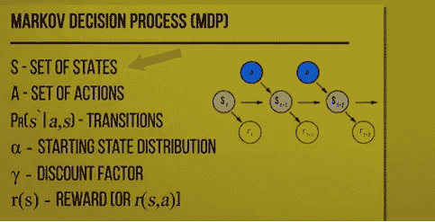
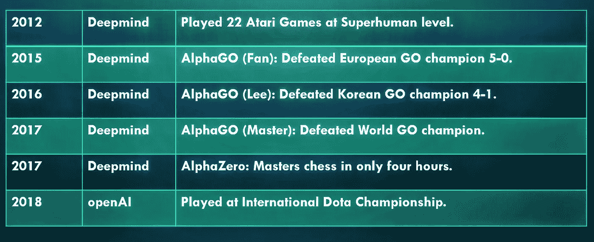

# AGI:最后一项发明？

> 原文：<https://medium.datadriveninvestor.com/agi-the-last-invention-dffd7845ded1?source=collection_archive---------12----------------------->

最近，我在迈索尔的 Infosys 做了一个关于 AGI(人工智能)的演讲。作为一名人工智能爱好者，我用非常基本的术语分享了我迄今为止所学到的知识。通过这篇博文，我想简要概述一下人工智能行业这些年来发生的事情以及未来的发展。

# 威胁

> 全人工智能的发展可能意味着人类的终结。——斯蒂芬·霍金

2018 年 4 月 5 日，一部纪念斯蒂芬·霍金的纪录片上映。
[**你信任这台电脑吗**](http://doyoutrustthiscomputer.org/) **它指出了 AI 的好处，也大多指出了它的危害。
感觉电影其实是偏向 AI 的邪恶。它较少展示人工智能对社会的积极影响。然而，它指出的危险并不是虚构的。这些事情即使不是现在，也有可能在不久的将来实现。假新闻和错误信息已经在世界各地发生。)**

**看科幻电影很有趣，尤其是当它涉及邪恶的机器人杀死人类的时候。
然而，认为这真的会发生是可笑且不合逻辑的，对吗？**

**2015 年，来自工业界的人，科学家，人工智能专家，企业家，对人工智能的安全表示关注，并签署了一封公开信[禁止在制造自主武器中使用人工智能。迄今为止，这封信已经有 26，518 人签名，其中包括知名人士和各种科技名人。](https://futureoflife.org/open-letter-autonomous-weapons/)**

**要想一窥当今人工智能的能力，请看[波士顿动力的机器人](https://youtu.be/6vYA8L_r850)。如果一台机器有能力完成这样的冒险，那么如果它落入坏人之手，也会造成巨大的伤害。**

# **我们现在在哪里？**

**目前，所构建的人工智能被称为**窄或弱人工智能**。它能完成特定的任务。用于自动驾驶汽车的人工智能算法不能用于下棋。
然而，这种情况正在慢慢改变。**

**我们人类的目标是到达 AGI。这是一种智能水平，算法、软件、机器或机器人，不管你叫它什么，真正像我们人类一样思考和行动。当这个 AGI 建成后，它将能够递归自我改进，这将导致智能爆炸，并将产生超越所有人类智能的强大超级智能。
这个假设被称为**奇点**，是一个被热议的话题。**

# **硬币的另一面。**

**持有片面的观点，尤其是在技术方面，是不公平的。其他人工智能专家完全否认 AGI 会在不远的将来到来，至少在十年内。**

**著名的人工智能研究者 Andrew NG 说，
*“担心机器人杀手和 AGI 就像担心火星人口过剩一样。”***

**互联网的发源地 DARPA 也有他们[自己对人工智能](https://youtu.be/-O01G3tSYpU)的看法。**

**因此，在该领域的专家中存在矛盾的意见。然而，抛开对人工智能的看法和猜测，这项技术近年来的影响是显著的。**

**从在医疗诊断方面超越人类到下棋和下围棋，自动驾驶汽车、虚拟助手、人脸识别和其他许多跨领域的问题都已经通过人工智能变得容易得多。**

# **这两种成分**

**人工智能技术的这些进步大多发生在过去的 4 到 5 年里。
**数据**和**计算能力**是导致它的两个主要成分。**

**根据摩尔定律，计算能力呈指数增长。
此外，目前 90%的数据是在过去 4 年中创建的，并且还在以更快的速度增长。**

> **"世界上最有价值的资源不再是石油，而是数据."**

**ImageNet 竞争是一个很好的例子，可以看出为什么硬件是一个如此重要的东西，可以导致 AGI。**

****

****The model that took 5 days to train, after 5 years, is taking just 15 minutes.****

**这可能只是一个起点，因为世界现在更加积极地生产更强大的人工智能芯片。2017 年，谷歌发布了其张量处理单元(TPUs)的第二代产品，该产品专门用于加速机器学习任务。**

# **追求**

**人工智能是一项颠覆性的技术，以至于每个主要的科技公司都有自己的人工智能部门，他们都在追求解决人工智能问题。
**谷歌:** *Deepmind，大脑团队*
**脸书:** *尚可*
**微软:** *MSRAI*
**妖孽:** *优步 AI Labs***

**此外，还有其他私人公司，如 OpenAI，旨在促进和发展友好的人工智能。**

**每年都有大量人工智能初创公司诞生，如果它们足够优秀，大型科技巨头就会收购它们。**

****

# **在幕后**

**今天使用的算法和技术产生了很好的结果，是很久以前发明的。**

**它们不是新的。由于大量的数据和强大的硬件，它们现在正被充分利用。**

*****深度学习*****

****

**这是一种统计技术，由 Geoffrey Hinton、Yann Lecun 和 Yoshua Bengio 在 2012 年 ImageNet 比赛中首次成功使用。**

**它涉及**多层神经网络**，通过每一层处理和提炼结果。
这项技术可以追溯到 20 世纪 60 年代，但是当给定大量数据和计算能力时，它胜过其他任何算法。**

**深度学习在识别模式方面非常有效，无论是图像、音频还是文本。大量使用 DL 的一些应用是语音识别和翻译(Siri，Google Assistant)，图像分类(人脸识别)，推荐系统(亚马逊，网飞)，文本生成和其他领域。**

**神经网络被称为**通用函数逼近器**，即它们可以解决任何问题，如果该问题可以被公式化为具有一个或多个参数/输入的函数。**

**然而，深度学习有其局限性。其中一些是:**

*   **它需要大量的数据才能表现良好。我们人类不需要成百上千的数据样本来学习一些东西。**
*   **主要解决**监督学习**问题，即被标记的数据。**
*   **神经网络有点像黑匣子。人工智能研究人员自己并不总是知道神经网络实际上在做什么。**

**[Tay.ai](https://en.wikipedia.org/wiki/Tay_(bot)) ，一个由微软打造的 AI twitter 机器人，因为开始发布煽动性和攻击性的推文，仅在推出 16 个小时后就被关闭。另一个事件发生在去年，当脸书的人工智能机器人开始用他们自己的语言相互交谈后就关闭了。**

*****无监督深度学习*****

**如果我们要到达 AGI，努力需要更多地集中在**无监督学习**上，在那里测试数据没有被标记，因为大多数现实世界的问题本质上都是无监督的。**

**最近的一种方法，称为 **GANs 或“生成对抗网络”**，与无监督的深度学习直接相关。**

**人工智能算法中主要有两类模型，**生成型**和**判别型**。
判别算法不关心数据是如何产生的；它只是对给定的信号进行分类。它们非常适合分类任务。例:**决策树，支持向量机，NN** 。
另一方面，生成算法确实关心数据是如何被创建的，以便学习类的分布。例如:GANs，自动编码器，朴素贝叶斯等…**

**生成模型背后的直觉有点像:**

> **"我不能创造的东西，我不明白。"
> —理查德·费曼**

**因此，GANs 是生成模型，它使用以对抗方式训练的神经网络来生成模拟某种分布的数据。**

**任务，例如:**

*   **从描述生成图像**
*   **从低分辨率图像获取高分辨率图像**
*   **预测哪种药物可以治疗某种疾病等**

**可以用这种技术解决。**

****

**gan 由 Ian Goodfellow 在 2014 年首创。
有两个神经网络，一个是生成器 G，用于生成假样本，另一个是鉴别器 D，用于估计来自 G 的数据来自训练集或 G 本身的概率。
把 G 想成制假人，把 D 想成警察。他们是对手，因此得名**对抗网**。
G 不断制造假数据并试图在不被检测的情况下使用，D 则试图检测数据是否是假的。这种情况一直在发生，两个模型都在改进他们的方法，直到最终，假数据与真数据无法区分。**

**GAN 最近变得流行，仅在去年就产生了各种版本的 GAN(WGAN、BEGAN、Cycle GAN、Progressive GAN)。**

*****试错*****

**另一种近年来加速发展的人工智能技术是**强化学习**。**

**简而言之，这是一种试错技术，人工智能通过执行一些动作来学习，并根据它的动作获得奖励，这种奖励充当了所采取的动作是好是坏的信号。
这个过程一直持续到人工智能掌握了技能，并且在数学上被公式化为**马尔可夫决策过程**。**

********

**这种技术与我们人类的学习方式非常相似。但是，由于我们需要数年时间来掌握一项技能，这些算法只需要几天甚至几个小时就可以成为特定任务的专家。**

**和深度学习一样，RL 也是一个老技术，可以追溯到 20 世纪 60 年代。这被认为是一个有趣的想法，但直到 2012 年才产生好的结果。**

**Deepmind 使用强化学习和多层神经网络，让一个人工智能机器人在超人的水平上玩 22 场雅达利游戏。**

****

**Over the years, reinforcement learning has successfully pulled off tasks that seem impossible in the past.**

**这种用神经网络进行强化学习的想法被称为**深度强化学习**。
深 RL 近年来取得重大突破。像 Deepmind 和 OpenAI 这样的机构正在持续使用这种技术来制作像国际象棋、围棋和 Dota 这样的人工智能大师游戏。由于电子游戏是最接近真实世界的模拟，如果一个人工智能能够以超人的水平玩游戏，那么它也可能有效地解决真实世界的问题。**

*****其他技法*****

**为了让深度强化学习通向 AGI，它可能需要其他算法和技术。**

****迁移学习**就是其中之一。
deep mind 的联合创始人戴密斯·哈萨比斯说， ***“迁移学习是一般智力的关键。”***
这是一种技术，在一个任务上训练的模型被重新用于第二个相关的任务。**

**另一个被称为**一次性学习**的有趣技术是对大量数据进行训练的深度学习问题的解决方案。
它旨在从一个或几个训练样本中学习。**

# **结论**

**今年早些时候，加州大学伯克利分校发布了一篇名为[“现在人人跳舞”的论文。给定一个人跳舞的源视频，该算法可以在目标主体表演标准动作仅几分钟后将该表演转移到一个新的(业余)目标。](https://youtu.be/PCBTZh41Ris)**

**这项技术的含义是深远的。
这将有助于制作音乐视频和广告活动，但相反，现在创建虚假数据非常容易。我们对现实的感觉将被完全扭曲，因为我们将无法分辨什么是真实的，什么不是。**

**虚假数据只是这种强大的不断发展的技术的黑暗面之一。大型行业和自主武器行业的失业是其他一些例子。**

**不管本世纪是否会创造出超人的人工智能，很明显人工智能正变得越来越强大，在未来几年甚至会变得更强大。**

## **问题是“在这个人工智能时代，作为一个社会和人类，我们能做些什么？”**

# **民主化人工智能**

**让每个人都可以免费或以非常低的成本获得人工智能教育，是传播意识，让人们知道和选择人类未来应该是什么样子的最伟大的举措之一。**

**像 fast.ai 和 schoolofai 这样的机构已经在免费提供世界级的人工智能教育。OpenAI 还向公众开放其专利和研究，旨在以造福全人类的方式促进和发展友好的人工智能。**

**作为这项强大技术的一部分，无论是使用它还是创造它，每个人都应该问这样一个问题:**

> **当这种强大的技术影响着地球上的每一个人时，为什么只有少数组织能够使用它？**

***图片鸣谢:* [*竞得顶级 AI 初创公司*](https://www.cbinsights.com/research/top-acquirers-ai-startups-ma-timeline/)*[*深度学习*](https://machinelearningmastery.com/what-is-deep-learning/)*[*甘斯*](https://stats.stackexchange.com/questions/277756/some-general-questions-on-generative-adversarial-networks)*[*强化学习*](https://www.youtube.com/watch?v=i_McNBDP9Qs)*****