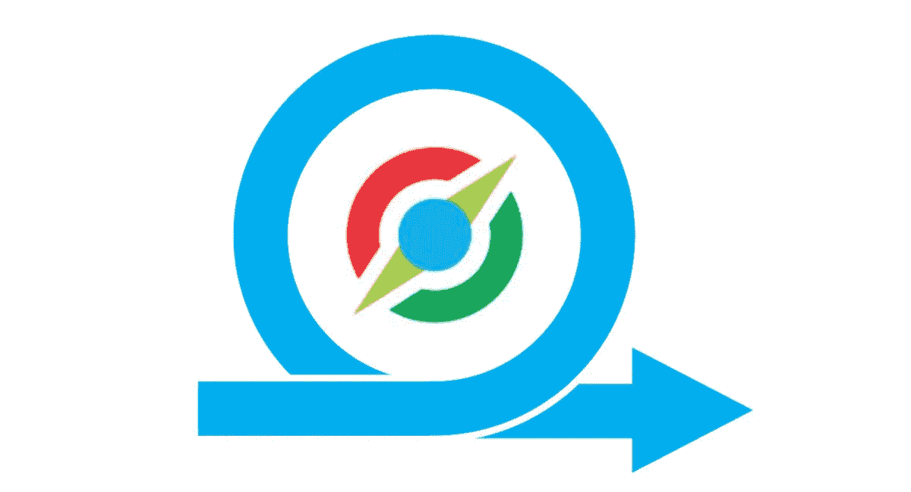
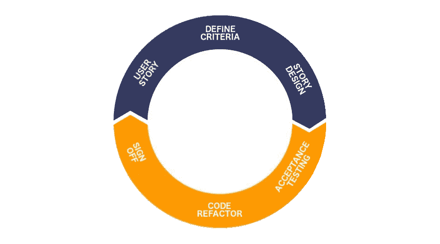
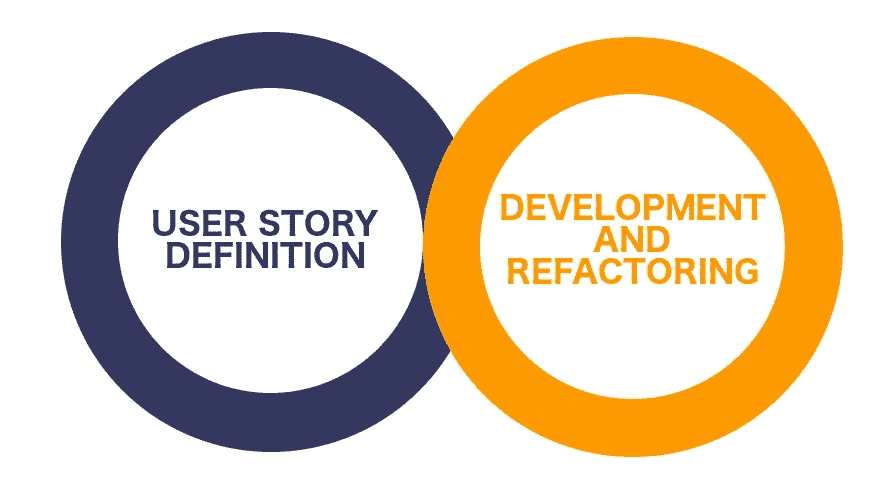

# 敏捷开发与适应性

> 原文：<https://medium.datadriveninvestor.com/agile-development-with-fitnesse-6244e25df11c?source=collection_archive---------18----------------------->

我见过许多开发方法和许多工具，但最近我发现了一种新的敏捷协作方式，它真正启发了我。

## 什么？

在快速灵活的环境中工作可能具有挑战性，但是，团队的最大目标之一是保持产品的高质量。为了保持高质量，我们可以建议的第一件事是用单元测试覆盖功能，但即使如此，这也不能保证所有的特性都按照要求实现了。

> “单元测试确保你构建的东西是正确的”。

此时，验收测试驱动的开发 *(ATTD)* 开始发挥作用。

> “验收测试确保你构建正确的东西”。

有几个工具可以帮助我们处理 ATTD: [Fit](http://fit.c2.com/) 、 [FitNesse](http://fitnesse.org/) 和[cumber](https://cucumber.io/)，但这次我们将检查 fitnese。

## 为什么？

如果有人让我描述健康，我可能会选择这些词:多功能、协作和可靠。我也会选择这些词来描述 Scrum/Agile 方法论，这并不是巧合。适应性的整个概念都围绕着敏捷原则。

作为一名软件工程师，我一直深受将验收标准从客户转移到团队的老派方法之苦。是时候决定我们应该改进什么了。

**为大家 Wiki。**绝大多数项目相关文档都集中在开发人员的代码库中。从 Cucumber 的特性文件中获得关于某部分功能的所有信息并不是什么大不了的事情，但是那些不能访问或修改现有源代码的团队成员怎么办呢——他们被迫与独立的文档来源达成协议，这反过来导致团队失去同步。这就是为什么 FitNesse 坚持通过用户友好的网络界面共享 Wiki/验收测试信息的想法。

**面向所有人的验收测试。**变化可能会突然出现在每个人面前，因此尽快获得与可能的影响相关的信息非常重要。*“看起来 FitNesse 甚至可以帮你解决这个问题”*——从角落里的某个地方，鲍勃叔叔大声喊了出来。每个团队成员(或者甚至一个客户)都可以创建或者更新已经存在的测试标准，以验证这些变化是如何影响当前的业务逻辑的。

## 怎么会？

我们澄清了 FitNesee 的一般概念，让我们来看看常规的工作流程。

User Story Lifecycle

这张图代表了用户故事的生命周期，通过查看这张图，我们已经可以定义主要问题— *封闭迭代*。基本上，在流程的起点到终点之间的变化是不受欢迎的。

**为什么会出现这种情况？**嗯，这就是我在本文开头提出的——“转移验收标准”。这里的关键词是转移。基本上，一旦客户将某个用户故事的通过标准传递给团队，在每一个单独的时刻，这个标准都可能被客户改变或者被曲解，每个人都只能在流程的最后，在签核阶段弄清楚。

让我们看看，如果在我们的过程中，我们有一个共同的文档和验收测试的来源，我们可以实现什么。

Detached Story Definition and Development Lifecycles

在更新的过程中，我们的故事定义和开发生命周期并不相互关联，因此，由于有了共同的集成点，过程中可能出现的所有更改都可以更容易地处理，问题也可以更快地解决。

## 结论

你对适应性和验收测试驱动的开发有一个大致的概念。你已经明白了为什么以及什么时候你必须使用它来达到更高的目标。

欢迎在下面的评论区继续讨论。

玩得开心！