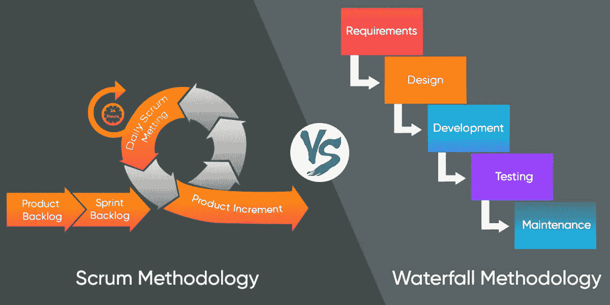
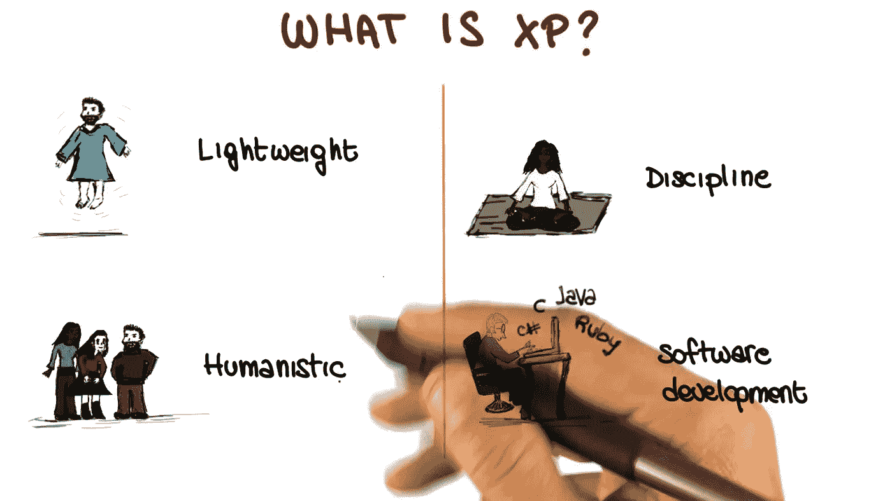
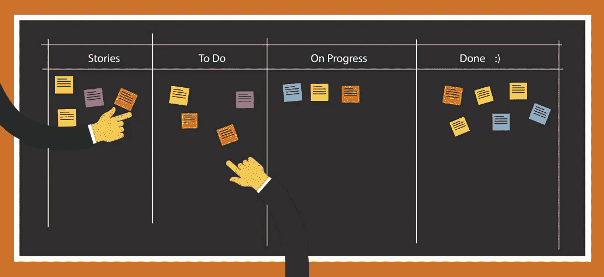
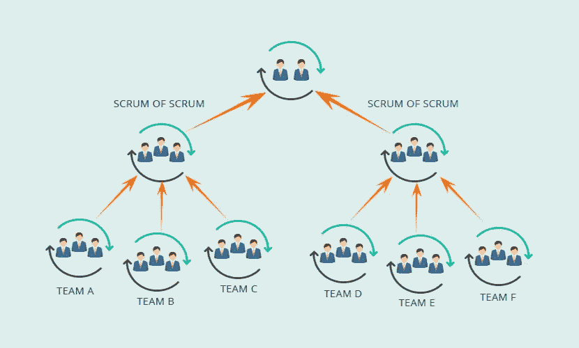

# 敏捷实践是企业界的最佳方法…

> 原文：<https://medium.datadriveninvestor.com/agile-practices-is-the-best-approach-in-the-corporate-world-627c406069af?source=collection_archive---------11----------------------->

在软件工程公司世界中，有两种主要类型的公司。分别是 ***服务型公司*** 和 ***产品型公司*** 。但是大多数公司在他们的开发和部署过程中使用敏捷实践。这篇文章描述了我在第四学期 ***软件工程*** 模块中学到的东西，以及我在伦敦证券交易所集团(LSEG)的辅导课上听到的东西。这是我在 Medium 的第 14 篇文章。

在斯里兰卡，伦敦证券交易所集团、WSO2、CodeGen 和许多其他公司都是以产品为基础的公司。但是 Virtusa 是一家以服务为基础的大公司。

有许多不同的软件过程，但都涉及到规格说明、设计和实现、验证和发展。软件过程模型是过程的抽象表示。软件中有两种主要的过程模型。他们是计划驱动的，敏捷的。在计划驱动中，每个软件过程都是预先计划好的，并且每个过程都依赖于前一个过程的结果。在敏捷中，计划是渐进的，每个过程都可能根据客户需求而变化。我们不能说敏捷是正确的过程模型，计划驱动是错误的过程模型。但是现在顾客的要求变化很快，因为世界潮流变化很快。因此，公司选择在他们的软件开发中使用敏捷。

## 什么是敏捷？

敏捷意味着能够快速改变/行动。随着技术的发展，人类的需求也在增长。敏捷最早可以追溯到 1957 年。敏捷的主要概念是给予增量交付。敏捷减少了计划驱动的开销，比如文档。在敏捷中，客户提供新的需求，客户密切参与整个过程。通过敏捷开发的系统在交付后应该可以在没有开发人员的情况下工作。通过敏捷开发的系统应该接受变化，并与新的变化一起工作。有许多敏捷软件开发方法。敏捷软件方法可以适用于大范围的 ***软件开发生命周期*** (SDLC)。在此，我描述一些流行的敏捷软件开发框架。如 ***极限编程(XP)、特征驱动开发(FDD)、适应性系统开发(ASD)、动态系统开发方法(DSDM)、精益软件开发(LSD)、看板和 Scrum。***

## 极限编程(XP)

这是一种敏捷方法，当客户需要一个最好质量的产品时，开发过程通过极限编程。极限编程侧重于技术方面。 ***测试优先开发和结对编程*** 是重要的极限编程实践。

**测试优先开发**

在极端情况下，产品中的每一个变化都是在测试之后发布的。用户参与产品的测试开发和验证。在这里，测试被写成程序。

**成对编程**

结对编程意味着一对程序员一起工作。它有助于开发高质量的产品。每一行代码都由两个人查看，这样代码中的错误就会减少。配对是动态创建的，每一对在一台计算机上工作。两个人一组，一个人编码，另一个人检查代码，他们会改变位置，随机地进行编码和检查。

然而，极限编程只关注技术方面，其他方面在管理方面是失败的。

## ***Scrum***

它也是一种关注项目管理的敏捷方法。这是一个用于管理产品开发的迭代软件开发模型。一个开发团队通常有 5-7 个人(包括 Scrum Master 和产品负责人)。在每个开发团队中，都有一个叫做“***【Scrum Master】***”的人负责确保 Scrum 过程被遵循，并指导团队有效地使用 Scrum。Scrum Master 不应该被认为是项目经理。Scrum Master 也和开发过程一起工作。在每个 Scrum 团队中，都有另一个人负责识别产品特性或需求，为开发确定这些特性或需求的优先级，并持续审查产品积压，以确保项目继续满足关键的业务需求，这个人叫做 ***【产品所有者】*** 。

有一种固定长度的迭代叫做 ***【冲刺】*** 。每次冲刺通常持续 2-4 周。在 Sprint 周期中，客户和开发团队通过 Scrum Master 联系。在 sprint 中，每天早上，开发团队成员和他们的 Scrum Master 互相讨论他们前一天做了什么，以及他们今天计划做什么。

在多团队 scrum 中，每天都有一个 Scrum***Scrum of Scrum***(SoS)，每个团队的代表(代表应该是团队中的技术贡献者)开会讨论进度和计划，以及要做的工作。来自每个团队的一个人也参与到 Scrum 的 Scrum 中来协调该团队之上的工作。这些团队通过一群又一群的 Scrum(soso)进一步协调他们的工作。

这两种方法在软件开发公司中被广泛使用。因此，我对这些方法做一个简单的介绍。

***感谢您阅读至此。如果你喜欢这篇文章，请分享、评论并发表👏几次(最多 50 次)。。。也许会对某个人有帮助。***

***关注我的***[***Twitter***](https://twitter.com/TheSabesan)***和 Medium 如果你将来对这些更深入、更翔实的文章感兴趣的话！***

## 来自 DDI 的相关故事:

 [## 数据科学和软件工程哪个更有前途？-数据驱动型投资者

### 大约一个月前，当我坐在咖啡馆里为一个客户开发网站时，我发现了这个女人…

www.datadriveninvestor.com](https://www.datadriveninvestor.com/2019/01/23/which-is-more-promising-data-science-or-software-engineering/)