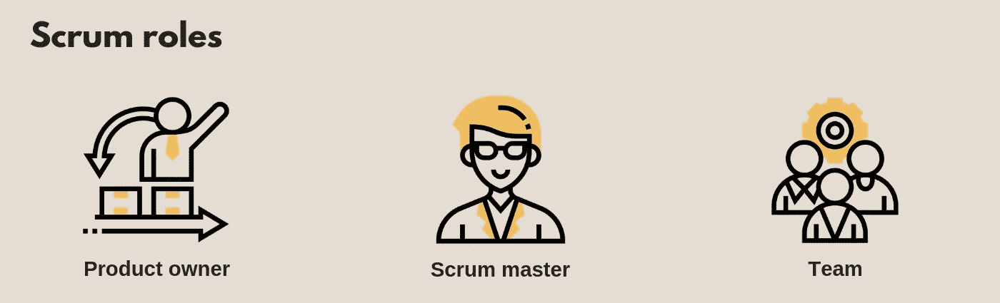
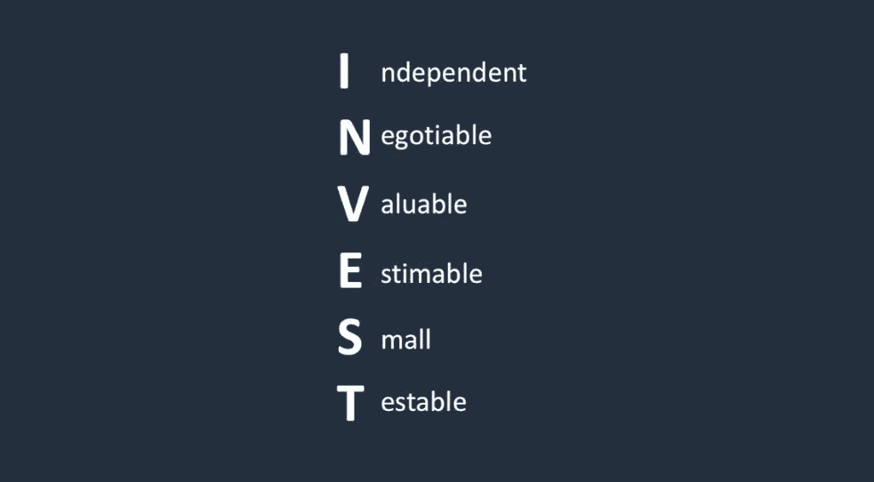
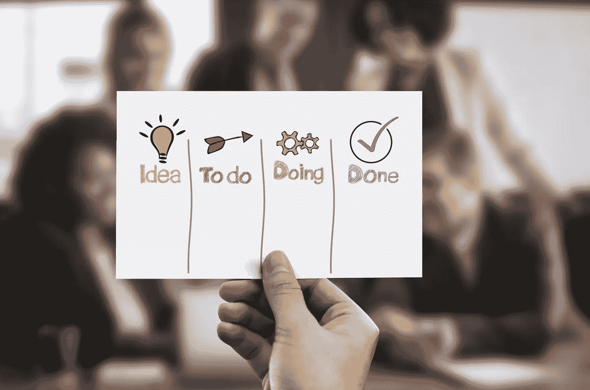
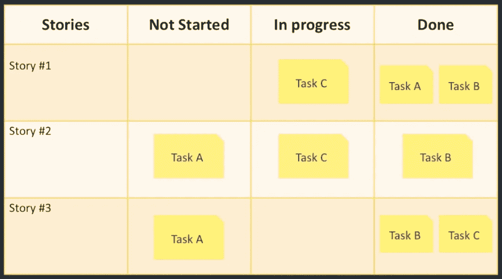
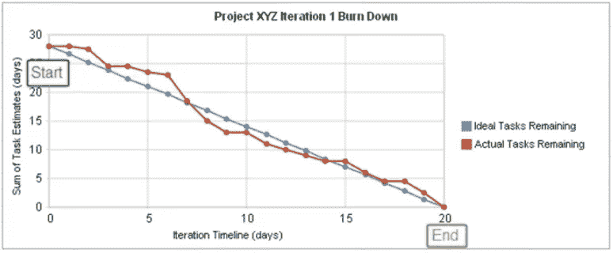

# 简明扼要的敏捷 Scrum 基础|循序渐进的 Scrum

> 原文：<https://medium.datadriveninvestor.com/agile-scrum-fundamentals-in-a-nutshell-scrum-step-by-step-af3170a4d8cc?source=collection_archive---------3----------------------->

Scrum 是实现[敏捷](https://medium.com/@nsdnaushad/agile-revolution-what-exactly-is-agile-66efb8167446?sk=5d37d597d8d61d1a088bef37b992f1c1)思维模式的最流行的框架之一。

Scrum 工作在一至四周的 sprint 阶段，你设计、构建和测试你产品的一部分。然后把它呈现给你的利益相关者，看看你是否需要调整你的产品。然后你一次又一次地重复这个循环。这样，在每次冲刺之后，您都在逐步构建您的产品。最后，你得到了你的最终产品。

在 Scrum 中，冲刺是一段固定的时间，在这段时间内特定的工作必须完成并准备好接受评审。

现在我们知道了 Scrum 背后的基本思想，让我们更深入地了解 Scrum 中发生了什么。

# Scrum 角色

Scrum 中定义了三种角色。

Scrum roles

1.  **产品负责人**:她是团队的业务代表，负责定义需要做什么以及按什么顺序做。这是一份全职工作。产品负责人在任何工作开始之前建立愿景。愿景是指引你和你的团队到达目的地的地图。
2.  **Scrum 大师**:他主持大多数团队会议，确保团队忠于 Scrum 价值观和原则。他保护团队不受干扰地完成工作，并解决日常问题。
3.  团队:团队包括开发人员、测试人员和所有人。他们是自组织的，他们完成了大部分的软件开发。

# 用户故事

产品负责人将与高管、团队、利益相关者、客户、用户交谈，并定义到底需要构建什么，称为产品 backlog。产品 backlog 是一个用户故事的列表，它被区分了优先级，并定义了需要做的事情。

Product owner defines product backlog

**用户故事**是客户/用户与我们产品的互动。用户与我们产品的每一次互动都告诉我们用户将如何使用我们的产品。这是我们在开发产品之前需要知道的细节层次。产品负责人在采访利益相关者和客户代表后，写下这些故事。

## 在 Scrum 中，高质量的用户故事是用 INVEST 缩写写的。

好的用户故事是**独立的**。它可以与其他用户故事分开交付，本身就有价值。

好的用户故事是**可协商的**,直到故事被提交工作。可以随时重写、更改或取消。

好的用户故事是有价值的。它为产品所有者、股东和客户带来价值。

好的用户故事是**可评估的**。你必须能够估计故事的大小和故事点。这意味着这个故事有足够的描述性，这样你就知道要完成它需要做什么。只有这样，你才能明白需要付出的努力。

好的用户故事是**小**。这个故事足够小，可以在一次冲刺中完成。

好的用户故事是**可测试的**。这个故事提供了足够的信息，你可以为它开发测试。

用户故事是一种战术工具，scrum 团队使用它来定义他们产品的工作。编写一个优秀的用户故事可能很有挑战性，但是随着时间的推移，通过练习会变得更容易。

# 验收标准(AC)

好的用户故事也要有验收标准，简称 AC。AC 是团队用来减少完成故事的工作量的最有力的工具。

这是一个清单，在开发人员可以将用户故事标记为“完成”之前，它确定用户故事的所有参数是否都已完成、测试和工作。所有的标准都必须满足，这样才能确保用户故事按照计划和测试的方式运行。

示例:为了在电子商务站点中创建用户配置文件，AC 可以是

*   捕获并保存客户名称。
*   捕获并保存客户电子邮件。
*   捕获并保存客户电话号码。
*   捕获并保存客户密码。
*   捕获并保存客户送货地址。

每当编写用户故事时，产品负责人和团队都会合作确定故事的 AC。每个故事都有一套独特的 AC。

验收标准应该尽可能明确，以便团队中的所有成员都知道首先要做什么。

# 成功标准

到现在为止，你应该已经将你的特性和主题分解成了通常的故事，并且将 AC 分配给了所有的用户故事。这是你的产品积压。

您的下一步是创建您的团队可以用来完成工作的边界。这些指导方针包括团队对“完成”的定义**、**待办事项整理和建立冲刺节奏。

## 完成的定义

首先，你的团队应该定义完成对他们的故事意味着什么。与 AC 不同，Done 的定义更加宽泛，它应该满足 backlog 中所有故事的最低要求。

例如:您的团队可能会决定，只有当一个故事在预发布环境中经过代码审查和测试时，它才可以被称为完成。

## 积压整理

它仅仅意味着产品所有者不断地按照价值的顺序排列故事。故事的结局越有价值，它在待办事项列表中的位置就越高。产品负责人应该确保首先交付最有价值的东西。这样，即使时间用完了，有价值的产品仍然可以交付。

如果有更大的故事需要被分割成更小的，这样它们就可以适应 sprint，那么产品负责人也会参与其中。

所有这些活动要么发生在会议中，要么发生在类似待办事项整理的会话中。

## 冲刺节奏

最后，你应该确定你的冲刺节奏或持续时间。Scrum 说 Sprint 的长度可以是 1 到 4 周，最好是更短的时间。

记住 scrums 说我们应该失败并快速学习。在这种情况下，你应该尽可能建立最短的可行冲刺长度。

当我和团队一起工作时，我通常建议用 2 周左右的时间。这个持续时间确实有助于团队专注于冲刺阶段发生的事情。

两周的冲刺是金发区。在我看来。

如果你的冲刺太短，团队会恐慌，质量会下降。如果你冲刺的时间太长，团队会不自觉地放松，他们的速度会下降。

建立这三个界限将有助于团队理解“完成”对于待办事项中的故事意味着什么，每个故事承载着什么价值，以及每个故事应该在什么时间交付。因此，他们现在有一个完美的执行框架来执行。

# 冲刺计划会议

Sprint planning meeting

一旦团队准备好冲刺，他们就会聚在一起开一个叫做**冲刺计划会议**的会议。在这次会议中，团队挑选出他们可以在现有 Sprint 中处理的热门故事。产品负责人与团队一起回顾这些故事，并帮助回答任何问题或澄清任何不清楚的事情。

后来团队聚在一起**分配故事**，弄清楚他们到底需要做什么来构建软件，比如设计数据库，开发 UI 和其他相关的。

一旦团队完成了故事，他们将最终确定完成所选故事需要多少冲刺。然后各队开始执行。

这里的目标是团队中的每个人都完全理解故事的意图和故事的具体接受标准。这也有助于在会议室张贴团队对所有故事的完成定义。

# 站立会议

scrum master 建立你的日常 scrum。这通常也被称为每日站立会议或简称站立会议。它包括团队中的每个人，包括产品负责人和 Scrum Master。

scrums 的工作依赖于三个 C。协作交流和节奏。

它每天在同一时间发生。所以你的 scrum 主人会选择适合每个人的时间。

一般都是在团队的任务板前举行，不管是电子的还是实体的。这是每个团队成员全面展示他们的进展的时候。

在会议中，每个人都谈论他们昨天做了什么，他们今天要做什么，如果有任何障碍，寻求帮助。

任何人都不应该对他们的活动进行详细的报道。只是概述。

每日站立应该是短的。应该限制在 15 分钟以内。它可以更短，但不能更长。整个团队都站起来保持速度。

Scrum master 主持会议，确保每个团队成员都遵守上述规则。

底线是你的日常站立是 scrum 框架中不可协商的。

# Scrum 报告

如果你在做一个关键项目，利益相关者询问你的团队成员事情进展如何是很常见的。这很好，人们对你项目的成果感兴趣。

然而，这对你的团队来说可能是一种干扰，因为一些团队成员对事情的进展有完整的观点，而其他人可能没有。

Scrum 通过发布信息辐射器来应对挑战。信息辐射器是你张贴在墙上或团队网站上的任何东西，它可以帮助每个人了解你在做什么以及进展如何。

至少团队会发布他们的**任务板**和他们的**消耗图表**。

## 任务板

任务板可以采用你喜欢的任何形式，但是它有几个你需要遵循的关键部分。

它显示了在 sprint 中提交的故事、处于当前状态的故事以及已经完成的故事。

下面是一个简单的任务板的例子。

Scrum Task board

它清楚地显示了提交的故事和相关的任务。它进一步显示了哪些任务尚未开始，哪些任务正在进行中。最后，它显示哪些任务已经完成。

这是一个简单的工具，它非常容易地告诉每个人团队正在做什么。董事会成为 Sprint 执行的核心。

团队将聚集在一起，跟踪冲刺阶段发生的事情，如果有任何问题，互相帮助。

## 燃尽图

分享进度信息的另一个主要工具是 sprint burned down 图表。团队用这个来衡量他们在 sprint 中的执行情况。

这是一个冲刺烧毁的例子。

正如你所看到的，burned 告诉你一天中你在 sprint 中的确切位置，以及在整个 sprint 中要做多少工作。理想情况下，你会以线性方式燃烧。

所以在这个图表中，x 轴是显示冲刺阶段天数的时间，y 轴是一些任务估计值的总和。

蓝线显示的是减少工作量的理想方式。它从工作的总数开始，然后在 sprint 结束时下降到零。

红线显示剩余的实际任务。正如你在开始时看到的，车队做得很好，然后在中间，他们没有走上正轨，最后，他们回来了。

实际行告诉你，与理想相比，你做得如何。这是一个非常强大的工具，可以向团队和所有涉众展示团队的进展情况。

易于创建，易于使用和理解。这些 sprint 报告方法将很好地服务于您的团队，并且您的利益相关者将欣赏拥有一个清晰的状态。

# 冲刺回顾和回顾

在 sprint 结束时，还有另外两个会议。

**冲刺评审**，整个团队与利益相关者和客户聚在一起，展示他们已经完成的工作并获得反馈。

**冲刺回顾，**他们谈论过程而不是产品。大部分讨论都发生在上次冲刺中哪些进展顺利，哪些进展不顺利，以及我们如何能做得更好？这满足了敏捷背后的原则，即团队需要一个机会来定期反思如何变得更有效，并相应地调整他们的行为

最后，让我们看看 Scrum 是如何支持敏捷原则的:

1.  如你所见，我们凭直觉进行建设，因此它拥抱变化。
2.  在每一次冲刺之后，你可以对你的产品清单进行修改，并将你的产品转移到不同的方向。
3.  它还支持许多协作会议。
4.  通过 sprint 回顾支持持续改进

这样的例子不胜枚举，正如我们所看到的，它至少体现了敏捷的关键原则。

## 总结

Scrum 中有三个角色，Scrum master，团队和产品负责人。有一些惯例，比如冲刺计划会议、每日 Scrum 会议、冲刺回顾和冲刺回顾。还有一些工件，比如产品待办事项、sprint 待办事项、任务板和燃尽图。

如果你想了解更多关于“[掌握敏捷 Scrum 项目管理](https://skl.sh/2DUT2Xh)”的内容，请浏览我在 [**Skillshare**](https://skl.sh/2DUT2Xh) 上的视频课程。在那里见。

**你可能想看看我的另一篇文章** [**敏捷革命|到底什么是敏捷？**](https://medium.com/@nsdnaushad/agile-revolution-what-exactly-is-agile-66efb8167446?sk=5d37d597d8d61d1a088bef37b992f1c1)

我写关于企业家精神和计算机科学的文章。关注我的每周文章。如果你喜欢这篇文章，分享一下，点击👏这样其他人就可以读了。

我是[PluraliQ.com](https://pluraliq.com/)的幕后推手——为孩子开设的私人在线一对一编程课程。

**联系我上@**[**Linkedin**](http://www.linkedin.com/in/naushad-shaik-b8187362)**@**[**Twitter**](https://twitter.com/nsdnaushad)**。**

*图像演职员表:
图像 1、3、5、6 由* [*rawpixel*](https://pixabay.com/users/rawpixel-4283981/?utm_source=link-attribution&utm_medium=referral&utm_campaign=image&utm_content=3472462) *和*[*Gerd Altmann*](https://pixabay.com/users/geralt-9301/?utm_source=link-attribution&utm_medium=referral&utm_campaign=image&utm_content=4051773)*来自* [*Pixabay*](https://pixabay.com/?utm_source=link-attribution&utm_medium=referral&utm_campaign=image&utm_content=3472462)