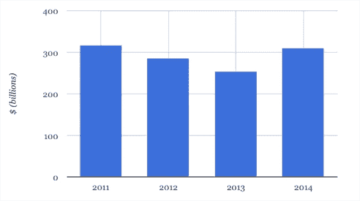

# 农业是科技的下一个泡沫

> 原文：<https://medium.datadriveninvestor.com/agriculture-is-the-next-tech-bubble-c5f1700515cc?source=collection_archive---------1----------------------->

Photo by [Antoine Barrès](https://unsplash.com/photos/o4u8pFwSiQE?utm_source=unsplash&utm_medium=referral&utm_content=creditCopyText) on [Unsplash](https://unsplash.com/search/photos/farm?utm_source=unsplash&utm_medium=referral&utm_content=creditCopyText)

农业技术(被亲切地称为“农业技术”)已经成为最有趣的工作领域之一。投资者将他们所有的钱都投入到农业科技中，希望他们能得到清洁能源产业的“特斯拉”。事实是，Agritech 的太阳正在落山，不久我们将看到许多这样的公司倒闭。

> 农业技术和清洁能源是迄今为止最有吸引力的行业，它们都有同样的潜在问题。

5 年多以前，清洁能源是最热门的行业。世界各地的公司都在努力制造最高效的太阳能电池板，或者恰当地利用风能、水能和天然气。其他人试图制造电力驱动而非燃料驱动的车辆。所有人的目光都集中在使用清洁能源技术(Cleantech)的公司身上。

一个由可再生能源驱动的世界有着巨大的希望。每个人都认为他们有正确的想法，这个想法会让世界变得更好。一些公司获得了数十亿美元的资金，一些公司幸运地获得了几十万美元。但是两组之间有一点是相同的，那就是他们几乎都失败了。

在此期间，清洁能源方面的进步很少，而且很少。那种认为大量聪明的头脑致力于一个大问题会使该领域的创新更快的想法被彻底否定了。公司纷纷倒下。最终，我们没有得到我们都期待的清洁技术的繁荣；相反，我们得到了一个十亿美元的集体坟墓。几年后，真正的赢家才浮出水面，他们为此而努力。

农业技术和清洁技术是迄今为止最有吸引力的行业。毕竟，这些问题如果得到适当的解决，可能会改变人类的命运。然而他们都有相同的潜在问题。

# 有人知道他们在做什么吗？

在 2011 年的高峰期，清洁技术公司总共获得了 3100 亿美元的资金。

*The rise and fall of cleantech investments 2011–2014\. Figures from* [*Bloomberg New Energy Finance*](http://about.bnef.com/press-releases/rebound-clean-energy-investment-2014-beats-expectations/)*, chart by Carbon Brief*

考虑到只有很少一部分人真正知道他们在做什么，这是一个了不起的数字。许多企业家成立公司时没有任何实际的愿景，他们只是做研究，并希望出现奇迹。

农业技术企业家也陷入了类似的困境。许多人认为，只要将无人机和智能手机连接到农场，他们就会让农业变得更加容易。

> 垂直农业是新的太阳能。每个人都在努力做得更好，但没有人真正知道如何去做。

目前农业科技领域最受追捧的概念之一是垂直农场的概念。这个概念听起来不错，它是一个全自动农场，坐落在一座温度和光线可控的建筑内，坐落在一座人口稠密的城市的中央。位于市中心意味着花在运输产品上的时间和金钱更少，这意味着更便宜、更新鲜的产品。这个概念听起来很容易理解，这可能就是为什么许多公司都在做同样的事情。

就像太阳能电池板一样，商人们认为把十几个科学家放在一个房间里，他们就能创造出比竞争对手更具创新性和效率的东西。他们意识到自己错了只是需要时间。

这些公司中有太多忽视了“创始人愿景”的重要性，完全依赖他们的团队从无到有。有时候这是可行的，团队会生产出比当前竞争对手更好的产品，但仍然不足以取代原来的产品。

给你的团队带来一个愿景是很重要的。你的团队只是朝着你的目标努力。从没有远见开始就像带着受伤的腿跑马拉松一样，你也许能跑完全程，但你会带着比以前更多的身体损伤死在最后。

# 日本神鼓

日本人以其许多怪异的概念而闻名，但其中一个特别怪异的概念是制作“无用”或“无用”物品的艺术。这些物品是有用的物品，但实际使用时带来太多麻烦。这些物品几乎完全没用，但也不尽然。

一个例子是**交流免费充电器**。这是一款可以给任意选择的电池充电的设备，但是这样做需要你使用 12 节其他电池。

[https://www.chindogu.com/?page_id=224](https://www.chindogu.com/?page_id=224)

另一件是**挠痒者的 t 恤**。一件背面带有网格的 t 恤，可以让你告诉挠痒者在哪里挠。

[https://www.chindogu.com/?page_id=238](https://www.chindogu.com/?page_id=238)

如果你客观地看待这些东西，它们确实有一些用处。但是当你从全局来看，你永远不会使用它们。

## 太阳能的新形态

太阳能电池板公司 Solyndra 就是一个很好的例子。Solyndra 创造了圆柱形太阳能电池板，被认为是“太阳能的新形态”。它们产生了更多的能量，也更容易安装。Solyndra 的产品比竞争对手更贵，但该公司仍然吸引了近 10 亿美元的投资。

然而，即使有了所有的资金，他们也无法吸引任何客户。事实证明，他们的圆柱形电池板只比其他竞争对手产生了稍微多一点的电力，但价格却高得多。

就像 Chindō gu 一样，该产品在实际使用中变得太麻烦了。购买更便宜的太阳能电池板比选择 Solyndra 的优质产品更有效率。不久之后，Solyndra 申请破产，这并不令人惊讶。

# 这些企业家去过农场吗？

大多数关于农业技术的想法都涉及到将技术整合到现有的农场中。目标是借助传感器、数据分析和实时智能手机更新的力量，农民可以更有效地管理他们的农场。

企业家容易忘记的一件事是，农业是科技发展最慢的领域之一，这是有充分理由的。

在农场中集成和维护技术是极其昂贵的。

对于要在农场生存的技术来说，它必须能够在最恶劣的天气条件下生存，有时甚至可以在不稳定甚至无法访问互联网的情况下生存。开发这样的技术是昂贵的，维护它更是如此。

许多公司认为，通过将物联网设备投入农场，他们将神奇地将农产品产量提高十倍。大多数时候，情况并非如此。事实上，仅仅维护这项技术可能会使农民付出的代价超过他们获得的收益(如果有的话)。

当公司的产品变得“无用”时，那些没有正确考虑其产品的成本和影响的公司会感到惊喜。

珍妮弗·艾尔斯弗采访了拥有谢德葡萄园的泰勒·谢德。泰勒经常收到科技公司的推介，试图将科技引入他们的农业业务。对此，他评论道:

> “许多技术确实很有前途，但对于农业环境来说，其中许多确实不切实际。”—泰勒·谢德

对于那些仍想进入农业科技行业的人来说，还有希望。看，几年前清洁技术公司也发生了同样的情况。

> “一家伟大的科技公司应该拥有比最接近的替代品好一个数量级的专有技术。但是清洁技术公司很少产生 2 倍的改进，更不用说 10 倍了。有时候，他们提供的产品实际上比他们寻求替代的产品更差”——彼得·泰尔的《零比一》

做出比竞争对手高两倍的改进是不够的。一个公司要想获胜，它必须创造出比其他任何产品都好 10 倍的产品。一家公司需要创造一种产品，不使用这种产品是愚蠢的。

只有到那时，他们才会被宣布为变革的领导者。